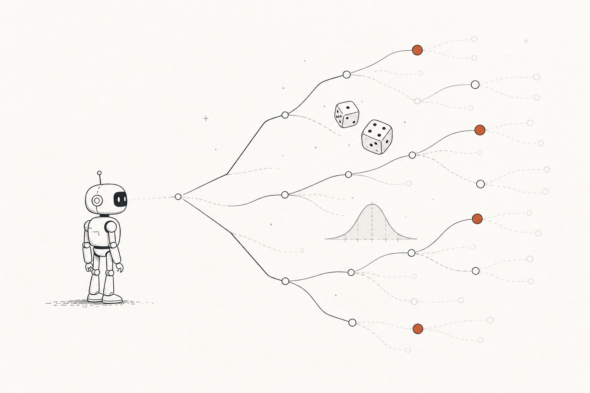
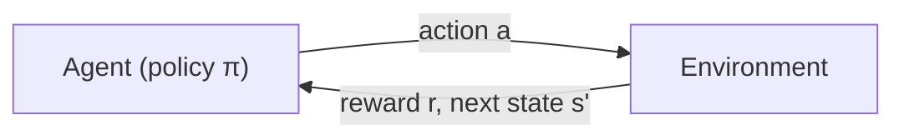
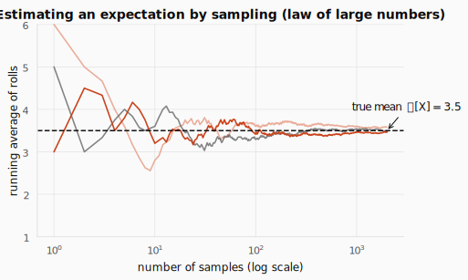
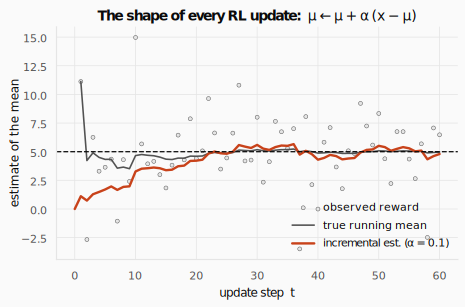
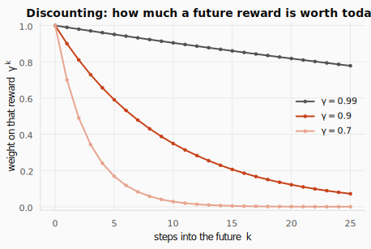
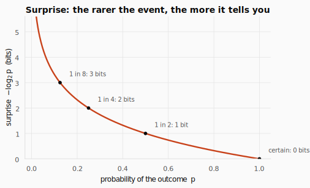
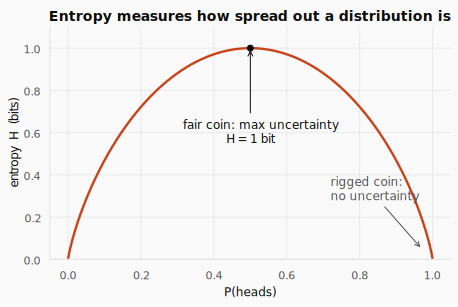
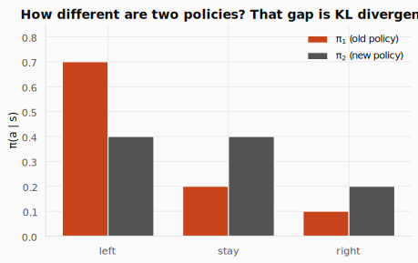

# Reinforcement Learning from First Principles (and the Math You Actually Need)



> **The one sentence the whole field hangs on:**
> *The value of where I am is the reward I just got, plus a discounted value of where I'll land next.*

Every algorithm you'll meet later (Q-learning, DQN, PPO, RLHF, GRPO) is a variation on that single line. This first post builds the intuition behind it and the five pieces of math you need to read it without flinching. No proofs for their own sake; just the ideas, one clean derivation each, a worked example, and then code.

---

## 1. The intuition: a world that rolls dice

Reinforcement learning starts from one uncomfortable fact: **the world is uncertain, and "how good" a situation is means "how good on average."**

Picture an agent standing at the left of the illustration above. It picks an action and the world *branches*: maybe the road is clear, maybe it's jammed; maybe the policy itself flips a coin. You cannot know which branch you'll get. So you cannot score a situation by a single outcome; you score it by the **average over all the branches, weighted by how likely each one is.** That average has a name (the *expectation*), and estimating it from experience is, quite literally, the entire field in one sentence.

### The five moving parts

RL describes a loop between an **agent** and an **environment**:



At each step the agent observes a state, picks an action from its **policy**, and the environment answers with a **reward** and a new state. Four concepts carry all the meaning:

- **Policy ($\pi$)**: the agent's behavior. A map from states to actions (or to *probabilities* over actions). It can be a lookup table, a neural net, or a search. The policy alone determines behavior. It may be deterministic ("always go left") or stochastic ("left with 70% probability").
- **Reward signal ($r$)**: a single scalar each step that *defines the goal*. The agent's sole objective is to maximize total reward over the long run. Crucially, reward says **what** to achieve, not **how**.
- **Value function ($V$ or $Q$)**: what's good *in the long run*. Reward is immediate; value is the total reward you expect to accumulate from here on. A state can have low reward but high value (a boring job that leads to a great career), or high reward but low value (dessert first: great now, hungry later). **We act on values, not rewards.**
- **Model**: an optional internal mimic of the environment. Given a state and action, it predicts the next state and reward. With a model you can *plan*. Without one you must learn from pure trial and error.

### Value looks backward, not forward

The definition $V(s) = \mathbb{E}[\text{future rewards}]$ *sounds* like it needs a crystal ball. It doesn't. Think of a restaurant you've visited three times, twice great and once terrible. You walk in with a gut feeling of "7/10." That number is a value estimate built **from memory, not prophecy**. $V(s)$ is just a running average of what actually happened every time you were in state $s$. The "future" in the formula is an illusion of the notation; the algorithms only ever use rewards they've *already observed*.

---

## 2. The math you actually need

Five ideas. Each one shows up in every algorithm later.

### 2.1 Random variables and expectation

A **random variable** $X$ is a quantity whose value depends on chance. A **probability distribution** lists each possible value and how likely it is. For a fair die, each of $\{1,\dots,6\}$ has probability $\tfrac{1}{6}$.

The **expectation** $\mathbb{E}[X]$ is the long-run average, each outcome weighted by its probability. It's the center of gravity of the distribution:

$$
\mathbb{E}[X] \;=\; \sum_x x\,p(x).
$$

For the die, $\mathbb{E}[X] = \tfrac{1}{6}(1+2+3+4+5+6) = 3.5$. You never *roll* a 3.5, but it's what the rolls average to. This is exactly why **value is an expectation, not the result of one lucky run.** A single trajectory is one sample from a random process; trust it and you're fitting noise. Average over all trajectories (weighted by probability) and you get a stable measure of long-term quality.



When you can't compute $\mathbb{E}[X]$ exactly (because the formula is intractable or you don't even know the distribution), you **estimate it by sampling**: draw many samples and average. By the *law of large numbers*, the sample average converges to the true expectation as you collect more samples (the figure above). That single idea *is* Monte-Carlo RL: the agent can't compute the expected **return** $\mathbb{E}[G_t]$ (the return $G_t$ is the total discounted reward collected from time $t$ onward, $G_t = r_{t+1} + \gamma r_{t+2} + \cdots$; we make the discounting precise in §2.5), so it plays many episodes and averages the returns it actually sees.

Both routes are one line of NumPy: the exact weighted sum $\sum_x x\,p(x)$, and the sampled average $\tfrac1N\sum_i x_i$ that converges to it:

```python
import numpy as np

# Exact: weight each face by its probability.  E[X] = Σ x·p(x)
faces = np.arange(1, 7)
probs = np.full(6, 1 / 6)
exact = (faces * probs).sum()

# Estimated: roll many times and average (law of large numbers).
rng = np.random.default_rng(0)
samples = rng.integers(1, 7, size=100_000)
estimate = samples.mean()

print(f"exact={exact:.4f}  estimate={estimate:.4f}")
```

```text title="Output"
exact=3.5000  estimate=3.4980
```

The exact weighted sum lands on 3.5; the sampled average from 100 000 rolls lands within 0.002 of it, the law of large numbers at work.

<details>
<summary><strong>Check:</strong> Why is value defined as an expectation over returns rather than the return of a single rollout? What goes wrong if you trust one trajectory?</summary>

**Answer.** A single rollout is one sample from a random process (a stochastic policy and/or environment); it can be very lucky or very unlucky. Value is the *mean* over all such rollouts. Trust one trajectory and you fit noise: the estimate has huge variance and can be arbitrarily wrong.
</details>

### 2.2 Conditional probability and the Markov property

Conditional probability $P(A \mid B)$ is "the probability of $A$ given that $B$ happened." Knowing $B$ can change the odds of $A$.

A process has the **Markov property** when the next state depends only on the *current* state and action, not on the entire history:

$$
P(s_{t+1} \mid s_t, a_t) \;=\; P(s_{t+1} \mid s_t, a_t, s_{t-1}, a_{t-1}, \dots, s_0).
$$

This isn't a restriction on the world: it's a restriction on *what counts as the state*. The state must include everything relevant. If velocity matters (an Atari ball's direction), stack a few frames so velocity is *in* the state. The payoff: the Markov property is what lets us write $V(s)$ as a function of $s$ **alone**. If value depended on the whole past, it could never be a simple lookup on the present.

<details>
<summary><strong>Check:</strong> A single Atari frame is not Markov. Why not? What's the standard fix, and what does that fix teach you about the word "state" in general?</summary>

**Answer.** A single frame shows position but not velocity, so you can't tell which way the ball is moving: the future isn't determined by the present frame alone. The standard fix is to **stack the last few frames**. The lesson: "state" isn't "what you observe," it's "whatever makes the future independent of the past." You engineer the state until the Markov property holds.
</details>

<details>
<summary><strong>Check:</strong> Give a real task where the Markov property is badly violated. How would you enlarge the state so it holds again, and what does that cost you?</summary>

**Answer.** Almost any partially-observed task: poker (you can't see opponents' cards) or a robot with a narrow camera. Enlarge the state by adding history or a belief over the hidden part. The cost: a much larger state space, more to learn, and you can never inject information that is genuinely unobservable.
</details>

### 2.3 Variance, standard deviation, and the z-score

Expectation is the center; **variance** is the spread. It measures how far outcomes typically land from the mean:

$$
\operatorname{Var}(X) = \mathbb{E}\big[(X-\mu)^2\big], \qquad \sigma = \sqrt{\operatorname{Var}(X)}.
$$

The **z-score** re-expresses a value as "how many standard deviations above or below the mean it is":

$$
z = \frac{x - \mu}{\sigma}.
$$

This isn't trivia: it's the heart of **GRPO** (the algorithm behind modern reasoning models). GRPO turns each sampled return into an *advantage* using exactly the z-score: a rollout that scored well **relative to its group** gets a positive advantage and is reinforced; one that scored below the group's average is discouraged. The group's own mean and standard deviation provide the baseline, so no separate value network is needed.

### 2.4 The running (incremental) average: the shape of every RL update

You can update an average **one sample at a time** without storing all the data. Nudge the old estimate a small step toward each new observation:

$$
\mu_{\text{new}} \;=\; \mu_{\text{old}} \;+\; \alpha\,\big(x - \mu_{\text{old}}\big).
$$

Read the pieces: $\mu_{\text{old}}$ is your current belief, $(x - \mu_{\text{old}})$ is how wrong it was, and $\alpha \in (0,1]$ is how much you care about the new data. This is **the template for every learning rule in the course.** Monte Carlo, TD learning, Q-learning, actor-critic: all are this nudge applied to slightly different targets.



In its RL form, the "new data" $x$ becomes a reward-based target and $\mu$ becomes a value estimate, and you'll see $V(s) \leftarrow V(s) + \alpha\,[\text{target} - V(s)]$ over and over.

### 2.5 Geometric series and discounting

A future reward is worth less than the same reward now. We encode that with a **discount factor** $\gamma \in [0,1)$ and weight a reward $k$ steps away by $\gamma^k$. Two consequences fall out of one classic sum. The **geometric series**

$$
\sum_{k=0}^{\infty} \gamma^{k} \;=\; \frac{1}{1-\gamma} \qquad (|\gamma| < 1)
$$

converges because each term shrinks fast enough. That's *why* an infinite stream of future rewards adds up to a **finite** number; otherwise "total future reward" would be meaningless for a task that never ends.



- $\gamma = 0$: completely myopic, only the very next reward matters.
- $\gamma \to 1$: far-sighted, distant rewards weigh almost as much as immediate ones.
- $\gamma = 0.9$: a reward 10 steps away is worth $0.9^{10} \approx 0.35$ of face value; 50 steps away, $\approx 0.005$.

<details>
<summary><strong>Check:</strong> The return adds up infinitely many rewards. Could it blow up to infinity? Why does γ < 1 prevent that?</summary>

**Answer.** No, as long as $\gamma < 1$. Each step counts a little less than the one before, so the rewards form a shrinking geometric sum. If every reward is at most $R_{\max}$, then $|G| \le R_{\max}(1 + \gamma + \gamma^2 + \cdots) = \frac{R_{\max}}{1 - \gamma}$. That bound is the whole reason $\gamma < 1$ matters.
</details>

<details>
<summary><strong>Check:</strong> Describe, in one sentence each, the agent you get with γ = 0 versus γ = 0.999. When would a low γ actually be the right choice?</summary>

**Answer.** $\gamma = 0$ gives a purely myopic agent that maximizes only the immediate reward and ignores all consequences. $\gamma = 0.999$ gives a far-sighted agent that weights rewards hundreds of steps away almost equally. A low $\gamma$ is right when the task truly is immediate (one-step decisions) or when long horizons add only noise and instability.
</details>

### 2.6 Information theory: entropy and KL divergence

The last two tools power every modern policy-gradient method (PPO, TRPO, GRPO). Both are built from a single idea, so we'll derive that idea once and reuse it.

#### The problem: measuring uncertainty

You have a probability distribution (a list of outcomes and their probabilities) and you want **one number** that answers: *how uncertain is this?* Two extremes are obvious. A fair coin (50/50) feels **maximally uncertain**. A rigged coin (100/0) has **no uncertainty at all**. We need a formula that captures everything in between. It starts with a more basic question: how *surprising* is a single outcome?

#### Step 1: Surprise (how much an outcome tells you)

"The sun rose this morning" has probability $\approx 1$; hearing it tells you nothing: **zero surprise**. "An earthquake hit this morning" has tiny probability; hearing it is a huge shock: **large surprise**. So *surprise* should be a function of probability that is large when $p$ is small and zero when $p = 1$.

Which function? We want three properties:

1. **Surprise decreases as $p$ increases**: likely things are unsurprising.
2. **An outcome with $p = 1$ has zero surprise**: certainty tells you nothing.
3. **Independent surprises add up.** Seeing two independent outcomes should *sum* their surprises, while their joint probability *multiplies* ($p_1 p_2$). The one function that turns multiplication into addition is the **logarithm**: $\log(p_1 p_2) = \log p_1 + \log p_2$.

The unique function satisfying all three is the **negative log-probability**:

$$
\text{surprise}(x) \;=\; \log\frac{1}{p(x)} \;=\; -\log p(x).
$$

Using $\log_2$ measures surprise in **bits**: $p=1 \to 0$ bits, $p=\tfrac12 \to 1$ bit, $p=\tfrac18 \to 3$ bits.



#### Step 2: Entropy (the average surprise)

**Entropy** is just the *expected* surprise: how surprised you should expect to be, on average, before the outcome is revealed. Take the expectation of $-\log p(x)$ under $p$ itself:

$$
H(p) \;=\; \mathbb{E}_{x\sim p}\big[-\log p(x)\big] \;=\; -\sum_x p(x)\,\log p(x).
$$

That's the entire derivation: **surprise is $-\log p$; entropy is its average.**



#### Step 3: What the number tells you

Entropy is **high** when the distribution is spread out: many outcomes are plausible, so on average you're quite surprised by what happens. Entropy is **low** when the distribution is concentrated: one outcome dominates, so you're rarely surprised. Entropy is **exactly zero** when one outcome has probability 1, with no uncertainty at all.

#### Step 4: Why RL cares about entropy

A policy $\pi(a\mid s)$ *is* a probability distribution over actions, so it has an entropy. If the entropy is **high**, the policy is spread across many actions: it's **exploring**. If the entropy is **near zero**, the policy has collapsed onto a single action: it's **fully committed**.

The danger: an agent might **collapse too early**, before it has gathered enough experience to know which action is truly best. To prevent this, many RL algorithms add an **entropy bonus** to the reward: a small extra reward for keeping the policy spread out, which encourages the agent to keep trying different actions rather than locking in prematurely.

#### Step 5: KL divergence (how different are two distributions?)

Entropy measures the uncertainty of **one** distribution. But often we have **two** and want to ask: *how different are they?* In RL this is constant: you had a policy $\pi_1$, you updated it, and now you have $\pi_2$: **how much did it change?**

Build it from surprise once more. Suppose the world really follows $\pi_1$, but you *describe* it using $\pi_2$. For an action $a$, the surprise you actually incur using $\pi_2$ is $-\log \pi_2(a)$, while the smallest (true) surprise was $-\log \pi_1(a)$. The **extra surprise** from using the wrong distribution is

$$
\big(-\log \pi_2(a)\big) - \big(-\log \pi_1(a)\big) \;=\; \log\frac{\pi_1(a)}{\pi_2(a)}.
$$

Average that extra surprise over the actions $\pi_1$ actually produces, and you get the **Kullback–Leibler divergence**:

$$
D_{\mathrm{KL}}(\pi_1 \,\Vert\, \pi_2)
\;=\; \mathbb{E}_{a\sim\pi_1}\!\left[\log\frac{\pi_1(a)}{\pi_2(a)}\right]
\;=\; \sum_a \pi_1(a)\,\log\frac{\pi_1(a)}{\pi_2(a)}.
$$

It's the **expected number of extra bits** you pay for believing $\pi_2$ when the truth is $\pi_1$. Two properties fall right out: $D_{\mathrm{KL}} \ge 0$ always, and $D_{\mathrm{KL}} = 0$ **iff** the two distributions are identical (no extra surprise, nothing wasted).



**Why "from $\pi_1$'s perspective"?** Notice the expectation is subscripted with $\pi_1$, not $\pi_2$: you weight by $\pi_1$'s probabilities. You're asking: *"for the actions that $\pi_1$ actually cares about, how differently does $\pi_2$ treat them?"* This is why **order matters**:

$$
D_{\mathrm{KL}}(\pi_1 \Vert \pi_2) \;\neq\; D_{\mathrm{KL}}(\pi_2 \Vert \pi_1),
$$

because *who does the weighting* changes the answer (we'll see the two numbers differ in the worked example).

#### Step 6: Why RL cares about KL

When you update a policy, you want it to get **better**. But if it changes **too much in one step**, it can jump to something terrible and never recover. KL divergence measures **how far the new policy has drifted from the old one**. TRPO, PPO, and GRPO all do the same thing conceptually: **don't let the KL between the old and new policy get too big.** It's a **leash**: the policy can improve, but it can't sprint off in a completely different direction in a single update.

This is the other half of the GRPO story from §2.3: the **z-score advantage decides which direction** to push each action, and the **KL leash limits how far** the policy is allowed to move while doing it.

Both quantities are a single line of NumPy. Notice the asymmetry in the last two lines (same policies, different answers), which is exactly why PPO and friends are careful about *which* KL they put on the leash:

```python
import numpy as np

def entropy_bits(p):
    p = np.asarray(p, dtype=float)
    p = p[p > 0]                       # 0·log0 = 0 by convention
    return -(p * np.log2(p)).sum()

def kl_bits(p1, p2):
    p1, p2 = np.asarray(p1, float), np.asarray(p2, float)
    return (p1 * np.log2(p1 / p2)).sum()

print(entropy_bits([0.25, 0.75]))
print(entropy_bits([0.5, 0.5]))

pi1, pi2 = [0.7, 0.2, 0.1], [0.4, 0.4, 0.2]
print(kl_bits(pi1, pi2))
print(kl_bits(pi2, pi1))
```

```text title="Output"
0.8112781244591328
1.0
0.2651484454403227
0.27705803117695843
```

The fair coin hits exactly 1 bit (maximum entropy); the biased coin sits at 0.81 bits. The forward and reverse KL divergences (0.265 vs 0.277) differ (same policies, different answers), confirming the asymmetry discussed above.

---

## 3. Worked examples (by hand)

### Example A: expectation of a die

$$
\mathbb{E}[X] = \sum_{x=1}^{6} x\cdot\tfrac{1}{6}
= \tfrac{1+2+3+4+5+6}{6} = \tfrac{21}{6} = 3.5.
$$

### Example B: a GRPO advantage from four rollouts

Four rollouts score returns $R = \{2,\,8,\,6,\,4\}$. Compute the mean, standard deviation, and the **advantage** of the rollout that scored 8.

**Mean:**
$$
\mu = \tfrac{2+8+6+4}{4} = \tfrac{20}{4} = 5.
$$

**Variance and standard deviation:**
$$
\operatorname{Var} = \tfrac{(2-5)^2+(8-5)^2+(6-5)^2+(4-5)^2}{4}
= \tfrac{9+9+1+1}{4} = 5, \qquad \sigma = \sqrt{5} \approx 2.236.
$$

**Advantage (z-score) of the rollout scoring 8:**
$$
A = \frac{8 - 5}{2.236} \approx +1.34.
$$

It scored well above its group, so this rollout's actions get **reinforced**, and notice we never needed a separate value network. The group was its own baseline.

### Example C: discounting adds up to a finite number

With $\gamma = 0.9$, an endless stream of reward $1$ per step is worth
$$
1 + 0.9 + 0.9^2 + 0.9^3 + \cdots = \frac{1}{1-0.9} = 10.
$$
A never-ending task collapses to the number **10**. That's discounting earning its keep.

### Example D: one incremental-average step

Belief $\mu_{\text{old}} = 5$, new observation $x = 8$, step size $\alpha = 0.1$:
$$
\mu_{\text{new}} = 5 + 0.1\,(8 - 5) = 5 + 0.3 = 5.3.
$$
You nudged your belief 10% of the way toward the surprise. Repeat forever: that's learning.

### Example E: entropy of a biased coin

A coin lands heads with probability $p = 0.25$. Its entropy (in bits) is
$$
H = -\big(0.25\log_2 0.25 + 0.75\log_2 0.75\big)
= -\big(0.25(-2) + 0.75(-0.415)\big)
= 0.5 + 0.311 = 0.811 \text{ bits}.
$$
Compare the extremes: a **fair** coin gives $H = -\big(0.5\log_2 0.5 + 0.5\log_2 0.5\big) = 1$ bit (maximum), and a **rigged** coin ($p=1$) gives $H = 0$ bits. Our biased coin sits in between, closer to certain than to fair, exactly the "everything in between" we wanted to measure.

### Example F: KL divergence between two policies (and why order matters)

Two policies over actions $\{\text{left},\text{stay},\text{right}\}$ (the figure above):
$$
\pi_1 = (0.7,\,0.2,\,0.1), \qquad \pi_2 = (0.4,\,0.4,\,0.2).
$$

**Forward**, extra surprise from $\pi_1$'s perspective:
$$
\begin{aligned}
D_{\mathrm{KL}}(\pi_1\Vert\pi_2)
&= 0.7\log_2\tfrac{0.7}{0.4} + 0.2\log_2\tfrac{0.2}{0.4} + 0.1\log_2\tfrac{0.1}{0.2} \\
&= 0.565 - 0.200 - 0.100 = 0.265 \text{ bits}.
\end{aligned}
$$

**Reverse**, now weighted by $\pi_2$:
$$
\begin{aligned}
D_{\mathrm{KL}}(\pi_2\Vert\pi_1)
&= 0.4\log_2\tfrac{0.4}{0.7} + 0.4\log_2\tfrac{0.4}{0.2} + 0.2\log_2\tfrac{0.2}{0.1} \\
&= -0.323 + 0.400 + 0.200 = 0.277 \text{ bits}.
\end{aligned}
$$

Same two policies, **different answers** ($0.265 \neq 0.277$), because whoever does the weighting changes the question. Both are positive and small: $\pi_2$ is a modest update away from $\pi_1$, the kind of step a KL leash would happily allow.

---

## 4. Putting it all together: the agent–environment loop in Gymnasium

We've mapped each idea to code right where it was introduced. Here's the whole vocabulary in one place as a quick reference, then a single runnable program that uses all of it at once.

| Concept | Math | In code |
|---|---|---|
| Expectation | $\mathbb{E}[X]=\sum_x x\,p(x)$ | `(values * probs).sum()` |
| Estimate by sampling | $\mathbb{E}[X]\approx \tfrac{1}{N}\sum_i x_i$ | `np.mean(samples)` |
| Return (discounted) | $G_t=\sum_k \gamma^k r_{t+k+1}$ | `G += (gamma ** k) * r` |
| Incremental update | $\mu \leftarrow \mu + \alpha(x-\mu)$ | `mu += alpha * (x - mu)` |
| Policy | $\pi(a\mid s)$ | `action = policy(state)` |
| Entropy | $H=-\sum_x p\log_2 p$ | `-(p * np.log2(p)).sum()` |
| KL divergence | $\sum_a \pi_1\log_2\tfrac{\pi_1}{\pi_2}$ | `(p1 * np.log2(p1 / p2)).sum()` |

Gymnasium is the standard RL environment API. Every environment exposes the exact loop from Section 1: `reset()` gives a starting state, and `step(action)` returns `(next_state, reward, terminated, truncated, info)`. Below we run a random policy on `FrozenLake` and **estimate the value of the start state** (the expected discounted return) by sampling many episodes and averaging. It is the whole post in one function: the loop (§1), the discounted return (§2.5), and estimating an expectation by sampling (§2.1).

```python
import gymnasium as gym
import numpy as np

def estimate_start_value(episodes=20_000, gamma=0.99, seed=0):
    """V(start) under a random policy = average discounted return over episodes."""
    env = gym.make("FrozenLake-v1", is_slippery=True)   # a stochastic gridworld MDP
    rng = np.random.default_rng(seed)
    returns = []

    for ep in range(episodes):
        state, _ = env.reset(seed=int(rng.integers(1 << 31)))
        G, discount, done = 0.0, 1.0, False
        while not done:
            action = env.action_space.sample()          # random policy π
            state, reward, terminated, truncated, _ = env.step(action)
            G += discount * reward                       # accumulate G_t = Σ γ^k r
            discount *= gamma
            done = terminated or truncated
        returns.append(G)

    env.close()
    return np.mean(returns), np.std(returns)

mean_return, std_return = estimate_start_value()
print(f"V(start) ≈ {mean_return:.4f}   (std of returns = {std_return:.4f})")
```

```text title="Output"
V(start) ≈ 0.0112   (std of returns = 0.0994)
```

V(start) is tiny (only about 1% of episodes reach the goal under a random policy), and the standard deviation dwarfs the mean, confirming that single episodes are extremely noisy estimates.

A few things to notice, each tying straight back to the math:

- **`G += discount * reward`** is the discounted return $G_t = \sum_k \gamma^k r_{t+k+1}$ from Section 2.5.
- **`np.mean(returns)`** is estimating the expectation $V(\text{start}) = \mathbb{E}[G_t \mid s_0]$ by sampling (Section 2.1).
- The **large `std_return`** is exactly the high *variance* of Section 2.3: a single episode is a noisy sample, which is why we average thousands. (It's also the reason Monte Carlo methods are noisy, a thread we pick up in a later post.)
- The random `env.action_space.sample()` is a (very bad) **policy** $\pi$. Replacing it with a *good* policy (one that maximizes this expected return) is the entire control problem ahead of us.

> Run it with `uv run python this_script.py` (or `pip install gymnasium numpy` first). FrozenLake's only reward is $+1$ for reaching the goal, so under a random policy `V(start)` is small, since most episodes fall in a hole and return 0. That small, noisy number is your first value estimate.

---

## Where this goes next

You now have the vocabulary (policy, reward, value, model) and the five tools (expectation, the Markov property, variance, the incremental update, and discounting). The next post formalizes the **environment** as a Markov Decision Process and derives the **Bellman equation**, the precise, recursive version of the one sentence at the top:

$$
V^\pi(s) = \mathbb{E}\big[\,R_{t+1} + \gamma\,V^\pi(S_{t+1}) \mid S_t = s\,\big].
$$

After that, we'll meet the three ways to actually solve it (Dynamic Programming, Monte Carlo, and Temporal-Difference learning) and watch all three converge to the same value function on a Gymnasium environment we build from scratch.
