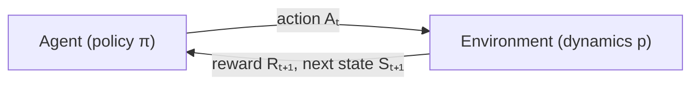

# MDPs and the Bellman Equation: The Recursion Behind Every RL Algorithm


> **The throughline:** *The value of where I am is the reward I just got, plus a discounted value of where I'll land next.*

The [RL Foundations](../01-rl-intro-and-prerequisites/) post gave us the vocabulary (policy, reward, value) and the math toolkit (expectation, discounting, the Markov property). This post puts those pieces together into a precise machine: the **Markov Decision Process** (MDP) formalizes the environment, **value functions** score how good a state or action is, and the **Bellman equation** expresses value as a recursion, one equation that every RL algorithm is, at its core, a way of solving.

---

## 1. The intuition: one loop, one lookup table, one recursion

### The agent–environment loop, one more time

Every RL problem is the same loop. At each discrete time step $t$:



The agent observes state $S_t$, picks action $A_t$ according to its policy $\pi$, the environment responds with reward $R_{t+1}$ and next state $S_{t+1}$, and the cycle repeats. The full history is a **trajectory**:

$$
S_0, A_0, R_1, S_1, A_1, R_2, S_2, A_2, R_3, \dots
$$

### What makes an environment an MDP?

An MDP is a tuple $(\mathcal{S}, \mathcal{A}, p, R, \gamma)$:

- $\mathcal{S}$: a finite set of **states** (every cell on a grid, every board position in chess).
- $\mathcal{A}$: a finite set of **actions** (left/down/right/up on a grid).
- $p(s', r \mid s, a)$, the **dynamics function**: the probability that action $a$ in state $s$ leads to next state $s'$ with reward $r$. This single function is the complete DNA of the environment. If you have it, you can plan (dynamic programming). If you don't, you must learn from experience (Monte Carlo, TD).
- $R$: the set of possible reward values.
- $\gamma \in [0, 1)$: the **discount factor** (introduced in [RL Foundations, §2.5](../01-rl-intro-and-prerequisites/#25-geometric-series-and-discounting)).

"Finite" just means you can count the states, actions, and rewards: you could list them all on a whiteboard. FrozenLake has 16 states, 4 actions, and rewards in $\{0, 1\}$.

### The Markov property (quick recap)

The dynamics depend only on $(S_t, A_t)$, not on how you got there. This isn't magic: it's a constraint on **what counts as the state**. If history matters, pack it into the state (frame-stacking in Atari, full transcript in a chatbot). The payoff: value can be a function of $s$ alone.

### The agent–environment boundary

A subtle point: the boundary is **control**, not anatomy. A robot's motors and gears are part of the environment: the agent sends voltage commands, but what the motors do follows physics, not the agent's wishes. Even if the agent knows the rules perfectly (like in chess), the reward computation is still "outside"; it defines the task, it doesn't solve it.

### The reward hypothesis

> *All goals can be thought of as the maximization of the expected cumulative sum of a scalar reward signal.*

Bold claim, but it works: chess ($+1$ win, $-1$ loss), maze ($-1$ per step, so hurry!), walking robot (reward proportional to forward speed). The critical design principle: **reward says what to achieve, not how.** If you reward a chess agent for capturing pieces, it might sacrifice a winning position to grab a queen.

<details>
<summary><strong>Check:</strong> The reward function is the only place you tell the agent what you want. Invent a reward for "drive safely" that an agent could obviously game. What does that reveal?</summary>

**Answer.** Reward $+1$ for every second without a crash, and the agent games it by driving extremely slowly or never leaving the driveway: technically "safe," completely useless. It shows the reward specifies *what you measure*, not *what you mean*, and any proxy can be exploited. That failure mode is **reward hacking**.
</details>

---

## 2. The math you need

### 2.1 The dynamics function $p(s', r \mid s, a)$

This is a lookup table: plug in four things (current state $s$, action $a$, next state $s'$, reward $r$) and get back a probability. For any fixed $(s, a)$, the probabilities over all $(s', r)$ outcomes sum to 1:

$$
\sum_{s' \in \mathcal{S}} \sum_{r \in \mathcal{R}} p(s', r \mid s, a) = 1, \qquad \forall\, s \in \mathcal{S},\; a \in \mathcal{A}(s).
$$

In Gymnasium, this table lives in `env.unwrapped.P`. Each entry is a list of `(probability, next_state, reward, done)` tuples, exactly $p(s', r \mid s, a)$:

```python
import gymnasium as gym

env = gym.make("FrozenLake-v1", is_slippery=True)
P = env.unwrapped.P

state, action = 6, 2   # state 6 (row 1, col 2), action Right
print(f"p(s', r | s={state}, a={action}):")
for prob, next_state, reward, done in P[state][action]:
    print(f"  prob={prob:.4f}  s'={next_state:2d}  r={reward:.0f}  done={done}")
env.close()
```

```text title="Output"
p(s', r | s=6, a=2):
  prob=0.3333  s'=10  r=0  done=False
  prob=0.3333  s'= 7  r=0  done=True
  prob=0.3333  s'= 2  r=0  done=False
```

Because the ice is slippery, action "Right" from state 6 has only a 1/3 chance of actually going right (to state 7, a hole!). The other 2/3 of the time the agent slides down or up. This is the stochasticity that makes the problem an MDP rather than a deterministic puzzle.

### 2.2 Returns: what exactly are we maximizing?

The agent doesn't maximize a single reward; it maximizes the **return** $G_t$, the cumulative discounted reward from time $t$ onward:

$$
G_t = R_{t+1} + \gamma\,R_{t+2} + \gamma^2 R_{t+3} + \cdots = \sum_{k=0}^{\infty} \gamma^k\,R_{t+k+1}.
$$

- **Episodic tasks** (chess, maze) end at some terminal step $T$; the sum is finite even without discounting.
- **Continuing tasks** (thermostat, stock trader) run forever; discounting with $\gamma < 1$ keeps the sum finite: $G_t \le \frac{R_{\max}}{1 - \gamma}$.

The discount factor $\gamma$ answers "how far-sighted is this agent?" ($\gamma = 0$: myopic; $\gamma \to 1$: values the distant future almost equally).

A quick calculation: with $\gamma = 0.99$ and $R_{\max} = 1$, the return is bounded by $\frac{1}{1 - 0.99} = 100$. That finite ceiling is why the Bellman equation works for infinite-horizon tasks.

```python
import numpy as np

rewards = [0, 0, 0, 1]  # four-step episode: reward +1 at the goal
gamma = 0.99

G = sum(gamma**k * r for k, r in enumerate(rewards))  # G_t = Σ γ^k R_{t+k+1}
print(f"Return G = {G:.4f}")
print(f"Upper bound with R_max=1: {1 / (1 - gamma):.0f}")
```

```text title="Output"
Return G = 0.9703
Upper bound with R_max=1: 100
```

The agent reached the goal after 3 zero-reward steps, so the discounted return is $\gamma^3 \times 1 = 0.97$, close to 1 but not quite, because the reward arrived late.

### 2.3 The recursive return: the heartbeat of RL

The most important algebraic trick in the entire course. Start with the definition of $G_t$ and factor out $\gamma$:

$$
G_t = R_{t+1} + \gamma\,R_{t+2} + \gamma^2 R_{t+3} + \cdots = R_{t+1} + \gamma\,\underbrace{(R_{t+2} + \gamma\,R_{t+3} + \cdots)}_{G_{t+1}}.
$$

$$
\boxed{G_t = R_{t+1} + \gamma\,G_{t+1}}
$$

The return from now equals the immediate reward plus $\gamma$ times the return from one step later. This **one-step recursion** is what makes the Bellman equation work: the whole chain of future rewards collapses into a single recursive step.

### 2.4 Value functions: $V$ vs $Q$, the emphasis

Two ways to score "how good":

**State-value function** $V^\pi(s)$, one number per state:

$$
V^\pi(s) = \mathbb{E}_\pi\big[G_t \mid S_t = s\big]
$$

"If I start in state $s$ and follow policy $\pi$ from here on, what return should I expect on average?"

**Action-value function** $Q^\pi(s, a)$, one number per state-action pair:

$$
Q^\pi(s, a) = \mathbb{E}_\pi\big[G_t \mid S_t = s, A_t = a\big]
$$

"If I start in state $s$, take action $a$, then follow $\pi$ afterward, what return should I expect?"

$Q$ breaks $V$ open per action. $V$ tells you how good a state is; $Q$ tells you which action makes it that good. Both depend on the policy: **same state, different policy, different value.**

#### The V-Q bridge (both directions)

$V$ and $Q$ are two views of the same thing, connected by two equations:

$$
V^\pi(s) = \sum_a \pi(a \mid s)\,Q^\pi(s, a)
$$

$V$ is the policy-weighted average of $Q$: average over the actions the policy would take.

$$
Q^\pi(s, a) = \sum_{s', r} p(s', r \mid s, a)\,\big[r + \gamma\,V^\pi(s')\big]
$$

$Q$ is the environment-weighted average of $[r + \gamma V']$: average over where the environment sends you.


#### Why $Q$ matters more in practice

With $V(s)$ alone, choosing an action requires the model: "if I take action $a$, where do I land, and what's $V(s')$ there?" That needs $p(s' \mid s, a)$.

With $Q(s, a)$, choosing is trivial: **pick $\arg\max_a Q(s, a)$. No model needed.** This is why DQN learns $Q$, not $V$, and the policy falls out of the argmax for free:

$$
\pi^*(s) = \arg\max_a\, Q^*(s, a).
$$

Here's the bridge in code: compute $Q$ from $V$ (using the model), then recover $V$ from $Q$:

```python
import gymnasium as gym
import numpy as np

env = gym.make("FrozenLake-v1", is_slippery=True)
P = env.unwrapped.P
nS, nA = 16, 4
gamma = 0.99

V = np.random.default_rng(0).uniform(0, 0.1, size=nS)  # placeholder V
V[15] = 1.0  # goal state
V[[5, 7, 11, 12]] = 0.0  # holes

def q_from_v(V, s, a):
    """Q^π(s,a) = Σ p(s',r|s,a) [r + γ V(s')]"""
    return sum(p * (r + gamma * V[s2]) for p, s2, r, d in P[s][a])

def v_from_q(Q_sa, pi_sa):
    """V^π(s) = Σ_a π(a|s) Q(s,a)"""
    return sum(pi * q for pi, q in zip(pi_sa, Q_sa))

s = 6
Q_s = [q_from_v(V, s, a) for a in range(nA)]
pi_uniform = [0.25] * nA

print(f"Q({s}, a) = {[f'{q:.4f}' for q in Q_s]}")
print(f"V({s}) via Q = {v_from_q(Q_s, pi_uniform):.4f}")
print(f"Greedy action = {np.argmax(Q_s)} ({['Left','Down','Right','Up'][np.argmax(Q_s)]})")
env.close()
```

```text title="Output"
Q(6, a) = ['0.0283', '0.0269', '0.0283', '0.0014']
V(6) via Q = 0.0212
Greedy action = 0 (Left)
```

$Q(6, \text{Left})$ is highest (tied with Right), so the greedy policy says "go Left" from state 6: no model needed at decision time, just compare four numbers.

<details>
<summary><strong>Check:</strong> If you could only be handed one of V(s) or Q(s, a), which one lets you actually act without any extra computation, and why?</summary>

**Answer.** $Q(s,a)$. It already gives a number for every action, so acting is a single $\arg\max$ with no model. $V(s)$ is one number for the whole state; to act from it you must ask "where does each action land, and what is $V$ there?", which needs the model $p(s'\mid s,a)$. That model-free choice is exactly why DQN learns $Q$.
</details>

<details>
<summary><strong>Check:</strong> Two states have the same value under some policy π. Does that mean they're equally good under the optimal policy? Argue both directions.</summary>

**Answer.** No. Equal value under one policy $\pi$ says nothing about the optimal values: a different policy could exploit one state far more than the other. Conversely, two states *can* still tie under the optimal policy (e.g. both one step from the goal). So same-value-under-$\pi$ neither implies nor forbids same-value-under-optimal.
</details>

### 2.5 The Bellman expectation equation

Now the payoff. Start from the recursive return $G_t = R_{t+1} + \gamma\,G_{t+1}$ and take the expectation conditioned on $S_t = s$:

$$
V^\pi(s) = \mathbb{E}_\pi\big[R_{t+1} + \gamma\,V^\pi(S_{t+1}) \mid S_t = s\big]
$$

That's the Bellman equation in one line: **the value of a state is the expected immediate reward plus the discounted value of the next state.** Now expand the expectation in two steps:

**Step 1: average over the agent's action randomness (policy $\pi$):**

$$
= \sum_a \pi(a \mid s)\;\mathbb{E}\big[R_{t+1} + \gamma\,V^\pi(S_{t+1}) \mid S_t = s, A_t = a\big]
$$

**Step 2: average over the environment's state randomness (dynamics $p$):**

$$
\boxed{V^\pi(s) = \sum_a \pi(a \mid s) \sum_{s'} p(s' \mid s, a)\;\big[R(s, a, s') + \gamma\,V^\pi(s')\big]}
$$

Read it aloud: "For each action I might take (weighted by my policy), for each state I might land in (weighted by transition probability), add the reward I get plus the discounted value of where I land."

Both steps use the same rule: $\mathbb{E}[X] = \sum (\text{possible value}) \times (\text{probability})$. Step 1 applies it to actions (probabilities from $\pi$). Step 2 applies it to next states (probabilities from $p$).

This is **one equation per state**, and they all refer to each other: $V(s)$ depends on $V(s')$, which depends on $V(s'')$, and so on. That system of equations is what we solve in the capstone.

```python
import gymnasium as gym
import numpy as np

env = gym.make("FrozenLake-v1", is_slippery=True)
P = env.unwrapped.P
nS, nA = 16, 4
gamma = 0.99

def bellman_backup(V, s, pi):
    """One Bellman expectation backup: V^π(s) = Σ_a π(a|s) Σ_s' p [r + γ V(s')]"""
    total = 0.0
    for a in range(nA):
        for prob, s2, r, done in P[s][a]:
            total += pi[a] * prob * (r + gamma * V[s2])
    return total

V_test = np.zeros(nS)
V_test[15] = 1.0  # goal state has value 1 (reward = 1 for reaching it)
pi = [0.25] * nA  # uniform random policy

v6 = bellman_backup(V_test, 6, pi)
print(f"Bellman backup at state 6: V(6) = {v6:.6f}")
env.close()
```

```text title="Output"
Bellman backup at state 6: V(6) = 0.000000
```

With all states at zero except the goal, the backup at state 6 gives zero because state 6 is too far from the goal for a single backup to propagate the value. Repeated backups (or solving the full system) are needed: that's what the capstone does.

<details>
<summary><strong>Check:</strong> The backup "looks to the future to value the present." Causally the future depends on now, so in what sense is the backup a causal inversion, and why is that legitimate?</summary>

**Answer.** The backup writes $V(s)$ in terms of $V(s')$: it values the present using the values of the future. It is not predicting the future from the past; it *defines* a state's value by the values of the states it can reach, then iterates until consistent. That's legitimate because it is a **fixed-point equation** $V = \mathcal{T}V$, not a causal claim. We simply solve for the self-consistent $V$.
</details>

### 2.6 The Bellman optimality equation

Replace the policy's weighted average $\sum_a \pi(a \mid s)\,(\cdots)$ with a **maximum** $\max_a\,(\cdots)$, and you get the equation for the **optimal** value:

$$
V^*(s) = \max_a \sum_{s'} p(s' \mid s, a)\;\big[R(s, a, s') + \gamma\,V^*(s')\big]
$$

Instead of averaging over actions according to some policy, **pick the best action.** The optimal action-value has its own recursion:

$$
Q^*(s, a) = \sum_{s'} p(s' \mid s, a)\;\big[R(s, a, s') + \gamma\,\max_{a'} Q^*(s', a')\big]
$$

And the optimal policy falls out for free:

$$
\pi^*(s) = \arg\max_a\, Q^*(s, a)
$$

Every RL algorithm is, at its core, a way of computing or approximating the right-hand side of these equations.

<details>
<summary><strong>Check:</strong> The relation V*(s) = max_a Q*(s, a) looks innocent. What does it quietly assume about how the agent behaves after the first step?</summary>

**Answer.** It assumes that **from the next step onward you act optimally** (greedily with respect to $Q^*$). The single $\max$ over the first action only works because every *future* action is already assumed to be the best one; that is what makes the state's value the $\max$ of action-values rather than a policy-weighted average.
</details>

### 2.7 The same recursion on a different surface

A remarkable claim: DQN, AlphaGo, PPO, and GRPO are all the same recursion, $V(s) = r + \gamma \cdot V(s')$, applied to different definitions of state, action, and reward:

| Algorithm | State | Action | Reward |
|---|---|---|---|
| DQN (Atari) | stack of game frames | joystick move | change in score |
| AlphaGo | board position | legal move | $+1$ win / $-1$ loss |
| PPO for RLHF | prompt + tokens so far | next token | reward-model score |
| GRPO | same as PPO | next token | group-relative reward |

The Bellman equation is the universal backbone. Everything else is engineering to make it work at scale.

<details>
<summary><strong>Check:</strong> Pick any two of DQN, AlphaGo, PPO, and GRPO and state precisely what the state, action, and reward are in each.</summary>

**Answer.** For example: **DQN** has state = a stack of Atari frames, action = a joystick move, reward = the change in game score. **AlphaGo** has state = the board position, action = a legal move, reward = $+1$ win / $-1$ loss. Different surfaces, but both estimate value through the same $V(s) = r + \gamma V(s')$ recursion; only the meaning of $s$, $a$, $r$ changes.
</details>

<details>
<summary><strong>Check:</strong> A Go board has roughly 10^170 positions, so you can never enumerate them. How does AlphaGo still apply the Bellman backup without a table over all states?</summary>

**Answer.** It never enumerates them. AlphaGo approximates $V$ (and the policy) with a neural network and applies the backup only along the states actually visited by tree search and self-play, generalizing to unseen boards. The backup is **local**: it needs only the current state and its successors, never the whole space. That table-to-network leap is the subject of [SARSA, Q-learning & DQN](../04-sarsa-qlearning-dqn/README.md).
</details>

---

## 3. Worked examples (by hand)

### Example A: reading the dynamics table

FrozenLake state 6, action Right (2). From `env.unwrapped.P[6][2]`:

| $p$ | $s'$ | $r$ | done |
|---|---|---|---|
| 1/3 | 10 (down) | 0 | no |
| 1/3 | 7 (right, hole!) | 0 | yes |
| 1/3 | 2 (up) | 0 | no |

Probabilities sum to 1. The agent intended to go right, but on slippery ice it slides down or up with equal probability: that's the stochasticity encoded in $p(s', r \mid s, a)$.

### Example B: computing $V^\pi$ and $Q^\pi$ on a tiny slice

Consider a simplified **deterministic** FrozenLake near the goal. Focus on state 14 (one cell left of the goal at state 15). Under a uniform random policy ($\pi = 0.25$ for each action), with $\gamma = 0.99$:

For simplicity, assume deterministic transitions (no slipping) and that states 5, 7, 11, 12 are holes ($V = 0$), state 15 is the goal ($V = 0$ after absorbing, reward $+1$ for arriving).

**$Q^\pi(14, a)$ for each action (deterministic):**

- $Q(14, \text{Right}) = r + \gamma V(15) = 1 + 0.99 \times 0 = 1.00$ (reaches goal, gets reward!)
- $Q(14, \text{Left}) = 0 + 0.99 \times V(13) \approx 0$ (state 13, far from goal)
- $Q(14, \text{Down}) = 0 + 0.99 \times V(14) = 0.99 \times V(14)$ (stays put in some layouts)
- $Q(14, \text{Up}) = 0 + 0.99 \times V(10) \approx 0$ (state 10, far from goal)

**$V^\pi(14)$ under the uniform policy:**

$$
V^\pi(14) = \sum_a \pi(a \mid 14)\,Q(14, a) = 0.25 \times 1.00 + 0.25 \times 0 + 0.25 \times 0 + 0.25 \times 0 = 0.25
$$

(Approximating the less-certain directions as near-zero for this hand calculation.)

**Optimal value and policy:**

$$
V^*(14) = \max_a Q^*(14, a) = Q^*(14, \text{Right}) = 1.00
$$

$$
\pi^*(14) = \arg\max_a Q^*(14, a) = \text{Right}
$$

The optimal policy at state 14 simply says "go Right", because that action leads directly to the $+1$ reward.

### Example C: how the slippery version changes things

On the actual slippery FrozenLake, "Right" from state 14 has three outcomes:

| $p$ | $s'$ | $r$ |
|---|---|---|
| 1/3 | 14 (stay!) | 0 |
| 1/3 | 15 (goal!) | 1 |
| 1/3 | 10 (up) | 0 |

So:

$$
Q(14, \text{Right}) = \tfrac{1}{3}(0 + 0.99\,V(14)) + \tfrac{1}{3}(1 + 0.99 \times 0) + \tfrac{1}{3}(0 + 0.99\,V(10))
$$

The value of going Right is no longer a clean 1.0: it's diluted by the 2/3 chance of sliding elsewhere (or staying put). This is why the Bellman equation averages over environment randomness.

### Example D: verifying the V–Q bridge

From the worked example: $Q(14, \cdot) = [0, 0, 1, 0]$ (simplified, deterministic). Under a uniform policy:

$$
V(14) = \sum_a \pi(a)\,Q(14, a) = 0.25 \times 0 + 0.25 \times 0 + 0.25 \times 1 + 0.25 \times 0 = 0.25
$$

Check the other direction:

$$
Q(14, \text{Right}) = \sum_{s'} p(s' \mid 14, \text{Right})\,[r + \gamma V(s')] = 1 \times [1 + 0] = 1.0 \quad\checkmark
$$

Both bridges agree. $V$ is the policy average of $Q$; $Q$ is the dynamics average of $[r + \gamma V']$.


The heatmap above shows $V^*$ for every state (computed by value iteration, which we'll derive in the next post). The arrows show $\pi^* = \arg\max_a Q^*$: the greedy policy that falls out of the optimal Q-values.

**Why do the arrows look wrong?** Many arrows point *away* from the goal: Left and Up in the top rows, Down at state 14 (the cell right next to the goal). This is **correct** and it's entirely because the ice is slippery. On slippery FrozenLake, every action has only a 1/3 chance of going where intended; the other 2/3 of the time the agent slides perpendicular. So the optimal strategy isn't "aim for the goal", it's **"aim so that your slips land somewhere safe."**

Consider state 14 (value 0.86, one cell left of the goal). Right seems obvious, but:

- **Right**: 1/3 reaches the goal, but 1/3 slides up to state 10 (V = 0.62, far away). Q = 0.82.
- **Down**: 1/3 reaches the goal *as a perpendicular slip*, 1/3 stays at state 14 (V = 0.86), and 1/3 slips to state 13 (V = 0.74). All slip destinations are high-value. Q = **0.86**.

Down wins because its worst-case slip is much better. The same logic explains the top-row arrows: by pointing Left or Up into the walls, the agent uses them as bumpers, since it can't slip off the grid, so two of its three outcomes keep it in the same (safe) cell instead of sliding toward a hole. **The optimal policy minimizes the damage from slips, not the distance to the goal.**

---

## 4. Putting it all together: solving Bellman exactly on FrozenLake

We've seen each idea in isolation. Here's the whole vocabulary as a quick reference, then one runnable program that solves the Bellman expectation equation as a linear system: no iteration, no sampling, just linear algebra.

| Concept | Math | In code |
|---|---|---|
| Dynamics | $p(s', r \mid s, a)$ | `P[s][a] -> [(prob, s', r, done)]` |
| Return | $G_t = \sum_k \gamma^k R_{t+k+1}$ | `G += gamma**k * r` |
| Recursive return | $G_t = R_{t+1} + \gamma G_{t+1}$ | (defines the Bellman structure) |
| State-value | $V^\pi(s) = \mathbb{E}[G_t \mid s]$ | `V[s]` |
| Action-value | $Q^\pi(s,a) = \mathbb{E}[G_t \mid s,a]$ | `q_from_v(V, s, a)` |
| V from Q | $V = \sum_a \pi\,Q$ | `(pi * Q_row).sum()` |
| Bellman equation | $V = \sum_a \pi \sum_{s'} p\,[r + \gamma V']$ | `np.linalg.solve(I - gamma * T, r_pi)` |
| Optimal policy | $\pi^* = \arg\max_a Q^*$ | `np.argmax(Q, axis=1)` |

**Why can we solve this with linear algebra?** Look at the Bellman equation for one state:

$$
V(s) = \sum_a \pi(a \mid s) \sum_{s'} p(s' \mid s, a)\;\big[r + \gamma\,V(s')\big]
$$

The unknowns are $V(0), V(1), \dots, V(15)$, one per state. Notice that $V$ appears on both sides, but only as a **weighted sum** of other $V$ values (no $V^2$, no $\log V$, no $V \cdot V'$). That makes it **linear**. Each state gives one equation, and we have 16 states, so it's a system of 16 linear equations in 16 unknowns, like you'd solve in high-school algebra.

Concretely, expand the equation for one state (say state 6):

$$
V(6) = \underbrace{0.25 \times \tfrac{1}{3} \times \gamma}_{}\,V(2) + \underbrace{\cdots}_{}\,V(7) + \cdots + \text{(constant reward terms)}
$$

Every term is either a **constant** (reward) or a **constant $\times V(\text{some state})$**. Collect all the $V$-multiplying constants into a matrix $\mathbf{T}_\pi$ and all the reward constants into a vector $\mathbf{r}_\pi$:

- $\mathbf{T}_\pi[s, s']$ = probability of going from $s$ to $s'$ under policy $\pi$ (summing over actions).
- $\mathbf{r}_\pi[s]$ = expected immediate reward at state $s$ under policy $\pi$.

Then the whole system in matrix form is:

$$
\mathbf{V} = \mathbf{r}_\pi + \gamma\,\mathbf{T}_\pi\,\mathbf{V}
$$

Rearrange to get all the $V$'s on one side:

$$
(\mathbf{I} - \gamma\,\mathbf{T}_\pi)\,\mathbf{V} = \mathbf{r}_\pi
$$

This is just $A\mathbf{x} = \mathbf{b}$: solve with `np.linalg.solve`. No iteration, no guessing, just one matrix inversion. The catch: you need the full model $p$ (to build $\mathbf{T}_\pi$) and the state space must be small enough to fit in a matrix. When either condition fails, you iterate or sample: that's [DP, MC & TD](../03-dp-mc-td/README.md).

```python
import gymnasium as gym
import numpy as np

env = gym.make("FrozenLake-v1", is_slippery=True)
P = env.unwrapped.P
nS, nA = env.observation_space.n, env.action_space.n
gamma = 0.99

# --- Step 1: Build transition matrix T_π and reward vector r_π for uniform random policy ---
pi = np.full((nS, nA), 1.0 / nA)  # uniform random policy
T_pi = np.zeros((nS, nS))         # T_π[s, s'] = Σ_a π(a|s) p(s'|s,a)
r_pi = np.zeros(nS)               # r_π[s]     = Σ_a π(a|s) Σ_s' p(s'|s,a) r

for s in range(nS):
    for a in range(nA):
        for prob, s2, reward, done in P[s][a]:
            T_pi[s, s2] += pi[s, a] * prob
            r_pi[s]     += pi[s, a] * prob * reward

# --- Step 2: Solve (I - γ T_π) V = r_π  (the Bellman linear system) ---
V_pi = np.linalg.solve(np.eye(nS) - gamma * T_pi, r_pi)  # V^π(s) for all s

# --- Step 3: Compute Q(s,a) from V, then extract the greedy policy ---
Q = np.zeros((nS, nA))
for s in range(nS):
    for a in range(nA):
        Q[s, a] = sum(p * (r + gamma * V_pi[s2]) for p, s2, r, d in P[s][a])

greedy_policy = np.argmax(Q, axis=1)  # π*(s) = argmax_a Q(s,a)
action_names = ["Left", "Down", "Right", "Up"]

print("V^π(s) under random policy:")
print(np.round(V_pi.reshape(4, 4), 4))
print()
print("Greedy policy from Q (argmax_a Q(s,a)):")
grid = np.array(list("SFFF" "FHFH" "FFFH" "HFFG"))
for s in range(nS):
    arrow = ["←", "↓", "→", "↑"][greedy_policy[s]]
    if grid[s] in ("H", "G"):
        arrow = grid[s]
    print(arrow, end="  " if (s + 1) % 4 else "\n")

env.close()
```

```text title="Output"
V^π(s) under random policy:
[[ 0.0124  0.0104  0.0193  0.0095]
 [ 0.0148 -0.      0.0389  0.    ]
 [ 0.0326  0.0843  0.1378  0.    ]
 [ 0.      0.1703  0.4336  0.    ]]

Greedy policy from Q (argmax_a Q(s,a)):
←  ↑  ←  ↑
←  H  →  H
↑  ↓  ←  H
H  →  ↓  G
```

The values under a random policy are tiny: most episodes fall into a hole before reaching the goal. But the greedy policy extracted from $Q$ already points arrows toward the goal, showing that even noisy value estimates can yield a sensible policy when passed through $\arg\max$. The arrows trace a path: from the start (top-left), go left/up to avoid holes, then navigate toward the goal (bottom-right). (The `-0.` at hole states is a harmless floating-point display artifact.)

Note: this greedy policy was extracted from $V^\pi$ under a *random* policy, so it's better than random but not yet optimal. To find $V^*$ and $\pi^*$, you'd iterate this process (policy improvement), which is exactly what we'll do in the next post.

> Run it with `uv run python this_script.py` (needs `gymnasium` and `numpy`). Try changing $\gamma$: with $\gamma = 0$ the agent becomes completely myopic and every state's value collapses to zero (no immediate reward at most states).

---

## Where this goes next

We've formalized the environment as an MDP, defined $V$ and $Q$, derived the Bellman equation, and solved it exactly with linear algebra. But that exact solve needs the model $p$ and scales poorly (inverting an $|\mathcal{S}| \times |\mathcal{S}|$ matrix). The next post introduces three ways to solve or approximate the Bellman equation without those limitations:

- **Dynamic Programming**: iterate the Bellman backup with the model (no sampling needed).
- **Monte Carlo**: sample full episodes and average the returns (no model needed).
- **Temporal Difference**: blend the two, updating after every step using a bootstrapped estimate.

All three converge to the same $V^\pi$, but they trade off bias, variance, and data efficiency in different ways. We'll build a custom Mars Rover environment and watch all three converge on it from scratch.
