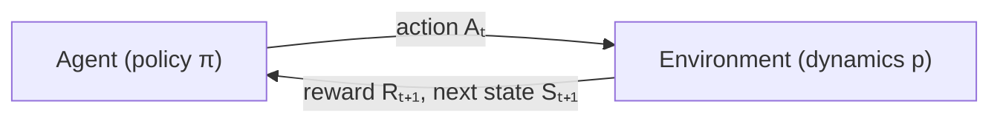
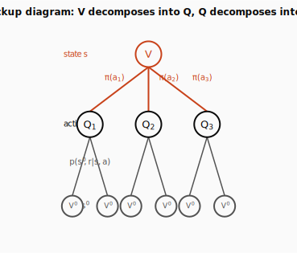
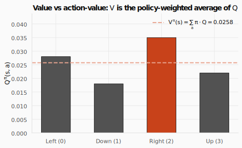
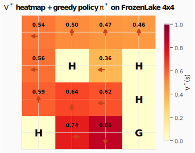

# MDPs and the Bellman Equation: The Recursion Behind Every RL Algorithm


> **The throughline:** _The value of where I am is the reward I just got, plus a discounted value of where I'll land next._

The [RL Foundations](../01-rl-intro-and-prerequisites/) post gave us the vocabulary (policy, reward, value) and the math toolkit (expectation, discounting, the Markov property). This post puts those pieces together into a precise machine: the **Markov Decision Process** (MDP) formalizes the environment, **value functions** score how good a state or action is, and the **Bellman equation** expresses value as a recursion, one equation that every RL algorithm is, at its core, a way of solving.

---

## 1. The intuition: one loop, one lookup table, one recursion

### The agent–environment loop, one more time

Every RL problem is the same loop. At each discrete time step $t$:



The agent observes state $S_t$, picks action $A_t$ according to its policy $\pi$, the environment responds with reward $R_{t+1}$ and next state $S_{t+1}$, and the cycle repeats. The full history is a **trajectory**:

$$
S_0, A_0, R_1, S_1, A_1, R_2, S_2, A_2, R_3, \dots
$$

### What makes an environment an MDP?

An MDP is a tuple $(\mathcal{S}, \mathcal{A}, p, R, \gamma)$:

- $\mathcal{S}$: a finite set of **states** (every cell on a grid, every board position in chess).
- $\mathcal{A}$: a finite set of **actions** (left/down/right/up on a grid).
- $p(s', r \mid s, a)$, the **dynamics function**: the probability that action $a$ in state $s$ leads to next state $s'$ with reward $r$. This single function is the complete DNA of the environment. If you have it, you can plan (dynamic programming). If you don't, you must learn from experience (Monte Carlo, TD).
- $R$: the set of possible reward values.
- $\gamma \in [0, 1)$: the **discount factor** (introduced in [RL Foundations, §2.5](../01-rl-intro-and-prerequisites/#25-geometric-series-and-discounting)).

"Finite" just means you can count the states, actions, and rewards: you could list them all on a whiteboard. FrozenLake has 16 states, 4 actions, and rewards in $\{0, 1\}$.

### The Markov property (quick recap)

The dynamics depend only on $(S_t, A_t)$, not on how you got there. This isn't magic: it's a constraint on **what counts as the state**. If history matters, pack it into the state (frame-stacking in Atari, full transcript in a chatbot). The payoff: value can be a function of $s$ alone.

### The agent–environment boundary

A subtle point: the boundary is **control**, not anatomy. A robot's motors and gears are part of the environment: the agent sends voltage commands, but what the motors do follows physics, not the agent's wishes. Even if the agent knows the rules perfectly (like in chess), the reward computation is still "outside"; it defines the task, it doesn't solve it.

### The reward hypothesis

> _All goals can be thought of as the maximization of the expected cumulative sum of a scalar reward signal._

Bold claim, but it works: chess ($+1$ win, $-1$ loss), maze ($-1$ per step, so hurry!), walking robot (reward proportional to forward speed). The critical design principle: **reward says what to achieve, not how.** If you reward a chess agent for capturing pieces, it might sacrifice a winning position to grab a queen.

<details>
<summary><strong>Check:</strong> The reward function is the only place you tell the agent what you want. Invent a reward for "drive safely" that an agent could obviously game. What does that reveal?</summary>

**Answer.** Reward $+1$ for every second without a crash, and the agent games it by driving extremely slowly or never leaving the driveway: technically "safe," completely useless. It shows the reward specifies _what you measure_, not _what you mean_, and any proxy can be exploited. That failure mode is **reward hacking**.

</details>

---

## 2. The math you need

### 2.1 The dynamics function $p(s', r \mid s, a)$

This is a lookup table: plug in four things (current state $s$, action $a$, next state $s'$, reward $r$) and get back a probability. For any fixed $(s, a)$, the probabilities over all $(s', r)$ outcomes sum to 1:

$$
\sum_{s' \in \mathcal{S}} \sum_{r \in \mathcal{R}} p(s', r \mid s, a) = 1, \qquad \forall\, s \in \mathcal{S},\; a \in \mathcal{A}(s).
$$

In Gymnasium, this table lives in `env.unwrapped.P`. Each entry is a list of `(probability, next_state, reward, done)` tuples, exactly $p(s', r \mid s, a)$:

```python
import gymnasium as gym

# Create the 4x4 FrozenLake with slippery ice (stochastic transitions).
# is_slippery=True means each action has only 1/3 chance of going where intended;
# the other 2/3 of the time the agent slides perpendicular.
env = gym.make("FrozenLake-v1", is_slippery=True)

# P is the full dynamics table p(s', r | s, a).
# P[s][a] returns a list of (probability, next_state, reward, done) tuples
# for every possible outcome of taking action a in state s.
P = env.unwrapped.P

# Query: "What happens if I try to go Right (action=2) from state 6?"
# state 6 (row 1, col 2), action Right
state, action = 6, 2
print(f"p(s', r | s={state}, a={action}):")
for prob, next_state, reward, done in P[state][action]:
    # Each tuple is one branch of the stochastic outcome:
    # prob = p(s',r|s,a), the transition probability for this specific outcome
    print(f"  prob={prob:.4f}  s'={next_state:2d}  r={reward:.0f}  done={done}")
env.close()
```

```text title="Output"
p(s', r | s=6, a=2):
  prob=0.3333  s'=10  r=0  done=False
  prob=0.3333  s'= 7  r=0  done=True
  prob=0.3333  s'= 2  r=0  done=False
```

Because the ice is slippery, action "Right" from state 6 has only a 1/3 chance of actually going right (to state 7, a hole!). The other 2/3 of the time the agent slides down or up. This is the stochasticity that makes the problem an MDP rather than a deterministic puzzle.

### 2.2 Returns: what exactly are we maximizing?

The agent doesn't maximize a single reward; it maximizes the **return** $G_t$, the cumulative discounted reward from time $t$ onward:

$$
G_t = R_{t+1} + \gamma\,R_{t+2} + \gamma^2 R_{t+3} + \cdots = \sum_{k=0}^{\infty} \gamma^k\,R_{t+k+1}.
$$

- **Episodic tasks** (chess, maze) end at some terminal step $T$; the sum is finite even without discounting.
- **Continuing tasks** (thermostat, stock trader) run forever; discounting with $\gamma < 1$ keeps the sum finite: $G_t \le \frac{R_{\max}}{1 - \gamma}$.

The discount factor $\gamma$ answers "how far-sighted is this agent?" ($\gamma = 0$: myopic; $\gamma \to 1$: values the distant future almost equally).

A quick calculation: with $\gamma = 0.99$ and $R_{\max} = 1$, the return is bounded by $\frac{1}{1 - 0.99} = 100$. That finite ceiling is why the Bellman equation works for infinite-horizon tasks.

### 2.3 The recursive return: the heartbeat of RL

The most important algebraic trick in all of reinforcement learning. Start with the definition of $G_t$ and factor out $\gamma$:

$$
G_t = R_{t+1} + \gamma\,R_{t+2} + \gamma^2 R_{t+3} + \cdots = R_{t+1} + \gamma\,\underbrace{(R_{t+2} + \gamma\,R_{t+3} + \cdots)}_{G_{t+1}}.
$$

$$
\boxed{G_t = R_{t+1} + \gamma\,G_{t+1}}
$$

The return from now equals the immediate reward plus $\gamma$ times the return from one step later. This **one-step recursion** is what makes the Bellman equation work: the whole chain of future rewards collapses into a single recursive step.

### 2.4 Value functions: $V$ vs $Q$, the emphasis

Two ways to score "how good":

**State-value function** $V^\pi(s)$, one number per state:

$$
V^\pi(s) = \mathbb{E}_\pi\big[G_t \mid S_t = s\big]
$$

Read: "V-pi of s equals the expected return G_t, given that the current state is s, when following policy pi."

Interpretation: if I start in state $s$ and follow policy $\pi$ from here on, what return should I expect on average?

**Action-value function** $Q^\pi(s, a)$, one number per state-action pair:

$$
Q^\pi(s, a) = \mathbb{E}_\pi\big[G_t \mid S_t = s, A_t = a\big]
$$

Read: "Q-pi of s, a equals the expected return G_t, given that the current state is s and the action taken is a, when following policy pi afterward."

Interpretation: if I start in state $s$, take action $a$, then follow $\pi$ afterward, what return should I expect?

$Q$ breaks $V$ open per action. $V$ tells you how good a state is; $Q$ tells you which action makes it that good. Both depend on the policy: **same state, different policy, different value.**

#### The V-Q bridge (both directions)

$V$ and $Q$ are two views of the same thing, connected by two equations:

$$
V^\pi(s) = \sum_a \pi(a \mid s)\,Q^\pi(s, a)
$$

Read: "V-pi of s equals the sum over all actions a of the policy probability pi(a|s) times Q-pi(s, a)."

Interpretation: $V$ is the policy-weighted average of $Q$. You average the action-values over the actions the policy would take: if the policy spreads 70% on left and 30% on right, V is 0.7·Q(left) + 0.3·Q(right).

$$
Q^\pi(s, a) = \sum_{s', r} p(s', r \mid s, a)\,\big[r + \gamma\,V^\pi(s')\big]
$$

Read: "Q-pi of s, a equals the sum over all possible next states s' and rewards r of the transition probability p(s',r|s,a) times [r + gamma times V-pi(s')]."

Interpretation: $Q$ is the environment-weighted average of $[r + \gamma V']$. You average over where the environment sends you: each landing spot contributes its immediate reward plus the discounted value of landing there, weighted by how likely that transition is.

The two diagrams below visualize these equations as a tree and a bar chart.



**Reading the backup diagram (tree).** Start at the top: the single $V$ node is the state you're in. Going _down one level_, it branches into multiple $Q$ nodes, one per action the policy might take. The edges are labeled $\pi(a_i)$: the probability the policy gives to each action. This is the first equation ($V = \sum_a \pi \cdot Q$): V averages over actions using policy probabilities. Going _down another level_, each $Q$ node branches into multiple $V'$ nodes (next states). The edges are labeled $p(s', r \mid s, a)$: the transition probabilities from the environment. This is the second equation ($Q = \sum_{s'} p \cdot [r + \gamma V']$): Q averages over next states using environment probabilities. Together, the full tree from top to bottom is the expanded Bellman equation: two layers of averaging (agent choice, then environment randomness).



**Reading the bar chart.** Each bar is $Q^\pi(s, a)$ for one action (Left, Down, Right, Up) at a single state. The bars have different heights because some actions lead to better outcomes than others (Right is tallest here: it leads toward the goal). The dashed horizontal line is $V^\pi(s) \approx 0.026$: the policy-weighted average of all four Q-values. Under a uniform policy ($\pi = 0.25$ for each action), that average is simply $(Q_\text{Left} + Q_\text{Down} + Q_\text{Right} + Q_\text{Up}) / 4$, which lands between the bars, not at any single bar's height. This is the V-Q bridge in a picture: V is just the expected Q under the policy.

#### Why $Q$ matters more in practice

With $V(s)$ alone, choosing an action requires the model: "if I take action $a$, where do I land, and what's $V(s')$ there?" That needs $p(s' \mid s, a)$.

With $Q(s, a)$, choosing is trivial: **pick $\arg\max_a Q(s, a)$. No model needed.** This is why DQN learns $Q$, not $V$, and the policy falls out of the argmax for free:

$$
\pi^*(s) = \arg\max_a\, Q^*(s, a).
$$

Read: "Pi-star of s equals the action a that maximizes Q-star(s, a)."

Interpretation: the optimal policy just picks whichever action has the highest Q-value. No search, no model, just compare numbers and take the biggest.

Here's the bridge in code. The key question: how does each equation become a loop?

**Equation → code for $Q$ from $V$:**

$$
Q^\pi(s, a) = \sum_{s', r} p(s', r \mid s, a)\,\big[r + \gamma\,V^\pi(s')\big]
$$

The sum says: "loop over every possible outcome $(s', r)$ of taking action $a$ in state $s$." Each outcome has a probability $p$ and contributes $p \times [r + \gamma \cdot V(s')]$ to the total. In Gymnasium, `P[s][a]` gives exactly that list of outcomes as `(prob, next_state, reward, done)` tuples, so the sum becomes a for-loop accumulating `prob * (reward + gamma * V[next_state])`.

**Equation → code for $V$ from $Q$:**

$$
V^\pi(s) = \sum_a \pi(a \mid s)\,Q^\pi(s, a)
$$

The sum says: "loop over every action $a$." Each action has a policy probability $\pi(a|s)$ and contributes $\pi(a|s) \times Q(s, a)$. Under a uniform policy, every action gets weight $0.25$, so V is just the average of the four Q-values.

```python
import gymnasium as gym
import numpy as np

env = gym.make("FrozenLake-v1", is_slippery=True)
P = env.unwrapped.P
nS, nA = 16, 4
gamma = 0.99

# Start with a rough placeholder V(s) to demonstrate the V↔Q bridge.
# In practice, V would come from solving the Bellman equation; here we
# seed it with small random values and set known terminal states.
V = np.random.default_rng(0).uniform(0, 0.1, size=nS)  # placeholder V
V[15] = 1.0  # goal state has high value (reward +1 for arriving)
V[[5, 7, 11, 12]] = 0.0  # holes are absorbing with zero value


def q_from_v(V: np.ndarray, s: int, a: int) -> float:
    """Q^π(s,a) = Σ_{s'} p(s',r|s,a) · [r + γ·V(s')]

    Given I take action a in state s, what's my expected return?
    Averages over environment randomness (where do I land?).
    """
    q_value: float = 0.0
    # P[s][a] is the dynamics table: each entry is one possible outcome
    # of taking action a in state s.
    for prob, next_state, reward, done in P[s][a]:
        # This one line IS the equation:
        # p(s',r|s,a)  ·  [r         + γ     · V(s')        ]
        q_value += prob * (reward + gamma * V[next_state])
    return q_value


def v_from_q(Q_values: list[float], pi_probs: list[float]) -> float:
    """V^π(s) = Σ_a π(a|s) · Q(s,a)

    What's the value of state s under policy π?
    Averages over agent randomness (which action do I pick?).
    """
    v_value: float = 0.0
    # Loop over every action: weight each Q-value by the policy probability
    for pi_a, q_a in zip(pi_probs, Q_values):
        # π(a|s) · Q(s,a)
        v_value += pi_a * q_a
    return v_value


# Compute Q(6, a) for all 4 actions, then recover V(6) from Q.
s = 6
Q_s = [q_from_v(V, s, a) for a in range(nA)]
pi_uniform = [0.25] * nA  # uniform random policy: equal weight on all actions

print(f"Q({s}, a) = {[f'{q:.4f}' for q in Q_s]}")
print(f"V({s}) via Q = {v_from_q(Q_s, pi_uniform):.4f}")
# Greedy action = argmax_a Q(s,a): the model-free decision rule.
# With Q in hand, acting optimally is just picking the largest number.
print(f"Greedy action = {np.argmax(Q_s)} ({['Left','Down','Right','Up'][np.argmax(Q_s)]})")
env.close()
```

```text title="Output"
Q(6, a) = ['0.0283', '0.0269', '0.0283', '0.0014']
V(6) via Q = 0.0212
Greedy action = 0 (Left)
```

$Q(6, \text{Left})$ is highest (tied with Right), so the greedy policy says "go Left" from state 6: no model needed at decision time, just compare four numbers.

<details>
<summary><strong>Check:</strong> If you could only be handed one of V(s) or Q(s, a), which one lets you actually act without any extra computation, and why?</summary>

**Answer.** $Q(s,a)$. It already gives a number for every action, so acting is a single $\arg\max$ with no model. $V(s)$ is one number for the whole state; to act from it you must ask "where does each action land, and what is $V$ there?", which needs the model $p(s'\mid s,a)$. That model-free choice is exactly why DQN learns $Q$.

</details>

<details>
<summary><strong>Check:</strong> Two states have the same value under some policy π. Does that mean they're equally good under the optimal policy? Argue both directions.</summary>

**Answer.** No. Equal value under one policy $\pi$ says nothing about the optimal values: a different policy could exploit one state far more than the other. Conversely, two states _can_ still tie under the optimal policy (e.g. both one step from the goal). So same-value-under-$\pi$ neither implies nor forbids same-value-under-optimal.

</details>

### 2.5 The Bellman expectation equation

Now the payoff. Start from the recursive return $G_t = R_{t+1} + \gamma\,G_{t+1}$ and take the expectation conditioned on $S_t = s$:

$$
V^\pi(s) = \mathbb{E}_\pi\big[R_{t+1} + \gamma\,V^\pi(S_{t+1}) \mid S_t = s\big]
$$

Read: "V-pi of s equals the expected value of [R_{t+1} plus gamma times V-pi of the next state S_{t+1}], given S_t = s, under policy pi."

Interpretation: **the value of a state is the expected immediate reward plus the discounted value of the next state.** This is the Bellman equation in one line. But that $\mathbb{E}_\pi[\cdots]$ still hides two sources of randomness: (1) which action the agent picks, and (2) where the environment sends it. Let's peel them off one at a time.

**Step 1: expand the expectation over the agent's action randomness (policy $\pi$).**

The expectation $\mathbb{E}_\pi[\cdots \mid S_t = s]$ is an average over _everything random_ that can happen from state $s$. The first random thing is: which action does the agent pick? The probability of picking action $a$ is $\pi(a \mid s)$. By the law of total expectation ("split an average into cases and weight each case by its probability"):

$$
\mathbb{E}_\pi[\cdots \mid S_t = s] \;=\; \sum_a \underbrace{\pi(a \mid s)}_{\text{prob of case } a} \;\cdot\; \underbrace{\mathbb{E}[\cdots \mid S_t = s,\, A_t = a]}_{\text{average within that case}}
$$

So the full line becomes:

$$
V^\pi(s) = \sum_a \pi(a \mid s)\;\mathbb{E}\big[R_{t+1} + \gamma\,V^\pi(S_{t+1}) \mid S_t = s, A_t = a\big]
$$

Why is there still an $\mathbb{E}$ inside? Because even after fixing the action, there is still randomness left: the _environment_ hasn't rolled its dice yet. We know the state ($s$) and the action ($a$), but the next state $S_{t+1}$ is still random (the ice is slippery!). The inner expectation averages over that remaining environment randomness.

**Step 2: expand the remaining expectation over the environment's state randomness (dynamics $p$).**

Now we're inside a fixed $(s, a)$ pair. The only randomness left is which next state $s'$ the environment produces, with probability $p(s' \mid s, a)$. Apply the same rule again ("split into cases, weight by probability"), but this time the cases are next states:

$$
\mathbb{E}[\cdots \mid S_t = s, A_t = a] \;=\; \sum_{s'} p(s' \mid s, a)\;\big[R(s, a, s') + \gamma\,V^\pi(s')\big]
$$

No $\mathbb{E}$ remains because once we fix $s$, $a$, and $s'$, nothing is random anymore: the reward $R(s,a,s')$ is a known number, and $V^\pi(s')$ is a fixed value for that next state.

**Substituting Step 2 into Step 1 gives the full Bellman expectation equation:**

$$
\boxed{V^\pi(s) = \sum_a \pi(a \mid s) \sum_{s'} p(s' \mid s, a)\;\big[R(s, a, s') + \gamma\,V^\pi(s')\big]}
$$

Read: "V-pi of s equals the sum over actions a of pi(a|s) times the sum over next states s' of p(s'|s,a) times [R(s,a,s') + gamma times V-pi(s')]."

Interpretation: for each action I might take (weighted by my policy), for each state I might land in (weighted by transition probability), add the reward I get plus the discounted value of where I land. Two nested sums, one per source of randomness, and once both are expanded there is nothing random left.

Both steps use the same rule: $\mathbb{E}[X] = \sum (\text{possible value}) \times (\text{probability})$. Step 1 applies it to actions (probabilities from $\pi$). Step 2 applies it to next states (probabilities from $p$).

This is **one equation per state**, and they all refer to each other: $V(s)$ depends on $V(s')$, which depends on $V(s'')$, and so on. That system of equations is what we solve in the capstone.

```python
import gymnasium as gym
import numpy as np

env = gym.make("FrozenLake-v1", is_slippery=True)
P = env.unwrapped.P
nS, nA = 16, 4
gamma = 0.99

def bellman_backup(V: np.ndarray, s: int, pi: list[float]) -> float:
    """One Bellman expectation backup for state s:
    V^π(s) = Σ_a π(a|s) · Σ_{s'} p(s'|s,a) · [r + γ·V(s')]

    This computes a NEW estimate for V(s) by looking one step ahead:
    for each action (weighted by policy), for each next state (weighted
    by dynamics), accumulate [immediate reward + discounted future value].
    """
    total: float = 0.0
    for a in range(nA):
        for prob, s2, r, done in P[s][a]:
            # π(a|s) · p(s'|s,a) · [r + γ·V(s')]
            # Agent randomness × environment randomness × one-step lookahead
            total += pi[a] * prob * (r + gamma * V[s2])
    return total

# Initialize V to all zeros except the goal. This simulates "before any
# value has propagated": only the goal knows it's valuable.
V_test = np.zeros(nS)
# goal state has value 1 (reward = 1 for reaching it)
V_test[15] = 1.0
# uniform random policy
pi = [0.25] * nA

# One backup at state 6: can the goal's value reach state 6 in a single step?
# State 6 is several cells away from state 15, so the answer is no (0.0).
# Repeated backups (or solving the full system) propagate value outward.
v6 = bellman_backup(V_test, 6, pi)
print(f"Bellman backup at state 6: V(6) = {v6:.6f}")
env.close()
```

```text title="Output"
Bellman backup at state 6: V(6) = 0.000000
```

With all states at zero except the goal, the backup at state 6 gives zero because state 6 is too far from the goal for a single backup to propagate the value. Repeated backups (or solving the full system) are needed: that's what the capstone does.

<details>
<summary><strong>Check:</strong> The backup "looks to the future to value the present." Causally the future depends on now, so in what sense is the backup a causal inversion, and why is that legitimate?</summary>

**Answer.** The backup writes $V(s)$ in terms of $V(s')$: it values the present using the values of the future. It is not predicting the future from the past; it _defines_ a state's value by the values of the states it can reach, then iterates until consistent. That's legitimate because it is a **fixed-point equation** $V = \mathcal{T}V$, not a causal claim. We simply solve for the self-consistent $V$.

</details>

### 2.6 The Bellman optimality equation

Replace the policy's weighted average $\sum_a \pi(a \mid s)\,(\cdots)$ with a **maximum** $\max_a\,(\cdots)$, and you get the equation for the **optimal** value:

$$
V^*(s) = \max_a \sum_{s'} p(s' \mid s, a)\;\big[R(s, a, s') + \gamma\,V^*(s')\big]
$$

Read: "V-star of s equals the max over actions a of the sum over next states s' of p(s'|s,a) times [R(s,a,s') + gamma times V-star(s')]."

Interpretation: instead of averaging over actions according to some policy, **pick the best action.** The optimal value of a state is the value you get when you always choose the action that leads to the highest expected return.

The optimal action-value has its own recursion:

$$
Q^*(s, a) = \sum_{s'} p(s' \mid s, a)\;\big[R(s, a, s') + \gamma\,\max_{a'} Q^*(s', a')\big]
$$

Read: "Q-star of s, a equals the sum over next states s' of p(s'|s,a) times [R(s,a,s') + gamma times the max over next actions a' of Q-star(s', a')]."

Interpretation: the optimal value of taking action $a$ in state $s$ is the expected reward plus the discounted value of the next state, _assuming you act optimally from that next state onward_ (that's where the inner $\max_{a'}$ comes from).

Now notice what $Q^*$ gives you: a number for every action in every state, and that number already accounts for optimal behavior in the entire future. So if you had $Q^*$ in hand, choosing the best action would require zero planning: just compare the numbers and pick the largest. The optimal policy falls out for free:

$$
\pi^*(s) = \arg\max_a\, Q^*(s, a)
$$

Read: "Pi-star of s equals the action a that maximizes Q-star(s, a)."

Interpretation: once you have the optimal Q-values, the optimal policy is trivial: just pick the action with the highest Q. Every RL algorithm is, at its core, a way of computing or approximating these optimal values.

One more relation connects $V^*$ and $Q^*$ directly (compare this to the V-Q bridge from §2.4, which used a policy-weighted _average_; here the average becomes a _max_):

$$
V^*(s) = \max_a\, Q^*(s, a)
$$

Read: "V-star of s equals the max over actions a of Q-star(s, a)."

Interpretation: the optimal value of a state is simply the Q-value of the best action available there. Under the optimal policy you always take the best action, so V and the best Q coincide.

**Where did $\pi(a|s)$ go?** Recall the general V-Q bridge: $V^\pi(s) = \sum_a \pi(a|s)\,Q^\pi(s,a)$ — a weighted average. For the _optimal_ policy, the weighting is degenerate: $\pi^*(a|s) = 1$ for the best action and $0$ for all others. When you substitute that one-hot distribution into the sum, every term vanishes except the maximum. A weighted average with a one-hot weight vector _is_ "pick the max."

<details>
<summary><strong>Check:</strong> The relation V*(s) = max_a Q*(s, a) looks innocent. What does it quietly assume about how the agent behaves after the first step?</summary>

**Answer.** It assumes that **from the next step onward you act optimally** (greedily with respect to $Q^*$). The single $\max$ over the first action only works because every _future_ action is already assumed to be the best one; that is what makes the state's value the $\max$ of action-values rather than a policy-weighted average.

</details>

#### Worked example: the optimal policy on slippery FrozenLake



The heatmap above shows $V^*$ for every state (computed by value iteration, which we'll derive in the next post). The arrows show $\pi^* = \arg\max_a Q^*$: the greedy policy that falls out of the optimal Q-values.

**Why do the arrows look wrong?** Many arrows point _away_ from the goal: Left and Up in the top rows, Down at state 14 (the cell right next to the goal). This is **correct** and it's entirely because the ice is slippery. On slippery FrozenLake, every action has only a 1/3 chance of going where intended; the other 2/3 of the time the agent slides perpendicular. So the optimal strategy isn't "aim for the goal", it's **"aim so that your slips land somewhere safe."**

Consider state 14 (value 0.86, one cell left of the goal). Right seems obvious, but:

- **Right**: 1/3 reaches the goal, but 1/3 slides up to state 10 (V = 0.62, far away). Q = 0.82.
- **Down**: 1/3 reaches the goal _as a perpendicular slip_, 1/3 stays at state 14 (V = 0.86), and 1/3 slips to state 13 (V = 0.74). All slip destinations are high-value. Q = **0.86**.

Down wins because its worst-case slip is much better. The same logic explains the top-row arrows: by pointing Left or Up into the walls, the agent uses them as bumpers, since it can't slip off the grid, so two of its three outcomes keep it in the same (safe) cell instead of sliding toward a hole. **The optimal policy minimizes the damage from slips, not the distance to the goal.**

### 2.7 The same recursion on a different surface

A remarkable claim: DQN, AlphaGo, PPO, and GRPO are all the same recursion, $V(s) = r + \gamma \cdot V(s')$, applied to different definitions of state, action, and reward:

| Algorithm    | State                  | Action        | Reward                |
| ------------ | ---------------------- | ------------- | --------------------- |
| DQN (Atari)  | stack of game frames   | joystick move | change in score       |
| AlphaGo      | board position         | legal move    | $+1$ win / $-1$ loss  |
| PPO for RLHF | prompt + tokens so far | next token    | reward-model score    |
| GRPO         | same as PPO            | next token    | group-relative reward |

The Bellman equation is the universal backbone. Everything else is engineering to make it work at scale.

<details>
<summary><strong>Check:</strong> Pick any two of DQN, AlphaGo, PPO, and GRPO and state precisely what the state, action, and reward are in each.</summary>

**Answer.** For example: **DQN** has state = a stack of Atari frames, action = a joystick move, reward = the change in game score. **AlphaGo** has state = the board position, action = a legal move, reward = $+1$ win / $-1$ loss. Different surfaces, but both estimate value through the same $V(s) = r + \gamma V(s')$ recursion; only the meaning of $s$, $a$, $r$ changes.

</details>

<details>
<summary><strong>Check:</strong> A Go board has roughly 10^170 positions, so you can never enumerate them. How does AlphaGo still apply the Bellman backup without a table over all states?</summary>

**Answer.** It never enumerates them. AlphaGo approximates $V$ (and the policy) with a neural network and applies the backup only along the states actually visited by tree search and self-play, generalizing to unseen boards. The backup is **local**: it needs only the current state and its successors, never the whole space. That table-to-network leap is the subject of [SARSA, Q-learning & DQN](../04-sarsa-qlearning-dqn/README.md).

</details>

---

## 3. Putting it all together: solving Bellman exactly on FrozenLake

We've seen each idea in isolation. Here's the whole vocabulary as a quick reference, then one runnable program that solves the Bellman expectation equation as a linear system: no iteration, no sampling, just linear algebra.

| Concept          | Math                                    | In code                            |
| ---------------- | --------------------------------------- | ---------------------------------- | -------------------- |
| Dynamics         | $p(s', r \mid s, a)$                    | `P[s][a] -> [(prob, s', r, done)]` |
| Return           | $G_t = \sum_k \gamma^k R_{t+k+1}$       | `G += gamma**k * r`                |
| Recursive return | $G_t = R_{t+1} + \gamma G_{t+1}$        | (defines the Bellman structure)    |
| State-value      | $V^\pi(s) = \mathbb{E}[G_t \mid s]$     | `V[s]`                             |
| Action-value     | $Q^\pi(s,a) = \mathbb{E}[G_t \mid s,a]$ | `q_from_v(V, s, a)`                |
| V from Q         | $V = \sum_a \pi(a                       | s)\,Q(s,a)$                        | `(pi * Q_row).sum()` |

| Optimal policy | $\pi^* = \arg\max_a Q^*$ | `np.argmax(Q, axis=1)` |

---

## Where this goes next

We've formalized the environment as an MDP, defined $V$ and $Q$, and derived the Bellman equation. But writing the equation is not the same as solving it: finding the actual values requires either exact linear algebra (feasible only for tiny state spaces) or iterative/sampling methods. The next post introduces three classical approaches:

- **Dynamic Programming**: iterate the Bellman backup with the model (no sampling needed).
- **Monte Carlo**: sample full episodes and average the returns (no model needed).
- **Temporal Difference**: blend the two, updating after every step using a bootstrapped estimate.

All three converge to the same $V^\pi$, but they trade off bias (how far from the true value), variance (how noisy the estimates are), and data efficiency (how many samples are needed to converge). We'll build a custom Mars Rover environment and watch all three converge on it from scratch.
