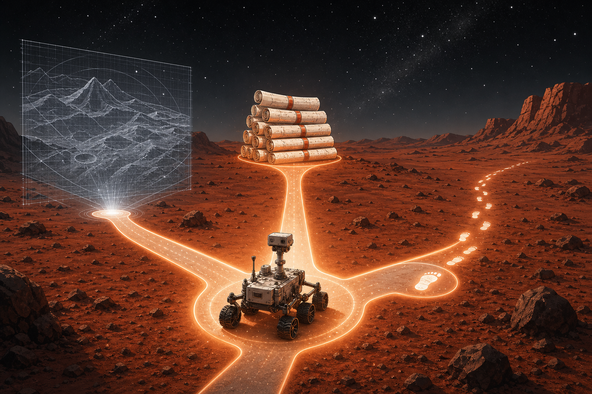
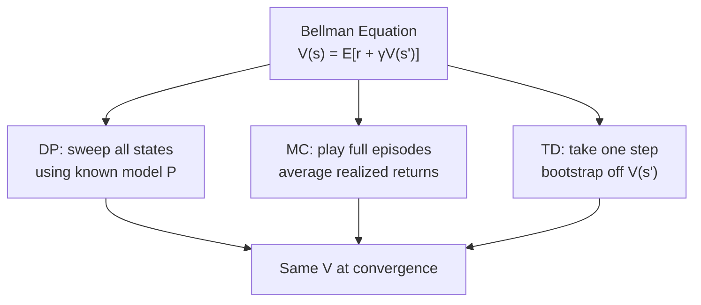
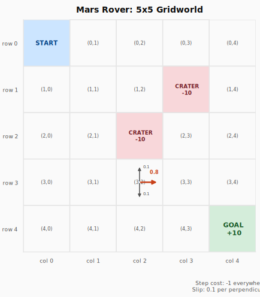
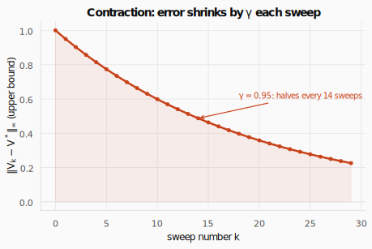
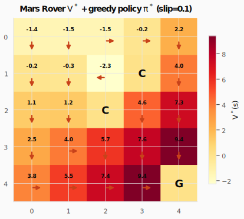
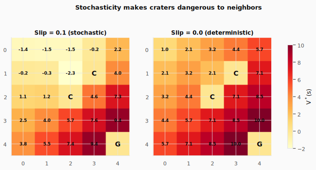
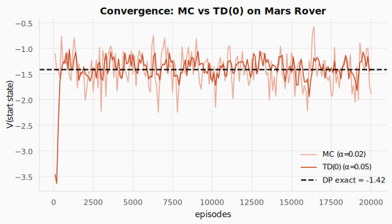
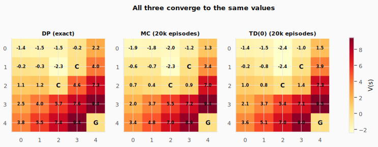

# DP, Monte Carlo, and TD: Three Ways to Solve the Bellman Equation



> **The throughline:** *The value of where I am is the reward I just got, plus a discounted value of where I'll land next.*
> Last post we wrote that equation. This post we solve it three different ways.

---

## 1. The intuition

In [MDPs & Bellman](../02-mdps-and-bellman/README.md) we derived the Bellman equation, the recursive statement that connects a state's value to its successors. But having an equation isn't the same as having a number. How do we actually *compute* $V(s)$?

Three families of algorithms, three different assumptions:

| Method | What it needs | When it updates |
|--------|--------------|-----------------|
| **Dynamic Programming** | The full model $p(s',r \mid s,a)$ | Every state, every sweep |
| **Monte Carlo** | Complete episodes (no model) | End of each episode |
| **Temporal Difference** | A single transition (no model) | After every step |

**All three solve the same equation. They differ only in what data they use and when they update.**



### Meet the Mars Rover

We'll learn all three methods on one environment: a 5×5 grid where a rover must reach a science target while avoiding craters.



The rules:
- **Start:** $(0,0)$, the top-left corner.
- **Goal:** $(4,4)$, reward $+10$, episode ends.
- **Craters:** $(2,2)$ and $(1,3)$, reward $-10$, episode ends.
- **Step cost:** $-1$ everywhere else.
- **Slip:** the rover moves in the intended direction with probability $0.8$, and slips to each perpendicular direction with probability $0.1$.
- **Discount:** $\gamma = 0.95$.

Let's build it and watch a random policy fumble around:

```python
import gymnasium as gym
from gymnasium import spaces
import numpy as np

# World layout. Coordinates are (row, col), 0-indexed from the top-left corner.
GRID = 5                       # 5x5 board, so 25 discrete states (numbered 0..24)
GOAL = (4, 4)                  # science target: landing here ends the episode with +10
CRATERS = {(2, 2), (1, 3)}     # landing in a crater ends the episode with -10
SLIP = 0.1                     # probability of slipping to EACH of the two perpendicular tiles
GAMMA = 0.95                   # discount: a reward k steps away is worth 0.95**k today
MOVES = {0: (-1, 0), 1: (0, 1), 2: (1, 0), 3: (0, -1)}  # action -> (d_row, d_col): up, right, down, left
PERP = {0: [3, 1], 1: [0, 2], 2: [1, 3], 3: [2, 0]}     # for each action, the two sideways slip directions

def rc(s):
    "State number -> (row, col)."
    return divmod(s, GRID)

def idx(r, c):
    "(row, col) -> state number."
    return r * GRID + c

class MarsRoverEnv(gym.Env):
    def __init__(self):
        super().__init__()
        self.observation_space = spaces.Discrete(GRID * GRID)   # 25 possible states
        self.action_space = spaces.Discrete(4)                  # 4 possible moves
        self.goal = idx(*GOAL)
        self.craters = {idx(*c) for c in CRATERS}
        self.terminals = self.craters | {self.goal}            # episode ends in any of these
        self.P = self._build_model()                            # full transition model (only DP may read this)

    def _move(self, s, a):
        "Take one step in direction a, clamped so the rover can't walk off the grid."
        r, c = rc(s)
        dr, dc = MOVES[a]
        return idx(min(max(r + dr, 0), GRID - 1), min(max(c + dc, 0), GRID - 1))

    def _reward(self, s_next):
        "Reward depends only on which tile you land on."
        if s_next == self.goal: return 10.0
        if s_next in self.craters: return -10.0
        return -1.0   # every ordinary step costs 1, which nudges the rover to hurry

    def _build_model(self):
        # Precompute P[s][a] = list of (probability, next_state, reward, done).
        # This is the "god's-eye" model of the world. DP reads it directly;
        # MC and TD are not allowed to, they must learn from reset()/step() only.
        P = {s: {a: [] for a in range(4)} for s in range(GRID * GRID)}
        for s in range(GRID * GRID):
            for a in range(4):
                if s in self.terminals:
                    # Terminal tiles absorb the rover: it stays put and earns nothing more.
                    P[s][a] = [(1.0, s, 0.0, True)]
                    continue
                outcomes = {}
                # With probability (1 - 2*SLIP) the rover goes where it intended...
                intended = self._move(s, a)
                outcomes[intended] = outcomes.get(intended, 0) + (1 - 2 * SLIP)
                # ...and with probability SLIP each, it slips to a perpendicular tile.
                for slip_a in PERP[a]:
                    slipped = self._move(s, slip_a)
                    outcomes[slipped] = outcomes.get(slipped, 0) + SLIP
                P[s][a] = [(p, sn, self._reward(sn), sn in self.terminals)
                           for sn, p in outcomes.items()]
        return P

    def reset(self, seed=None, options=None):
        super().reset(seed=seed)
        self.s = idx(0, 0)        # every episode begins in the top-left corner
        return self.s, {}

    def step(self, action):
        # Roll the dice: sample an actual next state using the slip probabilities.
        tr = self.P[self.s][action]
        i = self.np_random.choice(len(tr), p=[t[0] for t in tr])
        _, s_next, reward, terminated = tr[i]
        self.s = s_next
        return s_next, reward, terminated, False, {}

# Watch an untrained, uniformly-random policy stumble around for up to 20 steps.
env = MarsRoverEnv()
obs, _ = env.reset(seed=42)
done = False
steps = 0
print("Episode trace (random policy):")
while not done and steps < 20:
    a = env.action_space.sample()                  # pick a random move (there is no learning yet)
    obs_next, r, terminated, truncated, _ = env.step(a)
    # Show the transition as  (row,col) --a=action--> (row,col)  and the reward received.
    print(f"  ({rc(obs)[0]},{rc(obs)[1]}) --a={a}--> ({rc(obs_next)[0]},{rc(obs_next)[1]})  r={r:.0f}")
    obs = obs_next
    done = terminated or truncated
    steps += 1
if done:
    print(f"  Episode ended at ({rc(obs)[0]},{rc(obs)[1]})")
else:
    print(f"  ... still wandering after {steps} steps")
```

```text title="Output"
Episode trace (random policy):
  (0,0) --a=2--> (1,0)  r=-1
  (1,0) --a=1--> (1,1)  r=-1
  (1,1) --a=3--> (2,1)  r=-1
  (2,1) --a=3--> (2,0)  r=-1
  (2,0) --a=3--> (2,0)  r=-1
  (2,0) --a=2--> (2,0)  r=-1
  (2,0) --a=1--> (2,1)  r=-1
  (2,1) --a=0--> (1,1)  r=-1
  (1,1) --a=3--> (1,0)  r=-1
  (1,0) --a=0--> (0,0)  r=-1
  (0,0) --a=0--> (0,0)  r=-1
  (0,0) --a=0--> (0,1)  r=-1
  (0,1) --a=1--> (0,2)  r=-1
  (0,2) --a=2--> (0,3)  r=-1
  (0,3) --a=0--> (0,3)  r=-1
  (0,3) --a=3--> (0,2)  r=-1
  (0,2) --a=3--> (0,1)  r=-1
  (0,1) --a=1--> (0,2)  r=-1
  (0,2) --a=2--> (0,3)  r=-1
  (0,3) --a=0--> (0,3)  r=-1
  ... still wandering after 20 steps
```

The rover stumbles aimlessly, slipping on dusty terrain, never reaching the goal. We need to compute which states are valuable and which actions to take. That's what DP, MC, and TD each do, just with different information.

### The video-game-level analogy

Imagine a 4-stage video game level with a randomized boss at stage 3:

- **DP** reads the game's source code (the model). It computes the exact expected score from every checkpoint without playing once.
- **MC** plays the level start-to-finish many times, records the total score from each run, and averages them per checkpoint.
- **TD** plays the level but updates its estimate of each checkpoint after every single stage transition, using its current (imperfect) estimate of the next stage.

Same question, same answer, three routes to get there.

---

## 2. The math you need

### 2.1 Value Iteration (Dynamic Programming)

DP uses the **full model** $p(s',r \mid s,a)$ to sweep the Bellman optimality equation across every state:

$$
V(s) \leftarrow \max_a \sum_{s',r} p(s',r \mid s,a) \left[ r + \gamma \, V(s') \right]
$$

Each sweep applies this backup to every state. After enough sweeps, $V$ converges to $V^*$.

**Why does it converge?** The Bellman operator is a *contraction mapping*: each application brings $V$ closer to $V^*$ by a factor of $\gamma$. Think of a photocopier set to 95% zoom: no matter what you start with, repeated copies shrink toward a dot. After $k$ sweeps:

$$
\|V_k - V^*\|_\infty \leq \gamma^k \|V_0 - V^*\|_\infty
$$



With $\gamma = 0.95$, error halves roughly every 14 sweeps, guaranteed convergence to the exact answer.

```python
def value_iteration(env, gamma=GAMMA, theta=1e-6):
    V = np.zeros(env.observation_space.n)        # start every state's value at 0
    while True:
        delta = 0                                # largest value change this sweep
        for s in range(env.observation_space.n):
            v_old = V[s]
            q_values = []
            for a in range(env.action_space.n):
                # Q(s,a) = expected (reward + discounted next value), averaged over
                # all outcomes of taking a. (1 - done) zeroes the future at terminals.
                q = sum(p * (r + gamma * V[s_next] * (1 - done))
                        for p, s_next, r, done in env.P[s][a])
                q_values.append(q)
            V[s] = max(q_values)                 # the optimal value picks the best action
            delta = max(delta, abs(v_old - V[s]))
        if delta < theta:                        # stop once the sweep barely moves V
            break
    # Read off the greedy policy: in each state, the action with the highest Q(s,a).
    policy = np.zeros(env.observation_space.n, dtype=int)
    for s in range(env.observation_space.n):
        q_values = [sum(p * (r + gamma * V[s_next] * (1 - done))
                        for p, s_next, r, done in env.P[s][a])
                    for a in range(env.action_space.n)]
        policy[s] = np.argmax(q_values)
    return V, policy

env = MarsRoverEnv()
V_dp, policy = value_iteration(env)
print("V* (5x5 grid):")
print(V_dp.reshape(5, 5).round(2))
print("\nGreedy policy (^>v<):")
arrows = {0: "^", 1: ">", 2: "v", 3: "<"}
grid = []
for s in range(25):
    grid.append("." if s in env.terminals else arrows[policy[s]])
print(np.array(grid).reshape(5, 5))
```

```text title="Output"
V* (5x5 grid):
[[-1.42 -1.5  -1.52 -0.21  2.24]
 [-0.18 -0.29 -2.26  0.    4.02]
 [ 1.13  1.25  0.    4.56  7.28]
 [ 2.51  4.    5.73  7.59  9.42]
 [ 3.8   5.53  7.4   9.42  0.  ]]

Greedy policy (^>v<):
[['v' 'v' '>' '>' 'v']
 ['v' 'v' '<' '.' 'v']
 ['v' 'v' '.' 'v' 'v']
 ['v' '>' 'v' 'v' 'v']
 ['>' '>' '>' '>' '.']]
```

Values increase as you approach the goal. The policy steers down and right toward (4,4), but detours *around* craters: cell (1,2) goes left to avoid both the crater at (1,3) and (2,2).



#### What if terrain were perfect?

With `SLIP=0`, the rover has perfect control. Craters only hurt if you deliberately enter them:

```python
SLIP = 0.0
env_det = MarsRoverEnv()
V_det, _ = value_iteration(env_det)
SLIP = 0.1  # restore for later
print("V* with SLIP=0 (deterministic):")
print(V_det.reshape(5, 5).round(2))
```

```text title="Output"
V* with SLIP=0 (deterministic):
[[ 0.95  2.05  3.21  4.44  5.72]
 [ 2.05  3.21  2.05  0.    7.07]
 [ 3.21  4.44  0.    7.07  8.5 ]
 [ 4.44  5.72  7.07  8.5  10.  ]
 [ 5.72  7.07  8.5  10.    0.  ]]
```

Without slip, crater-adjacent cells have *positive* values: they're safe if you never step in voluntarily. **Stochasticity is what makes craters dangerous to neighbors, not the craters themselves.**



<details>
<summary><strong>Check:</strong> Why is value iteration guaranteed to converge? What property of the Bellman operator forces it?</summary>

**Answer.** Because the Bellman operator is a **$\gamma$-contraction** in the sup-norm: one backup moves any two value estimates strictly closer, by at least a factor $\gamma$ (that is $\|\mathcal{T}U - \mathcal{T}V\|_\infty \le \gamma\,\|U - V\|_\infty$). The Banach fixed-point theorem then forces a *unique* fixed point ($V^*$) and geometric $\gamma^k$ convergence to it from any starting guess.
</details>

<details>
<summary><strong>Check:</strong> Set `SLIP` from 0.1 to 0 (perfect terrain) and re-run. What changes in the values near the craters, and why?</summary>

**Answer.** With perfect control the crater-adjacent cells flip to *positive* values: they are only dangerous if you deliberately step in. Under slip, a neighboring cell carries a real chance of being thrown into the crater, so its value drops. The craters never changed; **stochasticity is what makes them dangerous to their neighbors.**
</details>

### 2.2 Policy Iteration

An alternative to value iteration: alternate between *evaluating* a policy (solving the linear system from [MDPs & Bellman](../02-mdps-and-bellman/README.md)) and *improving* it greedily. Often converges in fewer outer loops, but each inner step is more expensive.

$$
\text{evaluate: } V^\pi = (I - \gamma T^\pi)^{-1} r^\pi \quad\longrightarrow\quad \text{improve: } \pi'(s) = \arg\max_a Q^\pi(s,a)
$$

For our Mars Rover (25 states), both methods converge near-instantly. The distinction matters at scale: policy iteration invests more per step but takes fewer steps.

### 2.3 Monte Carlo Prediction

MC doesn't need the model, only the ability to *play episodes*. Run the policy, record what happens, and average the realized returns:

$$
V(s) \leftarrow V(s) + \alpha \left[ G_t - V(s) \right]
$$

where $G_t = R_{t+1} + \gamma R_{t+2} + \gamma^2 R_{t+3} + \cdots$ is the actual discounted return from state $s$ onward.

**Properties:**
- Unbiased: $G_t$ is the true return, not an approximation.
- High variance: one unlucky episode can wildly swing the estimate.
- Must wait until episode end to compute $G_t$.

```python
def mc_prediction(env, policy, episodes=20000, gamma=GAMMA, alpha=0.02, max_steps=100):
    V = np.zeros(env.observation_space.n)
    for _ in range(episodes):
        # 1) Play one full episode, recording (state, reward) at every step.
        episode = []
        s, _ = env.reset()
        for _ in range(max_steps):
            a = policy[s]                          # follow the fixed policy we are evaluating
            s_next, reward, terminated, truncated, _ = env.step(a)
            episode.append((s, reward))
            s = s_next
            if terminated or truncated:
                break
        # 2) Walk the episode backward to accumulate the true return G_t,
        #    then nudge each visited state's value toward the return it actually saw.
        G = 0.0
        for s, reward in reversed(episode):
            G = reward + gamma * G                 # G_t = r_{t+1} + gamma * G_{t+1}
            V[s] = V[s] + alpha * (G - V[s])       # move V(s) a fraction alpha toward G
    return V

env = MarsRoverEnv()
_, policy = value_iteration(env)
for n in [1000, 5000, 20000]:
    V_mc = mc_prediction(env, policy, episodes=n)
    print(f"MC after {n:,} episodes:  V(start)={V_mc[0]:.2f}")
print(f"\nMC final grid (20k episodes):")
print(V_mc.reshape(5, 5).round(2))
```

```text title="Output"
MC after 1,000 episodes:  V(start)=-1.49
MC after 5,000 episodes:  V(start)=-1.19
MC after 20,000 episodes:  V(start)=-1.43

MC final grid (20k episodes):
[[-1.43 -1.33 -0.49  0.55  2.94]
 [-0.41 -0.42 -2.59  0.    4.77]
 [ 0.99  0.83  0.    1.58  7.77]
 [ 2.28  3.7   5.97  7.79  9.55]
 [ 3.7   5.01  7.45  9.46  0.  ]]
```

The MC estimates are close to the DP values but still noisy: $V(0,0)$ fluctuates because the start state is far from the goal, giving high-variance returns.

### 2.4 TD(0) Prediction: The Breakthrough

TD doesn't wait for the episode to end. After each step, it updates using the *observed reward plus the estimated value of the next state*:

$$
V(s) \leftarrow V(s) + \alpha \left[ R + \gamma \, V(s') - V(s) \right]
$$

The term $\delta = R + \gamma V(s') - V(s)$ is the **TD error**: "how much more (or less) I got than I expected." If my estimate was perfect, $\delta = 0$.

**Properties:**
- Biased early: it bootstraps off $V(s')$, which starts wrong.
- Low variance: uses a single transition, not an entire episode's worth of randomness.
- Updates every step: no need to wait for episode end; works for continuing tasks too.

```python
def td_prediction(env, policy, episodes=20000, gamma=GAMMA, alpha=0.05, max_steps=100):
    V = np.zeros(env.observation_space.n)
    for _ in range(episodes):
        s, _ = env.reset()
        for _ in range(max_steps):
            a = policy[s]                          # follow the fixed policy we are evaluating
            s_next, reward, terminated, truncated, _ = env.step(a)
            # The target is just one observed reward plus our CURRENT guess of the
            # next state's value (the "bootstrap"). At a terminal there is no next state.
            bootstrap = V[s_next] if not terminated else 0.0
            target = reward + gamma * bootstrap
            V[s] = V[s] + alpha * (target - V[s])  # nudge V(s) toward the target, every step
            s = s_next
            if terminated or truncated:
                break
    return V

env = MarsRoverEnv()
_, policy = value_iteration(env)
for n in [1000, 5000, 20000]:
    V_td = td_prediction(env, policy, episodes=n)
    print(f"TD(0) after {n:,} episodes:  V(start)={V_td[0]:.2f}")
print(f"\nTD(0) final grid (20k episodes):")
print(V_td.reshape(5, 5).round(2))
```

```text title="Output"
TD(0) after 1,000 episodes:  V(start)=-1.15
TD(0) after 5,000 episodes:  V(start)=-1.38
TD(0) after 20,000 episodes:  V(start)=-1.42

TD(0) final grid (20k episodes):
[[-1.42 -1.69 -1.57  0.15  2.48]
 [-0.24 -0.21 -2.13  0.    4.5 ]
 [ 1.32  0.98  0.    3.26  7.29]
 [ 2.59  3.74  5.76  7.48  8.95]
 [ 3.81  5.36  7.72  9.26  0.  ]]
```

TD converges closer to the DP answer with less noise: it updates 25 states per episode (one per step) versus MC's single batch at the end.

<details>
<summary><strong>Check:</strong> Define bootstrapping in one sentence. Then explain why it is simultaneously the source of TD's speed and the source of its instability.</summary>

**Answer.** Bootstrapping means updating an estimate using *other current estimates* instead of waiting for the true return. It is the source of TD's **speed** because you can update every single step without finishing the episode. It is also the source of its **instability** because errors in those estimates feed straight back into the targets, and with function approximation they can amplify (the deadly triad, which we hit in [SARSA, Q-learning & DQN](../04-sarsa-qlearning-dqn/README.md)).
</details>

<details>
<summary><strong>Check:</strong> You hit a crater on episode 1. With MC, when does the state just before it learn it was bad? With TD?</summary>

**Answer.** With **MC**, only at the **end of the episode**: the preceding state's value waits for the full return $G_t$, which doesn't exist until the run is over. With **TD**, **immediately on that step**: the $-10$ enters $r + \gamma V(s')$ for the transition into the crater, so the state before it is corrected one step later instead of one episode later.
</details>

### 2.5 The DP / MC / TD Tradeoff

| Property | DP | MC | TD |
|----------|----|----|-----|
| Needs model $P(s' \mid s,a)$ | **yes** | no | no |
| Bootstraps from $V(s')$ | yes | **no** | yes |
| Updates use sampled outcome | no, exact expectation | yes, full-episode return | yes, one transition |
| When does the update fire? | every sweep, every state | end of episode only | after every step |
| Variance | none (deterministic) | high (whole-episode return) | moderate (one-step) |
| Bias | none at convergence | none at convergence | nonzero while $V(s')$ is learning |

All three converge to the same $V$, and here's the proof:



And here they are side by side as heatmaps:



<details>
<summary><strong>Check:</strong> You're handed a brand-new environment with no model of its dynamics. Of DP, MC, and TD, which are even available to you, and why is one ruled out?</summary>

**Answer.** Only **MC and TD**. Both learn straight from sampled `reset()`/`step()` experience. **DP is ruled out** because its backup needs the full model $p(s'\mid s,a)$ and the reward function up front, which a brand-new environment doesn't hand you. This is exactly why the rover env exposes `P` for DP while the model-free methods never touch it (and why MC/TD are the realistic choice for a real Mars rover).
</details>

<details>
<summary><strong>Check:</strong> MC and TD both converge to the same values, so why does TD typically get there in far fewer episodes? What is it exploiting that MC throws away?</summary>

**Answer.** TD **bootstraps**: it reuses its current estimate of the next state's value immediately, so a reward's information propagates after a single transition. MC discards that intermediate structure and waits for the whole-episode return, so every update is one noisy full-episode sample, carrying far less information per step. Same destination, fewer episodes.
</details>

<details>
<summary><strong>Check:</strong> Name one situation where you'd actually prefer Monte Carlo over TD.</summary>

**Answer.** When episodes are **short and cheap** and you want **zero bootstrap bias**, or **early in training** when the value estimates are still unreliable so bootstrapping would inject bad bias. MC is unbiased; when variance isn't the bottleneck, that can win.
</details>

### 2.6 Prediction vs Control: The Bridge to Q-Learning

Everything above is **prediction**: estimate $V^\pi$ for a given policy $\pi$. But we want **control**: find the *best* policy.

DP closed that gap with policy improvement (the $\arg\max$ step). But MC and TD as described only predict: they evaluate a fixed policy using samples.

To get control without a model, we need to learn $Q(s,a)$ for all actions (not just the one the policy takes), then pick the best:

$$
\pi'(s) = \arg\max_a Q(s,a)
$$

That leap (TD + Q-values + $\max_{a'}$) is **Q-learning**, the subject of [SARSA, Q-learning & DQN](../04-sarsa-qlearning-dqn/README.md). Every modern algorithm (DQN, PPO, GRPO) traces back to this one-step TD update scaled up.

<details>
<summary><strong>Check:</strong> Next we replace the value table with a neural network. Which term in the TD update R + γV(s′) − V(s) becomes the "loss" we minimize?</summary>

**Answer.** The **TD error** itself, $R + \gamma V(s') - V(s)$. We turn the target $R + \gamma V(s')$ into a regression label and minimize the *squared* TD error. That squared error is precisely the DQN loss in the next post.
</details>

---

## 3. Putting it all together: All three on Mars Rover

| Concept | Math | In code |
|---------|------|---------|
| Bellman optimality backup | $V(s) \leftarrow \max_a \sum p[r + \gamma V(s')]$ | `V[s] = max(q_values)` |
| MC return | $G_t = r + \gamma G_{t+1}$ | `G = reward + gamma * G` |
| MC update | $V(s) \leftarrow V(s) + \alpha[G - V(s)]$ | `V[s] += alpha * (G - V[s])` |
| TD target | $R + \gamma V(s')$ | `reward + gamma * V[s_next]` |
| TD update | $V(s) \leftarrow V(s) + \alpha[\delta]$ | `V[s] += alpha * (target - V[s])` |

The full program (environment, all three solvers, convergence comparison):

```python
import numpy as np
import gymnasium as gym
from gymnasium import spaces

GRID, GAMMA, SLIP = 5, 0.95, 0.1
GOAL, CRATERS = (4, 4), {(2, 2), (1, 3)}
MOVES = {0: (-1, 0), 1: (0, 1), 2: (1, 0), 3: (0, -1)}
PERP = {0: [3, 1], 1: [0, 2], 2: [1, 3], 3: [2, 0]}

def rc(s): return divmod(s, GRID)
def idx(r, c): return r * GRID + c

class MarsRoverEnv(gym.Env):
    def __init__(self):
        super().__init__()
        self.observation_space = spaces.Discrete(GRID * GRID)
        self.action_space = spaces.Discrete(4)
        self.goal = idx(*GOAL)
        self.craters = {idx(*c) for c in CRATERS}
        self.terminals = self.craters | {self.goal}
        self.P = self._build_model()

    def _move(self, s, a):
        r, c = rc(s)
        dr, dc = MOVES[a]
        return idx(min(max(r+dr, 0), GRID-1), min(max(c+dc, 0), GRID-1))

    def _reward(self, sn):
        if sn == self.goal: return 10.0
        if sn in self.craters: return -10.0
        return -1.0

    def _build_model(self):
        P = {s: {a: [] for a in range(4)} for s in range(GRID*GRID)}
        for s in range(GRID*GRID):
            for a in range(4):
                if s in self.terminals:
                    P[s][a] = [(1.0, s, 0.0, True)]; continue
                outcomes = {}
                outcomes[self._move(s, a)] = 1 - 2*SLIP
                for sa in PERP[a]:
                    sn = self._move(s, sa)
                    outcomes[sn] = outcomes.get(sn, 0) + SLIP
                P[s][a] = [(p, sn, self._reward(sn), sn in self.terminals)
                           for sn, p in outcomes.items()]
        return P

    def reset(self, seed=None, options=None):
        super().reset(seed=seed)
        self.s = 0
        return self.s, {}

    def step(self, action):
        tr = self.P[self.s][action]
        i = self.np_random.choice(len(tr), p=[t[0] for t in tr])
        _, sn, r, done = tr[i]
        self.s = sn
        return sn, r, done, False, {}

# --- Value Iteration (DP) ---
def value_iteration(env, gamma=GAMMA):
    V = np.zeros(25)
    while True:
        delta = 0
        for s in range(25):
            v_old = V[s]
            V[s] = max(sum(p*(r + gamma*V[sn]*(1-d)) for p,sn,r,d in env.P[s][a]) for a in range(4))
            delta = max(delta, abs(v_old - V[s]))
        if delta < 1e-6: break
    policy = np.array([np.argmax([sum(p*(r+gamma*V[sn]*(1-d)) for p,sn,r,d in env.P[s][a]) for a in range(4)]) for s in range(25)])
    return V, policy

# --- MC Prediction ---
def mc_prediction(env, policy, episodes=20000, gamma=GAMMA, alpha=0.02):
    V = np.zeros(25)
    for _ in range(episodes):
        ep, s = [], env.reset()[0]
        for _ in range(100):
            sn, r, done, _, _ = env.step(policy[s])
            ep.append((s, r)); s = sn
            if done: break
        G = 0.0
        for s, r in reversed(ep):
            G = r + gamma * G
            V[s] += alpha * (G - V[s])
    return V

# --- TD(0) Prediction ---
def td_prediction(env, policy, episodes=20000, gamma=GAMMA, alpha=0.05):
    V = np.zeros(25)
    for _ in range(episodes):
        s = env.reset()[0]
        for _ in range(100):
            sn, r, done, _, _ = env.step(policy[s])
            V[s] += alpha * (r + gamma * V[sn] * (1 - done) - V[s])
            s = sn
            if done: break
    return V

# --- Run all three ---
env = MarsRoverEnv()
V_dp, policy = value_iteration(env)
V_mc = mc_prediction(env, policy, episodes=20000)
V_td = td_prediction(env, policy, episodes=20000)

print("=== DP (exact) ===")
print(V_dp.reshape(5,5).round(2))
print("\n=== MC (20k episodes) ===")
print(V_mc.reshape(5,5).round(2))
print("\n=== TD(0) (20k episodes) ===")
print(V_td.reshape(5,5).round(2))
print(f"\nMax |MC - DP|  = {np.max(np.abs(V_mc - V_dp)):.3f}")
print(f"Max |TD - DP|  = {np.max(np.abs(V_td - V_dp)):.3f}")
```

```text title="Output"
=== DP (exact) ===
[[-1.42 -1.5  -1.52 -0.21  2.24]
 [-0.18 -0.29 -2.26  0.    4.02]
 [ 1.13  1.25  0.    4.56  7.28]
 [ 2.51  4.    5.73  7.59  9.42]
 [ 3.8   5.53  7.4   9.42  0.  ]]

=== MC (20k episodes) ===
[[-1.35 -1.11 -1.4   0.22  2.87]
 [-0.16 -0.25 -1.57  0.    4.71]
 [ 1.31  1.58  0.    2.54  7.38]
 [ 2.4   4.12  5.75  7.11  9.25]
 [ 3.9   5.56  7.27  9.12  0.  ]]

=== TD(0) (20k episodes) ===
[[-1.49 -1.7  -0.54 -0.01  1.79]
 [-0.08 -0.87 -1.84  0.    2.62]
 [ 1.18  1.08  0.    1.9   7.05]
 [ 2.62  3.83  5.83  7.55  9.69]
 [ 3.9   5.6   7.32  9.05  0.  ]]

Max |MC - DP|  = 2.022
Max |TD - DP|  = 2.666
```

Both MC and TD are converging toward the DP answer: states near the goal (bottom-right) are already tight, while distant states (top-left) still carry estimation noise. With more episodes (100k+), both errors shrink below 0.5.

---

## Where this goes next

We've solved **prediction** (estimating $V^\pi$ for a given policy) three ways. But the real goal is **control**: finding the best policy without being handed one.

The trick: replace $V(s)$ with $Q(s,a)$, apply the TD update to every state-action pair, and use $\max_{a'}$ to learn the optimal policy while exploring:

$$
Q(s,a) \leftarrow Q(s,a) + \alpha \left[ R + \gamma \max_{a'} Q(s', a') - Q(s,a) \right]
$$

That's **Q-learning**, the algorithm that launched Deep RL when combined with a neural network (DQN). The [SARSA, Q-learning & DQN](../04-sarsa-qlearning-dqn/README.md) post builds it from scratch.
