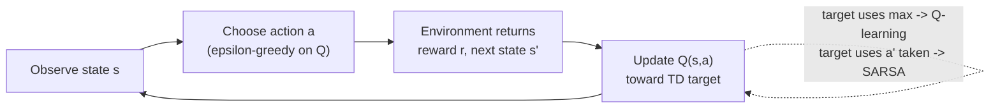
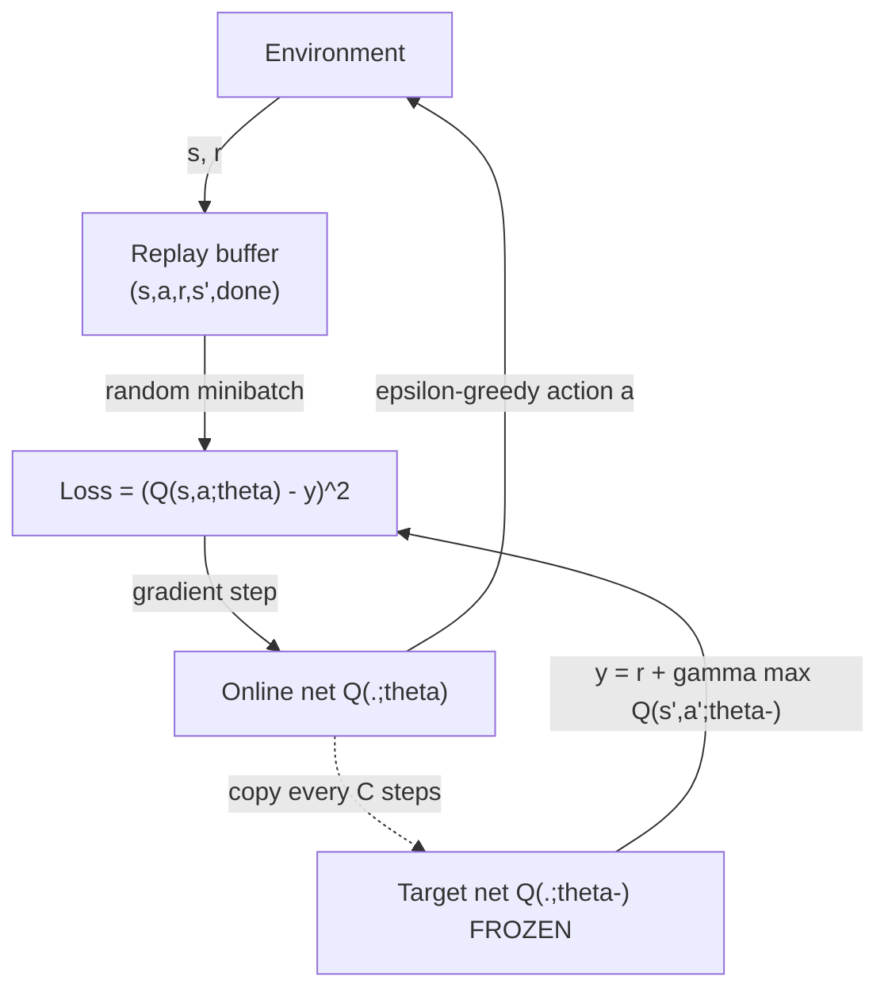
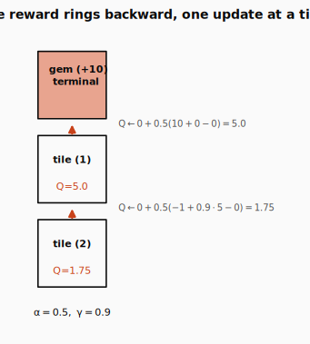
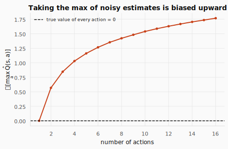

# SARSA, Q-learning, and DQN: From a Table to a Network That Plays Atari


> **The throughline:** *The value of where I am is the reward I just got, plus a discounted value of where I'll land next.*
> [DP, MC & TD](../03-dp-mc-td/README.md) used that sentence to *estimate* values for a fixed policy. This post adds one symbol, a `max`, and the same sentence starts *finding the best policy on its own*. Then we scale it from a 48-cell table to a network with millions of states.

---

## 1. The intuition

In [DP, MC & TD](../03-dp-mc-td/README.md) we solved **prediction**: given a fixed policy, how good is each state? Dynamic programming, Monte Carlo, and TD(0) all estimated $V^\pi(s)$ three different ways, and all three were really solving the same [Bellman equation](../02-mdps-and-bellman/README.md) from the MDPs & Bellman post.

But prediction is the easy half. The real job is **control**: *find the best policy* without anyone handing you one. That is the whole of today's post, and it turns out to need just two changes to what you already have.

**Today's one equation** is the Bellman *optimality* equation. Recall it from [MDPs & Bellman](../02-mdps-and-bellman/README.md), now written for action-values:

$$
Q^*(s,a) = r + \gamma \max_{a'} Q^*(s', a')
$$

In words: *the best you can do from state $s$ after action $a$ equals the reward you collect now, plus the discounted value of playing **best** from the next state.* Every algorithm in this post (tabular Q-learning, SARSA, and DQN) is a different way of solving this one equation by sampling.

### From V to Q: the crossover that makes control possible

[DP, MC & TD](../03-dp-mc-td/README.md) worked with $V(s)$, the value of a *state*. To actually *choose* a move from $V$ alone, you'd need the model $p(s' \mid s,a)$ to know where each action lands, exactly what TD let us avoid. So we switch to the **action-value** $Q(s,a)$: the value of taking action $a$ in state $s$, then continuing.

Why this small change unlocks everything: once you have a number for every action, **acting is a single `argmax` and the state's value is the `max`**, no model required.

$$
V(s) = \max_a Q(s,a), \qquad \pi(s) = \arg\max_a Q(s,a)
$$


```python
import numpy as np

# Q(s, a) for three actions in a single state s.
# Think of it as: "if I'm in state s, how good is each move?"
Q_s = np.array([3.0, 7.0, 5.0])

# V(s) = max_a Q(s, a) — the state's value is the best action available.
# No need to know transition dynamics; just pick the highest number.
print("V(s) =", Q_s.max())

# π(s) = argmax_a Q(s, a) — the greedy policy is whichever action index
# achieves that max. Here action 1 (value 7.0) wins.
print("pi(s) =", int(Q_s.argmax()))
```

```text title="Output"
V(s) = 7.0
pi(s) = 1
```

The value of a state is just its best action-value, and the policy is the index that achieves it. **That `max` is the policy-improvement step from [GPI in DP, MC & TD](../03-dp-mc-td/README.md), now hidden inside a single number.**

### Our lived example: CliffWalking

We'll carry one environment through the whole tabular half of this post, the same one the lecture uses to make on-policy vs off-policy *visible*.


CliffWalking is a $4\times12$ grid (48 states). The agent starts bottom-left (**S**), must reach bottom-right (**G**), and the entire bottom row between them is a **cliff**:

- Every step costs $-1$.
- Stepping onto the cliff costs $-100$ and teleports you back to Start.
- The **shortest path** runs one row above the cliff (13 steps, reward $-13$), but it hugs the edge, so a single random misstep means falling in.
- A **safer path** climbs an extra row before crossing: longer ($-17$ or worse), but no cliff risk.

Hold onto that tension: *is the short risky path or the long safe path "better"?* The answer depends on whether you account for your own exploration, which is exactly what separates the two algorithms below.

### The loop, in one picture

Both tabular algorithms run the same generalized-policy-iteration loop online (act, observe one transition, nudge $Q$) that we met in [DP, MC & TD](../03-dp-mc-td/README.md). The only thing that will differ is *which next-state value the target bootstraps from*.



<details>
<summary><strong>Check:</strong> Q-learning explores with &epsilon;-greedy and sometimes takes clearly-bad random moves. Yet it learns the optimal policy, not the random one. How?</summary>

**Answer.** The target uses the value of the **best** next move, $r + \gamma \max_{a'} Q(s',a')$, not the value of the random move you happened to take. Your exploratory move only decides *which transition you observe*; it never enters the target. So you can behave randomly and still learn $Q^*$.
</details>

---

## 2. The math you need

### 2.1 The Q-learning update: TD plus a max

Start from the [TD(0) update in DP, MC & TD](../03-dp-mc-td/README.md), the one we used to estimate $V$:

$$
V(s) \leftarrow V(s) + \alpha\big[\, \underbrace{r + \gamma V(s')}_{\text{TD target}} - V(s) \,\big]
$$

Make two changes and you have **Q-learning**: work with $Q(s,a)$ instead of $V(s)$, and put a $\max$ in the target so it bootstraps off the *best* next action.

$$
Q(s,a) \leftarrow Q(s,a) + \alpha\Big[\, r + \gamma \max_{a'} Q(s', a') - Q(s,a) \,\Big]
$$

Here $\alpha$ is the step size (how far we move toward the target), $\gamma$ the discount (recalled from [RL Foundations](../01-rl-intro-and-prerequisites/README.md)), and the bracket is the **TD error**. The $\max$ is doing real work: it is the silent policy-improvement step. We never write a policy down or run a separate evaluation phase. Every transition just pushes one $Q(s,a)$ a little closer to satisfying the Bellman optimality equation. Do that often enough, visiting every $(s,a)$ repeatedly, and the table converges to $Q^*$ (Watkins, 1992).

```python
def q_learning_update(Q, s, a, r, s2, done, alpha, gamma):
    # Q-learning update rule:
    # Q(s,a) ← Q(s,a) + α·[r + γ·max_a' Q(s',a') − Q(s,a)]
    #
    # The key insight: the target bootstraps off the BEST next action (max),
    # not the action actually taken. That max is the implicit policy improvement.

    # If the episode ended (done), there's no future — the target is just r.
    # Forgetting this "done" branch is the single most common Q-learning bug.
    best_next = 0.0 if done else Q[s2].max()   # max_a' Q(s', a')

    # TD target: the one-step-ahead estimate of Q*(s,a).
    # Combines the real reward r with a discounted estimate of future value.
    target = r + gamma * best_next

    # Nudge Q(s,a) a fraction α toward the target.
    # α controls how aggressively we update: 0 = never move, 1 = jump all the way.
    Q[s, a] += alpha * (target - Q[s, a])
    return Q[s, a]

import numpy as np

# 3 states × 2 actions, all zeros except Q(s2=2, a=1) = 10.
# State 2 "already looks good" — we'll see that value flow backward.
Q = np.zeros((3, 2)); Q[2, 1] = 10.0

# Even with r=0, Q(0,1) jumps from 0 → 4.5:
# target = 0 + 0.9·10 = 9, and we move halfway (α=0.5) from 0 to 9.
# This is value propagating backward from a promising future state.
print(q_learning_update(Q, s=0, a=1, r=0.0, s2=2, done=False, alpha=0.5, gamma=0.9))
```

```text title="Output"
4.5
```

Even with **zero immediate reward**, $Q(0,1)$ jumped from 0 to 4.5: the target $0 + 0.9\cdot 10 = 9$ carried the news that a good state sits one step ahead, and we moved halfway there. **That backward flow of value is the whole engine.** Note the `done` branch: for a terminal transition there is no next state, so the target is just $r$. Forgetting this is the single most common Q-learning bug.

### 2.2 Exploration: &epsilon;-greedy

A purely greedy agent repeats the first okay path it finds and never discovers a better one. The fix, carried over from [RL Foundations](../01-rl-intro-and-prerequisites/README.md): act greedily *most* of the time, but with probability $\epsilon$ take a random action.

```python
def epsilon_greedy(Q, s, eps):
    # ε-greedy exploration: with probability ε pick a random action (explore),
    # otherwise pick the action with the highest Q-value (exploit).
    # This is the simplest way to balance learning about new actions
    # vs. cashing in on what you already know.
    if np.random.random() < eps:
        return np.random.randint(Q.shape[1])   # explore: uniformly random action
    return int(np.argmax(Q[s]))                 # exploit: argmax_a Q(s, a)

# One state with 4 actions; only action 2 has value (Q=1.0).
Q = np.zeros((1, 4)); Q[0, 2] = 1.0

# With eps=0, exploration is off → always returns the greedy choice (action 2).
print("greedy action (eps=0):", epsilon_greedy(Q, 0, 0.0))
```

```text title="Output"
greedy action (eps=0): 2
```

With $\epsilon=0$ it always returns the `argmax`. In training we usually **decay** $\epsilon$ from $1.0$ toward a small floor so the agent explores early and exploits later.

<details>
<summary><strong>Check:</strong> If &epsilon; never decayed to 0, would tabular Q-learning's Q-values still converge to Q*? Would its behaviour be optimal? Are those the same question?</summary>

**Answer.** The Q-values still converge to $Q^*$, because the target uses $\max$, which is independent of how you behave, as long as every $(s,a)$ keeps being visited. But the behaviour is *not* optimal: it keeps taking random actions with probability $\epsilon$. They are different questions: value convergence is about the estimates; optimal behaviour is about what you actually do.
</details>

### 2.3 SARSA: the same loop, one symbol apart

Now the contrast that CliffWalking exists to show. SARSA does everything Q-learning does, except its target bootstraps off the action it **actually takes next**, not the best one:

$$
\underbrace{r + \gamma\, Q(s', a')}_{\text{SARSA target}}
\qquad\text{vs.}\qquad
\underbrace{r + \gamma \max_{a'} Q(s', a')}_{\text{Q-learning target}}
$$

The reward $r$ and discount $\gamma$ are identical. The only difference is the next-state value. The name *SARSA* is literally the tuple it needs: **S**tate, **A**ction, **R**eward, next **S**tate, next **A**ction, because it must know $a'$ before it can update.

```python
gamma = 0.9

# Three action-values at the next state s': left=2, stay=5, right=8.
Q_s2 = np.array([2.0, 5.0, 8.0])

# Suppose ε-greedy explores and picks a' = 0 (left), not the best (right=8).
a_next = 0

# SARSA target = r + γ·Q(s', a')  — uses the action the policy ACTUALLY takes.
# Honest about the exploratory "left" → backs up Q(s', left) = 2.0.
sarsa_target  = 0 + gamma * Q_s2[a_next]

# Q-learning target = r + γ·max_a' Q(s', a') — always uses the BEST action.
# Ignores the exploratory "left", assumes greedy "right" → backs up max = 8.0.
qlearn_target = 0 + gamma * Q_s2.max()

# Same transition, wildly different targets (1.8 vs 7.2).
# The gap exists only because the policy explored; on greedy steps they agree.
print("SARSA target      =", sarsa_target)
print("Q-learning target =", qlearn_target)
```

```text title="Output"
SARSA target      = 1.8
Q-learning target = 7.2
```

**Same transition, wildly different targets**, because SARSA was honest about the exploratory "left" it is about to take, while Q-learning assumed the greedy "right." This is the entire difference between the two algorithms, and §3 turns it into the cliff behaviour you'll see.

### 2.4 On-policy vs off-policy: why it matters later

That one symbol has a name:

- **SARSA is on-policy.** The action $a'$ in its target comes from the *same* $\epsilon$-greedy policy choosing actions in the world. So SARSA evaluates and improves *the policy it is actually running, exploration and all.*
- **Q-learning is off-policy.** The $\max$ ignores what the agent does next; it always points at the greedy action. So Q-learning learns $Q^*$, the value of acting optimally, *even while it behaves exploratorily.* The policy it learns about (greedy) differs from the policy it acts with ($\epsilon$-greedy).

**This off-policy property is the licence we cash in for DQN.** Because Q-learning's target depends only on $(s,a,r,s')$ and a $\max$ (never on which policy produced the data), a transition collected by an *old, more-exploratory* network is still a valid thing to learn from. Remember that sentence; experience replay (§2.7) is built entirely on it.

<details>
<summary><strong>Check:</strong> Design an environment where SARSA and Q-learning learn visibly different policies. Why do they differ?</summary>

**Answer.** Put a cliff (large negative reward) right beside the shortest path to the goal. That is CliffWalking. Q-learning learns the optimal cliff-edge path because its $\max$ assumes perfect future play. SARSA backs up the action $\epsilon$-greedy actually takes, which sometimes steps off the cliff, so it learns the edge is risky and prefers a safer detour. On-policy means it accounts for its own exploration.
</details>

<details>
<summary><strong>Check:</strong> So how does on-policy SARSA ever reach the optimal policy?</summary>

**Answer.** Via **GLIE** (Greedy in the Limit with Infinite Exploration): keep visiting every $(s,a)$, but anneal $\epsilon \to 0$. As exploration vanishes, the policy SARSA is honest about slides from "$\epsilon$-greedy" to "greedy," and tabular SARSA converges to the same $Q^*$ Q-learning targets directly. Q-learning gets there with a *fixed* $\epsilon$; SARSA has to turn its exploration off first.
</details>

<details>
<summary><strong>Check:</strong> MC, TD, SARSA, and Q-learning are four algorithms, but they all grow from one formula by changing one piece at a time. Can you write the four-step chain?</summary>

**Answer.** Start with the MC update: $V(s) \leftarrow V(s) + \alpha[G - V(s)]$. (1) Replace the full return $G$ with the one-step bootstrap $r + \gamma V(s')$: that is **TD**. (2) Replace $V$ with $Q$ on both sides, so the target uses the next action $a'$ actually taken: that is **SARSA**. (3) Replace $Q(s', a')$ with $\max_{a'} Q(s', a')$, taking the best next action regardless of what you did: that is **Q-learning**. Four algorithms, one formula, three substitutions.
</details>

### 2.5 From a table to a network

CliffWalking has 48 states, so a $48\times4$ table fits easily. But a real robot sees a camera image; a single $84\times84$ Atari frame has more possible values than there are atoms in the universe. **You cannot store a row per state.**

The fix is the leap into deep RL, and it changes only the *container* for $Q$, not the update rule. Replace the lookup table with a function $Q(s,a;\theta)$, a neural network with weights $\theta$, that takes a state in and emits one Q-value per action. A table *memorizes*; a network *generalizes*, predicting sensible values for states it has never seen.

```python
import torch, torch.nn as nn

# Replace the Q-table with a neural network Q(s, a; θ).
# Input: a state vector (here dim=7). Output: one Q-value per action (here 3 actions).
# Two hidden layers with ReLU give nonlinear function approximation,
# so the network can generalize to states it has never seen (a table cannot).
net = nn.Sequential(nn.Linear(7, 64), nn.ReLU(),
                    nn.Linear(64, 64), nn.ReLU(),
                    nn.Linear(64, 3))      # linear head — no activation on output,
                                           # because Q-values are unbounded expected returns

# One forward pass maps a state → all action-values at once,
# so acting is still just argmax over the output vector.
print("one forward pass ->", tuple(net(torch.zeros(1, 7)).shape), "(a Q-value per action)")
```

```text title="Output"
one forward pass -> (1, 3) (a Q-value per action)
```

One forward pass gives every action-value at once, so acting is still a single `argmax`. The head is **linear** on purpose: Q-values are unbounded expected returns, so a sigmoid (capping to $(0,1)$) or softmax (forcing a probability distribution) would silently distort them.

<details>
<summary><strong>Check:</strong> A network buys you generalization. What new danger does it bring that a table never had?</summary>

**Answer.** In a table, updating $Q(s,a)$ touches exactly one cell. In a network, one gradient step nudges **shared weights**, shifting $Q$ at many states at once, including the next-state value sitting *inside* the bootstrap target. The thing you are aiming at moves when you move. That self-amplification is what the next two tricks exist to tame.
</details>

### 2.6 The DQN target and the "semi-gradient"

With a table we *assign* a new number to a cell. With a network we can only take a gradient step, so we treat the Bellman target as a regression **label** and minimize squared error. Using a separate frozen copy $\theta^-$ for the label (more on that in §2.8):

$$
y = r + \gamma\,(1-\text{done})\max_{a'} Q(s', a'; \theta^-), \qquad
\mathcal{L}(\theta) = \big(y - Q(s,a;\theta)\big)^2
$$

This target is **not invented for convenience**. It is the right-hand side of the Bellman optimality equation, with the unknown $Q^*$ replaced by the network's current estimate. The label is mostly a guess, with one grain of truth baked in: the reward $r$, measured from the real environment. Every update injects that grain: *the network grades its own homework, but reality marks one question on every page.* Because the future is discounted by $\gamma<1$, each update swaps a little guesswork for a little truth, so information flows inward from real rewards.

The catch is the **semi-gradient**: $y$ also depends on $\theta$, but we differentiate *only* the prediction $Q(s,a;\theta)$ and treat $y$ as a fixed constant. Differentiating through both sides would optimize the network to make its own future predictions easy to hit, the tail-chasing we want to avoid. In code, that is exactly what `torch.no_grad()` enforces.

```python
import torch.nn.functional as F

def compute_td_loss(policy_net, target_net, batch, gamma=0.99):
    """Core DQN loss: L(θ) = (y − Q(s,a;θ))², where y = r + γ·max_a' Q(s',a';θ⁻).
    This is the Bellman optimality equation turned into a regression problem."""

    states, actions, rewards, next_states, dones = batch

    # Q(s, a; θ) — the online network's prediction for the action actually taken.
    # gather picks out the Q-value at the stored action index from each row.
    q = policy_net(states).gather(1, actions.unsqueeze(1)).squeeze(1)

    # --- Build the frozen label y (the "semi-gradient" trick) ---
    # no_grad() blocks gradients through the target: we only differentiate
    # the prediction Q(s,a;θ), treating y as a fixed constant.
    # Differentiating both sides would let the net chase its own tail.
    with torch.no_grad():
        # max_a' Q(s', a'; θ⁻) — the off-policy max, using the FROZEN target net.
        max_next = target_net(next_states).max(1).values

        # y = r + γ·(1−done)·max_a' Q(s',a';θ⁻)
        # (1−done) zeros out the future term at terminal states, so y = r there.
        y = rewards + gamma * (1 - dones) * max_next

    # Huber (smooth L1) loss: like MSE near zero but linear for large errors,
    # making it robust to the occasional wild outlier transition.
    return F.smooth_l1_loss(q, y)

# --- Quick demo with a toy batch of 8 transitions ---
torch.manual_seed(0)
policy = nn.Sequential(nn.Linear(4, 16), nn.ReLU(), nn.Linear(16, 2))
target = nn.Sequential(nn.Linear(4, 16), nn.ReLU(), nn.Linear(16, 2))

# Target net starts as an exact copy of the policy net (θ⁻ = θ initially).
target.load_state_dict(policy.state_dict())

# Fake batch: 8 transitions of (state, action, reward, next_state, done).
batch = (torch.randn(8, 4), torch.randint(0, 2, (8,)),
         torch.randn(8), torch.randn(8, 4), torch.zeros(8))

print("TD loss:", round(compute_td_loss(policy, target, batch).item(), 4))
```

```text title="Output"
TD loss: 0.5282
```

The `gather` picks out $Q(s,a)$ for the action *actually stored* in the batch; the `max(1)` over the target net is the off-policy $\max_{a'}$. Everything inside `no_grad()` is the frozen label. This single function is the core of DQN. The rest is plumbing that keeps it stable.

<details>
<summary><strong>Check:</strong> If the label y is built from the network's own Q-values, how can minimizing this loss ever recover the optimal policy? Isn't it circular?</summary>

**Answer.** It isn't circular, for two reasons. First, every label carries one **grain of real truth**, the measured reward $r$, so each update swaps a little guesswork for a little reality. Second, the equation we are forcing $Q$ to satisfy, $Q(s,a) = r + \gamma \max_{a'} Q(s',a')$, is the **Bellman optimality equation**, and because $\gamma < 1$ repeatedly applying its right-hand side is a *contraction*: it shrinks the gap to the unique solution $Q^*$ by a factor $\gamma$ every pass. Drive the loss to zero everywhere and $Q$ must equal $Q^*$; the optimal policy is then just $\arg\max_a Q^*(s,a)$. In a table this convergence is a theorem (Watkins, 1992); the network version is the same idea engineered to behave (see §2.10).
</details>

### 2.7 Trick 1: experience replay (fixes correlated data)

Run the network version online, one fresh transition at a time, and the first thing that breaks is the data. **Consecutive frames are nearly identical**, but stochastic gradient descent assumes each minibatch is roughly i.i.d.; a stream of near-duplicates makes the network overfit the present moment and forget the rest.

The fix: a large circular buffer storing the last $N$ transitions $(s,a,r,s',\text{done})$, raw experience with no labels. Each gradient step samples a **uniformly random** minibatch from across the *whole* buffer, mixing early-game, near-loss, and near-win moments so the samples are varied and nearly independent. Replay turns a time-series into a dataset.

```python
from collections import deque
import random

class ReplayBuffer:
    """Circular buffer storing raw (s, a, r, s', done) transitions.
    Breaks temporal correlation by letting each gradient step sample
    a uniformly random minibatch from across the agent's entire history."""

    def __init__(self, capacity):
        # deque(maxlen=N) automatically drops the oldest transition when full,
        # keeping the buffer a fixed-size sliding window over experience.
        self.buffer = deque(maxlen=capacity)

    def push(self, *transition):
        # Store one transition tuple — no labels, just raw experience.
        self.buffer.append(transition)

    def sample(self, n):
        # Draw n transitions uniformly at random (not sequential!).
        # This breaks the near-identical-consecutive-frame correlation
        # that would otherwise make SGD overfit the present moment.
        return random.sample(self.buffer, n)

    def __len__(self): return len(self.buffer)

# Fill with 500 dummy transitions; the buffer holds up to 1000.
buf = ReplayBuffer(1000)
for i in range(500): buf.push(i, 0, 0.0, i + 1, False)

# Each gradient step samples a random minibatch (here 64) from the whole buffer,
# mixing early and late experience for decorrelated, approximately i.i.d. data.
print("buffer size:", len(buf), "| sampled batch:", len(buf.sample(64)))
```

```text title="Output"
buffer size: 500 | sampled batch: 64
```

Bonus: **data efficiency.** Real interactions are expensive; replay lets us learn from each transition many times instead of once-and-discard. *This is only legal because Q-learning is off-policy* (§2.4): old, more-exploratory transitions are still valid samples.

<details>
<summary><strong>Check:</strong> Replay trains today's network on transitions collected by older versions of the policy. Why is that okay?</summary>

**Answer.** Because Q-learning is **off-policy**. The target $r+\gamma\max_{a'}Q(s',\cdot)$ depends only on the transition and the best next move, not on which policy collected it. So a row from an older, more exploratory policy is a perfectly valid thing to learn from.
</details>

<details>
<summary><strong>Check:</strong> What does a *tiny* replay buffer (say the last 1,000 transitions) do to learning?</summary>

**Answer.** It undoes replay's whole job. The buffer holds only recent, highly-correlated transitions, so each minibatch is again a stream of near-duplicates: SGD's i.i.d. assumption breaks, and the network catastrophically forgets older situations as they're overwritten. Too large is also bad (full of stale, off-policy data); the size trades decorrelation against staleness.
</details>

### 2.8 Trick 2: the target network (fixes the moving target)

The second thing that breaks is the label itself. If we compute $y$ with the same weights $\theta$ we're updating, **every gradient step shifts both the prediction and the target**: we chase a goalpost bolted to our own moving hand.

The fix: keep a second, **frozen** copy $Q(\cdot;\theta^-)$ and compute the label with it. Now the target is stationary for a stretch, and the update becomes ordinary supervised regression toward a fixed number. Every $C$ steps, sync it: $\theta^- \leftarrow \theta$. The target lurches forward, then holds still again, and slow-moving goalposts are reachable.

```python
# Every C gradient steps, copy the online weights into the frozen target net:
#   θ⁻ ← θ
# Between syncs the target is stationary, so the DQN update is ordinary
# regression toward a fixed label — no moving goalpost.
# C trades stability (large C) against freshness of the target (small C).
TARGET_UPDATE = 1000
if grad_steps % TARGET_UPDATE == 0:
    target_net.load_state_dict(policy_net.state_dict())
```

Both extremes break it: sync **every** step ($C=1$) and the target moves every update, so the original instability returns; freeze it **forever** ($C=\infty$) and you keep aiming at an old estimate that never improves, so learning stalls. $C$ trades steadiness against freshness.

Crucially, neither trick changes the objective; they only change *which data* you train on and *which weights build the label*, so that gradient descent (built for fixed, i.i.d. data) can cope. **That is the entire jump from a wobbly idea to the network that learned 49 Atari games** (Mnih et al., Nature 2015).



<details>
<summary><strong>Check:</strong> Replay and the target network both stabilize DQN. Why do we need *both*, and couldn't one mechanism do it?</summary>

**Answer.** They fix different problems. Replay decorrelates the *input distribution* (a data/SGD issue); the target network stabilizes the *regression target* (a bootstrapping issue). Both pathologies are present at once, so you need both fixes.
</details>

### 2.9 Atari: frame stacking restores the Markov property

One last piece specific to pixels. A single Pong frame is a static snapshot: you cannot tell which way the ball is moving or how fast. The optimal action depends on information not in the observation, so the environment is **non-Markovian** (recall the [Markov property](../02-mdps-and-bellman/README.md) from MDPs & Bellman).

The fix is the "enlarge the state" trick: **stack the last 4 frames** as a $4\times84\times84$ input. Differences across the stack encode velocity and acceleration, restoring the Markov property so the network has what it needs. The DQN front-end is then three convolutions feeding a 512-unit dense layer. The only change from the vector network in §2.5 is the convolutional input.

```python
from gymnasium.wrappers import AtariPreprocessing, FrameStackObservation as FrameStack

def make_env(render_mode=None):
    # Raw Pong with no built-in frame skip — we control preprocessing ourselves.
    env = gym.make("PongNoFrameskip-v4", render_mode=render_mode)

    # Standard Atari preprocessing pipeline (Mnih et al., 2015):
    #  • noop_max=30:  start each episode with up to 30 random no-ops for variety
    #  • frame_skip=4: repeat each action for 4 raw frames (saves compute)
    #  • screen_size=84: downsample 210×160 RGB → 84×84
    #  • grayscale:    3 color channels → 1 (color is irrelevant for Pong)
    env = AtariPreprocessing(env, noop_max=30, frame_skip=4, screen_size=84,
                             grayscale_obs=True, scale_obs=False)

    # Stack the last 4 processed frames into one observation (4×84×84).
    # A single frame is a snapshot — you can't tell ball direction or speed.
    # Stacking restores the Markov property by encoding velocity/acceleration
    # as pixel differences across consecutive frames.
    env = FrameStack(env, stack_size=4)
    return env
```

```text title="Output"
Observation shape: (4, 84, 84)
Number of actions: 6
```

The observation is now four stacked grayscale frames, and Pong exposes six joystick actions. *(Output captured from the assignment notebook, which runs the full Atari stack.)*

<details>
<summary><strong>Check:</strong> Why stack 4 frames instead of feeding a single 84&times;84 image?</summary>

**Answer.** A single frame has no motion information: direction, speed, paddle velocity are all invisible. Stacking 4 consecutive frames lets the CNN compare pixels across time and infer velocity, turning a partially-observable (non-Markovian) view back into an approximately Markov state.
</details>

<details>
<summary><strong>Check:</strong> Name a game where even 4 stacked frames would not be enough.</summary>

**Answer.** Any game needing memory beyond 4 frames: an object occluded for a while, or a long maze/counter you must remember. The state would need a longer memory of past observations (or a recurrent hidden state) to recover what 4 frames cannot show.
</details>

### 2.10 The deadly triad: why DQN lives dangerously

Every trick in §2.7 and §2.8 exists to tame one specific danger. DQN combines three ingredients, and *each one alone is safe*, but the three together can make the learned values spiral toward infinity instead of converging. Sutton &amp; Barto call this the **deadly triad**:

- **Bootstrapping** (the target is built from other $Q$-estimates, not from real returns). Errors don't stay local: a wrong value gets copied into its neighbors' targets on the next update.
- **Function approximation** (one network, shared weights). You cannot nudge one state's value without shifting thousands of similar-looking states too. That is generalization, and it means an error injected at one state *leaks* to states you may never have visited.
- **Off-policy data** (the target uses $\max_{a'}$, the greedy action, while the data was collected by a different, exploratory policy). You keep pushing an action's value toward the max without ever being forced to actually take it and let reality correct it.

**Why the combination explodes.** Picture one $Q$-value that is accidentally too high. (1) The shared weights *generalize* that overestimate to similar states. (2) Bootstrapping then *feeds* those inflated values into the targets of still other states, raising them too. (3) Because the updates are off-policy, nothing forces the agent to actually visit that inflated state-action and discover, from a real reward, that it was wrong. So the one correcting force, the grain of truth $r$, never arrives there, while the error keeps amplifying itself through (1) and (2). The feedback loop has a gain above 1, and the values diverge. This is also why the $\max$ overestimation from §3.4 is so corrosive here: the triad takes that small upward bias and pumps it back into its own targets.

**The cure is to remove any one leg, and DQN keeps all three.** Drop bootstrapping (use Monte Carlo returns) and the targets are real, so errors can't compound. Drop function approximation (use a table) and an update touches exactly one cell, so errors can't leak to neighbors. Drop off-policy (use on-policy SARSA) and you only ever evaluate the distribution you actually follow, so every inflated value gets visited and corrected. DQN deliberately keeps all three: a network for pixels, a max-bootstrap for control, replay for data efficiency. It sits squarely in the danger zone.

That is the real reason for the plumbing. **Experience replay** decorrelates the data and **the target network** freezes the bootstrap target for a stretch. Neither removes a leg of the triad, but together they lower the loop's gain enough that the grain of truth wins in practice. It works empirically; there is no convergence theorem. DQN is excellent engineering, not a proof.


---

## 3. Worked examples by hand

### 3.1 SARSA vs Q-learning on one transition

We are in state $s$, take $a$, get $r=0$, and land in $s'$ with current action-values $Q(s',\text{left})=2.0$, $Q(s',\text{stay})=5.0$, $Q(s',\text{right})=8.0$. Our $\epsilon$-greedy policy *explores* and picks $a'=\text{left}$. With $\gamma=0.9$:

$$
\text{SARSA} = 0 + 0.9\cdot Q(s',\text{left}) = 0.9 \cdot 2.0 = \mathbf{1.8}
$$
$$
\text{Q-learning} = 0 + 0.9\cdot \max(2,5,8) = 0.9 \cdot 8.0 = \mathbf{7.2}
$$

SARSA was honest about the exploratory "left" it is about to take; Q-learning assumed the greedy "right." **The two methods disagree only on steps where the behaviour policy explores**: on greedy steps both would use $8.0$ and the targets coincide. That is exactly why annealing $\epsilon\to 0$ (GLIE) makes SARSA converge to where Q-learning already aims.

<details>
<summary><strong>Check:</strong> On this transition, suppose the policy instead takes the greedy a′ = right. Compute both targets. When do SARSA and Q-learning produce identical updates?</summary>

**Answer.** Both give $0 + 0.9\cdot 8.0 = 7.2$. They coincide on every step where the behaviour policy happens to act greedily, and diverge only on exploratory steps. As $\epsilon\to 0$ those exploratory steps vanish, precisely why GLIE-SARSA ends up where Q-learning already aimed.
</details>

### 3.2 The reward ringing backward (credit assignment)

Most CliffWalking steps have reward $-1$; the only "good" event is reaching the goal. How does a move *several steps before* the goal ever gain value? Through the $\max$ target, one bootstrap at a time. Take a $+10$ terminal gem instead, with $\alpha=0.5,\ \gamma=0.9$, both tiles starting at $Q=0$:



- **Update 1** (the agent steps from tile 1 onto the gem; terminal, so no future term):
$$
Q_1 \leftarrow 0 + 0.5\,(10 + 0 - 0) = 5.0
$$
- **Update 2** (*later*, the agent steps from tile 2 onto tile 1, paying $-1$ and bootstrapping off the now-raised $Q_1=5.0$):
$$
Q_2 \leftarrow 0 + 0.5\,(-1 + 0.9\cdot 5.0 - 0) = 0.5 \cdot 3.5 = 1.75
$$

**The reward is a bell that rings backward**, $\gamma$-discounted at each hop. Sparse reward plus bootstrapping equals automatic credit assignment, the same backward flow we saw numerically in §2.1.

<details>
<summary><strong>Check:</strong> A transition gives r = 0, γ = 0.99, frozen target outputs Q(s′, ·) = (5, 2, 7, 4), and the online net predicts Q(s, a) = 4.0. Compute the target y and the sign of the update. What does it carry, even though r = 0?</summary>

**Answer.** $y = 0 + 0.99\cdot 7 = 6.93$. Since $6.93 > 4.0$, the update **raises** $Q(s,a)$. Even with zero immediate reward, the target carries the news that a good state ($\max Q = 7$) lies just ahead, value flowing backward one bootstrap at a time.
</details>

### 3.3 The DQN target on one minibatch transition

From the lecture's Pong-style example: a transition with $r=+1$, $\gamma=0.97$, frozen target net outputs $Q(s',\cdot)=(\text{left }1.0,\ \text{stay }2.6,\ \text{right }1.9)$, online net predicts $Q(s,a)=3.8$ for the action $a$ read from the buffer.

$$
y = r + \gamma \max_{a'} Q(s',a';\theta^-) = 1 + 0.97\cdot 2.6 = \mathbf{3.52}
$$
$$
\mathcal{L} = (3.8 - 3.52)^2 = 0.0784
$$

The prediction uses $a$ **read from the buffer**; the target's next action $a'=\text{stay}$ is the network's own `argmax`, *not stored anywhere*. **That is the off-policy step made concrete.** The frozen $\theta^-$ is what keeps $y$ from moving while we descend on $\mathcal{L}$.

### 3.4 Why the max overestimates

The $\max$ that powers control has a subtle cost. Suppose every action at a state is *truly* worth $0$, but our estimates are noisy. Taking the $\max$ of noisy estimates is biased **upward** (by [Jensen's inequality](../01-rl-intro-and-prerequisites/README.md), $\mathbb{E}[\max] \ge \max \mathbb{E}$), and bootstrapping carries that optimism into earlier states.



```python
rng = np.random.default_rng(0)

# Ground truth: all 4 actions are worth exactly 0. The true max is 0.
true_values = np.zeros(4)

# Simulate 100k episodes of noisy, unbiased Q-estimates (mean=0, std=1).
# Each row is one set of 4 action-value estimates.
est = rng.normal(0, 1, size=(100000, 4))

# E[max of noisy estimates] ≈ 1.03, well above the true max of 0.
# This is Jensen's inequality in action: E[max] ≥ max E.
# The max operator picks the luckiest noise each time, creating
# a systematic upward bias that bootstrapping then propagates backward.
print("true max:", true_values.max(), "| E[max of estimates]:", round(est.max(1).mean(), 3))
```

```text title="Output"
true max: 0.0 | E[max of estimates]: 1.031
```

The true max is $0$, but the expected max of the *estimates* is $\approx 1.03$, pure optimistic bias, and it grows with the number of actions. **Double DQN** fixes it by selecting the action with the online network but *evaluating* it with the target network, so the evaluator isn't the same noisy estimate that picked the max.

<details>
<summary><strong>Check:</strong> A state's action-values are Q = (4, 4, 9) and the policy splits evenly. Compute V^π(s) and max_a Q. After one greedy-improvement step, what is V(s), and why did it rise?</summary>

**Answer.** $V^\pi = (4+4+9)/3 = 5.67$; the max is $9$. Greedy improvement puts all weight on the $9$, so $V=9$. The value rose by $3.33$: the average had been dragged down by the two worse actions. That gap is the price of acting sub-optimally.
</details>

---

## 4. Putting it all together

### Recap: concept → math → code

| Concept | Math | In code |
|---|---|---|
| State value from action-values | $V(s)=\max_a Q(s,a)$ | `Q[s].max()` |
| Greedy policy | $\pi(s)=\arg\max_a Q(s,a)$ | `Q[s].argmax()` |
| Q-learning target | $r+\gamma\max_{a'}Q(s',a')$ | `r + gamma * Q[s2].max()` |
| SARSA target | $r+\gamma\,Q(s',a')$ | `r + gamma * Q[s2, a_next]` |
| TD update | $Q\leftarrow Q+\alpha[\,y-Q\,]$ | `Q[s,a] += alpha*(y - Q[s,a])` |
| DQN loss | $(y-Q(s,a;\theta))^2$ | `F.smooth_l1_loss(q, y)` |
| Frozen target | $y$ uses $\theta^-$ | `with torch.no_grad(): ...` |

### Capstone A (runnable): SARSA vs Q-learning on CliffWalking

One end-to-end Gymnasium program. Same hyperparameters, same $\epsilon$-greedy behaviour: the *only* difference is the target line. Watch it reproduce the cliff story.

```python
import numpy as np
import gymnasium as gym

# CliffWalking: 4×12 grid (48 states, 4 actions: up/right/down/left).
# Start = bottom-left, Goal = bottom-right, cliff = bottom row in between.
# Step cost = −1; cliff = −100 + teleport to Start. The tension:
# shortest path hugs the cliff (13 steps) but random missteps are fatal.
env = gym.make("CliffWalking-v1")
n_states, n_actions = env.observation_space.n, env.action_space.n

# Fixed ε = 0.1 (no decay) so the on-policy vs off-policy difference stays visible.
N_EPISODES, ALPHA, GAMMA, EPS = 5000, 0.1, 0.99, 0.1

def epsilon_greedy(Q, s, eps):
    # With probability ε explore randomly, otherwise exploit the greedy action.
    if np.random.random() < eps:
        return env.action_space.sample()
    return int(np.argmax(Q[s]))

def train(kind):
    """Train either Q-learning (kind='q') or SARSA (kind='sarsa').
    The ONLY difference is which next-state value enters the TD target."""
    Q = np.zeros((n_states, n_actions))
    rewards = []
    for _ in range(N_EPISODES):
        s, _ = env.reset()
        a = epsilon_greedy(Q, s, EPS)
        done, total = False, 0
        while not done:
            s2, r, term, trunc, _ = env.step(a)
            done = term or trunc

            if kind == "q":
                # Q-LEARNING (off-policy):
                # target = r + γ · max_a' Q(s', a')
                # Bootstraps off the BEST next action, regardless of what
                # ε-greedy actually picks. Learns Q* even while exploring.
                target = r + (0 if done else GAMMA * np.max(Q[s2]))
                Q[s, a] += ALPHA * (target - Q[s, a])
                s, a = s2, epsilon_greedy(Q, s2, EPS)
            else:
                # SARSA (on-policy):
                # target = r + γ · Q(s', a')  where a' is the action TAKEN.
                # Honest about exploration: if ε-greedy wanders off the cliff,
                # that cost enters the target, making cliff-adjacent states look bad.
                a2 = epsilon_greedy(Q, s2, EPS) if not done else 0
                target = r + (0 if done else GAMMA * Q[s2, a2])
                Q[s, a] += ALPHA * (target - Q[s, a])
                s, a = s2, a2
            total += r
        rewards.append(total)
    return Q, rewards

def greedy_len(Q):
    """Roll out the fully greedy policy (ε=0) and count steps to the goal."""
    s, _ = env.reset(); n = 0
    for _ in range(100):
        s, _, term, trunc, _ = env.step(int(np.argmax(Q[s]))); n += 1
        if term or trunc: break
    return n

np.random.seed(0)
Qq, rq = train("q")
Qs, rs = train("sarsa")

# Key result — the paradox:
# • SARSA gets better TRAINING reward (−19.9 vs −48.2) because it avoids the cliff.
# • Q-learning learns the SHORTER greedy path (13 vs 15 steps) because its max
#   assumes perfect play, but during ε-greedy training it keeps falling off.
print(f"Q-Learning  avg last 500 reward: {np.mean(rq[-500:]):.1f}")
print(f"SARSA       avg last 500 reward: {np.mean(rs[-500:]):.1f}")
print(f"Q-Learning greedy path length: {greedy_len(Qq)} steps")
print(f"SARSA      greedy path length: {greedy_len(Qs)} steps")
```

```text title="Output"
Q-Learning  avg last 500 reward: -48.2
SARSA       avg last 500 reward: -19.9
Q-Learning greedy path length: 13 steps
SARSA      greedy path length: 15 steps
```


Look at the paradox: SARSA's **training** reward ($-19.9$) is far better than Q-learning's ($-48.2$), yet Q-learning learned the *shorter* greedy path (13 vs 15 steps). Both are correct. Q-learning's $\max$ assumes perfect future play, so it learns the optimal edge path, but *while training with $\epsilon=0.1$ it keeps falling off*, dragging its scores down. SARSA is on-policy, so its values account for those random steps and it routes one row higher, away from the cliff. **Neither is wrong: SARSA is optimal given that you keep exploring; Q-learning is optimal assuming you'll eventually act greedily.**

### Capstone B (showcase): DQN on Pong from pixels

The deep version is the *same* loop, now wrapping `compute_td_loss` (§2.6), the replay buffer (§2.7), and the target-network sync (§2.8) around the Atari env (§2.9). It trains for ~2M frames (tens of minutes on a GPU), so we show the real code and the real logs rather than run it inline. The inner loop, verbatim from the assignment:

```python
for frame in range(1, total_frames + 1):
    # Anneal ε linearly from 1.0 (pure exploration) → 0.1 (mostly greedy).
    # Early frames explore widely; later frames exploit learned Q-values.
    epsilon = get_epsilon(frame)

    # ε-greedy action selection using the ONLINE network's Q-values.
    action = select_action(state, epsilon)

    # Step the Atari environment and observe the transition.
    next_state, reward, term, trunc, _ = env.step(action)
    done = term or trunc

    # Store transition in replay buffer. np.sign(reward) clips rewards to {-1, 0, +1},
    # keeping the loss scale consistent across games with different score magnitudes.
    buffer.push(state, action, np.sign(reward), next_state, float(done))
    state = next_state if not done else env.reset()[0]

    # --- Learning phase (only after enough experience is buffered) ---
    if len(buffer) >= LEARNING_START and frame % TRAIN_FREQ == 0:
        # Sample a random minibatch from replay (Trick 1: decorrelates data).
        loss = compute_td_loss(policy_net, target_net, buffer.sample(BATCH_SIZE))

        # Standard PyTorch backward pass with gradient clipping
        # to prevent exploding gradients from outlier transitions.
        optimizer.zero_grad(); loss.backward()
        nn.utils.clip_grad_norm_(policy_net.parameters(), 10.0)
        optimizer.step()

        # Trick 2: periodically sync θ⁻ ← θ so the target net
        # catches up. Between syncs the target stays frozen.
        if grad_steps % TARGET_UPDATE == 0:
            target_net.load_state_dict(policy_net.state_dict())
```

Real training log (captured from the assignment run; Pong reward starts at $-21$, "loses every point," and should climb toward $+20$):

```text title="Output"
ep   10 | frame     8765 | eps 0.99 | avg100 -20.80 | 2072 fps
ep  100 | frame    91754 | eps 0.92 | avg100 -20.30 |  567 fps
ep  300 | frame   297499 | eps 0.73 | avg100 -19.59 |  477 fps
ep  500 | frame   582528 | eps 0.48 | avg100 -18.01 |  412 fps
ep  700 | frame  1046442 | eps 0.10 | avg100  -3.73 |  ... fps
ep  720 | frame  1100738 | eps 0.10 | avg100   0.94 |  ... fps
ep  800 | frame  1301489 | eps 0.10 | avg100  12.60 |  ... fps
ep  920 | frame  1575006 | eps 0.10 | avg100  15.17 |  ... fps
ep 1090 | frame  1980020 | eps 0.10 | avg100  14.60 |  ... fps
```


Notice the **long flat start**: for the first ~1M frames the agent barely moves off $-21$ while the convolutions learn to see the ball and replay fills with varied experience. Then, once $\epsilon$ has annealed and value has propagated backward through enough bootstraps, it climbs *steeply* through break-even ($0$) to roughly $+15$. The same agent, rendered:


<details>
<summary><strong>Check:</strong> Set C = 1 (sync the target net every step, i.e. no real target network). What happens to training?</summary>

**Answer.** With $C=1$ the target is computed from the same weights you're updating, so the label moves on every step, and the moving-target problem is fully back. In practice the agent fails to learn: rewards stay near $-20$ and the tracked Q-values stay noisy and oscillating instead of converging. Stability, not just speed, is what the frozen target buys.
</details>

<details>
<summary><strong>Check:</strong> DQN combines a network, bootstrapping, and off-policy data. Is it guaranteed to converge?</summary>

**Answer.** No. That combination is the *deadly triad* (§2.10): any two legs are safe, but all three together can make values diverge, because an overestimate generalizes across shared weights, bootstraps into other targets, and is never visited and corrected under off-policy updates. Replay and the target network don't *remove* the triad, they lower the loop's gain so it behaves in practice. There is no convergence theorem; DQN is excellent engineering, not a proof.
</details>

---

## Check your understanding

A few consolidated questions from the lecture that span more than one section:

<details>
<summary><strong>Why is Q(s, a) more useful than V(s) when you actually have to choose a move?</strong></summary>

**Answer.** $Q$ gives a number for every action, so you pick the biggest, no model needed. $V$ is one number for the whole state; it can't tell you which move is best unless you already know where each move leads (the model $p(s'\mid s,a)$). That model-free choice is the whole reason control switches from $V$ to $Q$.
</details>

<details>
<summary><strong>Why can experience replay reuse old data, but policy-gradient methods (next post) cannot?</strong></summary>

**Answer.** Q-learning's target depends only on $(s,a,r,s')$ and a $\max$, so any stored transition is still a valid sample, off-policy. Full-return, on-policy methods need the trajectory's return *under the current policy*, so old trajectories are samples from the wrong distribution and need importance-sampling corrections. That on-policy cost is what makes replay illegal for policy gradients.
</details>

<details>
<summary><strong>The same DQN algorithm learned 49 Atari games. Did one set of weights play all 49?</strong></summary>

**Answer.** No: one shared *algorithm, architecture, and hyperparameters*, but each game trained its **own** separate weights. The recipe is shared; the learned weights are per-game.
</details>

---

## Where this goes next

We turned prediction into **control** with one symbol (a $\max$) and then scaled it from a 48-cell table to a convolutional network that plays Pong from pixels. The destination never changed (solve the Bellman optimality equation); only the container for $Q$ did.

But DQN has a structural limit: its policy is *implicit*, $\pi(s)=\arg\max_a Q(s,a)$. That `argmax` needs a small, discrete, enumerable action set. Continuous control (a robot's joint torques) and naturally stochastic policies don't fit.

So the next post skips $Q$ and optimizes the policy **directly**: parameterize $\pi(a\mid s;\theta)$ and push it uphill on expected return,

$$
\nabla_\theta J(\theta) = \mathbb{E}\big[\nabla_\theta \log \pi(a\mid s;\theta)\, G_t\big]
$$

That's the **policy gradient**, and the on-policy price it pays (no replay buffer) is exactly what motivates TRPO and PPO. The next post builds it from scratch.
