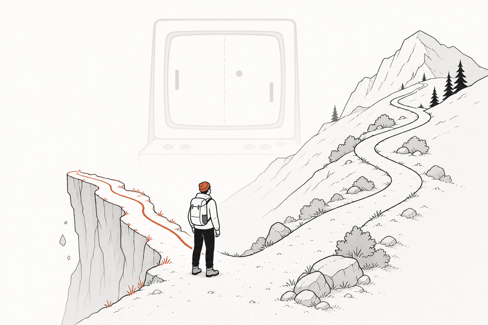
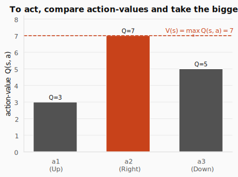
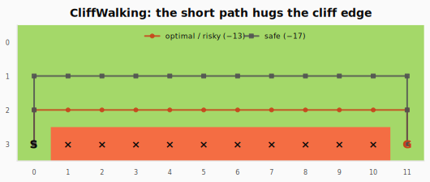
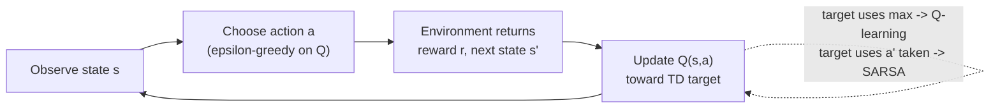
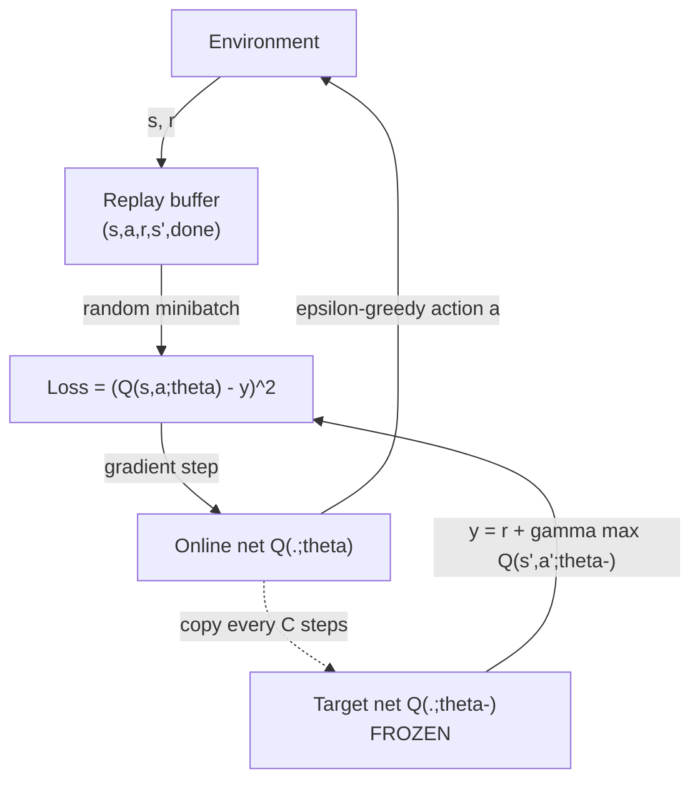
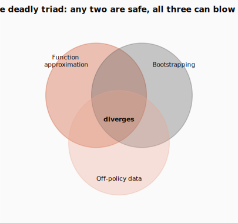
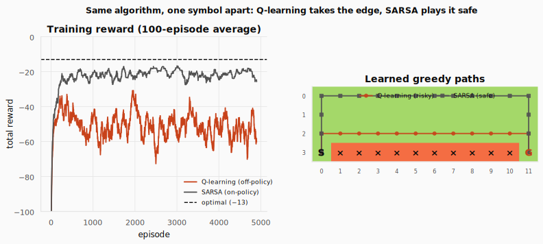
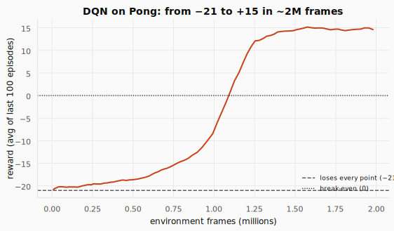
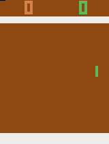

# SARSA, Q-learning, and DQN: From a Table to a Network That Plays Atari



> **The throughline:** _The value of where I am is the reward I just got, plus a discounted value of where I'll land next._
> [DP, MC & TD](../03-dp-mc-td/README.md) used that sentence to _estimate_ values for a fixed policy. This post adds one symbol, a `max`, and the same sentence starts _finding the best policy on its own_. Then we scale it from a 48-cell table to a network with millions of states.

---

## 1. The intuition

In [DP, MC & TD](../03-dp-mc-td/README.md) we solved **prediction**: given a fixed policy, how good is each state? Dynamic programming, Monte Carlo, and TD(0) all estimated $V^\pi(s)$ three different ways, and all three were really solving the same [Bellman equation](../02-mdps-and-bellman/README.md) from the MDPs & Bellman post.

But prediction is the easy half. The real job is **control**: _find the best policy_ without anyone handing you one. That is the whole of today's post, and it turns out to need just two changes to what you already have.

**Today's one equation** is the Bellman _optimality_ equation. Recall it from [MDPs & Bellman](../02-mdps-and-bellman/README.md), now written for action-values:

$$
Q^*(s,a) = r + \gamma \max_{a'} Q^*(s', a')
$$

Read it symbol by symbol first. $Q^*(s,a)$ is the value of taking action $a$ in state $s$ and then acting optimally forever after. On the right, $r$ is the reward you collect right now, $\gamma$ is the discount carried over from earlier posts, $s'$ is the state you land in next, and $\max_{a'} Q^*(s', a')$ is the largest action-value available from that next state, the value of the _best_ move there. The equals sign ties them together: the optimal action-value now equals the immediate reward plus the discounted optimal value of where you end up.

In words: _the best you can do from state $s$ after action $a$ equals the reward you collect now, plus the discounted value of playing **best** from the next state._ Every algorithm in this post (tabular Q-learning, SARSA, and DQN) is a different way of solving this one equation by sampling.

### From V to Q: the crossover that makes control possible

[DP, MC & TD](../03-dp-mc-td/README.md) worked with $V(s)$, the value of a _state_. To actually _choose_ a move from $V$ alone, you'd need the model's transition probabilities $p(s' \mid s,a)$ to know where each action lands, exactly what TD let us avoid. So we switch to the **action-value** $Q(s,a)$: the value of taking action $a$ in state $s$, then continuing.

Why this small change unlocks everything: once you have a number for every action, **acting is a single `argmax` and the state's value is the `max`**, no model required.

$$
V(s) = \max_a Q(s,a), \qquad \pi(s) = \arg\max_a Q(s,a)
$$

Two equations show up at once because the _same_ row of $Q$ numbers answers two different questions. The first, $\max_a Q(s,a)$, collapses the action-values into a single best number: _how good is this state?_ The second, $\arg\max_a Q(s,a)$, returns the action _index_ that achieves that best number: _what should I actually do?_ The `max` gives you the score, the `argmax` gives you the move, and both fall straight out of the stored numbers with no model. (If you only remember one distinction: `max` is a _value_, `argmax` is an _action_.)



The figure makes this concrete for one state with three actions valued $Q = 3, 7, 5$. Each bar is one action-value; the dashed line sits at the tallest bar, $V(s) = \max_a Q(s,a) = 7$. The greedy policy picks whichever action owns that tallest bar (the middle one here), so $\pi(s) = \arg\max_a Q(s,a)$ is that action's index. **That `max` is the policy-improvement step from [DP, MC & TD](../03-dp-mc-td/README.md), now hidden inside a single number.** (Recall _generalized policy iteration_, GPI: the loop of _evaluating_ a policy and then _improving_ it greedily. Here improvement isn't a separate phase, it's baked into taking the `max` over actions every update.)

### Our lived example: CliffWalking

We'll carry one environment through the whole tabular half of this post, the same one the lecture uses to make on-policy vs off-policy _visible_.



CliffWalking is a $4\times12$ grid (48 states). The agent starts bottom-left (**S**), must reach bottom-right (**G**), and the entire bottom row between them is a **cliff**:

- Every step costs $-1$.
- Stepping onto the cliff costs $-100$ and teleports you back to Start.
- The **shortest path** runs one row above the cliff (13 steps, reward $-13$), but it hugs the edge, so a single random misstep means falling in.
- A **safer path** climbs an extra row before crossing: longer ($-17$ or worse), but no cliff risk.

Hold onto that tension: _is the short risky path or the long safe path "better"?_ The answer depends on whether you account for your own exploration, which is exactly what separates the two algorithms below.

### The loop, in one picture

Both tabular algorithms run the same generalized-policy-iteration loop online (act, observe one transition, nudge $Q$) that we met in [DP, MC & TD](../03-dp-mc-td/README.md). The only thing that will differ is _which next-state value the target bootstraps from_.



<details>
<summary><strong>Check:</strong> Q-learning explores with &epsilon;-greedy and sometimes takes clearly-bad random moves. Yet it learns the optimal policy, not the random one. How?</summary>

**Answer.** The target uses the value of the **best** next move, $r + \gamma \max_{a'} Q(s',a')$, not the value of the random move you happened to take. Your exploratory move only decides _which transition you observe_; it never enters the target. So you can behave randomly and still learn $Q^*$.

</details>

---

## 2. The math you need

### 2.1 The Q-learning update: TD plus a max

Start from the [TD(0) update in DP, MC & TD](../03-dp-mc-td/README.md), the one we used to estimate $V$:

$$
V(s) \leftarrow V(s) + \alpha\big[\, \underbrace{r + \gamma V(s')}_{\text{TD target}} - V(s) \,\big]
$$

Make two changes and you have **Q-learning**: work with $Q(s,a)$ instead of $V(s)$, and put a $\max$ in the target so it bootstraps off the _best_ next action.

$$
Q(s,a) \leftarrow Q(s,a) + \alpha\Big[\, r + \gamma \max_{a'} Q(s', a') - Q(s,a) \,\Big]
$$

Here $\alpha$ is the step size (how far we move toward the target), $\gamma$ the discount (recalled from [RL Foundations](../01-rl-intro-and-prerequisites/README.md)), and the bracket is the **TD error**. The $\max$ is doing real work: it is the silent policy-improvement step. We never write a policy down or run a separate evaluation phase. Every transition just pushes one $Q(s,a)$ a little closer to satisfying the Bellman optimality equation. Do that often enough, visiting every $(s,a)$ repeatedly, and the table converges to $Q^*$ (Watkins, 1992).

```python
import numpy as np

def q_learning_update(
    Q: np.ndarray,   # Q-table, shape (n_states, n_actions)
    s: int,          # current state index
    a: int,          # action taken in s
    r: float,        # reward observed for (s, a)
    s2: int,         # next state index s'
    done: bool,      # True if the episode terminated on this transition
    alpha: float,    # step size / learning rate
    gamma: float,    # discount factor
) -> float:          # returns the updated value Q[s, a]
    # Q-learning update rule:
    # Q(s,a) ← Q(s,a) + α·[r + γ·max_a' Q(s',a') − Q(s,a)]
    #
    # The key insight: the target bootstraps off the BEST next action (max),
    # not the action actually taken. That max is the implicit policy improvement.

    # If the episode ended (done), there's no future — the target is just r.
    # Forgetting this "done" branch is the single most common Q-learning bug.
    best_next = 0.0 if done else Q[s2].max()   # max_a' Q(s', a')

    # TD target: a ONE-STEP (bootstrapped) estimate of Q*(s,a). It looks only at
    # the IMMEDIATE next state s2 — the real reward r right now, plus a discounted
    # guess of everything after, read from our CURRENT estimate Q[s2]. It is NOT
    # the full return all the way to the terminal state: value from further ahead
    # reaches s only later, one hop per visit, as those states' own Q values get
    # updated and the news propagates backward.
    target = r + gamma * best_next

    # Nudge Q(s,a) a fraction α toward the target.
    # α controls how aggressively we update: 0 = never move, 1 = jump all the way.
    Q[s, a] += alpha * (target - Q[s, a])
    return Q[s, a]

# 3 states × 2 actions, all zeros except Q(s2=2, a=1) = 10.
# State 2 "already looks good" — we'll see that value flow backward.
Q = np.zeros((3, 2)); Q[2, 1] = 10.0

# Here we assume that from state 0, it takes action 1 to reach state 2, which has a value of 10.
print(q_learning_update(Q, s=0, a=1, r=0.0, s2=2, done=False, alpha=0.5, gamma=0.9))
```

```text title="Output"
4.5
```

Even with **zero immediate reward**, $Q(0,1)$ jumped from 0 to 4.5: the target $0 + 0.9\cdot 10 = 9$ carried the news that a good state sits one step ahead, and we moved halfway there. **That backward flow of value is the whole engine.** Note the `done` branch: for a terminal transition there is no next state, so the target is just $r$. Forgetting this is the single most common Q-learning bug.

### 2.2 Exploration: &epsilon;-greedy

A purely greedy agent repeats the first okay path it finds and never discovers a better one. The fix, carried over from [RL Foundations](../01-rl-intro-and-prerequisites/README.md): act greedily _most_ of the time, but with probability $\epsilon$ take a random action.

```python
import numpy as np
# set seed for reproducibility
np.random.seed(52)
def epsilon_greedy(Q: np.ndarray, s: int, eps: float) -> int:
    # ε-greedy exploration: with probability ε pick a random action (explore),
    # otherwise pick the action with the highest Q-value (exploit).
    # This is the simplest way to balance learning about new actions
    # vs. cashing in on what you already know.
    if np.random.random() < eps:
        return np.random.randint(Q.shape[1])   # explore: uniformly random action
    return int(np.argmax(Q[s]))                 # exploit: argmax_a Q(s, a)

# One state with 4 actions; only action 2 has value (Q=1.0).
Q = np.zeros((1, 4)); Q[0, 2] = 1.0

# With eps=0, exploration is off → always returns the greedy choice (action 2).
print("greedy action (eps=0):", epsilon_greedy(Q, 0, 0.0))
print("explore action (eps=1):", epsilon_greedy(Q, 0, 1.0))
```

```text title="Output"
greedy action (eps=0): 2
explore action (eps=1): 3
```

With $\epsilon=0$ it always returns the `argmax`. With $\epsilon=1$ it always returns a random action. In training we usually **decay** $\epsilon$ from $1.0$ toward a small floor so the agent explores early and exploits later.

<details>
<summary><strong>Check:</strong> If &epsilon; never decayed to 0, would tabular Q-learning's Q-values still converge to Q*? Would its behaviour be optimal? Are those the same question?</summary>

**Answer.** The Q-values still converge to $Q^*$, because the target uses $\max$, which is independent of how you behave, as long as every $(s,a)$ keeps being visited. But the behaviour is _not_ optimal: it keeps taking random actions with probability $\epsilon$. They are different questions: value convergence is about the estimates; optimal behaviour is about what you actually do.

</details>

### 2.3 SARSA: the same loop, one symbol apart

Now the contrast that CliffWalking exists to show. SARSA does everything Q-learning does, except its target bootstraps off the action it **actually takes next**, not the best one:

$$
\underbrace{r + \gamma\, Q(s', a')}_{\text{SARSA target}}
\qquad\text{vs.}\qquad
\underbrace{r + \gamma \max_{a'} Q(s', a')}_{\text{Q-learning target}}
$$

The reward $r$ and discount $\gamma$ are identical. The only difference is the next-state value. The name _SARSA_ is literally the tuple it needs: **S**tate, **A**ction, **R**eward, next **S**tate, next **A**ction, because it must know $a'$ before it can update.

```python
gamma = 0.9

# Three action-values at the next state s': left=2, stay=5, right=8.
Q_s2 = np.array([2.0, 5.0, 8.0])

# Suppose ε-greedy explores and picks a' = 0 (left), not the best (right=8).
a_next = 0

# SARSA target = r + γ·Q(s', a')  — uses the action the policy ACTUALLY takes.
# Honest about the exploratory "left" → backs up Q(s', left) = 2.0.
sarsa_target  = 0 + gamma * Q_s2[a_next]

# Q-learning target = r + γ·max_a' Q(s', a') — always uses the BEST action.
# Ignores the exploratory "left", assumes greedy "right" → backs up max = 8.0.
qlearn_target = 0 + gamma * Q_s2.max()

# Same transition, wildly different targets (1.8 vs 7.2).
# The gap exists only because the policy explored; on greedy steps they agree.
print("SARSA target      =", sarsa_target)
print("Q-learning target =", qlearn_target)
```

```text title="Output"
SARSA target      = 1.8
Q-learning target = 7.2
```

**Same transition, wildly different targets**, because SARSA was honest about the exploratory "left" it is about to take, while Q-learning assumed the greedy "right." This is the entire difference between the two algorithms, and §3 turns it into the cliff behaviour you'll see.

### 2.4 On-policy vs off-policy: why it matters later

That one symbol has a name:

- **SARSA is on-policy.** The action $a'$ in its target comes from the _same_ $\epsilon$-greedy policy choosing actions in the world. So SARSA evaluates and improves _the policy it is actually running, exploration and all._
- **Q-learning is off-policy.** The $\max$ ignores what the agent does next; it always points at the greedy action. So Q-learning learns $Q^*$, the value of acting optimally, _even while it behaves exploratorily._ The policy it learns about (greedy) differs from the policy it acts with ($\epsilon$-greedy).

**This off-policy property is the licence we cash in for DQN.** Because Q-learning's target depends only on $(s,a,r,s')$ and a $\max$ (never on which policy produced the data), a transition collected by an _old, more-exploratory_ network is still a valid thing to learn from. Remember that sentence; experience replay (§2.7) is built entirely on it.

<details>
<summary><strong>Check:</strong> Design an environment where SARSA and Q-learning learn visibly different policies. Why do they differ?</summary>

**Answer.** Put a cliff (large negative reward) right beside the shortest path to the goal. That is CliffWalking. Q-learning learns the optimal cliff-edge path because its $\max$ assumes perfect future play. SARSA backs up the action $\epsilon$-greedy actually takes, which sometimes steps off the cliff, so it learns the edge is risky and prefers a safer detour. On-policy means it accounts for its own exploration.

</details>

<details>
<summary><strong>Check:</strong> So how does on-policy SARSA ever reach the optimal policy?</summary>

**Answer.** Via **GLIE** (Greedy in the Limit with Infinite Exploration): keep visiting every $(s,a)$, but anneal $\epsilon \to 0$. As exploration vanishes, the policy SARSA is honest about slides from "$\epsilon$-greedy" to "greedy," and tabular SARSA converges to the same $Q^*$ Q-learning targets directly. Q-learning gets there with a _fixed_ $\epsilon$; SARSA has to turn its exploration off first.

</details>

<details>
<summary><strong>Check:</strong> MC, TD, SARSA, and Q-learning are four algorithms, but they all grow from one formula by changing one piece at a time. Can you write the four-step chain?</summary>

**Answer.** Start with the MC update: $V(s) \leftarrow V(s) + \alpha[G - V(s)]$. (1) Replace the full return $G$ with the one-step bootstrap $r + \gamma V(s')$: that is **TD**. (2) Replace $V$ with $Q$ on both sides, so the target uses the next action $a'$ actually taken: that is **SARSA**. (3) Replace $Q(s', a')$ with $\max_{a'} Q(s', a')$, taking the best next action regardless of what you did: that is **Q-learning**. Four algorithms, one formula, three substitutions.

</details>

### 2.5 From a table to a network

CliffWalking has 48 states, so a $48\times4$ table fits easily. But a real robot sees a camera image; a single $84\times84$ Atari frame has more possible values than there are atoms in the universe. **You cannot store a row per state.**

The fix is the leap into deep RL, and the surprising part is how little has to change: the update rule stays exactly the same, only the _container_ for $Q$ is swapped out. In place of the lookup table we use a function $Q(s,a;\theta)$, a neural network with weights $\theta$, that reads a state in and emits one Q-value per action. The difference is what each can do with an _unfamiliar_ state: a table can only return a value it has already stored, so a state it never visited is a blank cell, while a network _generalizes_, producing a sensible Q-value by interpolating from the similar states it has seen.

```python
import torch, torch.nn as nn

torch.manual_seed(0)  # reproducible random weights for this demo

# Replace the Q-table with a neural network Q(s, a; θ).
# Input: a state vector (here dim=7). Output: one Q-value per action (here 3 actions).
# Two hidden layers with ReLU give nonlinear function approximation,
# so the network can generalize to states it has never seen (a table cannot).
net = nn.Sequential(nn.Linear(7, 64), nn.ReLU(),
                    nn.Linear(64, 64), nn.ReLU(),
                    # linear head — no activation on output,
                    # because Q-values are unbounded expected returns
                    nn.Linear(64, 3))

# Feed TWO different states at once. A table would need a stored row for each;
# the network just runs a forward pass and emits a Q-value per action for both.
states = torch.tensor([[0.00,  0.00,  0.00, 0.00,  0.00, 0.00,  0.00],
                       [0.87, -1.22, -1.41, 1.01, -0.20, 0.79, -1.49]])
with torch.no_grad():
    # no_grad() disables gradient computation, because we're just reading values
    # and not training — the network is frozen in this forward pass.
    q = net(states)
print("Q-values (2 states x 3 actions):")
print(q.round(decimals=2))
# Acting is still a single argmax over each row — even though the net has never
# trained on these exact states, it produces a usable value for every action.
print("greedy action per state:", q.argmax(dim=1).tolist())
```

```text title="Output"
Q-values (2 states x 3 actions):
tensor([[-0.1600, -0.1200, -0.0600],
        [-0.2200,  0.0200, -0.0500]])
greedy action per state: [2, 1]
```

The point of the demo is what the table could never do: two states it has never seen still get a full set of action-values from one forward pass, and the two rows differ enough to imply _different_ greedy moves (action 2 for the first state, action 1 for the second). The weights are random here, so the numbers are meaningless, training is what makes them approximate $Q^*$, but the _mechanism_ is already complete: state in, a Q-value per action out, act with `argmax`. The head is **linear** on purpose; the next paragraph says why.

**Why the head must stay linear.** A Q-value is an _expected return_, a sum of discounted rewards, so it is an unbounded real number with no fixed scale: it is frequently negative (CliffWalking returns run to $-13$ on the safe path and $-100$ on a cliff fall) and can grow large on high-reward tasks. The output activation has to be able to represent that whole range. A **sigmoid** squashes every output into $(0,1)$, so it literally cannot produce a value like $-100$, and regression to the Bellman label would be impossible. A **softmax** forces the action outputs to be positive and sum to $1$, turning independent action-values into a probability distribution, which destroys both their scale and the genuine gaps between them. The greedy `argmax` and the squared-error fit to $r + \gamma \max_{a'} Q(s',a')$ both depend on those raw magnitudes, so the **identity (linear) head** is the only choice that leaves them intact.

<details>
<summary><strong>Check:</strong> A network buys you generalization. What new danger does it bring that a table never had?</summary>

**Answer.** In a table, updating $Q(s,a)$ touches exactly one cell. In a network, one gradient step nudges **shared weights**, shifting $Q$ at many states at once, including the next-state value sitting _inside_ the bootstrap target. The thing you are aiming at moves when you move. That self-amplification is what the next two tricks exist to tame.

</details>

### 2.6 The DQN target and the "semi-gradient"

With a table we _assign_ a new number to a cell. With a network we can only take a gradient step, so we treat the Bellman target as a regression **label** and minimize squared error. Using a separate frozen copy $\theta^-$ for the label (more on that in §2.8):

$$
y = r + \gamma\,(1-\text{done})\max_{a'} Q(s', a'; \theta^-), \qquad
\mathcal{L}(\theta) = \big(y - Q(s,a;\theta)\big)^2
$$

This target isn't arbitrary. It is the right-hand side of the Bellman optimality equation, with the unknown $Q^*$ swapped for the network's current estimate. So the label has two parts: the reward $r$ is **real** (measured from the environment), and $\gamma\max_{a'} Q(s',a';\theta^-)$ is the network's **guess** about the future. Every update is mostly the network's own opinion plus one real fact: _it grades its own homework, but reality marks one question on every page._ The discount $\gamma<1$ keeps the guess smaller than the real reward, and at a terminal step the $(1-\text{done})$ factor drops the guess entirely, so there $y=r$ is pure truth. Those real rewards spread backward one step at a time, which is what anchors the estimates to the environment.

There is one subtlety, called the **semi-gradient**. The label $y$ also depends on $\theta$, but we treat it as a fixed constant and take gradients only through the prediction $Q(s,a;\theta)$. Why? The loss $\big(y - Q(s,a;\theta)\big)^2$ could shrink in two ways: move the prediction toward $y$ (what we want), or move $y$ toward the prediction (cheating). If gradients flowed into $y$, the network would lower the loss by making its own targets easy to hit, learning nothing. Freezing $y$ blocks that. In code, `torch.no_grad()` (or `.detach()`) does it.

This is only the first of DQN's two stabilizers. It steadies the target _within_ a single update, but across many updates the label still drifts, because it is computed from the same network we keep changing. A **frozen target network** (§2.8) fixes that slower drift.

```python
import torch.nn.functional as F

def compute_td_loss(
    policy_net: nn.Module,   # online network Q(·;θ), the one we train
    target_net: nn.Module,   # frozen copy Q(·;θ⁻), used only to build the label
    batch: tuple[torch.Tensor, torch.Tensor, torch.Tensor, torch.Tensor, torch.Tensor],
    gamma: float = 0.99,     # discount factor
) -> torch.Tensor:           # returns a scalar loss tensor (carries gradients)
    """Core DQN loss: L(θ) = (y − Q(s,a;θ))², where y = r + γ·max_a' Q(s',a';θ⁻).
    This is the Bellman optimality equation turned into a regression problem."""

    states, actions, rewards, next_states, dones = batch

    # Q(s, a; θ) — the online network's prediction for the action actually taken.
    # Read the chain left to right (B = batch size):
    #   policy_net(states)   -> (B, n_actions): a Q-value for EVERY action in each state
    #   actions.unsqueeze(1) -> (B, 1): the single action index taken, as a column
    #   .gather(1, ...)      -> (B, 1): from each row, pluck the Q-value at that index
    #   .squeeze(1)          -> (B,): drop the extra dim, leaving one Q-value per transition
    # We need only the action we actually took, because that's the one the observed reward r corresponds to.
    # In short, for each transition, we keep only the Q-value for the action actually taken.
    q = policy_net(states).gather(1, actions.unsqueeze(1)).squeeze(1)

    # --- Build the frozen label y (the "semi-gradient" trick) ---
    # no_grad() blocks gradients through the target: we only differentiate
    # the prediction Q(s,a;θ), treating y as a fixed constant.
    # Differentiating both sides would let the net chase its own tail.
    with torch.no_grad():
        # max_a' Q(s', a'; θ⁻) — the off-policy max, using the FROZEN target net.
        max_next = target_net(next_states).max(1).values

        # y = r + γ·(1−done)·max_a' Q(s',a';θ⁻)
        # (1−done) zeros out the future term at terminal states, so y = r there.
        y = rewards + gamma * (1 - dones) * max_next

    # Huber (smooth L1) loss: like MSE near zero but linear for large errors,
    # making it robust to the occasional wild outlier transition.
    return F.smooth_l1_loss(q, y)

# --- Quick demo with a toy batch of 3 transitions ---
torch.manual_seed(0)
policy = nn.Sequential(nn.Linear(4, 16), nn.ReLU(), nn.Linear(16, 2))
target = nn.Sequential(nn.Linear(4, 16), nn.ReLU(), nn.Linear(16, 2))

# Target net starts as an exact copy of the policy net (θ⁻ = θ initially).
target.load_state_dict(policy.state_dict())

# Fake batch of B=3 transitions. Each field is stacked along the batch dimension,
# exactly the shape the loss above expects (real training pulls this same 5-tuple
# from the replay buffer instead of using randn):
#   states      (3, 4)  — 3 observations, each a 4-feature state vector
#   actions     (3,)    — the action index taken in each state (0 or 1; the net has 2 actions)
#   rewards     (3,)    — the scalar reward seen for each transition
#   next_states (3, 4)  — the state reached after each action
#   dones       (3,)    — 1.0 if the transition ended the episode, else 0.0 (all 0.0 here)
batch = (
    torch.randn(3, 4),
    # Actions are discrete category indices. The network has 2 actions, so a valid action is the integer 0 or 1, nothing in between.
    # torch.randint(0, 2, (3,)) draws 3 integers from {0, 1} (low 0 inclusive, high 2 exclusive).
    torch.randint(0, 2, (3,)),
    # Rewards are continuous real-valued signals. A reward can be any real number, positive or negative, with no fixed set of allowed values (think +1, -1, -100, 0.37). torch.randn(3) draws 3 floats from a standard normal distribution.
    torch.randn(3),
    torch.randn(3, 4),
    torch.zeros(3)
)

print("TD loss:", round(compute_td_loss(policy, target, batch).item(), 4))
```

```text title="Output"
TD loss: 0.3225
```

Let's trace that function once, line by line, on a tiny batch of **3 transitions** with **2 actions**. Suppose the two networks emit these Q-values, and the batch carries these actions, rewards, and done-flags ($\gamma = 0.99$):

$$
\underbrace{Q_\theta(s)}_{\texttt{policy\_net(states)}}=\begin{bmatrix}0.5 & 1.2\\ 0.3 & -0.1\\ 2.0 & 0.7\end{bmatrix},\qquad
\underbrace{Q_{\theta^-}(s')}_{\texttt{target\_net(next\_states)}}=\begin{bmatrix}0.0 & 2.0\\ 1.0 & 0.5\\ -1.0 & 3.0\end{bmatrix}
$$

$$
a=\begin{bmatrix}1\\0\\1\end{bmatrix},\qquad r=\begin{bmatrix}1.0\\-1.0\\0.0\end{bmatrix},\qquad \text{done}=\begin{bmatrix}0\\1\\0\end{bmatrix}
$$

**Line 1, the prediction (`gather`).** From each row of $Q_\theta(s)$, keep only the column named by the action $a$ (bold), then flatten to a vector:

$$
\begin{bmatrix}0.5 & \mathbf{1.2}\\ \mathbf{0.3} & -0.1\\ 2.0 & \mathbf{0.7}\end{bmatrix}
\;\xrightarrow{\text{gather by } a}\;
q=\begin{bmatrix}1.2\\0.3\\0.7\end{bmatrix}
$$

**Line 2, the best next value (`max(1)`).** From each row of the _frozen_ target net, keep the largest entry (bold), the off-policy $\max_{a'}$:

$$
\begin{bmatrix}0.0 & \mathbf{2.0}\\ \mathbf{1.0} & 0.5\\ -1.0 & \mathbf{3.0}\end{bmatrix}
\;\xrightarrow{\max_{a'}}\;
\texttt{max\_next}=\begin{bmatrix}2.0\\1.0\\3.0\end{bmatrix}
$$

**Line 3, the label.** $y = r + \gamma\,(1-\text{done})\times\texttt{max\_next}$, row by row. Row 1 is terminal, so its future term is switched off and $y_1=r_1$:

$$
\begin{aligned}
y_0 &= 1.0 + 0.99\cdot 1\cdot 2.0 = 2.98\\
y_1 &= -1.0 + 0.99\cdot \mathbf{0}\cdot 1.0 = -1.0 \quad(\text{terminal})\\
y_2 &= 0.0 + 0.99\cdot 1\cdot 3.0 = 2.97
\end{aligned}
$$

**Line 4, the loss.** Take the error $\delta = y - q$, apply the Huber penalty per element, then average:

$$
\delta = y - q = \begin{bmatrix}1.78\\-1.30\\2.27\end{bmatrix}
\;\xrightarrow{\text{Huber, then mean}}\;
\mathcal{L} = \tfrac{1}{3}\,(1.28 + 0.80 + 1.77) = \boxed{1.28}
$$

(These hand-picked numbers are just to read the steps; the runnable demo above uses random weights, hence its different `0.3225`.) Crucially, only $q$ carries gradients, $y$ is a frozen constant (the semi-gradient), so this loss nudges the three predictions toward their labels and nothing else. **This single function is the core of DQN; everything after it is plumbing that keeps it stable.**

<details>
<summary><strong>Check:</strong> If the label y is built from the network's own Q-values, how can minimizing this loss ever recover the optimal policy? Isn't it circular?</summary>

**Answer.** It isn't circular, for two reasons. First, every label carries one **grain of real truth**, the measured reward $r$, so each update swaps a little guesswork for a little reality. Second, the equation we are forcing $Q$ to satisfy, $Q(s,a) = r + \gamma \max_{a'} Q(s',a')$, is the **Bellman optimality equation**, and because $\gamma < 1$ repeatedly applying its right-hand side is a _contraction_: it shrinks the gap to the unique solution $Q^*$ by a factor $\gamma$ every pass. Drive the loss to zero everywhere and $Q$ must equal $Q^*$; the optimal policy is then just $\arg\max_a Q^*(s,a)$. In a table this convergence is a theorem (Watkins, 1992); the network version is the same idea engineered to behave (see §2.10).

</details>

---

### Why the core loss isn't enough: the tricks that follow

That loss is the _entire_ learning rule, and on paper it converges. Run it **naively**, though, one fresh online transition at a time through a single network, and it diverges in practice. Two specific things break, and the next two sections each add one fix that leaves the objective untouched and only makes gradient descent on it behave:

- **The data is too correlated.** Consecutive transitions are nearly identical, which violates the i.i.d. assumption SGD relies on. _Trick 1: experience replay_ (§2.7).
- **The label keeps moving.** Computing $y$ from the same weights we update means the target shifts under us every step. _Trick 2: the target network_ (§2.8), the second stabilizer promised above.

(These instabilities are a face of the well-known **deadly triad**: bootstrapping, function approximation, and off-policy learning together can diverge. The tricks below tame it.)

### 2.7 Trick 1: experience replay (fixes correlated data)

Run the network version online, one fresh transition at a time, and the first thing that breaks is the data. **Consecutive frames are nearly identical**, but stochastic gradient descent assumes each minibatch is roughly i.i.d.; a stream of near-duplicates makes the network overfit the present moment and forget the rest.

The fix: a large circular buffer storing the last $N$ transitions $(s,a,r,s',\text{done})$, raw experience with no labels. Each gradient step samples a **uniformly random** minibatch from across the _whole_ buffer, mixing early-game, near-loss, and near-win moments so the samples are varied and nearly independent. Replay turns a time-series into a dataset.

Bonus: **data efficiency.** Real interactions are expensive; replay lets us learn from each transition many times instead of once-and-discard. _This is only legal because Q-learning is off-policy_ (§2.4): old, more-exploratory transitions are still valid samples.

<details>
<summary><strong>Check:</strong> Replay trains today's network on transitions collected by older versions of the policy. Why is that okay?</summary>

**Answer.** Because Q-learning is **off-policy**. The target $r+\gamma\max_{a'}Q(s',\cdot)$ depends only on the transition and the best next move, not on which policy collected it. So a row from an older, more exploratory policy is a perfectly valid thing to learn from.

</details>

<details>
<summary><strong>Check:</strong> What does a tiny replay buffer (say the last 1,000 transitions) do to learning?</summary>

**Answer.** It undoes replay's whole job. The buffer holds only recent, highly-correlated transitions, so each minibatch is again a stream of near-duplicates: SGD's i.i.d. assumption breaks, and the network catastrophically forgets older situations as they're overwritten. Too large is also bad (full of stale, off-policy data); the size trades decorrelation against staleness.

</details>

### 2.8 Trick 2: the target network (fixes the moving target)

The second thing that breaks is the label itself. If we compute $y$ with the same weights $\theta$ we're updating, **every gradient step shifts both the prediction and the target**: we chase a goalpost bolted to our own moving hand.

The fix: keep a second, **frozen** copy $Q(\cdot;\theta^-)$ and compute the label with it. Now the target is stationary for a stretch, and the update becomes ordinary supervised regression toward a fixed number. Every $C$ steps, sync it: $\theta^- \leftarrow \theta$. The target lurches forward, then holds still again, and slow-moving goalposts are reachable.

That sync interval $C$ is the one knob, and both extremes break it: sync **every** step ($C=1$) and the target moves every update, so the original instability returns; freeze it **forever** ($C=\infty$) and you keep aiming at an old estimate that never improves, so learning stalls. $C$ trades steadiness against freshness.

Crucially, neither trick changes the objective; they only change _which data_ you train on and _which weights build the label_, so that gradient descent (built for fixed, i.i.d. data) can cope. **That is the entire jump from a wobbly idea to the network that learned 49 Atari games** (Mnih et al., Nature 2015).



<details>
<summary><strong>Check:</strong> Replay and the target network both stabilize DQN. Why do we need both, and couldn't one mechanism do it?</summary>

**Answer.** They fix different problems. Replay decorrelates the _input distribution_ (a data/SGD issue); the target network stabilizes the _regression target_ (a bootstrapping issue). Both pathologies are present at once, so you need both fixes.

</details>

### 2.9 Atari: frame stacking restores the Markov property

One last piece specific to pixels. A single Pong frame is a static snapshot: you cannot tell which way the ball is moving or how fast. The optimal action depends on information not in the observation, so the environment is **non-Markovian** (recall the [Markov property](../02-mdps-and-bellman/README.md) from MDPs & Bellman).

The fix is the "enlarge the state" trick, and it has two steps. **First, each raw frame is preprocessed.** Atari hands us a $210\times160$ RGB image; we throw away color (it carries no extra game logic) and shrink it to a single $84\times84$ grayscale square. The $84\times84$ size is just a practical choice from the DQN paper: small enough to keep the network fast, big enough to still see the ball and paddles. **Second, we stack the last 4 of those preprocessed frames** into one $4\times84\times84$ input. A single frame is still motionless, but differences _across_ the 4-frame stack encode velocity and acceleration, restoring the Markov property so the network has what it needs. The DQN front-end is then three convolutions feeding a 512-unit dense layer; the only change from the vector network in §2.5 is that the input is now a stack of images read by convolutions instead of a flat feature vector.

<details>
<summary><strong>Check:</strong> Why stack 4 frames instead of feeding a single 84&times;84 image?</summary>

**Answer.** A single frame has no motion information: direction, speed, paddle velocity are all invisible. Stacking 4 consecutive frames lets the CNN compare pixels across time and infer velocity, turning a partially-observable (non-Markovian) view back into an approximately Markov state.

</details>

<details>
<summary><strong>Check:</strong> Name a game where even 4 stacked frames would not be enough.</summary>

**Answer.** Any game needing memory beyond 4 frames: an object occluded for a while, or a long maze/counter you must remember. The state would need a longer memory of past observations (or a recurrent hidden state) to recover what 4 frames cannot show.

</details>

### 2.10 The deadly triad: why DQN lives dangerously



Every trick in §2.7 and §2.8 exists to tame one specific danger. DQN mixes three ingredients. Any one or two of them is perfectly safe; **all three at once can make the learned $Q$-values blow up toward infinity instead of settling down.** Sutton &amp; Barto call this trio the **deadly triad**:

- **Bootstrapping.** The target is built from the network's _own_ guess about the next state ($\max_{a'} Q(s',a')$), not from a real, measured return. So if that guess is wrong, the mistake gets baked into other states' targets on the next update.
- **Function approximation.** One network with shared weights stands in for millions of states. Nudging the value of one state automatically drags every similar-looking state along with it. So a single error doesn't stay put; it spreads to states you may never have visited.
- **Off-policy data.** The target always uses $\max_{a'}$, the action the network _thinks_ is best, but the agent is off exploring with a different policy. So a value can keep climbing without the agent ever actually taking that action and letting a real reward prove it wrong.

**Why all three together explode.** Think of it as a rumor with no fact-checker. Say one $Q$-value is accidentally too high:

1. _Function approximation_ spreads the rumor: the shared weights copy that overestimate onto similar-looking states.
2. _Bootstrapping_ amplifies it: those inflated values now become the targets for still other states, pulling them up too.
3. _Off-policy_ fires the fact-checker: because the agent never has to actually take that over-valued action, no real reward $r$ ever arrives to say "that was wrong."

The one correcting force, the grain of truth in $r$, never reaches the inflated value, while steps 1 and 2 keep feeding it back into itself. The loop amplifies faster than it corrects, and the numbers run away. (This is also why the $\max$ in the target is so dangerous here: taking the max of noisy estimates is biased slightly _upward_, and the triad takes that tiny upward bias and pumps it straight back into its own targets.)

**The cure: remove any one leg.** Take away a single ingredient and the loop can't close:

- Drop **bootstrapping** (use real Monte Carlo returns): targets are actual outcomes, so a wrong guess has nothing to compound.
- Drop **function approximation** (use a lookup table): an update touches exactly one cell, so an error can't leak to neighbors.
- Drop **off-policy** (use on-policy SARSA): you only ever evaluate actions you actually take, so every inflated value eventually gets visited and corrected by a real reward.

DQN deliberately keeps all three (a network for pixels, a max-bootstrap for control, replay for data efficiency), so it sits squarely in the danger zone.

That is the real reason for the plumbing. **Experience replay** decorrelates the data and **the target network** holds the bootstrap target still for a stretch. Neither one actually removes a leg of the triad, but together they turn the loop's gain down far enough that the grain of truth wins in practice. It works empirically; there is no convergence proof. DQN is excellent engineering, not a theorem.

---

## 3. Putting it all together

### Recap: concept → math → code

| Concept                        | Math                            | In code                        |
| ------------------------------ | ------------------------------- | ------------------------------ |
| State value from action-values | $V(s)=\max_a Q(s,a)$            | `Q[s].max()`                   |
| Greedy policy                  | $\pi(s)=\arg\max_a Q(s,a)$      | `Q[s].argmax()`                |
| Q-learning target              | $r+\gamma\max_{a'}Q(s',a')$     | `r + gamma * Q[s2].max()`      |
| SARSA target                   | $r+\gamma\,Q(s',a')$            | `r + gamma * Q[s2, a_next]`    |
| TD update                      | $Q\leftarrow Q+\alpha[\,y-Q\,]$ | `Q[s,a] += alpha*(y - Q[s,a])` |
| DQN loss                       | $(y-Q(s,a;\theta))^2$           | `F.smooth_l1_loss(q, y)`       |
| Frozen target                  | $y$ uses $\theta^-$             | `with torch.no_grad(): ...`    |

### Capstone A (runnable): SARSA vs Q-learning on CliffWalking

One end-to-end Gymnasium program. Same hyperparameters, same $\epsilon$-greedy behaviour: the _only_ difference is the target line. Watch it reproduce the cliff story.

```python
import numpy as np
import gymnasium as gym

# CliffWalking: 4×12 grid (48 states, 4 actions: up/right/down/left).
# Start = bottom-left, Goal = bottom-right, cliff = bottom row in between.
# Step cost = −1; cliff = −100 + teleport to Start. The tension:
# shortest path hugs the cliff (13 steps) but random missteps are fatal.
env = gym.make("CliffWalking-v1")
n_states, n_actions = env.observation_space.n, env.action_space.n

# Fixed ε = 0.1 (no decay) so the on-policy vs off-policy difference stays visible.
N_EPISODES, ALPHA, GAMMA, EPS = 5000, 0.1, 0.99, 0.1

def epsilon_greedy(Q, s, eps):
    # With probability ε explore randomly, otherwise exploit the greedy action.
    if np.random.random() < eps:
        return env.action_space.sample()
    return int(np.argmax(Q[s]))

def train(kind):
    """Train either Q-learning (kind='q') or SARSA (kind='sarsa').
    The ONLY difference is which next-state value enters the TD target."""
    Q = np.zeros((n_states, n_actions))
    rewards = []
    for _ in range(N_EPISODES):
        s, _ = env.reset()
        a = epsilon_greedy(Q, s, EPS)
        done, total = False, 0
        while not done:
            s2, r, term, trunc, _ = env.step(a)
            done = term or trunc

            if kind == "q":
                # Q-LEARNING (off-policy):
                # target = r + γ · max_a' Q(s', a')
                # Bootstraps off the BEST next action, regardless of what
                # ε-greedy actually picks. Learns Q* even while exploring.
                target = r + (0 if done else GAMMA * np.max(Q[s2]))
                Q[s, a] += ALPHA * (target - Q[s, a])
                s, a = s2, epsilon_greedy(Q, s2, EPS)
            else:
                # SARSA (on-policy):
                # target = r + γ · Q(s', a')  where a' is the action TAKEN.
                # Honest about exploration: if ε-greedy wanders off the cliff,
                # that cost enters the target, making cliff-adjacent states look bad.
                a2 = epsilon_greedy(Q, s2, EPS) if not done else 0
                target = r + (0 if done else GAMMA * Q[s2, a2])
                Q[s, a] += ALPHA * (target - Q[s, a])
                s, a = s2, a2
            total += r
        rewards.append(total)
    return Q, rewards

def greedy_len(Q):
    """Roll out the fully greedy policy (ε=0) and count steps to the goal."""
    s, _ = env.reset(); n = 0
    for _ in range(100):
        s, _, term, trunc, _ = env.step(int(np.argmax(Q[s]))); n += 1
        if term or trunc: break
    return n

np.random.seed(0)
Qq, rq = train("q")
Qs, rs = train("sarsa")

# Key result — the paradox:
# • SARSA gets better TRAINING reward (−19.9 vs −48.2) because it avoids the cliff.
# • Q-learning learns the SHORTER greedy path (13 vs 15 steps) because its max
#   assumes perfect play, but during ε-greedy training it keeps falling off.
print(f"Q-Learning  avg last 500 reward: {np.mean(rq[-500:]):.1f}")
print(f"SARSA       avg last 500 reward: {np.mean(rs[-500:]):.1f}")
print(f"Q-Learning greedy path length: {greedy_len(Qq)} steps")
print(f"SARSA      greedy path length: {greedy_len(Qs)} steps")
```

```text title="Output"
Q-Learning  avg last 500 reward: -48.2
SARSA       avg last 500 reward: -19.9
Q-Learning greedy path length: 13 steps
SARSA      greedy path length: 15 steps
```



Look at the paradox: SARSA's **training** reward ($-19.9$) is far better than Q-learning's ($-48.2$), yet Q-learning learned the _shorter_ greedy path (13 vs 15 steps). Both are correct. Q-learning's $\max$ assumes perfect future play, so it learns the optimal edge path, but _while training with $\epsilon=0.1$ it keeps falling off_, dragging its scores down. SARSA is on-policy, so its values account for those random steps and it routes one row higher, away from the cliff. **Neither is wrong: SARSA is optimal given that you keep exploring; Q-learning is optimal assuming you'll eventually act greedily.**

### Capstone B (showcase): DQN on Pong from pixels

The deep version is the _same_ loop, now wrapping `compute_td_loss` (§2.6), the replay buffer (§2.7), and the target-network sync (§2.8) around the Atari env (§2.9). It trains for ~2M frames (tens of minutes on a GPU), so we show the real code and the real logs rather than run it inline. The inner loop, verbatim:

```python
for frame in range(1, total_frames + 1):
    # Anneal ε linearly from 1.0 (pure exploration) → 0.1 (mostly greedy).
    # Early frames explore widely; later frames exploit learned Q-values.
    epsilon = get_epsilon(frame)

    # ε-greedy action selection using the ONLINE network's Q-values.
    action = select_action(state, epsilon)

    # Step the Atari environment and observe the transition.
    next_state, reward, term, trunc, _ = env.step(action)
    done = term or trunc

    # Store transition in replay buffer. np.sign(reward) clips rewards to {-1, 0, +1},
    # keeping the loss scale consistent across games with different score magnitudes.
    buffer.push(state, action, np.sign(reward), next_state, float(done))
    state = next_state if not done else env.reset()[0]

    # --- Learning phase (only after enough experience is buffered) ---
    if len(buffer) >= LEARNING_START and frame % TRAIN_FREQ == 0:
        # Sample a random minibatch from replay (Trick 1: decorrelates data).
        loss = compute_td_loss(policy_net, target_net, buffer.sample(BATCH_SIZE))

        # Standard PyTorch backward pass with gradient clipping
        # to prevent exploding gradients from outlier transitions.
        optimizer.zero_grad(); loss.backward()
        nn.utils.clip_grad_norm_(policy_net.parameters(), 10.0)
        optimizer.step()

        # Trick 2: periodically sync θ⁻ ← θ so the target net
        # catches up. Between syncs the target stays frozen.
        if grad_steps % TARGET_UPDATE == 0:
            target_net.load_state_dict(policy_net.state_dict())
```

Real training log (captured from a training run; Pong reward starts at $-21$, "loses every point," and should climb toward $+20$):

```text title="Output"
ep   10 | frame     8765 | eps 0.99 | avg100 -20.80 | 2072 fps
ep  100 | frame    91754 | eps 0.92 | avg100 -20.30 |  567 fps
ep  300 | frame   297499 | eps 0.73 | avg100 -19.59 |  477 fps
ep  500 | frame   582528 | eps 0.48 | avg100 -18.01 |  412 fps
ep  700 | frame  1046442 | eps 0.10 | avg100  -3.73 |  ... fps
ep  720 | frame  1100738 | eps 0.10 | avg100   0.94 |  ... fps
ep  800 | frame  1301489 | eps 0.10 | avg100  12.60 |  ... fps
ep  920 | frame  1575006 | eps 0.10 | avg100  15.17 |  ... fps
ep 1090 | frame  1980020 | eps 0.10 | avg100  14.60 |  ... fps
```



Notice the **long flat start**: for the first ~1M frames the agent barely moves off $-21$ while the convolutions learn to see the ball and replay fills with varied experience. Then, once $\epsilon$ has annealed and value has propagated backward through enough bootstraps, it climbs _steeply_ through break-even ($0$) to roughly $+15$. The same agent, rendered:



<details>
<summary><strong>Check:</strong> Set C = 1 (sync the target net every step, i.e. no real target network). What happens to training?</summary>

**Answer.** With $C=1$ the target is computed from the same weights you're updating, so the label moves on every step, and the moving-target problem is fully back. In practice the agent fails to learn: rewards stay near $-20$ and the tracked Q-values stay noisy and oscillating instead of converging. Stability, not just speed, is what the frozen target buys.

</details>

<details>
<summary><strong>Check:</strong> DQN combines a network, bootstrapping, and off-policy data. Is it guaranteed to converge?</summary>

**Answer.** No. That combination is the _deadly triad_ (§2.10): any two legs are safe, but all three together can make values diverge, because an overestimate generalizes across shared weights, bootstraps into other targets, and is never visited and corrected under off-policy updates. Replay and the target network don't _remove_ the triad, they lower the loop's gain so it behaves in practice. There is no convergence theorem; DQN is excellent engineering, not a proof.

</details>

---

## Check your understanding

A few consolidated questions from the lecture that span more than one section:

<details>
<summary><strong>Why is Q(s, a) more useful than V(s) when you actually have to choose a move?</strong></summary>

**Answer.** $Q$ gives a number for every action, so you pick the biggest, no model needed. $V$ is one number for the whole state; it can't tell you which move is best unless you already know where each move leads (the model $p(s'\mid s,a)$). That model-free choice is the whole reason control switches from $V$ to $Q$.

</details>

<details>
<summary><strong>Why can experience replay reuse old data, but policy-gradient methods (next post) cannot?</strong></summary>

**Answer.** Q-learning's target depends only on $(s,a,r,s')$ and a $\max$, so any stored transition is still a valid sample, off-policy. Full-return, on-policy methods need the trajectory's return _under the current policy_, so old trajectories are samples from the wrong distribution and need importance-sampling corrections. That on-policy cost is what makes replay illegal for policy gradients.

</details>

<details>
<summary><strong>The same DQN algorithm learned 49 Atari games. Did one set of weights play all 49?</strong></summary>

**Answer.** No: one shared _algorithm, architecture, and hyperparameters_, but each game trained its **own** separate weights. The recipe is shared; the learned weights are per-game.

</details>

---

## Practice: assignments

Put the theory into action — implement Q-learning from scratch, then scale it up with a neural network:

> **[Assignment — Tabular Q-Learning on Taxi-v3](https://github.com/S1LV3RJ1NX/RL-in-Production-Bootcamp-Resources/blob/main/assignments/lecture2.1.ipynb)**

> **[Assignment — Deep Q-Network (DQN) on Pong](https://github.com/S1LV3RJ1NX/RL-in-Production-Bootcamp-Resources/blob/main/assignments/lecture2.2.ipynb)**

---

## Where this goes next

We turned prediction into **control** with one symbol (a $\max$) and then scaled it from a 48-cell table to a convolutional network that plays Pong from pixels. The destination never changed (solve the Bellman optimality equation); only the container for $Q$ did.

But DQN has a structural limit: its policy is _implicit_, $\pi(s)=\arg\max_a Q(s,a)$. That `argmax` needs a small, discrete, enumerable action set. Continuous control (a robot's joint torques) and naturally stochastic policies don't fit.

So the next post skips $Q$ and optimizes the policy **directly**: parameterize $\pi(a\mid s;\theta)$ and push it uphill on expected return,

$$
\nabla_\theta J(\theta) = \mathbb{E}\big[\nabla_\theta \log \pi(a\mid s;\theta)\, G_t\big]
$$

That's the **policy gradient**, and the on-policy price it pays (no replay buffer) is exactly what motivates TRPO and PPO. The [Policy Gradients](../05-policy-gradients/README.md) post builds it from scratch.
