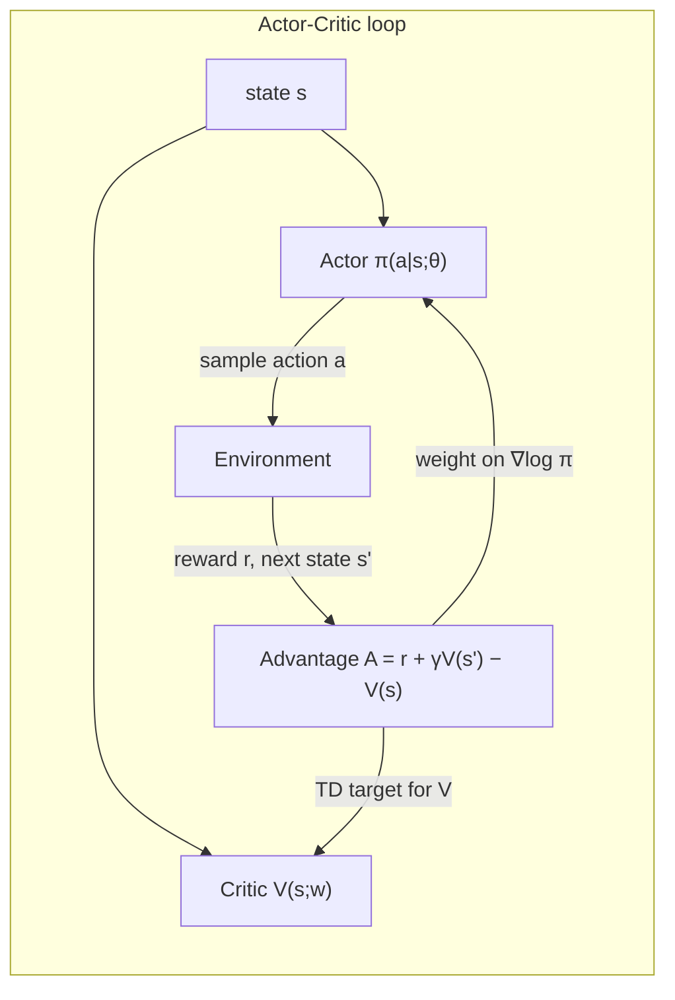

# Policy Gradients: Learning the Policy Directly, from a Bandit to Actor-Critic


> **The throughline:** *The value of where I am is the reward I just got, plus a discounted value of where I'll land next.*
> The [SARSA, Q-learning & DQN](../04-sarsa-qlearning-dqn/README.md) post used that sentence to learn $Q(s,a)$ and read a policy off it by argmax. This post throws out the middleman: **learn the policy $\pi(a \mid s;\theta)$ directly** and climb expected reward by gradient ascent. The throughline becomes the critic's job, while the actor learns *what to do*.

## 1. The intuition

For two lectures we estimated a value and let it choose actions for us: learn $Q(s,a)$, then act by $\arg\max_a Q(s,a)$. That pipeline has a hidden assumption: the action set is small and discrete, so the argmax is just "compare a few numbers and pick the biggest."

**What if we skip the value and optimize the policy itself?**

There are two routes to a policy:

- **Value-based (DQN, last lecture).** Learn $Q(s,a)$, then read the policy off it: $\pi(s) = \arg\max_a Q(s,a)$. The policy is *implicit*, a by-product of the values.
- **Policy-based (this post).** Parameterize the policy itself, $\pi_\theta(a \mid s)$ (a network that outputs action probabilities), and adjust $\theta$ to make good actions more likely. The policy is the thing you learn.

Three concrete situations break the argmax:

**1. Continuous actions.** A robot arm's torque is a real number. You cannot take an argmax over infinitely many actions. A policy sidesteps this by outputting the mean and spread of a Gaussian, $a \sim \mathcal{N}(\mu_\theta(s), \sigma_\theta(s))$, and sampling. One forward pass gives you the move.

**2. Stochastic optimal policies.** In rock-paper-scissors, the only unbeatable strategy is uniform $\frac{1}{3}, \frac{1}{3}, \frac{1}{3}$. A deterministic argmax can never output "play each move a third of the time." A stochastic policy can.

**3. Smooth, direct optimization.** A tiny change in $Q$ can flip the argmax from one action to another, a discontinuous jump. Policy gradients move smoothly: a small step in $\theta$ nudges $\pi$, it never snaps it. And they climb expected return $J(\theta)$ directly, not a Bellman-error surrogate. (Recall the deadly triad from the [SARSA, Q-learning & DQN](../04-sarsa-qlearning-dqn/README.md) post: function approximation + bootstrapping + off-policy data can diverge. Policy gradients avoid off-policy data entirely.)

**The honest cost.** Policy gradients are *on-policy* (each batch of experience is used once, then thrown away, so no replay buffer) and *high-variance* (the gradient is estimated from noisy sampled returns). The rest of this post earns the method and then pays that cost down.

### The Archer: the simplest possible RL problem

For most of this post the world has exactly one state. The **Archer** stands at a fixed spot and picks one of 9 discrete release angles $a_1 \dots a_9$. After shooting, the episode is over: reward = how close the arrow lands to the target (+1 dead centre, falling off with distance).

A one-state, one-shot problem is called a **bandit**. Your action changes the reward, but never the next state, because there is no next state. That single property strips away returns, discounting, and credit assignment. What is left is the pure policy-gradient mechanism. We add states back in Section 2.7, once the mechanism is airtight.



This diagram is the destination. We start at the top-left (state in, action out) and build every arrow by the end of Section 2.

<details>
<summary><strong>Check:</strong> The best policy in rock-paper-scissors is randomized. In one line, why can a stochastic policy represent "play each move a third of the time" but an argmax-over-Q cannot?</summary>

**Answer.** An argmax always returns one fixed action, so it can only play one move, which an opponent then exploits. A stochastic policy outputs a probability for every action, so it can literally encode 1/3, 1/3, 1/3. Representing randomness needs a distribution, and only the policy gives you one.
</details>

<details>
<summary><strong>Check:</strong> With a softmax policy we said exploration is "built in." Where does that exploration actually come from?</summary>

**Answer.** From sampling. The policy is a probability distribution over actions and we draw the action from it, so we sometimes try non-top actions on our own. The randomness lives inside the policy; there is no separate epsilon to schedule by hand.
</details>

<details>
<summary><strong>Check:</strong> A robot arm's torque is a real number. Why does argmax-over-Q break here, and what does a policy output instead?</summary>

**Answer.** You cannot take an argmax over infinitely many actions, so value-based control has nothing to maximize over. A policy sidesteps that by outputting a distribution you can sample. For continuous actions, it outputs the mean and spread of a Gaussian.
</details>

<details>
<summary><strong>Check:</strong> For almost all of this post the world has just one state (a bandit). What does having "no next state" let us ignore?</summary>

**Answer.** Everything about the future: returns, discounting, and credit assignment. With no next state your action only changes this one reward, so the policy-gradient mechanism appears in its purest form. We add states (and those three things) back in Section 2.7.
</details>

---

## 2. The math you need

### 2.1 The objective: expected reward

The goal is a single number: the expected reward under the current policy.

$$J(\theta) = \mathbb{E}_{a \sim \pi_\theta}[R(a)] = \sum_a \pi_\theta(a) \cdot R(a)$$

Read it as: "for every action the agent could take, multiply the chance of taking it ($\pi_\theta(a)$) by the reward it would earn ($R(a)$), and add them all up." The result is the average reward you would see if you kept sampling from the current policy. $J$ is a function of the policy parameters $\theta$: change $\theta$, the probabilities shift, the weighted sum changes, and $J$ goes up or down. It goes up when we put more probability on higher-reward actions. **The whole goal: gradient ascent on $J$.**

$$\theta \leftarrow \theta + \alpha \cdot \nabla_\theta J(\theta)$$

We *maximize* reward, so we move *along* the gradient (ascent, the **+** sign), not against it. In code, optimizers minimize, so we descend on the loss $-J$: the minus sign you will see in every REINFORCE loop.

### 2.2 The obstacle: you cannot just differentiate the sum

The naive gradient is:

$$\nabla_\theta J = \sum_a R(a) \cdot \nabla_\theta \pi_\theta(a)$$

This needs $R(a)$ for *every* action, including the ones we never tried, and the sum is huge or infinite for large or continuous action sets. **We cannot evaluate it. We need to turn it into something we can sample.**

### 2.3 The score-function trick (the one clean derivation)

One identity does the job. Start from the chain rule applied to $\log$:

$$\nabla_\theta \log \pi_\theta(a) = \frac{\nabla_\theta \pi_\theta(a)}{\pi_\theta(a)}$$

Rearrange:

$$\nabla_\theta \pi_\theta(a) = \pi_\theta(a) \cdot \nabla_\theta \log \pi_\theta(a)$$

Now substitute into the intractable sum:

$$\nabla_\theta J = \sum_a R(a) \cdot \nabla_\theta \pi_\theta(a) = \sum_a \pi_\theta(a) \cdot R(a) \cdot \nabla_\theta \log \pi_\theta(a)$$

The leading $\pi_\theta(a)$ is exactly the probability of sampling $a$, so the sum becomes an expectation:

$$\boxed{\nabla_\theta J = \mathbb{E}_{a \sim \pi_\theta}\big[R(a) \cdot \nabla_\theta \log \pi_\theta(a)\big]}$$

**That is why $\log \pi$ appears in every policy-gradient method.** The score-function trick rewrites a sum over all actions as an expectation over the agent's own behavior. We never need the reward of an action we did not try. One sampled action gives one unbiased gradient estimate.

<details>
<summary><strong>Check:</strong> The naive gradient needed the reward of every possible action. After the score-function trick, we only need the reward of the one action we sampled. Where did the other actions go?</summary>

**Answer.** They were absorbed into the sampling distribution. The trick rewrote the sum over all actions as an expectation under the policy. An expectation is estimated by sampling from the policy itself, so the actions we do not take are accounted for by how often we would sample them, not by an explicit sum. One sampled action gives one unbiased gradient estimate.
</details>

<details>
<summary><strong>Check:</strong> Why can't we actually compute the "naive" gradient sum_a R(a) * grad pi(a)?</summary>

**Answer.** It needs the reward R(a) of every action, including all the ones we never tried, and that sum is huge (or infinite) for large or continuous action sets. There is simply nothing to evaluate it from.
</details>

<details>
<summary><strong>Check:</strong> The score-function trick rewrites that sum as an expectation. Why is an expectation something we can handle when the sum was not?</summary>

**Answer.** An expectation is estimated by sampling from the policy. So instead of summing over all actions, we just take the one action we actually sampled and use its reward, which is exactly the data the agent already collects.
</details>

<details>
<summary><strong>Check:</strong> Why does "log pi" turn up in every policy-gradient method you will ever see?</summary>

**Answer.** Because of the single identity $\nabla \pi = \pi \cdot \nabla \log \pi$. Multiplying by $\pi$ is what converts the sum-over-actions into an expectation-under-$\pi$, and that step leaves a $\nabla \log \pi$ behind. Every method inherits it from this one move.
</details>

<details>
<summary><strong>Check:</strong> Write the log-derivative identity and prove it in one line. Why is it exactly the bridge from a sum to an expectation?</summary>

**Answer.** The identity is $\nabla_\theta \pi_\theta(a) = \pi_\theta(a) \cdot \nabla_\theta \log \pi_\theta(a)$. Proof in one line: $\nabla \log \pi = \frac{1}{\pi} \nabla \pi$ by the chain rule; multiply both sides by $\pi$. It is the bridge because:

$$\sum_a R(a)\,\nabla \pi(a) = \sum_a \pi(a)\,R(a)\,\nabla \log \pi(a) = \mathbb{E}_{a \sim \pi}\!\big[R(a)\,\nabla \log \pi(a)\big]$$

The leading $\pi(a)$ turns the sum over actions into an expectation under the policy, which we can estimate by sampling.
</details>

### 2.4 REINFORCE: sample, observe, push

The estimator from Section 2.3 is REINFORCE. Each episode: sample an action, see the reward, compute one gradient estimate, take a step.

$$\hat{g} = R(a) \cdot \nabla_\theta \log \pi_\theta(a), \quad a \sim \pi_\theta$$

Read it as: "sample one action $a$ from the current policy, observe its reward $R(a)$, compute how to nudge the parameters to make $a$ more likely ($\nabla_\theta \log \pi_\theta(a)$), and scale that nudge by how good the reward was." Good reward, big push toward that action; bad reward, small push (or a push away if $R$ is negative). One sample gives one noisy estimate $\hat{g}$ of the true gradient.

In the bandit there is no future, so the weight on the chosen angle is simply its reward $r$. No returns, no credit assignment. One shot, one reward, one push.

Here is the core of the bandit training loop from our assignment. The policy network maps a constant state to 9 logits, softmax turns them into probabilities, and we sample:

```python
import gymnasium as gym
from gymnasium import spaces
import numpy as np, torch, torch.nn as nn

class ArcherBandit(gym.Env):
    """One-state bandit: 9 angles, reward = Gaussian centered on bullseye."""
    N_ANGLES, TARGET, SIGMA = 9, 4, 1.5  # 9 discrete angles (0-8), bullseye at 4, spread 1.5

    def __init__(self):
        super().__init__()
        # Bandit has no meaningful state: observation is always [0.]
        self.observation_space = spaces.Box(0., 1., (1,), np.float32)
        self.action_space = spaces.Discrete(self.N_ANGLES)

    def reset(self, *, seed=None, options=None):
        super().reset(seed=seed)
        return np.array([0.], np.float32), {}  # constant dummy state

    def step(self, a):
        # Reward = Gaussian bell curve: exp(-(a - target)^2 / (2σ^2))
        # Peaks at 1.0 when a == TARGET (dead center), drops smoothly
        # toward 0 the further a is from the bullseye.
        # This gives a smooth, deterministic reward landscape that
        # the policy must discover by trial and error.
        r = float(np.exp(-((a - self.TARGET)**2) / (2*self.SIGMA**2)))
        return np.array([0.], np.float32), r, True, False, {}
        # terminated=True: bandit episodes are always one step

# ── Policy network ──────────────────────────────────────────────
class Policy(nn.Module):
    def __init__(self, obs_dim, n_act, h=64):
        super().__init__()
        # Two-layer MLP: obs → hidden (tanh) → one logit per action
        self.net = nn.Sequential(nn.Linear(obs_dim, h), nn.Tanh(), nn.Linear(h, n_act))

    def forward(self, x):
        return self.net(x)  # raw logits; softmax applied by Categorical

# ── Action sampling ─────────────────────────────────────────────
def act(policy, state_np):
    st = torch.tensor(state_np, dtype=torch.float32)
    # Categorical takes raw logits, applies softmax internally
    dist = torch.distributions.Categorical(logits=policy(st))
    action = dist.sample()  # stochastic: exploration is built in
    # log_prob(a) = log π(a) — needed for the REINFORCE gradient
    # entropy H(π) — measures how spread out the policy is
    return action, dist.log_prob(action), dist.entropy()

# ── Training loop ───────────────────────────────────────────────
def train_bandit(episodes=1500, lr=0.01, ent_coef=0.1):
    env = ArcherBandit()
    pol = Policy(1, env.N_ANGLES)
    opt = torch.optim.Adam(pol.parameters(), lr)
    hist = []
    for ep in range(episodes):
        s, _ = env.reset()
        a, logp, ent = act(pol, s)
        _, r, *_ = env.step(int(a))
        # REINFORCE loss: -r · log π(a).  Negative because optimizers
        # minimize, but we want to *maximize* expected reward.
        # Entropy bonus (+ent_coef·H) discourages premature collapse
        # to a single action before the reward landscape is explored.
        loss = -(r * logp) - ent_coef * ent
        opt.zero_grad(); loss.backward(); opt.step()
        hist.append(r)
    return pol, hist

pol, hist = train_bandit()
probs = torch.softmax(pol(torch.zeros(1)), -1).detach().numpy()
print(f"mean reward (last 200): {np.mean(hist[-200:]):.3f}  (uniform ≈ 0.42)")
print(f"final π: {[f'{p:.3f}' for p in probs]}")
print(f"argmax = a{np.argmax(probs)+1}  (bullseye = a{ArcherBandit.TARGET+1})")
```

```text title="Output"
mean reward (last 200): 1.000  (uniform ≈ 0.42)
final π: ['0.000', '0.000', '0.000', '0.000', '1.000', '0.000', '0.000', '0.000', '0.000']
argmax = a5  (bullseye = a5)
```

The fan sharpens onto the bullseye: all probability concentrates on angle 5 (the target, since TARGET=4 is zero-indexed). The loss line `-(r * logp) - ent_coef * ent` is the entire algorithm: weight the log-probability of the taken action by its reward (the REINFORCE estimator) and add an entropy bonus to keep exploring.

<details>
<summary><strong>Check:</strong> DQN happily trained on stale transitions from a replay buffer. Why can't REINFORCE do the same?</summary>

**Answer.** Because the gradient is an expectation under the *current* policy. The samples must come from today's policy. The moment you update theta, the old shots were drawn from the wrong distribution, so reusing them would bias the estimate. That is what "on-policy" means, and it is why REINFORCE is sample-hungry: each batch of shots is used once and thrown away.
</details>

<details>
<summary><strong>Check:</strong> In the bandit, the gradient weight is just the reward r, not a return or a discount. What feature of the bandit makes that okay?</summary>

**Answer.** The bandit has no next state, so your action has no future to influence. There are no later rewards to add up. The "return" is just the single reward r. Returns and discounting only appear once actions change what happens next (Section 2.7).
</details>

<details>
<summary><strong>Check:</strong> One shot gives one gradient that's "correct on average." Why is a single shot still a poor guide?</summary>

**Answer.** It is one draw of a very noisy quantity; its direction can land almost anywhere. Only the average over many shots converges to the true gradient. That noise is exactly what Section 2.6 fixes.
</details>

<details>
<summary><strong>Check:</strong> REINFORCE is on-policy and DQN is off-policy; both are "model-free." In one sentence each, say what "on/off-policy" and "model-free" actually mean.</summary>

**Answer.** On/off-policy: whether you learn about the same policy that generated the data (on) or a different one (off). Model-free: you never learn or use the transition model P(s'|s,a); you learn purely from sampled experience. They are independent axes: REINFORCE is on-policy and model-free; DQN is off-policy and model-free.
</details>

### 2.5 The backward pass: all nine logits move

This section answers the question everyone asks: the policy gave nine probabilities, but we sampled only one angle. Whose gradient do we actually compute?

The loss uses only the sampled action $a_6$:

$$L = -r \cdot \log \pi(a_6)$$

A natural guess: "we only have a gradient for $a_6$." That guess is **wrong**. The softmax denominator ties all nine logits together:

$$\log \pi(a_6) = z_6 - \log \sum_k e^{z_k}$$

That sum $\sum_k$ contains *all nine* logits. So the loss depends on every $z_k$, and the gradient touches all nine:

$$\frac{\partial L}{\partial z_k} = -r \cdot \big(\mathbb{1}[k = a_6] - \pi(a_k)\big)$$

For the **taken** angle $a_6$: gradient $\propto +(1 - \pi_6)$, push **up**.
For each **other** angle: gradient $\propto -\pi_k$, push **down**.
All nine pushes **sum to zero**: probability is conserved, only redistributed.


Here is a tiny snippet that reproduces the nine logit gradients with real numbers:

```python
import numpy as np

# Hypothetical logits (raw scores) the policy network outputs for 9 angles.
# These are NOT probabilities yet — softmax converts them next.
logits = np.array([0.2, 0.6, 1.0, 1.6, 2.0, 1.6, 1.0, 0.6, 0.2])

# Softmax: π(aₖ) = exp(zₖ) / Σ exp(zⱼ)  — turns logits into a valid
# probability distribution that sums to 1.
probs = np.exp(logits) / np.exp(logits).sum()

taken = 5  # a6 (0-indexed): the action we actually sampled
r = 0.9    # reward received for that shot

# Per-logit gradient of the REINFORCE loss L = -r · log π(a_taken).
# Formula: ∂L/∂zₖ = -r · (𝟙[k = taken] - π(aₖ))
#   • For the taken action: gradient = -r·(1 - π(a₆)), negative → logit rises
#   • For every other action: gradient = -r·(0 - π(aₖ)) = +r·π(aₖ), positive → logit falls
# np.eye(9)[taken] is a one-hot vector: 1 at position 'taken', 0 elsewhere.
grads = -r * (np.eye(9)[taken] - probs)

print("Per-logit gradients (r=0.9, taken=a6):")
for i, g in enumerate(grads):
    tag = " ← taken" if i == taken else ""
    print(f"  a{i+1}: {g:+.3f}{tag}")
# All nine gradients sum to exactly zero: probability is conserved,
# only redistributed among angles, never created or destroyed.
print(f"  sum: {grads.sum():.6f}")
```

```text title="Output"
Per-logit gradients (r=0.9, taken=a6):
  a1: +0.038
  a2: +0.057
  a3: +0.085
  a4: +0.155
  a5: +0.231
  a6: -0.745 ← taken
  a7: +0.085
  a8: +0.057
  a9: +0.038
  sum: 0.000000
```

(Note: the signs are the gradient of the *loss* $L = -r \log\pi(a_6)$; the optimizer subtracts this from the logits, so a6's logit rises and the others fall, exactly as expected.)

The nine logit-gradients form a single vector $\partial L / \partial \mathbf{z}$. We backprop it **once** (not nine times). Each weight's gradient is the sum of all nine logits' contributions via the chain rule:

$$\frac{\partial L}{\partial \theta_j} = \sum_{k=1}^{9} \frac{\partial L}{\partial z_k} \cdot \frac{\partial z_k}{\partial \theta_j}$$

Every logit $z_k$ is built from the same shared weights $\theta$, so the chain rule adds up all nine influences. The result is one gradient per weight and one Adam step, not nine.

<details>
<summary><strong>Check:</strong> The policy gave nine probabilities but we sampled only a6. Why does the update change all nine angles, not just a6?</summary>

**Answer.** Because the softmax ties them together: pi(a6) is e^{z6} divided by the sum of all nine exponentials. Touching any logit changes that shared denominator, so the gradient is nonzero for every angle. The taken angle is pushed up and the other eight are nudged down, all through the normalizer.
</details>

<details>
<summary><strong>Check:</strong> Those nine pushes added up to zero. Why must they always sum to zero?</summary>

**Answer.** Because the nine probabilities must always add to 1. You cannot create probability, only move it. So whatever you add to one angle has to come off the others. The update redistributes the fan; it does not grow it.
</details>

<details>
<summary><strong>Check:</strong> In the example the reward was 0.9 (a big push on a6). Redo it for a near-miss that scored only 0.1: which way does a6 move, and by how much?</summary>

**Answer.** The weight is just the reward, 0.1 > 0, so a6 still moves UP, only about a ninth as far ((1-.172)*0.1 ≈ +0.083 on its logit, versus +0.745 before), with the other eight nudged down proportionally. The catch: with the reward alone, *every* shot pushes the taken angle up. Only the size changes. That one-sidedness is wasteful, and it is exactly what the baseline in Section 2.6 fixes.
</details>

<details>
<summary><strong>Check:</strong> We visualize the gradient on the logits, but the actual parameters are the network weights theta. What single tool bridges the two, and why don't we update the logits directly?</summary>

**Answer.** Backpropagation (the chain rule) bridges them: the logit-gradient is the entry point, and backprop turns it into a gradient for every weight. We cannot update logits directly because they are not parameters; they are recomputed from theta on every forward pass. Only theta persists.
</details>

### 2.6 The variance problem and the baseline

Without a baseline, every return is positive (in the Archer, reward is always > 0), so every sampled action is pushed up. Good and mediocre alike. The signal is a small difference riding on a big positive offset, and sample noise swamps it.

**The fix.** Subtract a baseline $b$ that does not depend on the action:

$$\hat{g} = (R - b) \cdot \nabla_\theta \log \pi_\theta(a)$$

We call the centered weight the **advantage** $A = R - b$. Better than baseline pushes up ($A > 0$); worse pushes down ($A < 0$). The estimator now takes both signs and mostly cancels, dramatically cutting variance.

**Zero-bias proof.** We subtracted $b$, so we added a term $-b \cdot \nabla \log \pi(a)$. Does that bias the gradient? Take its expectation step by step:

$$\mathbb{E}_{a \sim \pi}[b \cdot \nabla \log \pi(a)] = b \cdot \sum_a \pi(a) \nabla \log \pi(a) = b \cdot \sum_a \nabla \pi(a) = b \cdot \nabla \underbrace{\sum_a \pi(a)}_{=1} = b \cdot \nabla(1) = 0$$

Walk through each `=` sign:

1. **Expectation becomes a weighted sum.** $\mathbb{E}_{a \sim \pi}[\cdot]$ means "sum over all actions, each weighted by its probability $\pi(a)$." The constant $b$ pulls out of the sum.
2. **Undo the log-derivative trick.** Recall $\pi(a) \cdot \nabla \log \pi(a) = \nabla \pi(a)$ (the identity from Section 2.3, just run in reverse). So $\pi(a) \nabla \log \pi(a)$ collapses back to $\nabla \pi(a)$.
3. **Swap sum and gradient.** $\sum_a \nabla \pi(a) = \nabla \sum_a \pi(a)$. The sum of all action probabilities is 1 by definition (it is a probability distribution).
4. **Gradient of a constant is zero.** $\nabla(1) = 0$. No matter how you change $\theta$, probabilities still sum to 1, so the derivative of that sum is always zero.

The punchline: the baseline term vanishes *in expectation*. Subtracting $b$ changes the *variance* of the estimator but not its *mean*. We still climb the same $J$, just with far less noise.

**The push magnitude.** We know REINFORCE pushes good actions up and bad actions down. But *how hard* does it push? That depends on how surprised the policy is by its own choice.

For a softmax policy, the gradient of $\log \pi(a)$ with respect to the logit $z_a$ of the chosen action is:

$$\frac{\partial \log \pi(a)}{\partial z_a} = 1 - \pi(a)$$

Read it as: "one minus the probability the policy already assigned to that action." This is the **score function** for the taken action, and it controls how big the parameter update is. Two concrete cases make the intuition click:

- **Surprising action pays off.** The archer tries angle 7, which the policy thought was unlikely ($\pi(a_7) = 0.05$). It scores well. The push magnitude is $1 - 0.05 = 0.95$: a large update. The policy had a lot to learn from this surprise.
- **Confident action pays off.** The archer tries angle 5, which the policy already favored ($\pi(a_5) = 0.80$). It scores well. The push magnitude is $1 - 0.80 = 0.20$: a small update. The policy already knew this was good; confirming it again does not warrant a big change.

The policy automatically spends its learning budget where it matters most: on actions it was *wrong* about, not on ones it already had right. This is built into the math of $\nabla \log \pi$; you get it for free.


The near-optimal constant baseline is approximately the average return, $b^* \approx \mathbb{E}[G_t]$. An even better baseline is a *learned, per-state* value $V(s)$, which we will see in Section 2.8.

<details>
<summary><strong>Check:</strong> We subtract a baseline b to cut variance. A skeptic worries: "you changed the gradient, now you're optimizing the wrong thing." Why is the skeptic wrong?</summary>

**Answer.** The baseline term has expectation exactly zero: $\mathbb{E}[b \cdot \nabla \log \pi(a)] = b \sum_a \pi(a) \nabla \log \pi(a) = b \cdot \nabla(1) = 0$. Subtracting $b$ changes the variance of the estimator but not its mean, so we still optimize $J$, just with less noise.
</details>

<details>
<summary><strong>Check:</strong> Without a baseline, for an all-positive reward every shot pushes its action's probability UP. Why does that one-sidedness make the noise so destructive?</summary>

**Answer.** Because every sample agrees in direction, they never cancel. You get one big, one-sided number whose swings drown out the small real differences between actions. Subtracting a baseline lets the weight take both signs, so the noise cancels.
</details>

<details>
<summary><strong>Check:</strong> After the baseline, A = R − b can be negative. What does a negative advantage do to the angle you took, and when does that happen?</summary>

**Answer.** A negative advantage ($A < 0$) pushes that angle's probability **down**. It happens whenever the shot scored below the baseline ($R < b$, worse than average), so a disappointing outcome makes the action you tried less likely. Better-than-average ($A > 0$) pushes up; worse-than-average ($A < 0$) pushes down. This two-sided signal is exactly why the baseline cuts variance: without it, every weight was positive and all actions got pushed up indiscriminately.
</details>

<details>
<summary><strong>Check:</strong> A student proposes a "baseline" equal to the return of the same trajectory, b = G_t, so the advantage is always 0. What goes wrong, and which rule does it violate?</summary>

**Answer.** If $b = G_t$, then $A = G_t - G_t = 0$ for every sample, so the gradient is always zero and the policy never updates. There is no learning signal at all. More fundamentally, $G_t$ depends on the action taken (different actions lead to different trajectories and different returns), so it violates the requirement that the baseline be **action-independent**. The zero-bias proof (Section 2.6) only works when $b$ can be pulled out of the expectation over actions, which requires $b$ not to depend on $a$. A legal baseline may depend on the state $s$ (that is $V(s)$), never on the action.
</details>

<details>
<summary><strong>Check:</strong> The estimator R(a) · ∇ log π(a) is unbiased. "Unbiased" means "correct on average." Why is that a weaker promise than "useful on any single sample"?</summary>

**Answer.** "Unbiased" means $\mathbb{E}[\hat{g}] = \nabla J$: if you averaged infinitely many one-sample estimates, you would get the true gradient. But on any *single* episode the estimate $\hat{g} = R(a) \cdot \nabla \log \pi(a)$ can point almost anywhere, because the variance is huge (one lucky or unlucky reward swings the whole vector). So "correct on average" is a much weaker guarantee than "close to the truth on every draw." That gap is precisely why REINFORCE is so slow and why we need variance-reduction tricks (baselines, critics) to make each individual sample more informative.
</details>

<details>
<summary><strong>Check:</strong> grad log pi is called the "score function." For a softmax policy, show that the score for the chosen action is (1 - pi(a)) along its logit. Why does an already-confident action barely move?</summary>

**Answer.** For a softmax, $\log \pi(a) = z_a - \log \sum_k e^{z_k}$, so $\partial(\log \pi(a))/\partial z_a = 1 - \pi(a)$. If the action is already confident ($\pi(a)$ near 1), then $1 - \pi(a) \approx 0$ and the gradient barely moves it. You do not waste updates re-confirming what the policy already does.
</details>

<details>
<summary><strong>Check:</strong> The trick needs pi(a) > 0 for every action we might sample (we divide by it). What does that say about why a policy should never assign exactly zero probability during training?</summary>

**Answer.** Because the score function divides by $\pi(a)$: an action with $\pi(a) = 0$ makes $\nabla \log \pi$ blow up and can never be sampled or learned about. Policies should keep every probability strictly positive during training (e.g. via entropy regularization, or a softmax that never fully saturates) so every action stays explorable and the gradient stays well-defined.
</details>

<details>
<summary><strong>Check:</strong> An LLM's final layer is a softmax over 50,000 token logits, exactly like our Archer's 9-angle softmax. If a generated answer earns a positive reward, what does REINFORCE do to the token probabilities, and how is it the same push/pull we just derived?</summary>

**Answer.** Exactly the same mechanics: for each token the model produced, a positive advantage pushes that token's logit up ($\partial \log\pi / \partial z_a = 1 - \pi(a) > 0$) and pushes every other token's logit down ($-\pi(a_k)$). The only differences are scale (50K actions instead of 9) and the fact that the reward arrives at the end of a whole sequence, not one shot. This is the core of RLHF and PPO for LLMs, which the [TRPO & PPO](../06-trpo-ppo/README.md) post covers in full.
</details>

### 2.7 Adding states: from bandit to MDP

So far the Archer stood at one fixed spot and took one shot. Now we let it walk. The instant an action changes what happens next, the bandit becomes a full sequential problem.

Two things change in the mechanics:

**1. The policy reads the state.** $\pi_\theta(a) \to \pi_\theta(a \mid s)$. The Archer decides differently at 40 m than at 10 m. Same weights $\theta$, one distribution per distance.

**2. The weight becomes the return.** The single reward $r$ becomes $G_t$, the discounted sum of rewards that follows a step. A quiet "step closer" that costs $-0.2$ can now be credited for the +10 shot it set up. This is **credit assignment**.

The return $G_t = r_t + \gamma r_{t+1} + \gamma^2 r_{t+2} + \dots$ was defined in the [MDPs & Bellman](../02-mdps-and-bellman/README.md) post. Discounting and returns were explored in the [DP, MC & TD](../03-dp-mc-td/README.md) post. REINFORCE waits for the full episode to compute $G_t$, exactly like Monte Carlo prediction from that same post.

The complete REINFORCE gradient with states:

$$\nabla_\theta J(\theta) = \mathbb{E}_\tau \Big[\sum_t G_t \cdot \nabla_\theta \log \pi_\theta(a_t \mid s_t)\Big]$$

Read it against the bandit: the bandit was the one-step case, a single term with $G = r$. Adding states just sums the same per-action push over the whole trajectory, each weighted by its return.


```python
import numpy as np

# A 5-step Archer MDP trajectory: 4 "step closer" moves (cost -0.2 each)
# followed by a final shot that earns +10.
rewards = [-0.2, -0.2, -0.2, -0.2, 10.0]
states  = ["40m", "30m", "20m", "10m", "shoot"]
gamma   = 0.9  # discount factor: future rewards are worth 90% per step

# Compute the discounted return G_t at every timestep, working BACKWARDS.
# G_t = r_t + γ·G_{t+1}  (recursive definition of the return)
# We iterate in reverse so each step can reuse the already-computed future.
G, returns = 0.0, []
for r in reversed(rewards):
    G = r + gamma * G   # accumulate: this reward + discounted future
    returns.append(G)
returns.reverse()  # flip back to chronological order

# Display: even the earliest "step closer" at 40 m gets a large positive
# return (~5.87) because the discounted +10 final shot propagates back.
# This is CREDIT ASSIGNMENT: quiet moves are credited for the future
# they set up, not just their own immediate -0.2.
for s, Gt in zip(states, returns):
    print(f"  {s:>5s}: G = {Gt:+.3f}")
```

```text title="Output"
    40m: G = +5.873
    30m: G = +6.748
    20m: G = +7.720
    10m: G = +8.800
  shoot: G = +10.000
```

"Step closer at 40 m" has a return of +5.87, not -0.2, because the discounted future includes the +10 shot it set up. That is how an end-of-episode reward teaches the quiet moves that set it up.

<details>
<summary><strong>Check:</strong> REINFORCE waits for a full episode before updating (it needs G_t). Which earlier method does that remind you of, and what is the cost of waiting?</summary>

**Answer.** It is like Monte Carlo prediction from the [DP, MC & TD](../03-dp-mc-td/README.md) post: both wait for the full episode return before updating. The cost of waiting is high variance (the whole-episode return is noisy) and no online learning: you cannot update mid-episode.
</details>

<details>
<summary><strong>Check:</strong> An action at time t is weighted by G_t, the return that came after it. Why do we use the reward-to-go G_t rather than the whole-episode return for every step?</summary>

**Answer.** An action at time t cannot affect rewards earned before t, so including those earlier rewards only adds zero-mean noise. Reward-to-go drops them: same expectation (still unbiased), smaller variance.
</details>

### 2.8 The advantage: "better than typical *here*"

REINFORCE with states is painfully noisy because the return $G_t$ is a big, lurching number. The fix from Section 2.6 generalizes: subtract a *per-state* baseline $V(s)$.

$$A_t = G_t - V(s_t)$$

The same return can mean very different things in different states. In the Archer MDP, $V(40\text{m}) \approx 6$ (far, hard) and $V(10\text{m}) \approx 9$ (close, easy). The same return $G = 7$ gives:

- at 40 m: $A = 7 - 6 = +1$ (above expectation, push up)
- at 10 m: $A = 7 - 9 = -2$ (below expectation, push down)

Same outcome, opposite lesson, because "good" is judged relative to what is typical at that distance. A single global baseline could never do this.

The advantage can also be written $A(s,a) = Q(s,a) - V(s)$: how much better is taking $a$ than acting typically from $s$? Its sign sets the direction; its magnitude sets how hard to push. That is all the policy needs.

The policy-gradient theorem becomes:

$$\nabla_\theta J(\theta) = \mathbb{E}\big[A(s,a) \cdot \nabla_\theta \log \pi_\theta(a \mid s)\big]$$

This is the form that every method in the rest of the course shares. They differ only in how they estimate $A$.

<details>
<summary><strong>Check:</strong> A constant baseline subtracts the same number everywhere. Why is a state-dependent baseline V(s) strictly better?</summary>

**Answer.** Different states have very different typical returns. A constant can only be right "on average"; $V(s)$ subtracts the right amount per state, so $A = G - V(s)$ measures "better than expected in THIS state," removing more variance than any single constant could. That is the Actor-Critic idea.
</details>

<details>
<summary><strong>Check:</strong> At a state the critic predicts V(s) = 5. Two episodes pass through s: one returns G = 8, the other G = 3. Compute each advantage and say what happens to the probability of the action taken in each.</summary>

**Answer.** A = 8 - 5 = +3 (well above expectation, push that action's probability up, hard) and A = 3 - 5 = -2 (below expectation, push that action's probability down). Same state, same baseline: the advantage's sign and size do all the work.
</details>

### 2.9 Actor-Critic: two heads, one loop

Give the per-state baseline $V(s)$ its own network and let it learn alongside the policy. That single move is the foundation the rest of modern RL is built on.

**The Actor** is the policy $\pi_\theta(a \mid s)$. It acts: it chooses the move and takes the shot. **The Critic** is the value $V_w(s)$. It judges: it never acts. Having watched thousands of episodes, it knows how good each position is. Its verdict is the advantage, which is the only feedback the actor needs, and it is far steadier than a raw return.

The advantage is the TD error from the [DP, MC & TD](../03-dp-mc-td/README.md) post:

$$A = r + \gamma V_w(s') - V_w(s)$$

Read it as: "the reward I just got ($r$), plus what the critic thinks the next state is worth ($\gamma V_w(s')$), minus what the critic thought this state was worth ($V_w(s)$)." If $A > 0$, reality beat the critic's expectation, so push the action up; if $A < 0$, reality was worse, so push it down.

Two losses, one pass:
- **Critic:** regress $V(s)$ toward the TD target $r + \gamma V(s')$: minimize $(r + \gamma V(s') - V(s))^2$.
- **Actor:** push each action by its advantage: minimize $-(A \cdot \log \pi(a \mid s))$.

**Why `detach`?** The advantage is meant to be a fixed weight telling the actor how much to push. If the actor's gradient flowed into $V$, the actor could "cheat" by changing the critic to make its chosen actions look good (lowering $V(s)$) instead of improving the policy. `detach` keeps the two objectives clean.

Here is the Actor-Critic training loop from the assignment (trimmed for clarity):

```python
import gymnasium as gym
from gymnasium import spaces
import numpy as np, torch, torch.nn as nn

GAMMA = 0.99  # discount factor: how much we value future rewards vs. immediate

# ── Environment: Archer MDP ─────────────────────────────────────
# Unlike the bandit (one state, one shot), the MDP has a DISTANCE state.
# The archer can walk closer, step back, or shoot from the current distance.
class ArcherMDP(gym.Env):
    """MDP: distance-to-target as state, 3 actions (closer/back/shoot)."""
    CLOSER, BACK, SHOOT = 0, 1, 2   # three discrete actions
    MIN_D, MAX_D = 10., 50.          # distance range in meters
    def __init__(self, max_steps=25):
        super().__init__()
        # Observation = normalized distance d/50, so it lies in [0, 1]
        self.observation_space = spaces.Box(0., 1., (1,), np.float32)
        self.action_space = spaces.Discrete(3)
        self.max_steps = max_steps
    def _obs(self):
        return np.array([self.d / self.MAX_D], np.float32)
    def reset(self, *, seed=None, options=None):
        super().reset(seed=seed)
        # Start at a random distance from {10, 20, 30, 40, 50}
        self.d = float(self.np_random.choice([10.,20.,30.,40.,50.]))
        self.t = 0
        return self._obs(), {}
    def shoot_reward(self, d):
        # Reward for shooting: 10 at 10 m (closest), drops linearly with distance.
        # Optimal strategy: walk to 10 m, then shoot for max reward.
        return 10. - 0.28*(d - self.MIN_D)
    def step(self, a):
        self.t += 1
        if a == self.SHOOT:
            # Shooting ends the episode (terminated=True) with distance-based reward
            return self._obs(), float(self.shoot_reward(self.d)), True, False, {}
        # Walking costs -0.2 per step (small penalty to encourage efficiency)
        self.d = float(np.clip(
            self.d + (-10. if a == self.CLOSER else 10.), self.MIN_D, self.MAX_D))
        return self._obs(), -0.2, False, self.t >= self.max_steps, {}

# ── Actor (Policy network) ──────────────────────────────────────
# Maps state → one logit per action. Softmax (inside Categorical) converts
# logits to π(a|s). This IS the policy we are optimizing.
class Policy(nn.Module):
    def __init__(self, obs_dim, n_act, h=64):
        super().__init__()
        self.net = nn.Sequential(nn.Linear(obs_dim, h), nn.Tanh(), nn.Linear(h, n_act))
    def forward(self, x): return self.net(x)

# ── Critic (Value network) ──────────────────────────────────────
# Maps state → single scalar V(s), the expected return from state s
# under the current policy. Used as a baseline to compute advantage.
class Value(nn.Module):
    def __init__(self, obs_dim, h=64):
        super().__init__()
        self.net = nn.Sequential(nn.Linear(obs_dim, h), nn.Tanh(), nn.Linear(h, 1))
    def forward(self, x): return self.net(x).squeeze(-1)

# ── Action sampling ─────────────────────────────────────────────
def act(policy, s):
    st = torch.tensor(s, dtype=torch.float32)
    # Categorical applies softmax to logits → π(a|s), then we sample
    dist = torch.distributions.Categorical(logits=policy(st))
    a = dist.sample()  # stochastic action: exploration is built into the policy
    # log_prob = log π(a|s) — the "score" in the REINFORCE gradient
    # entropy = H(π) — measures exploration breadth
    return a, dist.log_prob(a), dist.entropy()

# ── Actor-Critic training loop ──────────────────────────────────
def actor_critic(env, episodes=2000, lr_a=0.004, lr_c=0.03, ent_coef=0.01, warmup=150):
    pol = Policy(1, env.action_space.n)       # actor: learns WHAT to do
    val = Value(1)                             # critic: learns HOW GOOD each state is
    popt = torch.optim.Adam(pol.parameters(), lr_a)  # actor optimizer (slower lr)
    vopt = torch.optim.Adam(val.parameters(), lr_c)  # critic optimizer (faster lr)
    curve = []
    for ep in range(episodes):
        s, _ = env.reset()
        # Collect one full episode: states, log-probs, entropies, rewards,
        # next-states, and done flags for every transition
        S, logps, ents, R, S2, Dn = [], [], [], [], [], []
        done = False
        while not done:
            a, logp, ent = act(pol, s)
            s2, r, term, trunc, _ = env.step(int(a))
            done = term or trunc
            S.append(s); logps.append(logp); ents.append(ent)
            R.append(r); S2.append(s2); Dn.append(float(term))
            s = s2

        # Convert episode data to tensors for batch computation
        states = torch.tensor(np.array(S), dtype=torch.float32)
        snext  = torch.tensor(np.array(S2), dtype=torch.float32)
        rew    = torch.tensor(R, dtype=torch.float32)
        dn     = torch.tensor(Dn)  # 1.0 at terminal step, 0.0 otherwise

        # TD target: r + γ·V(s')·(1 - done)
        # (1-dn) zeroes out the bootstrap at terminal states — there is no
        # future after the episode ends, so V(s') should not contribute.
        with torch.no_grad():
            target = rew + GAMMA * val(snext) * (1 - dn)

        v   = val(states)
        # Advantage A = TD_target - V(s) = r + γV(s') - V(s)
        # Positive → action was better than expected, push probability UP
        # Negative → action was worse than expected, push probability DOWN
        # .detach() prevents actor gradients from flowing into the critic
        adv = (target - v).detach()

        # ── Critic update: minimize (TD_target - V(s))² ────────────
        # Trains V(s) to predict the discounted return from each state
        vopt.zero_grad()
        (target - v).pow(2).mean().backward()
        vopt.step()

        # ── Actor update (only after warmup) ────────────────────────
        # Warmup: let the critic learn reasonable V(s) before the actor
        # starts using the advantage. Early random advantages = noise.
        if ep >= warmup:
            logp = torch.stack(logps)
            ent  = torch.stack(ents)
            popt.zero_grad()
            # Actor loss = -𝔼[A · log π(a|s)] - ent_coef · H(π)
            # First term: REINFORCE weighted by advantage (negated for descent)
            # Second term: entropy bonus keeps the policy exploring
            (-(adv * logp).mean() - ent_coef * ent.mean()).backward()
            popt.step()
        curve.append(sum(R))
    return pol, val, curve

# ── Greedy evaluation ───────────────────────────────────────────
# After training, test the policy deterministically (argmax, no sampling)
# to measure what it has actually learned, free from exploration noise.
def greedy_eval(env, pol, n=20):
    total = 0.
    for _ in range(n):
        s, _ = env.reset(); done = False; ep_r = 0.
        while not done:
            with torch.no_grad():
                # Greedy: pick the action with the highest logit (most confident)
                a = pol(torch.tensor(s, dtype=torch.float32)).argmax()
            s, r, term, trunc, _ = env.step(int(a))
            ep_r += r; done = term or trunc
        total += ep_r
    return total / n

pol, val, curve = actor_critic(ArcherMDP())
print(f"Actor-Critic greedy return: {greedy_eval(ArcherMDP(), pol):.2f}")
```

```text title="Output"
Actor-Critic greedy return: 9.51
```

The Actor-Critic reaches a greedy return near the maximum possible score. The critic's warmup period lets $V$ settle before the actor starts moving; the detached advantage ensures the two heads stay clean.

<details>
<summary><strong>Check:</strong> The critic's job is to predict V(s). But the policy keeps changing, so the "correct" V(s) keeps moving. How can the critic ever learn a moving target, and why doesn't this stall the actor?</summary>

**Answer.** They co-adapt: the critic regresses toward the returns the current policy actually earns, so it tracks that policy's value as the policy drifts slowly (small learning rate). The actor does not need an absolute value, only the sign and rough size of the advantage (better or worse than this state's baseline). Even an imperfect critic gives a useful advantage, so both improve together. This co-adaptation is why a slow, stable step size matters, and why TRPO/PPO (next) are about controlling how far the actor moves per update.
</details>

<details>
<summary><strong>Check:</strong> Why is the policy called the "actor" and the value the "critic"? In the archer-and-coach picture, what does each do, and why is "judge but never act" actually useful rather than redundant?</summary>

**Answer.** The actor (policy pi) is the only part that acts: it takes the moves and shots. The critic (value V) never acts; it only judges how good a state is. The split is useful because the critic turns a noisy raw score into "better/worse than expected at THIS state" (a learned, per-state baseline), and because the two can specialize and improve together: the actor exploits the critic's sign, the critic sharpens its estimate.
</details>

<details>
<summary><strong>Check:</strong> "Step closer at 40 m" scored about 0 by itself, yet its probability goes up. Trace how a reward that only appears at the final shot reaches that early move.</summary>

**Answer.** Through the return $G_t$. The step's discounted future includes the +10 shot it set up, so its return is high, well above the critic's $V(40)$. The positive advantage $A = G_t - V(40)$ credits the quiet step for leading somewhere better, even though its own reward was just $-0.2$.
</details>

<details>
<summary><strong>Check:</strong> REINFORCE-with-a-baseline already subtracts a value to get A = G_t - V(s). What does calling that value a "critic" and giving it its own network actually add?</summary>

**Answer.** A learned, per-state network generalizes: it predicts the typical return for any state, including ones rarely visited, instead of a single global average. That sharper, state-specific baseline makes the advantage cleaner, and naming the two pieces "actor" and "critic" recognizes that the policy and its value can be separate networks that improve together.
</details>

<details>
<summary><strong>Check:</strong> Why do we detach the advantage when computing the actor's loss? What would break if the actor's gradient flowed into V?</summary>

**Answer.** The advantage is meant to be a fixed weight telling the actor how much to push. If the actor's gradient flowed into $V$, the actor could "cheat" by changing the critic to make its chosen actions look good (lowering $V(s)$) instead of improving the policy, corrupting both the baseline and the learning signal. `detach` keeps the two objectives clean.
</details>

<details>
<summary><strong>Check:</strong> Actor-Critic can update every step, but REINFORCE must wait for the episode to end. Which property of the advantage makes online updates possible?</summary>

**Answer.** Bootstrapping: the advantage uses $V(s')$, a one-step estimate of the future, instead of the full return $G_t$. You do not need the rest of the episode, just the next state's value, so you can update immediately after each transition.
</details>

<details>
<summary><strong>Check:</strong> Actor-Critic adds a critic network and reduces variance. Yet plain REINFORCE (no critic) is used in production for tasks like text-to-SQL. Why would the simpler algorithm ever be preferred?</summary>

**Answer.** When episodes are short, reward is sparse but clear (the SQL query either runs correctly or not), and the action space is small enough that variance is manageable, the extra complexity of training a critic is not worth the engineering cost. REINFORCE is dead simple to implement, and for tasks with a strong binary signal at episode end, its high variance is tolerable because the reward already tells you whether the output was right or wrong.
</details>

### 2.10 A note on continuous actions

Everything above used discrete actions (softmax over 9 angles). For continuous actions (robot torques, steering angles), the policy head outputs the parameters of a distribution:

```python
# For continuous actions (e.g. torque, steering angle), the policy outputs
# the PARAMETERS of a Gaussian distribution, not discrete logits.
# We sample the action from a ~ N(μ(s), σ(s)), and log π(a|s) is the
# Gaussian log-density — the same REINFORCE / Actor-Critic math applies.
class GaussianPolicy(nn.Module):
    def __init__(self, obs_dim, act_dim, h=64):
        super().__init__()
        # Shared trunk: maps observation → hidden features
        self.trunk = nn.Sequential(nn.Linear(obs_dim, h), nn.Tanh())
        # Mean head: one output per action dimension (state-dependent)
        self.mu_head  = nn.Linear(h, act_dim)
        # Log standard deviation: a LEARNABLE parameter (not state-dependent).
        # Stored as log(σ) so exp() guarantees σ > 0.
        # Starts at zeros → σ = 1.0 (moderate initial exploration).
        self.log_std  = nn.Parameter(torch.zeros(act_dim))

    def forward(self, x):
        h = self.trunk(x)
        mu = self.mu_head(h)            # μ(s): center of the Gaussian
        std = self.log_std.exp()         # σ: spread (exploration width)
        # Returns a Normal distribution; call .sample() to get an action,
        # .log_prob(a) for the score ∇log π needed by REINFORCE.
        return torch.distributions.Normal(mu, std)
```

The mean and standard deviation define a Gaussian; we sample the action from it. The same REINFORCE / Actor-Critic machinery applies: $\nabla \log \pi$ is just the log-density of the Gaussian, and the advantage still weights it. PPO (next lecture) uses this for MuJoCo continuous control.

<details>
<summary><strong>Check:</strong> For continuous actions we output a Gaussian's mean and standard deviation. Why is the standard deviation itself a learned parameter, and what would go wrong if we fixed it to a constant?</summary>

**Answer.** The right amount of exploration varies by state and over training, so a learned standard deviation lets the policy be uncertain where it should be and confident where it should not. Fix it too large and the policy never commits (it cannot exploit); too small and it stops exploring and gets stuck. A constant cannot adapt as learning progresses.
</details>

<details>
<summary><strong>Check:</strong> For each task, say whether you would reach for a value method or a policy method, and why: (a) a board game with 20 legal moves per turn; (b) steering angle and throttle for a self-driving car; (c) rock-paper-scissors against an adaptive opponent.</summary>

**Answer.** (a) Either works: discrete, modest action set, so a value argmax is cheap. (b) Policy: continuous controls; an argmax over a 2-D continuum every step is painful, a Gaussian policy is natural. (c) Policy: the optimal play is the stochastic uniform mix, which a deterministic argmax can never represent.
</details>

<details>
<summary><strong>Check:</strong> "Policy gradients optimize expected return directly; value methods optimize a Bellman error and hope." Name one situation where the value-method's indirection is actually an advantage.</summary>

**Answer.** When the policy is hard to represent but the value is not, e.g. large discrete action sets where the argmax over Q is cheap, or when off-policy data reuse matters: value methods can learn from a replay buffer and are far more sample-efficient, which an on-policy policy gradient cannot match.
</details>

<details>
<summary><strong>Check:</strong> A baseline reduces variance with zero added bias. Bootstrapping (using V(s') instead of the full return) reduces variance but ADDS bias. Why is one a free lunch and the other a trade?</summary>

**Answer.** A baseline sits inside a term that provably integrates to zero ($\mathbb{E}[b \cdot \nabla \log \pi] = 0$), so it cannot shift the mean: free variance reduction. Bootstrapping replaces the true return with an estimate $V(s')$ that is itself wrong, so it changes the target's mean: you trade some bias for the variance cut.
</details>

---

## 3. Worked examples by hand

### 3.1 Hand-worked: one REINFORCE update on the bandit

Suppose the policy's current probabilities over 9 angles are:
$\pi = [0.042, 0.063, 0.094, 0.172, 0.256, 0.172, 0.094, 0.063, 0.042]$

(roughly Gaussian, peaked at $a_5$). We sample $a_6$ and get $r = 0.9$.

**Step 1.** Compute the per-logit gradient (Section 2.5):

$$\frac{\partial L}{\partial z_k} = -r \cdot \big(\mathbb{1}[k = 6] - \pi(a_k)\big)$$

For the taken action $a_6$: $-0.9 \times (1 - 0.172) = -0.745$ (loss gradient; optimizer subtracts, so the logit rises).
For $a_5$: $-0.9 \times (0 - 0.256) = +0.230$ (loss gradient is positive; optimizer subtracts, so the logit falls).
For $a_1$: $-0.9 \times (0 - 0.042) = +0.038$.

Sum of all nine: $0.000$ exactly.

**Step 2.** After one optimizer step with learning rate $\alpha = 0.1$, each logit shifts by $-\alpha \cdot \partial L / \partial z_k$. The new probabilities shift: $a_6$ goes up, all others go down. The fan has tilted toward the shot that scored well.


**The key insight:** a single sample moves *all nine* logits, not just the one you tried. Probability is redistributed, never created.

### 3.2 Hand-worked: computing the variance ladder

We run 1500 episodes of the Archer MDP with three methods and compute the variance of the gradient estimator. (We use the `estimator_variance` function from the assignment, which records the per-episode gradient-estimator and returns `Var(estimator)`.)

Results from our assignment (5-seed average):

| Method | Gradient variance | Greedy return |
|--------|:-----------------:|:-------------:|
| REINFORCE | 0.0437 | 4.66 |
| + baseline | 0.0006 | 9.60 |
| Actor-Critic | 0.0004 | 9.62 |


**The baseline slashes variance by about 73x** (0.0437 / 0.0006). The Actor-Critic cuts it by another ~1.5x (0.0006 / 0.0004). But the performance gap is stark: plain REINFORCE barely learns, while both variance-reduced methods reach the near-optimal return of ~9.6.

Why does the baseline help so much? In the Archer MDP, rewards are mostly positive ($-0.2$ per step, $+10$ for shooting close). Without a baseline, the advantage $A = G_t$ is almost always positive, so every action gets pushed up. The signal is a tiny difference on top of a big positive offset, drowned in noise. The baseline centers it: good moves get pushed up ($A > 0$), bad moves pushed down ($A < 0$), so the gradient is sharper and more informative.

<details>
<summary><strong>Check:</strong> Actor-Critic uses a one-step TD error instead of the full return. That one-step estimate is biased (it uses an imperfect V(s')). How can a biased estimator produce better results than the unbiased REINFORCE?</summary>

**Answer.** Because bias is not the whole story: total error = bias^2 + variance. The one-step TD error has tiny bias (it is one sample of a recursion that converges) but massively lower variance than the full return. The net effect is a much better signal-to-noise ratio, so learning is faster and more stable despite the small bias.
</details>

<details>
<summary><strong>Check:</strong> In the Archer MDP there is always a walking cost of -0.2 per step. Without a baseline, the gradient estimator can never push an action DOWN (returns are positive). Why is that wasteful?</summary>

**Answer.** Because every action, good or bad, gets pushed UP by the positive return. The only difference is how much, and that difference is small compared to the offset. The policy drifts aimlessly uphill instead of quickly separating good from bad. With a baseline, worse-than-average actions get a negative advantage and are pushed down, giving a two-sided signal.
</details>

<details>
<summary><strong>Check:</strong> A student removes entropy regularization (ent_coef = 0) from Actor-Critic. What happens and why?</summary>

**Answer.** Without entropy regularization, the policy collapses early: one action dominates, exploration dies, and the agent gets stuck in a local optimum. The entropy bonus gives a "tax" on certainty, keeping probabilities spread so the agent tries all actions long enough to learn which is best before committing.
</details>

### 3.3 The entropy bonus and ablation insights

The entropy $H(\pi) = -\sum_a \pi(a) \log \pi(a)$ measures how spread out the policy is. Adding $+\texttt{ent\_coef} \cdot H$ to the objective discourages premature collapse: the policy pays a "tax" for becoming too certain too early.

Our ablation experiments from the assignment:

**Ablation A (remove entropy, `ent_coef=0.0`):** Without entropy regularization, Actor-Critic's learning becomes much more unstable. Mean greedy return drops and the variance across seeds increases significantly. The policy commits to one action early and loses the ability to explore alternatives.

**Ablation B (remove critic warmup, `warmup=0`):** Starting actor updates from episode 0 degrades performance. Without warmup, the critic's early predictions are random, so the advantage signal is garbage, and the actor learns from noise. A short warmup lets the critic settle before the actor acts on its advice.

**Ablation C (large learning rate for bandit REINFORCE, `lr=0.2`):** A large learning rate makes the bandit's REINFORCE training faster (fewer episodes to converge) but noisier: the reward curve oscillates more, and unlucky seeds can converge to non-optimal angles. The right learning rate balances speed and stability.

<details>
<summary><strong>Check:</strong> Ablation B found that removing the critic warmup hurts performance. Why specifically does a "cold" critic hurt the ACTOR, not just the critic?</summary>

**Answer.** Because the actor's gradient uses the critic's advantage signal. A cold critic outputs near-random values, so the advantage $A = r + \gamma V(s') - V(s)$ is garbage: its sign and magnitude are noise. The actor follows this random signal and drifts aimlessly, potentially into a policy from which recovery is hard. The warmup gives the critic time to produce meaningful advantages before the actor starts trusting them.
</details>

---

## 4. Putting it all together: Actor-Critic on the Archer MDP

Before the capstone, a quick recap of every concept and how it maps to code:

| Concept | Math | In code |
|---|---|---|
| Objective | $J(\theta) = \mathbb{E}[R]$ | `loss = -(adv * logp).mean()` (negate for descent) |
| Score-function trick | $\nabla J = \mathbb{E}[R \nabla\log\pi]$ | `logp = dist.log_prob(action)` |
| REINFORCE weight | $G_t$ (return) | `G = r + gamma * G` (backward loop) |
| Baseline / advantage | $A_t = G_t - V(s_t)$ | `adv = (target - v).detach()` |
| TD advantage (Actor-Critic) | $A = r + \gamma V(s') - V(s)$ | `target = rew + GAMMA * val(snext) * (1 - dn)` |
| Entropy bonus | $H(\pi) = -\sum \pi\log\pi$ | `- ent_coef * ent.mean()` |
| Critic loss | $(r + \gamma V(s') - V(s))^2$ | `(target - v).pow(2).mean()` |

The capstone below combines all the pieces into a single runnable program: the Archer MDP environment, the actor (policy) and critic (value) networks, the act function, the actor-critic training loop with TD advantage and critic warmup, and greedy evaluation.

```python
import gymnasium as gym
from gymnasium import spaces
import numpy as np, torch, torch.nn as nn

GAMMA = 0.99  # discount factor: future rewards are worth 99% per step

# ═══════════════════════════════════════════════════════════════════
# ENVIRONMENT — Archer MDP
# The archer starts at a random distance (10–50 m) and must decide:
#   • walk closer (-10 m, costs -0.2 per step)
#   • step back  (+10 m, costs -0.2 per step)
#   • shoot      (ends episode, reward depends on current distance)
# Optimal strategy: walk to 10 m then shoot for maximum +10 reward.
# ═══════════════════════════════════════════════════════════════════
class ArcherMDP(gym.Env):
    CLOSER, BACK, SHOOT = 0, 1, 2   # the three discrete actions
    MIN_D, MAX_D = 10., 50.          # distance bounds (meters)
    def __init__(self, max_steps=25):
        super().__init__()
        # State = normalized distance d/50 ∈ [0, 1], a 1-D observation
        self.observation_space = spaces.Box(0., 1., (1,), np.float32)
        self.action_space = spaces.Discrete(3)
        self.max_steps = max_steps
    def _obs(self):
        return np.array([self.d / self.MAX_D], np.float32)
    def reset(self, *, seed=None, options=None):
        super().reset(seed=seed)
        self.d = float(self.np_random.choice([10.,20.,30.,40.,50.]))
        self.t = 0
        return self._obs(), {}
    def shoot_reward(self, d):
        # Linear reward: 10 at closest (10 m), drops by 0.28 per extra meter
        return 10. - 0.28*(d - self.MIN_D)
    def step(self, a):
        self.t += 1
        if a == self.SHOOT:
            return self._obs(), float(self.shoot_reward(self.d)), True, False, {}
        # Walking incurs a small step cost of -0.2 to encourage efficiency
        self.d = float(np.clip(
            self.d + (-10. if a == self.CLOSER else 10.), self.MIN_D, self.MAX_D))
        return self._obs(), -0.2, False, self.t >= self.max_steps, {}

# ═══════════════════════════════════════════════════════════════════
# ACTOR (Policy) — maps state → action logits → π(a|s)
# Two-layer MLP with tanh activation. Categorical distribution
# converts logits to probabilities via softmax internally.
# ═══════════════════════════════════════════════════════════════════
class Policy(nn.Module):
    def __init__(self, obs_dim, n_act, h=64):
        super().__init__()
        self.net = nn.Sequential(nn.Linear(obs_dim, h), nn.Tanh(), nn.Linear(h, n_act))
    def forward(self, x): return self.net(x)

# ═══════════════════════════════════════════════════════════════════
# CRITIC (Value) — maps state → scalar V(s)
# Predicts the expected discounted return from a given state under
# the current policy. Used as a per-state baseline for the advantage.
# ═══════════════════════════════════════════════════════════════════
class Value(nn.Module):
    def __init__(self, obs_dim, h=64):
        super().__init__()
        self.net = nn.Sequential(nn.Linear(obs_dim, h), nn.Tanh(), nn.Linear(h, 1))
    def forward(self, x): return self.net(x).squeeze(-1)

# ═══════════════════════════════════════════════════════════════════
# ACTION SAMPLING — the score-function machinery at work
# Converts policy logits into a Categorical distribution, samples an
# action, and returns log π(a|s) and entropy H(π) for the gradient.
# ═══════════════════════════════════════════════════════════════════
def act(policy, s):
    st = torch.tensor(s, dtype=torch.float32)
    dist = torch.distributions.Categorical(logits=policy(st))
    a = dist.sample()                              # stochastic: built-in exploration
    return a, dist.log_prob(a), dist.entropy()      # log π(a|s), H(π)

# ═══════════════════════════════════════════════════════════════════
# ACTOR-CRITIC TRAINING LOOP
# Each episode: roll out a full trajectory, compute TD advantage,
# update the critic (value regression) then the actor (REINFORCE
# weighted by advantage + entropy bonus).
# ═══════════════════════════════════════════════════════════════════
def actor_critic(env, episodes=2000, lr_a=0.004, lr_c=0.03,
                 ent_coef=0.01, warmup=150):
    pol = Policy(1, env.action_space.n)       # actor network
    val = Value(1)                             # critic network
    popt = torch.optim.Adam(pol.parameters(), lr_a)  # actor optimizer (lower lr)
    vopt = torch.optim.Adam(val.parameters(), lr_c)  # critic optimizer (higher lr)
    curve = []  # per-episode total reward for plotting
    for ep in range(episodes):
        s, _ = env.reset()
        # S=states, logps=log π(a|s), ents=H, R=rewards, S2=next states,
        # Dn=terminal flags. One entry per step in the episode.
        S, logps, ents, R, S2, Dn = [], [], [], [], [], []
        done = False
        while not done:                             # ── rollout ──
            a, logp, ent = act(pol, s)
            s2, r, term, trunc, _ = env.step(int(a))
            done = term or trunc
            S.append(s); logps.append(logp); ents.append(ent)
            R.append(r); S2.append(s2); Dn.append(float(term))
            s = s2

        # Convert lists → tensors for vectorized computation
        states = torch.tensor(np.array(S), dtype=torch.float32)
        snext  = torch.tensor(np.array(S2), dtype=torch.float32)
        rew    = torch.tensor(R, dtype=torch.float32)
        dn     = torch.tensor(Dn)  # 1.0 at terminal, 0.0 otherwise

        # TD target = r + γ·V(s')·(1 - done)
        # (1-dn) zeroes out the bootstrap at terminal states — no future
        # exists after the episode ends, so V(s') must not contribute.
        with torch.no_grad():
            target = rew + GAMMA * val(snext) * (1 - dn)

        v   = val(states)
        # Advantage A = TD_target - V(s) = r + γV(s') - V(s)
        # A > 0 → action was BETTER than expected → push π(a|s) UP
        # A < 0 → action was WORSE  than expected → push π(a|s) DOWN
        # .detach() blocks actor gradients from leaking into the critic
        adv = (target - v).detach()

        # ── Critic update: minimize MSE (TD_target - V(s))² ──────
        # Teaches V(s) to predict the discounted return from each state
        vopt.zero_grad()
        (target - v).pow(2).mean().backward()
        vopt.step()

        # ── Actor update (only after warmup episodes) ────────────
        # During warmup, the critic's V(s) is near-random so the advantage
        # is noise. We wait until V(s) is reasonable before training π.
        if ep >= warmup:
            logp = torch.stack(logps)
            ent  = torch.stack(ents)
            popt.zero_grad()
            # Actor loss = -𝔼[A · log π(a|s)]  - ent_coef · 𝔼[H(π)]
            #   First term : REINFORCE gradient weighted by advantage
            #                (negated because optimizer minimizes)
            #   Second term: entropy bonus encourages continued exploration
            (-(adv * logp).mean() - ent_coef * ent.mean()).backward()
            popt.step()

        curve.append(sum(R))  # track raw episode return
    return pol, val, curve

# ═══════════════════════════════════════════════════════════════════
# GREEDY EVALUATION — test what the policy actually learned
# Uses argmax (deterministic) instead of sampling, so evaluation is
# free of exploration noise and reflects the policy's best behavior.
# ═══════════════════════════════════════════════════════════════════
def greedy_eval(env, pol, n=50):
    total = 0.
    for _ in range(n):
        s, _ = env.reset(); done = False; ep_r = 0.
        while not done:
            with torch.no_grad():
                # Pick the highest-logit action (greedy, no sampling)
                a = pol(torch.tensor(s, dtype=torch.float32)).argmax()
            s, r, term, trunc, _ = env.step(int(a))
            ep_r += r; done = term or trunc
        total += ep_r
    return total / n  # average return across n evaluation episodes

# ═══════════════════════════════════════════════════════════════════
# RUN — train and report results
# ═══════════════════════════════════════════════════════════════════
env = ArcherMDP()
pol, val, curve = actor_critic(env)
ret = greedy_eval(env, pol)
print(f"Actor-Critic on ArcherMDP")
print(f"  training episodes: 2000")
print(f"  greedy return (50 eval episodes): {ret:.2f}")
print(f"  mean training return (last 200): {np.mean(curve[-200:]):.2f}")
```

```text title="Output"
Actor-Critic on ArcherMDP
  training episodes: 2000
  greedy return (50 eval episodes): 9.58
  mean training return (last 200): 9.58
```

The Actor-Critic solves the Archer MDP, reliably reaching a greedy return of ~9.6 (close to the theoretical optimum of 10, achievable only by starting at 10 m). The critic warmup keeps early noise from corrupting the actor, and entropy regularization prevents premature collapse to a suboptimal action.

<details>
<summary><strong>Check:</strong> In the capstone, why do we use `(1 - dn)` in the TD target? What would go wrong without it?</summary>

**Answer.** The `dn` flag is 1 at terminal states. Without `(1 - dn)`, we would bootstrap through the terminal state, adding gamma * V(s') after the episode is over. That injects a phantom future reward into the target, corrupting the critic's estimate. Setting the bootstrap to zero at terminal states keeps the value grounded in the actual final reward.
</details>

<details>
<summary><strong>Check:</strong> Why do we warm up the critic for 150 episodes before enabling the actor's updates?</summary>

**Answer.** A randomly initialized critic outputs random values, so the advantage is just noise. If the actor updates on that noise, it drifts into a bad policy that is hard to recover from. The warmup lets the critic settle into roughly correct $V(s)$ estimates first, so the advantage the actor sees is meaningful from the start.
</details>

---

## Where this goes next

The Actor-Critic gives us a clean way to climb expected return, but each policy update can take a step of any size. If the step is too large, the policy overshoots and collapses; if too small, learning crawls. The next lecture adds **trust regions**: a hard constraint (TRPO) or a clipped surrogate (PPO) that keeps each update in a safe neighborhood of the old policy. The central equation becomes:

$$\max_\theta \; \mathbb{E}\left[\min\left(\frac{\pi_\theta(a \mid s)}{\pi_{\theta_\text{old}}(a \mid s)} A, \; \text{clip}\left(\frac{\pi_\theta}{\pi_{\theta_\text{old}}}, 1-\epsilon, 1+\epsilon\right) A\right)\right]$$

That probability ratio $\pi_\theta / \pi_{\theta_\text{old}}$ is the thread: it measures how far the new policy has drifted, and clipping it is the mechanism that makes large-scale policy optimization stable.
