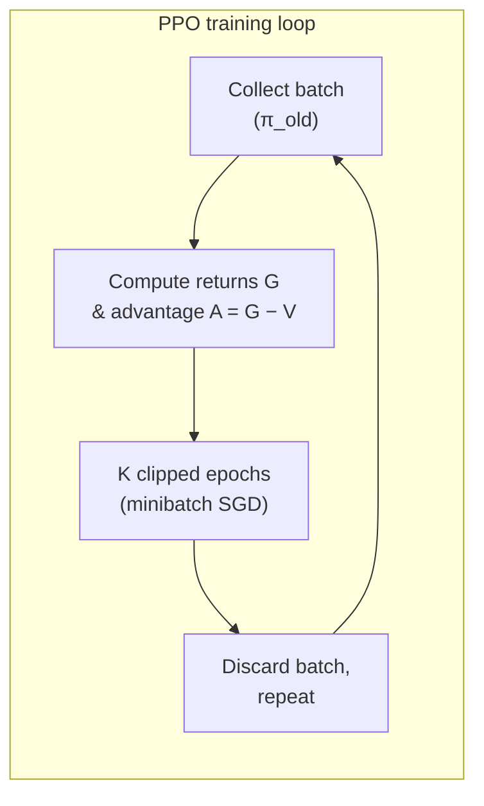
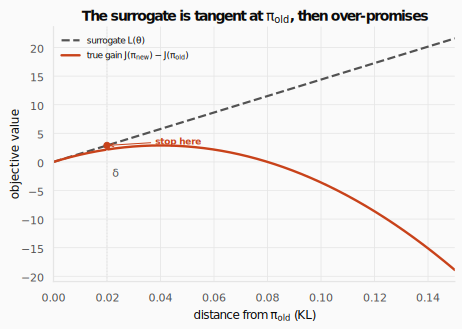
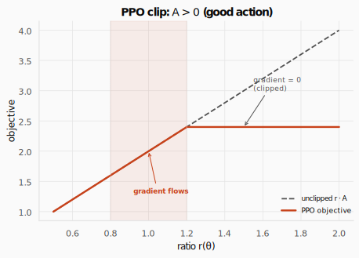
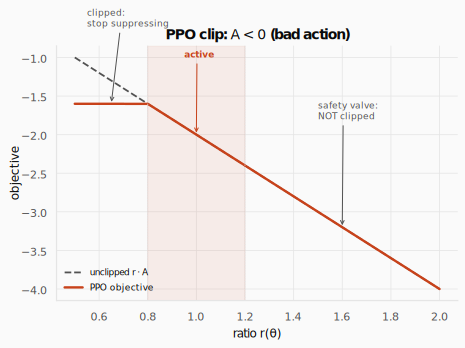
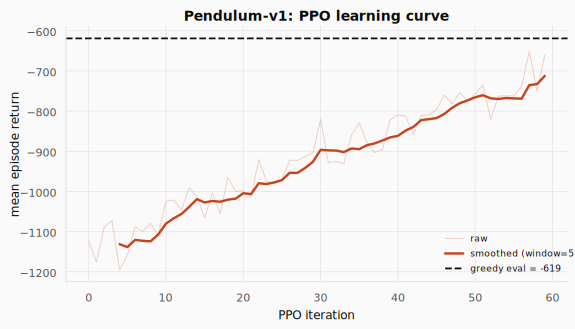
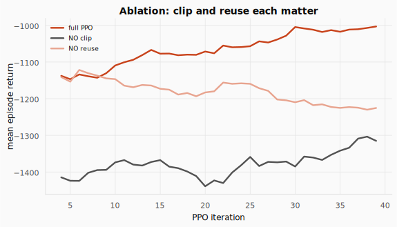

# TRPO and PPO: The Largest Safe Step a Policy Can Take


> **The throughline:** _The value of where I am is the reward I just got, plus a discounted value of where I'll land next._
> The [Policy Gradients](../05-policy-gradients/README.md) post derived the gradient $\nabla J = \mathbb{E}[A \cdot \nabla \log \pi]$ and built an Actor-Critic that climbs expected return. But nothing in that machinery controls _how far_ each step goes. This post is entirely about the step size: how to take the largest step that is still safe.

## 1. The intuition

The [Policy Gradients](../05-policy-gradients/README.md) post ended with a promise: the Actor-Critic gives a direction, but each update can take a step of any size. If the step is too large, the policy overshoots and collapses; if too small, learning crawls.

**In supervised learning, a bad step is cheap.** The training set is fixed. Overshoot on one batch and the next batch, drawn from the same data, pulls you back. Mistakes are reversible.

**In RL, a bad step can spiral.** The policy chooses its own future data. A reckless update wrecks the policy, the wrecked policy collects wrecked data, and the wrecked data makes the next update even worse. There may be no recovery. That feedback loop is the core danger, and it is why "just lower the learning rate" is not enough: a tiny step everywhere is safe but painfully slow, while the step we want is the _largest one that is still safe_.

The gradient $\nabla J$ is measured at the current policy. It promises improvement for a small step. Walk far along it and you leave the ground you measured, entering a fog where the estimate is just a guess.

Two questions organize the rest of this post:

- **Safety.** How far can the policy move on one batch before the update stops being trustworthy?
- **Thrift.** Can we squeeze more than one update out of a batch the current policy collected?

They are two sides of one coin: you can only _reuse_ a batch (thrift) for as long as the policy stays _close_ to the one that collected it (safety). That link is the whole design.



That loop is the whole PPO rhythm. Collect a batch with the current policy ($\pi_\text{old}$), score every step with its advantage $A = G - V$, then squeeze $K$ clipped epochs of learning out of that one batch before discarding it and collecting again. The two questions above map straight onto it: thrift is why we run $K$ epochs instead of one, and safety is what keeps those reused epochs from drifting too far from the policy that collected the data.

TRPO and PPO answer the same question with two temperaments. **TRPO builds a fence** (a hard KL constraint) and works hard to respect it. **PPO swaps the fence for a tether** woven into the objective: wander past the safe band and the payoff just goes flat. Same destination, different enforcement. Almost everyone took the PPO road.

**The equation that ties it all together is unchanged from the last post:**

$$\nabla_\theta J = \mathbb{E}\big[A \cdot \nabla_\theta \log \pi_\theta(a \mid s)\big]$$

REINFORCE and Actor-Critic learned to _estimate_ the advantage $A$. TRPO and PPO learn to _limit the step_. The objective is the same one we wrote in [Policy Gradients](../05-policy-gradients/README.md); we only wrap it in a safety mechanism.

<details>
<summary><strong>Check:</strong> "Just lower the learning rate" tames bad steps in supervised learning. Why is that a weak fix in RL, and what makes a bad RL step qualitatively worse than a bad supervised step?</summary>

**Answer.** In supervised learning the dataset is fixed, so a bad step is corrected by the next batch of the same data. In RL the policy collects its own data: a bad step changes what data you see next, and the worse data can cause an even worse step. A small learning rate makes _every_ step tiny (slow) and still provides no guarantee any given step is safe. We want the _largest_ step that is still safe, which is exactly what a trust region gives.

</details>

<details>
<summary><strong>Check:</strong> In one line, why does the gradient "expire" the moment you take a step?</summary>

**Answer.** Because the gradient is an expectation under the _current_ policy: it is only correct for the policy that generated the batch. Step, and the data came from a now-old policy, so the gradient estimate no longer points where you think.

</details>

<details>
<summary><strong>Check:</strong> DQN happily reused a replay buffer full of old transitions. Why can't vanilla policy gradients do the same?</summary>

**Answer.** DQN is off-policy: its target $r + \gamma \max Q(s')$ does not care which policy collected the transition. Policy gradients are on-policy: the gradient is an average over actions drawn from the current $\pi$, so old data is drawn from the wrong distribution and biases the estimate.

</details>

<details>
<summary><strong>Check:</strong> Why is "use a very small step" an unsatisfying answer to the safety question?</summary>

**Answer.** It throws away speed everywhere to be safe in the few places that are actually dangerous. We would rather take a big step where the data supports it and a small one only where it does not, adapting the step to how far we can still trust the estimate.

</details>

---

## 2. The math you need

### 2.1 The objective is unchanged; only the step is limited

Recall from [Policy Gradients](../05-policy-gradients/README.md):

$$\nabla_\theta J(\theta) = \mathbb{E}_{s,a}\big[A(s,a) \cdot \nabla_\theta \log \pi_\theta(a \mid s)\big]$$

where $A = G_t - V(s_t)$ is the advantage (the return minus the critic's baseline, introduced in the same post). TRPO and PPO do not change this equation. They change only **how far** along it we step.

### 2.2 Importance sampling: reusing old data

The Actor-Critic from [Policy Gradients](../05-policy-gradients/README.md) used each batch once and threw it away, because the gradient is an expectation under the _current_ policy. The instant we update, the batch was drawn from the old policy and is stale.

Can we _reweight_ the old batch instead of discarding it?

**Importance sampling** is one identity: if you want the average of $f(x)$ under distribution $p$ but can only sample from $q$, multiply each sample by $p(x)/q(x)$:

$$\mathbb{E}_{x \sim p}[f(x)] = \mathbb{E}_{x \sim q}\!\left[\frac{p(x)}{q(x)} \cdot f(x)\right]$$

Read it as: "draw from the distribution you _have_ ($q$), correct each sample by how much more or less the target distribution $p$ would have weighted it, and average." The ratio $w(x) = p(x)/q(x)$ is called the **importance weight**. Where $p$ puts more mass than $q$ ($w > 1$), the sample was under-represented, so scale it up; where $p$ puts less ($w < 1$), $q$ over-produced it, so scale it down.

**Applying it to RL.** We want the expected advantage under $\pi_\text{new}$, but our batch was collected by $\pi_\text{old}$. Substituting $p = \pi_\text{new}$ and $q = \pi_\text{old}$:

$$\mathbb{E}_{a \sim \pi_\text{new}}[A] = \mathbb{E}_{a \sim \pi_\text{old}}\!\left[\frac{\pi_\text{new}(a \mid s)}{\pi_\text{old}(a \mid s)} \cdot A\right] = \mathbb{E}_{a \sim \pi_\text{old}}[r \cdot A]$$

where $r = \pi_\text{new}(a \mid s) \;/\; \pi_\text{old}(a \mid s)$ is the **probability ratio**. It is the single most important symbol in this post.

- $r = 1$: the new policy assigns the same probability as the old.
- $r > 1$: the new policy favors this action _more_ than the old did.
- $r < 1$: the new policy favors it _less_.

**The catch: importance sampling only works while the policies stay close.** If $\pi_\text{new}$ drifts far from $\pi_\text{old}$, a handful of ratios explode (e.g. $r = 30$ when the old policy almost never took an action the new one loves), a few samples hog all the weight, and the estimate becomes noise. The reused data is trustworthy only in a neighborhood of $\pi_\text{old}$, which is precisely the trust region.

**A worked example: reweighting at one checkpoint.** Consider a single state with two actions, $a_1$ and $a_2$. We have already collected a batch under the old policy, so we know each action's advantage $A$ from that data. We now have a candidate new policy and want to ask: would it have scored better, without running it in the environment?

| action | $\pi_\text{old}$ | $\pi_\text{new}$ | $r = \pi_\text{new}/\pi_\text{old}$ | $A$ (from the batch) | $r \cdot A$ |
| ------ | ---------------- | ---------------- | ----------------------------------- | -------------------- | ----------- |
| $a_1$  | 0.5              | 0.8              | 1.6                                 | +2                   | **+3.2**    |
| $a_2$  | 0.5              | 0.2              | 0.4                                 | -1                   | **-0.4**    |

Two columns deserve a closer look, because they answer a natural question: if we already have $\pi_\text{new}$, why not just sample from it?

- **The advantages $A$ are given, not recomputed.** They were measured once, when the batch was collected under $\pi_\text{old}$. We reuse those same numbers; we do not run $\pi_\text{new}$ to get fresh advantages.
- **$\pi_\text{new}$ enters only through the ratio $r$.** We _evaluate_ the probability it assigns to each already-sampled action (a forward pass through the network), but we never _sample_ from it. Sampling would mean rolling $\pi_\text{new}$ out in the environment and collecting new data, which is exactly the expensive step importance sampling lets us skip.

Now score the new policy three ways:

- **Old policy's score**: $\mathbb{E}_{\pi_\text{old}}[A] = 0.5(+2) + 0.5(-1) = +0.5$. This measures $\pi_\text{old}$, the wrong question.
- **Reweighted score**: $\mathbb{E}_{\pi_\text{old}}[r \cdot A] = 0.5(3.2) + 0.5(-0.4) = +1.4$. This is $\pi_\text{new}$, scored from the old data.
- **Direct check**: $\mathbb{E}_{\pi_\text{new}}[A] = 0.8(+2) + 0.2(-1) = +1.4$. This is what we would get if we _could_ sample fresh from $\pi_\text{new}$.

The reweighted score matches the direct check exactly. Importance sampling recovered the new policy's expected advantage with no new data.

Now the failure mode. Suppose the old policy almost never took an action that the new policy strongly favors:

| action       | $\pi_\text{old}$ | $\pi_\text{new}$ | $r$    |
| ------------ | ---------------- | ---------------- | ------ |
| the rare one | 0.02             | 0.60             | **30** |
| common A     | 0.49             | 0.20             | 0.41   |
| common B     | 0.49             | 0.20             | 0.41   |

A 50-sample batch holds roughly one instance of the rare action, yet at weight 30 that single sample is about 60% of the whole estimate. One fluke sample decides everything. That is a guess, not data. **The reweighting is trustworthy only while the new policy stays close to the old one.**

<details>
<summary><strong>Check:</strong> In one sentence, what is the importance ratio r(theta) measuring?</summary>

**Answer.** How much more ($r > 1$) or less ($r < 1$) likely the new policy is to take the specific action we already sampled from the old policy, the factor that reweights old data for the new policy.

</details>

<details>
<summary><strong>Check:</strong> The ratio lets us reuse pi_old's data to score pi_new. So why can't we just keep optimizing against one batch forever and never collect data again?</summary>

**Answer.** Because the reweighting degrades as the policies separate. Importance sampling is exact in expectation, but its _variance_ grows fast as $\pi_\text{new}$ leaves $\pi_\text{old}$'s neighborhood: a few samples hog all the weight and the estimate becomes noise. A batch buys you a few safe steps near $\pi_\text{old}$, not infinite optimization. Once you have moved enough, you must collect fresh data.

</details>

<details>
<summary><strong>Check:</strong> Maximizing r * A with no limit on r: what goes wrong?</summary>

**Answer.** For a positive-advantage action the objective is maximized by sending $r$ as high as possible, and the reverse for negative advantage. On the sampled batch this looks great, but it moves the policy far from $\pi_\text{old}$, where the importance estimate is no longer valid, so the "improvement" is an illusion. We need to bound how far $r$ (or the policy) can move.

</details>

<details>
<summary><strong>Check:</strong> Why does importance sampling have low variance when the policies are close and high variance when they are far?</summary>

**Answer.** When $\pi_\text{new} \approx \pi_\text{old}$, every ratio $\approx 1$ and the reweighting barely changes anything: the estimate is as stable as the original samples. When they differ a lot, the ratios span from near 0 to very large, so the average is dominated by a few high-weight samples: small effective sample size, huge variance.

</details>

### 2.3 The surrogate objective

We now have both halves of the puzzle. The advantage $A$ from the last post says how good each action was, and the ratio $r$ from Section 2.2 reweights old data to score a new policy. Combine them over a whole batch and you get the single objective that TRPO and PPO actually optimize, the **surrogate objective**. It scores a candidate new policy using only the old policy's data:

$$L(\theta) = \mathbb{E}_{(s,a) \sim \pi_\text{old}}\big[r_t(\theta) \cdot A_t\big]$$

where $r_t(\theta) = \pi_\theta(a_t \mid s_t) \;/\; \pi_\text{old}(a_t \mid s_t)$ and $A_t = G_t - V(s_t)$.

Read it as: "for each transition in the batch, multiply its advantage by the ratio (how much more or less the new policy would have taken that action), then average." It rises when we put more weight ($r > 1$) on good actions ($A > 0$) and less weight ($r < 1$) on bad ones ($A < 0$).

**The surrogate makes exactly one approximation.** It reuses $\pi_\text{old}$'s _states_ to stand in for the states $\pi_\text{new}$ would visit. The action mismatch is corrected exactly by the ratio, but the state mismatch is not. For a small change of policy, the two state distributions roughly match and the approximation is accurate. For a big change, $\pi_\text{new}$ would visit entirely different states and the surrogate's verdict is a guess.



**At $\pi_\text{old}$ the surrogate $L = 0$ (no change yet), but its gradient equals the true policy gradient.** A small step uphill on $L$ is a real improvement. But $L$ keeps climbing forever while the true gain peaks and falls. Maximize $L$ blindly and you land on a number that was never real.

In code, the advantage is computed once per batch:

```python
import torch

returns = torch.tensor([5.0, 3.0, 8.0, 1.0, 6.0])
values = torch.tensor([4.5, 4.0, 5.5, 3.0, 5.0])

# A = G - V(s)
adv = returns - values
# standardize to mean 0, std 1
adv = (adv - adv.mean()) / (adv.std() + 1e-8)
print(f"Raw advantages:          {(returns - values).tolist()}")
print(f"Standardized advantages: {[f'{a:.3f}' for a in adv.tolist()]}")
```

```text title="Output"
Raw advantages:          [0.5, -1.0, 2.5, -2.0, 1.0]
Standardized advantages: ['0.171', '-0.684', '1.312', '-1.255', '0.456']
```

Why standardize? The advantage multiplies the gradient. In $\nabla_\theta L \approx \mathbb{E}\big[A \cdot \nabla_\theta \log \pi_\theta\big]$, each sample's $A$ acts like a per-sample step size. Raw advantages can be small in one batch and large in the next, because rewards vary and an untrained critic mis-estimates $V$, so the gradient magnitude (and with it the effective learning rate) would swing from update to update. Subtracting the mean and dividing by the standard deviation forces every batch onto the same scale, mean 0 and standard deviation 1. Only the relative ranking of the advantages decides the direction, so re-scaling them does not change which actions get encouraged; it just keeps the step size steady so one learning rate works across all batches. Subtracting the mean is also the baseline trick from the [Policy Gradients](../05-policy-gradients/README.md) post: it lowers variance without adding bias.

<details>
<summary><strong>Check:</strong> The surrogate L(theta) = E[r * A] makes exactly one approximation. Which one, and when is it valid?</summary>

**Answer.** It reuses the states visited by $\pi_\text{old}$ to stand in for the states $\pi_\text{new}$ would visit. The action mismatch is corrected exactly by the ratio, but the state mismatch is not. The approximation is valid only while $\pi_\text{new}$ stays close to $\pi_\text{old}$ (it visits roughly the same states).

</details>

<details>
<summary><strong>Check:</strong> At pi_new = pi_old, L = 0 yet it is still useful. Why?</summary>

**Answer.** Because its _gradient_ at that point equals the true policy gradient. $L = 0$ just sets the reference (no change yet); the slope is what we follow, and a small step uphill on $L$ is a genuine improvement in $J$.

</details>

<details>
<summary><strong>Check:</strong> Why must "maximize L" be paired with "stay close to pi_old"? What does each half contribute?</summary>

**Answer.** $L$ supplies the _direction and size_ of improvement; "stay close" keeps us in the region where $L$ is actually a faithful stand-in for the true objective. Without the leash, $L$ over-promises and we step into the fog; without $L$, we have no improvement signal. Both halves are needed.

</details>

### 2.4 TRPO: the KL fence

Trust Region Policy Optimization (Schulman et al., 2015) enforces "stay close" with a hard constraint. We need a ruler for how different two policies are, one that looks at the _whole_ distribution at each state, not just the one action we sampled. That ruler is **KL divergence**:

$$D_\text{KL}(\pi_\text{old} \;\|\; \pi_\theta) = \sum_a \pi_\text{old}(a \mid s) \log \frac{\pi_\text{old}(a \mid s)}{\pi_\theta(a \mid s)}$$

It is 0 when the two policies are identical and grows as they disagree. The ratio $r$ only sees the sampled action; KL watches the entire distribution. A policy could keep one action's ratio near 1 while violently rearranging the probabilities of all the other actions, a huge real change the ratio would never notice. KL catches it.

The TRPO update is:

$$\max_\theta \; \mathbb{E}\big[r_t(\theta) \, A_t\big] \quad \text{subject to} \quad \mathbb{E}\big[D_\text{KL}(\pi_\text{old} \;\|\; \pi_\theta)\big] \le \delta$$

Read it as: "maximize the surrogate (make advantageous actions more likely), but keep the average KL between old and new policy below a small budget $\delta$ (e.g. 0.01)." Two jobs, cleanly separated: $r \cdot A$ chooses the _direction and magnitude_ of improvement; $\text{KL} \le \delta$ caps _how far_ the policy may actually move.

**TRPO solved the step-size crisis.** Before it, deep policy gradients were brittle. TRPO gave a principled "how far is safe," with a near-monotonic-improvement argument, and made large neural policies practical on hard continuous-control tasks.

**The catch.** "Maximize $L$ subject to $\text{KL} \le \delta$" is a constrained, nonlinear optimization over millions of network weights, re-solved every single update. TRPO pulls this off with second-order optimization: the natural gradient (rescaling by the Fisher information matrix), conjugate gradient (solving the linear system iteratively), and a line search (backtracking until the KL truly satisfies $\le \delta$). It works, but it is heavy, fiddly to implement, awkward with a shared actor-critic network, and squeezes out only about one update per batch.

**The wish that led to PPO:** keep TRPO's "stay close" safety with the simplicity of plain SGD. First-order, a few lines of code, many cheap steps per batch.

<details>
<summary><strong>Check:</strong> We already had the ratio r(theta), which also measures a kind of policy change. Why does TRPO introduce KL for the constraint instead of just bounding the ratio?</summary>

**Answer.** Because the ratio only sees the sampled action; KL sees the whole policy. $r(\theta)$ is computed for the single action we drew. A policy could keep that action's ratio near 1 while violently rearranging the probabilities of all the other actions at that state, a huge real change the ratio would never notice. KL averages over the entire distribution at each state, so it captures the true size of the policy shift.

</details>

<details>
<summary><strong>Check:</strong> State the TRPO update in words: what is maximized, and what is constrained?</summary>

**Answer.** Maximize the surrogate $\mathbb{E}[r \cdot A]$ (make advantageous actions more likely) subject to the average KL between the old and new policy staying below $\delta$ (don't move the policy too far). Improvement under a leash.

</details>

<details>
<summary><strong>Check:</strong> TRPO poses a clean problem yet is rarely the default today. What practical drawback motivated PPO?</summary>

**Answer.** Solving "maximize $L$ subject to $\text{KL} \le \delta$" exactly needs heavy second-order optimization, re-run every update: complex to implement, awkward with a shared actor-critic network, and it reuses each batch poorly (about one step). PPO keeps the "stay close" safety but with simple first-order SGD and many cheap updates per batch.

</details>

<details>
<summary><strong>Check:</strong> Two roles, two tools: what does the ratio do, and what does the KL constraint do?</summary>

**Answer.** The ratio reweights old data to _estimate_ how much a candidate new policy would improve (direction and size). The KL constraint _limits_ how far the new policy may move from the old. Estimate vs. restrain: different jobs, working together.

</details>

### 2.5 PPO: the clip

Proximal Policy Optimization (Schulman et al., 2017) asks: what if the objective _itself_ refused to reward big steps? Then there is no constraint to solve. The trick is a clip on the ratio.

$$L^\text{CLIP}(\theta) = \mathbb{E}_t\!\left[\min\!\left(r_t \, A_t, \;\; \text{clip}(r_t, 1-\varepsilon, 1+\varepsilon) \, A_t\right)\right]$$

where $\varepsilon \approx 0.2$. Two ingredients do the work:

- **The clip** pins the ratio inside the band $[1-\varepsilon, 1+\varepsilon]$. Anything above $1+\varepsilon$ becomes $1+\varepsilon$, anything below $1-\varepsilon$ becomes $1-\varepsilon$. Beyond the band the objective goes flat: **zero gradient**.
- **The min** takes the more pessimistic (smaller) of the clipped and unclipped terms. PPO optimizes a **lower bound** on the unclipped surrogate, so a big ratio can never inflate the objective.

**When $A > 0$ (good action):** we want the action more likely, so we want $r > 1$. The objective rises with $r$ until $r = 1 + \varepsilon$, where the clip caps it and the curve goes flat. Zero gradient: once you have made the action 20% more likely, PPO gives you nothing for pushing further. The trust region, enforced by the objective's own shape.



The orange curve traces the PPO objective as the ratio grows. It climbs with the dashed unclipped line while $r$ stays inside the shaded band $[1-\varepsilon, 1+\varepsilon]$, then flattens the instant $r$ crosses $1+\varepsilon$. That flat stretch is the zero-gradient zone: the action has been made as much more likely as one batch is allowed to allow, so optimization stops pushing it. The clip, not a separate constraint, is what draws the line.

**When $A < 0$ (bad action):** we want the action _less_ likely, so we push $r$ below 1. Since $A$ is negative, the objective $r \cdot A$ is negative everywhere; "improving" it means making it less negative. Three regions:

1. **$r < 1 - \varepsilon$ (flat).** Already cut about 20%. No further reward for suppressing it more. Gradient 0. We do not zero out an action on one noisy batch.
2. **$1 - \varepsilon \le r \le 1$ (active).** The gradient pushes $r$ down toward $1-\varepsilon$, making the bad action less likely.
3. **$r > 1 + \varepsilon$ (NOT clipped, the safety valve).** If a bad action somehow grew _more_ likely, the objective keeps dropping, so the gradient keeps pulling it back. A bad action that slipped through is always corrected, never stranded.



Read the curve left to right. Below $1-\varepsilon$ the objective is flat: we stop suppressing a bad action we have already cut enough. Through the band it slopes, so the gradient pushes $r$ down and the action becomes less likely. Above $1+\varepsilon$ it keeps falling alongside the unclipped line instead of flattening. That last branch, the one the clip deliberately leaves open, is the safety valve: an action that wrongly grew more likely is always pulled back.

**The asymmetry in one line:** for a bad action the clip caps how hard you _suppress_ it (a floor at $1-\varepsilon$), but never caps how hard you _undo_ an accidental increase (no ceiling). Pessimism, by design.

Here is the core of the PPO update:

```python
import torch

ratio = torch.tensor([0.95, 1.10, 1.50, 0.60])
advantage = torch.tensor([2.0, 2.0, -2.0, -2.0])
eps = 0.2

# L^CLIP = min(r·A, clip(r, 1-ε, 1+ε)·A)
# r·A: the unbounded surrogate
unclipped = ratio * advantage
# clip(r)·A: the bounded surrogate
clipped = torch.clamp(ratio, 1 - eps, 1 + eps) * advantage
# the pessimistic (smaller) of the two
objective = torch.min(unclipped, clipped)

for i in range(len(ratio)):
    print(f"  r={ratio[i]:.2f}  A={advantage[i]:+.1f}  "
          f"uncl={unclipped[i]:+.2f}  clip={clipped[i]:+.2f}  "
          f"obj={objective[i]:+.2f}")
```

```text title="Output"
  r=0.95  A=+2.0  uncl=+1.90  clip=+1.90  obj=+1.90
  r=1.10  A=+2.0  uncl=+2.20  clip=+2.20  obj=+2.20
  r=1.50  A=-2.0  uncl=-3.00  clip=-2.40  obj=-3.00
  r=0.60  A=-2.0  uncl=-1.20  clip=-1.60  obj=-1.60
```

- $r=0.95$ inside the band, both terms agree, gradient flows.
- $r=1.10$ inside the band, same story.
- $r=1.50$ with $A < 0$ (safety valve): the unclipped term $-3.0$ is more negative, so `min` picks it, the gradient keeps pulling the bad action back.
- $r=0.60 < 0.8$ with $A < 0$ (already cut enough): the clipped term $-1.6$ is more negative, so `min` picks it, the value is fixed, gradient 0. The clip stops us from over-suppressing.
<details>
<summary><strong>Check:</strong> For a good action (A > 0), once the ratio passes 1 + epsilon the gradient is zero. Doesn't that mean PPO just ignores very good actions and stops learning from them?</summary>

**Answer.** No, it defers them, it does not ignore them. Within _this_ batch, PPO caps how far it will push one action: it moves the ratio to $1+\varepsilon$ and stops, refusing to overcommit on stale data. But then we collect a fresh batch with the improved policy, $\pi_\text{old}$ resets to the current policy (so the ratio resets to 1), and if the action is still good, PPO pushes it another $1+\varepsilon$. Great actions get amplified over many safe steps instead of one reckless one. The clip limits the step, not the destination.

</details>

<details>
<summary><strong>Check:</strong> In one sentence each: what does the clip do, and what does the min do?</summary>

**Answer.** The clip pins the ratio into $[1-\varepsilon, 1+\varepsilon]$ so the objective flattens outside the band. The min takes the pessimistic (smaller) of the clipped and unclipped terms, so PPO optimizes a lower bound and never gets fooled by a large ratio inflating the objective.

</details>

<details>
<summary><strong>Check:</strong> For A > 0 the objective flattens above r = 1 + epsilon; for A < 0 it does not flatten for large r. Why the asymmetry?</summary>

**Answer.** For a good action we only want to increase its probability a bounded amount, so we cap the upside. For a bad action that has become much more likely (large $r$), we must keep pulling it back down: clipping there would strand a mistake. The min leaves that branch un-clipped as a safety valve.

</details>

<details>
<summary><strong>Check:</strong> How does clipping give "a trust region for free" compared with TRPO?</summary>

**Answer.** TRPO enforces closeness with an explicit KL constraint solved by second-order optimization. PPO reshapes the objective so that going far earns nothing (zero gradient outside the band), so ordinary first-order SGD simply never wanders far. Same goal, no constraint solver, a few lines of code.

</details>

<details>
<summary><strong>Check:</strong> Clipping the ratio is a cruder proxy than bounding KL. Name one thing it misses, and why PPO is fine anyway.</summary>

**Answer.** The ratio only sees the sampled action, so per-step it does not bound the full-distribution KL the way TRPO does. PPO is fine in practice because it takes many small clipped steps and re-collects data often, so the policy still stays close on average: empirically as stable as TRPO, far simpler.

</details>

### 2.6 The full PPO objective and training loop

A working PPO is a full actor-critic system. Three terms, three jobs:

$$L = \mathbb{E}\!\left[L^\text{CLIP} - c_1 \big(V_\theta(s) - G_t\big)^2 + c_2 \, H[\pi_\theta]\right]$$

Read it as: the loss $L$ averages three pieces over the batch. The first, $L^\text{CLIP}$, is the clipped actor objective from Section 2.5. The second, $\big(V_\theta(s) - G_t\big)^2$, is the critic's squared prediction error, scaled by $c_1$ and subtracted because we want it small. The third, $H[\pi_\theta]$, is the policy's entropy, scaled by $c_2$ and added because we want to keep a little randomness. In plain terms: improve the actor, sharpen the critic, and stay exploratory, all in one update.

- **Clip (actor).** Improve the policy safely. The star of Section 2.5.
- **Value loss (critic).** Improving the actor needs the advantage $A = G - V(s)$, and that needs a critic, so the critic has to be trained too. We fold its training into the same objective: pull $V(s)$ toward the observed return $G_t$ by mean-squared error, so next iteration's advantage is sharper. The weight $c_1$ sets how much critic training counts against actor improvement, and the actor and critic often even share a network body, which is the other reason to write a single combined objective.
- **Entropy bonus.** Reward a bit of randomness ($H[\pi]$ is the entropy of the policy) so the policy does not collapse to one action too early.

**Why is the critic loss subtracted?** $L$ is a quantity we _maximize_ (gradient ascent), but the value error $\big(V_\theta(s) - G_t\big)^2$ is a quantity we want _small_. Maximizing the negative of an error is the same as minimizing the error, so we put a minus sign in front of it: pushing $L$ up pushes the critic's mistakes down. The entropy term carries a plus sign for the mirror-image reason, more entropy is desirable, so maximizing $L$ should reward it. The coefficients $c_1$ and $c_2$ just balance the three pulls. (In the code below we keep it simple and take a separate gradient step for the actor and the critic, which is equivalent to this one combined objective, and we leave out the optional entropy bonus.)

Because the clip keeps each step safe, we can reuse the same batch for **K epochs** (typically 3-10). Each epoch shuffles the batch into minibatches and takes clipped SGD steps. As the policy drifts during the epochs, the ratios for some samples leave $[1-\varepsilon, 1+\varepsilon]$; those samples' gradients go to zero and they quietly stop driving the update. The frozen `logp_old` (recorded at collection time) is the denominator of the ratio: because it never moves, the ratio measures true drift from the data-collecting policy.

For continuous actions (Pendulum torque, LunarLander thrusters), the policy outputs a Gaussian:

```python
import torch
import torch.nn as nn

# π(a|s) = N(μ_θ(s), σ): a Gaussian whose mean depends on the state,
# whose std is a free parameter (learned, not state-dependent).
class GaussianPolicy(nn.Module):
    def __init__(self, obs_dim, act_dim, h=64):
        super().__init__()
        self.body = nn.Sequential(
            nn.Linear(obs_dim, h), nn.Tanh(),
            nn.Linear(h, h), nn.Tanh(),
        )
        # μ_θ(s): center of the Gaussian
        self.mean = nn.Linear(h, act_dim)
        # log σ (learned), stored as a log so σ stays positive after exp()
        self.log_std = nn.Parameter(torch.zeros(act_dim) - 0.5)

    def dist(self, obs):
        # state-dependent mean
        m = self.mean(self.body(obs))
        # N(μ, σ)
        return torch.distributions.Normal(m, self.log_std.exp())

torch.manual_seed(0)
obs_dim, act_dim = 3, 1
pol = GaussianPolicy(obs_dim, act_dim)
obs = torch.randn(1, obs_dim)
# the action distribution for this state
d = pol.dist(obs)
# sample one continuous action
a = d.sample()
print(f"mu = {d.loc.item():.3f}, sigma = {d.scale.item():.3f}, "
      f"sampled a = {a.item():.3f}, log_prob = {d.log_prob(a).sum().item():.3f}")
```

```text title="Output"
mu = -0.060, sigma = 0.607, sampled a = -0.231, log_prob = -0.459
```

The mean $\mu(s)$ is state-dependent (from the network); the standard deviation $\sigma$ is a learned parameter (not state-dependent). Sampling from this Gaussian gives a continuous action, and `log_prob(a)` gives the log-density, the score needed for the ratio.

The rest of the program builds on this actor. We need a critic to estimate $V(s)$, a way to turn rewards into returns, a rollout to fill a batch, and the clipped update itself. First, a few hyperparameters for `Pendulum-v1`:

```python
# γ, clip ε, K epochs, batch size, minibatch size, learning rate
GAMMA, CLIP_EPS, EPOCHS, MIN_STEPS, MB_SIZE, LR = 0.95, 0.2, 10, 2048, 64, 3e-4
```

The **critic** is a small network trained to predict the return from each state:

```python
import torch.nn as nn

# V_θ(s): maps an observation to a scalar value estimate.
# Trained by MSE against the discounted return: loss = (V(s) − G_t)².
class Value(nn.Module):
    def __init__(self, obs_dim, h=64):
        super().__init__()
        self.net = nn.Sequential(nn.Linear(obs_dim, h), nn.Tanh(),
                                 nn.Linear(h, h), nn.Tanh(), nn.Linear(h, 1))

    def forward(self, x):
        # squeeze the trailing dim so V(s) is one scalar per state
        return self.net(x).squeeze(-1)
```

**Returns** accumulate future rewards backward through each episode:

```python
# G_t = r_t + γ r_{t+1} + γ² r_{t+2} + ...
# walk the rewards backward so each G picks up the rewards that follow it
def discounted_returns(rewards, gamma):
    G, out = 0.0, []
    for r in reversed(rewards):
        # G_t = r_t + γ · G_{t+1}
        G = r + gamma * G
        out.append(G)
    return list(reversed(out))
```

**Collect** rolls out the current policy (which is $\pi_\text{old}$ for the upcoming update) and records everything the update needs, including the frozen log-probs that become the ratio's denominator:

```python
import numpy as np

# roll out π_old until the batch holds at least min_steps transitions.
# record (s, a, log π_old(a|s), G_t) for every step.
def collect(env, policy, gamma, min_steps=MIN_STEPS):
    S, A, LOGP, RET, ep_rets = [], [], [], [], []
    lo, hi = env.action_space.low, env.action_space.high
    steps = 0
    while steps < min_steps:
        s, _ = env.reset()
        ep_s, ep_a, ep_lp, ep_r = [], [], [], []
        done = False
        while not done:
            with torch.no_grad():
                dist = policy.dist(torch.as_tensor(s, dtype=torch.float32))
                # a ~ π_old(·|s)
                a = dist.sample()
                # log π_old(a|s)
                lp = dist.log_prob(a).sum(-1)
            # respect the environment's action bounds
            a_np = np.clip(a.numpy(), lo, hi)
            s2, r, term, trunc, _ = env.step(a_np)
            ep_s.append(s); ep_a.append(a.numpy())
            ep_lp.append(float(lp)); ep_r.append(r)
            s = s2; done = term or trunc; steps += 1
        S += ep_s; A += ep_a; LOGP += ep_lp
        # G_t for each step of this episode
        RET += discounted_returns(ep_r, gamma)
        ep_rets.append(sum(ep_r))
    return (np.array(S, np.float32), np.array(A, np.float32),
            np.array(LOGP, np.float32), np.array(RET, np.float32),
            float(np.mean(ep_rets)))
```

The **update** is the heart of PPO: compute the advantage once, then sweep the batch for $K$ epochs of clipped minibatch SGD.

```python
# K epochs of clipped SGD on the collected batch. The advantage is
# computed once and frozen; the batch is then shuffled into minibatches
# and swept K times. As the policy drifts, ratios leave [1−ε, 1+ε] and
# their gradients vanish on their own.
def ppo_update(policy, value, popt, vopt, batch):
    S, A, LOGP_old, RET, _ = batch
    S = torch.as_tensor(S); A = torch.as_tensor(A)
    LOGP_old = torch.as_tensor(LOGP_old); RET = torch.as_tensor(RET)
    with torch.no_grad():
        # A = G_t − V(s_t)
        adv = RET - value(S)
    # standardize to mean 0, std 1
    adv = (adv - adv.mean()) / (adv.std() + 1e-8)
    n = S.shape[0]
    # K-epoch reuse
    for _ in range(EPOCHS):
        # random minibatches
        for idx in torch.randperm(n).split(MB_SIZE):
            dist = policy.dist(S[idx])
            # log π_θ(a|s) under the current policy
            logp = dist.log_prob(A[idx]).sum(-1)
            # r = π_new / π_old
            ratio = (logp - LOGP_old[idx]).exp()
            # r · A
            unclipped = ratio * adv[idx]
            # clip(r) · A
            clipped = torch.clamp(ratio, 1 - CLIP_EPS,
                                  1 + CLIP_EPS) * adv[idx]
            # −L^CLIP: minimize the negative to maximize the objective
            actor_loss = -torch.min(unclipped, clipped).mean()
            popt.zero_grad(); actor_loss.backward(); popt.step()
            # critic MSE: (V(s) − G)²
            v_loss = (value(S[idx]) - RET[idx]).pow(2).mean()
            vopt.zero_grad(); v_loss.backward(); vopt.step()
```

The **training loop** ties it together: collect with $\pi_\text{old}$, run the clipped update, repeat. We seed everything (including the environment) so the run is reproducible.

```python
import gymnasium as gym

# seed everything so the captured output below is reproducible
torch.manual_seed(0); np.random.seed(0)

env = gym.make("Pendulum-v1")
# seed the env RNG once; the first reset seeds the whole run
env.reset(seed=0); env.action_space.seed(0)
pol = GaussianPolicy(env.observation_space.shape[0], env.action_space.shape[0])
val = Value(env.observation_space.shape[0])
popt = torch.optim.Adam(pol.parameters(), LR)
vopt = torch.optim.Adam(val.parameters(), LR)

curve = []
for it in range(60):
    # roll out π_old, recording (s, a, logp, G)
    batch = collect(env, pol, GAMMA)
    # K clipped epochs on this one batch
    ppo_update(pol, val, popt, vopt, batch)
    curve.append(batch[-1])
    if (it + 1) % 20 == 0:
        print(f"  iter {it+1:3d}  mean episode return {batch[-1]:.1f}")
```

Finally, a **greedy evaluation** takes the Gaussian mean with no sampling noise, to measure the learned policy without exploration:

```python
# greedy action = μ(s): the Gaussian mean, no sampling noise
def greedy_eval(env_id, policy, n=10, seed=123):
    env = gym.make(env_id)
    lo, hi = env.action_space.low, env.action_space.high
    total = 0.0
    for i in range(n):
        s, _ = env.reset(seed=seed + i)
        done = False
        while not done:
            with torch.no_grad():
                # μ(s): the mean of the Gaussian
                a = policy.dist(torch.as_tensor(s, dtype=torch.float32)).loc
            s, r, term, trunc, _ = env.step(np.clip(a.numpy(), lo, hi))
            total += r; done = term or trunc
    env.close()
    return total / n

g = greedy_eval("Pendulum-v1", pol)
env.close()
print(f"\nPendulum PPO:  start {np.mean(curve[:3]):.1f}  "
      f"end {np.mean(curve[-3:]):.1f}  greedy {g:.1f}")
```

```text title="Output"
  iter  20  mean episode return -1038.2
  iter  40  mean episode return -919.3
  iter  60  mean episode return -672.0

Pendulum PPO:  start -1137.3  end -703.8  greedy -619.0
```

The policy steadily reduces its penalties. The per-batch mean return climbs from about $-1137$ (the arm hanging down, accruing large penalties) to about $-704$ by the end, and the iteration-60 batch reaches $-672$. Greedy evaluation, taking the Gaussian mean with no exploration noise, scores $-619$: the policy has learned to swing the pendulum up and hold it near vertical. Every piece above is doing its job: the Gaussian policy, the discounted returns, the standardized advantage, and the clipped surrogate with $K$-epoch reuse.

<details>
<summary><strong>Check:</strong> Vanilla policy gradients use a batch once; PPO sweeps it for K epochs. What makes the reuse safe?</summary>

**Answer.** The clip. As the policy drifts during the epochs, each action's ratio leaves $[1-\varepsilon, 1+\varepsilon]$ and its contribution flattens (zero gradient), so reused, increasingly-stale samples automatically stop driving the update before they can do harm.

</details>

<details>
<summary><strong>Check:</strong> What does each of the three loss terms do, and what would break if you dropped the entropy bonus?</summary>

**Answer.** Clip term improves the policy; value term trains the critic so advantages are accurate; entropy term keeps the policy stochastic. Drop entropy and the policy can collapse to a near-deterministic choice too early, stop exploring, and get stuck in mediocre behavior.

</details>

<details>
<summary><strong>Check:</strong> The actor never uses the critic's V(s) directly, only the advantage A = G - V. So why train a critic at all?</summary>

**Answer.** The critic turns the noisy raw return $G$ into a centered, low-variance signal: $A = G - V$ says "better or worse than typical from _this_ state." A good $V$ makes the advantage clean, so the clipped updates point the right way; drop the critic and you are back to high-variance REINFORCE.

</details>

<details>
<summary><strong>Check:</strong> Why is logp_old detached / frozen when forming the ratio?</summary>

**Answer.** It is the fixed reference policy that collected the batch, the thing we are staying proximal to. If it moved with $\theta$, the ratio would always be about 1 and the clip would never engage; freezing it makes $r$ measure true drift from the data-collecting policy.

</details>

### 2.7 Does it work? The Pendulum curve and an ablation

This section uses two plots, and they answer two different questions. The first asks **does PPO learn at all?** It dissects a single run. The second asks **why does it learn, which ingredient does the work?** It overlays three separate runs. Same axes on both (PPO iteration on x, mean episode return on y), so you can read them side by side, but they are doing different jobs: one is a _within-run_ learning curve, the other is a _between-run_ controlled comparison.

**Graph 1: the learning curve (one run, dissected).** We ran the loop above for 60 iterations on `Pendulum-v1` ($\gamma = 0.95$, 2048 steps per batch, $K = 10$ epochs, $\varepsilon = 0.2$):



This single run is drawn as three lines so you can separate signal from noise:

- **Faint line, raw per-batch return.** Noisy because every batch is a fresh set of episodes, each starting from a random pendulum angle and acting under a _stochastic_ policy. The jitter is sampling noise, not the policy getting worse.
- **Bold line, 5-iteration moving average.** Smooths that sampling noise so the trend is visible. It climbs from about $-1137$ to about $-704$: the pendulum goes from hanging down to swinging up and holding near vertical.
- **Dashed line, greedy evaluation at $-619$.** A separate evaluation where the policy acts at its mean $\mu$ with no exploration noise.

The deeper point is the gap between the bold line ($-704$) and the dashed line ($-619$). The training return is _pessimistic_: while learning, the policy keeps injecting Gaussian exploration noise (the learned $\sigma$ from `log_std`), and that noise costs return on every step. Greedy evaluation removes the noise (act at $\mu$, never sample), so it scores higher. That gap is, roughly, the return the policy is still "spending" on exploration. As $\sigma$ shrinks over training the two lines would converge. So graph 1 is really showing two things at once: the policy is improving (the climb) and it is still exploring (the gap).

**Graph 2: the ablation (three runs, compared).** Now we ask which part causes that climb. Turn one ingredient off at a time and rerun from scratch for 40 iterations each:

| Variant          | Start | End      | Notes                                 |
| ---------------- | ----- | -------- | ------------------------------------- |
| **full PPO**     | -1137 | **-996** | best: clip + reuse                    |
| NO reuse ($K=1$) | -1144 | -1238    | each batch used once, slower learning |
| NO clip          | -1404 | -1301    | worst, most unstable                  |



How this graph differs from the first, concretely:

- It overlays **three runs** instead of dissecting one. Each line is a _different algorithm_, not a different view of the same data.
- Only the **smoothed** curve is shown for each (no faint raw lines), because three raw curves would overlap into a mush. Smoothing is what makes the separation legible.
- All three are truncated to **40 iterations** so every variant gets the same compute budget, which is what makes the comparison fair. The orange "full PPO" line here is literally the first 40 iterations of the run in graph 1, so the two plots share a curve: graph 2's orange is a prefix of graph 1's bold line.

Read the _shape_, not just the endpoints. **Removing the clip hurt the most.** Without it, the surrogate $r \cdot A$ is unbounded: a large advantage lets the ratio grow without limit in a single step, shoving the policy far from where the batch was collected. So that curve is both the lowest _and_ the most jagged, lurching up and down batch to batch as good updates get undone by destructive ones. The visible variance is the instability, not just bad luck.

**Removing reuse was costly too**, but in a different way. Its curve is comparatively smooth (no destructive jumps) yet flat, drifting sideways. With $K=1$ each batch feeds a single gradient step instead of 10, so you extract about a tenth of the learning per batch while paying the full collection cost. The failure mode is slowness, not instability.

**Together:** clip matters most (it keeps each update safe, killing the jaggedness), reuse matters second (it extracts more learning per batch, killing the flatness). Full PPO is a trust region via clipping plus sample efficiency via reuse, and it is the only curve that steadily climbs.

One honest caveat: each variant here is a single seed, so treat the gaps as illustrative rather than statistically airtight. The separations are large relative to the within-run wobble, which is why the story is believable, but a rigorous claim would average several seeds per variant and show the spread.

<details>
<summary><strong>Check:</strong> Turning the clip off makes the training curve the worst. Why specifically does an unbounded surrogate collapse?</summary>

**Answer.** Without the clip, if the advantage $A$ happens to be large for some transition, the ratio $r = \pi_\text{new}/\pi_\text{old}$ can grow without limit in a single gradient step, shoving the policy far from where the batch was collected. That one over-large update can land the policy in a bad region it never recovers from. Nothing in the unclipped surrogate prevents this.

</details>

<details>
<summary><strong>Check:</strong> With use_reuse=False (K=1) each batch is used once. How does learning speed per iteration change, and why is it safe to reuse a batch K times in full PPO but riskier without the clip?</summary>

**Answer.** Learning per iteration is much slower: each batch feeds one gradient step instead of 10. In full PPO it is safe to reuse because the clip bounds how far each epoch can push the policy: once $r$ hits the $[1-\varepsilon, 1+\varepsilon]$ boundary, the gradient is zero and no further movement happens. Without the clip there is no such brake; reusing the batch with an unbounded surrogate compounds the over-large-ratio problem.

</details>

<details>
<summary><strong>Check:</strong> If we train the critic on the return G, why isn't the advantage A = G - V always zero?</summary>

**Answer.** The critic is trained toward the _average_ return, while $G$ is a single noisy draw. Under squared-error loss, $V(s)$ settles on $\mathbb{E}[G \mid s]$, the mean return from $s$. Each individual $G$ deviates from that mean, so $A = G - V(s)$ is a real, nonzero signal: "how much better than typical this run was." The training _succeeds_ when $V$ equals the average, not when $V$ equals every $G$, which is impossible.

</details>

### 2.8 Where you have already used it: RLHF

PPO is the algorithm that aligned ChatGPT. The only thing that moves is the dictionary:

| RL         | LLM / RLHF                                           |
| ---------- | ---------------------------------------------------- |
| state      | prompt + tokens generated so far                     |
| action     | next token                                           |
| policy     | language model $\pi_\theta$                          |
| trajectory | full generated answer                                |
| reward     | reward-model score $-$ KL penalty to reference model |

A reward model (trained on human preferences) scores each response. PPO updates the LM to earn higher reward, making good answers more likely, exactly the clip objective.

**RLHF has two KL leashes, doing two different jobs:**

- **KL #1 (inside PPO).** The clip (a stand-in for KL between $\pi_\text{old}$ and $\pi_\theta$) keeps each _optimization step_ stable. It resets every batch. This is the trust region from this post.
- **KL #2 (inside the reward).** A penalty for drifting from the frozen _reference_ model (the pretrained/SFT checkpoint), baked into the reward signal. It keeps the _final_ model near the pretrained one across the whole run. An alignment constraint, not an optimization one.

Same mathematical tool, two roles: one stabilizes the _update_, the other anchors the _destination_.

**GRPO** (the algorithm behind DeepSeek's reasoning models) keeps PPO's clipped objective but drops the critic entirely. For each prompt it samples a group of answers and uses their average reward as the baseline. The advantage is simply "how much better than its siblings." We will return to it in a later post.

<details>
<summary><strong>Check:</strong> In RLHF, what plays the role of state, action, policy, and reward?</summary>

**Answer.** State = the prompt plus the tokens generated so far; action = the next token; policy = the language model $\pi_\theta$; reward = a learned reward model's score of the full response (minus a KL-to-reference penalty). Generating an answer is one trajectory.

</details>

<details>
<summary><strong>Check:</strong> RLHF involves two KL terms. Describe each and why both exist.</summary>

**Answer.** KL #1 is PPO's own old-vs-new policy closeness (the clip), which stabilizes each optimization step and resets each batch. KL #2 is a penalty in the reward for drifting from the frozen reference (pretrained/SFT) model, which keeps the final aligned model from straying too far and reward-hacking. One restrains the step; the other anchors the destination.

</details>

<details>
<summary><strong>Check:</strong> GRPO keeps PPO's clip but drops the critic. What does it use for the advantage instead, and why is that attractive for LLMs?</summary>

**Answer.** It samples a group of responses per prompt and uses the group's mean reward as the baseline, so advantage = how much better a response is than its siblings. This avoids training a separate value network (expensive and unstable for LLMs) and fits tasks where reward arrives once at the end.

</details>

---

## 3. Putting it all together

Every piece of PPO has now appeared inline next to the idea it implements. Here is the whole algorithm at a glance, each concept mapped to its math and its code:

| Concept           | Math                                                 | In code                                                           |
| ----------------- | ---------------------------------------------------- | ----------------------------------------------------------------- |
| Probability ratio | $r = \pi_\theta / \pi_\text{old}$                    | `ratio = (logp - logp_old).exp()`                                 |
| Surrogate         | $L = \mathbb{E}[r \cdot A]$                          | `unclipped = ratio * adv`                                         |
| Clipped surrogate | $\min(r A,\, \text{clip}(r,1\!\pm\!\varepsilon)\,A)$ | `torch.min(unclipped, clipped)`                                   |
| Advantage         | $A_t = G_t - V(s_t)$, standardized                   | `adv = (ret - val(s)); adv = (adv - adv.mean())/(adv.std()+1e-8)` |
| Return-to-go      | $G_t = r_t + \gamma G_{t+1}$                         | `G = r + gamma * G` (backward loop)                               |
| Value loss        | $(V(s) - G)^2$                                       | `(val(s) - ret).pow(2).mean()`                                    |
| Gaussian policy   | $a \sim \mathcal{N}(\mu_\theta(s), \sigma)$          | `dist = Normal(mu, log_std.exp()); a = dist.sample()`             |
| K-epoch reuse     | K sweeps over the same batch                         | `for _ in range(K): for idx in randperm(n).split(mb):`            |

The complete, runnable program is exactly the training loop assembled in Section 2.6: the Gaussian policy, the critic, `collect`, `ppo_update`, the training loop, and the greedy evaluation. Rather than repeat it here as a capstone dump, the full end-to-end version, packaged as a notebook you can run and extend to other continuous-control tasks, lives in the assignment.

---

## Practice: assignment

Implement PPO from scratch and train a continuous-control agent (no discrete actions, real torques and forces):

> **[Assignment: PPO from Scratch (Continuous Control)](https://github.com/S1LV3RJ1NX/RL-in-Production-Bootcamp-Resources/blob/main/assignments/lecture4.ipynb)**

---

## Where this goes next

PPO is the workhorse of modern RL, and its most famous job is alignment: it is the algorithm that taught ChatGPT to follow instructions. But that raises a question this post quietly skipped. On Pendulum the reward came from the environment. Where does the reward come from when the task is "be helpful and honest," something no simulator can score?

The next post builds that missing piece. A language model only ever predicts the next token. The [RLHF](../07-rlhf/README.md) post turns text generation into an MDP, learns a reward model from human comparisons, then runs exactly the clipped PPO update from this post to optimize it, with the KL-to-reference leash we met in Section 2.8 keeping the model from gaming a flawed reward. Next, read the [RLHF](../07-rlhf/README.md) post.
