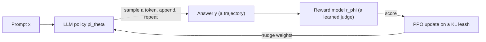
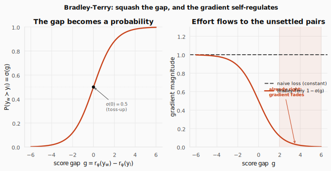
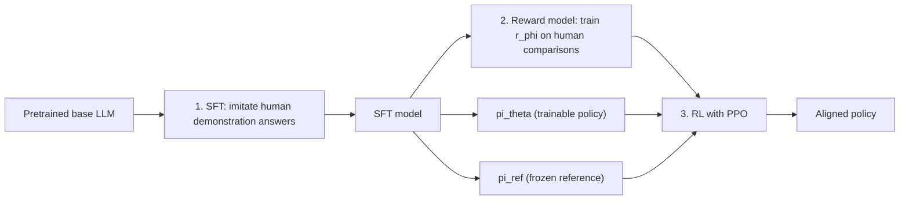
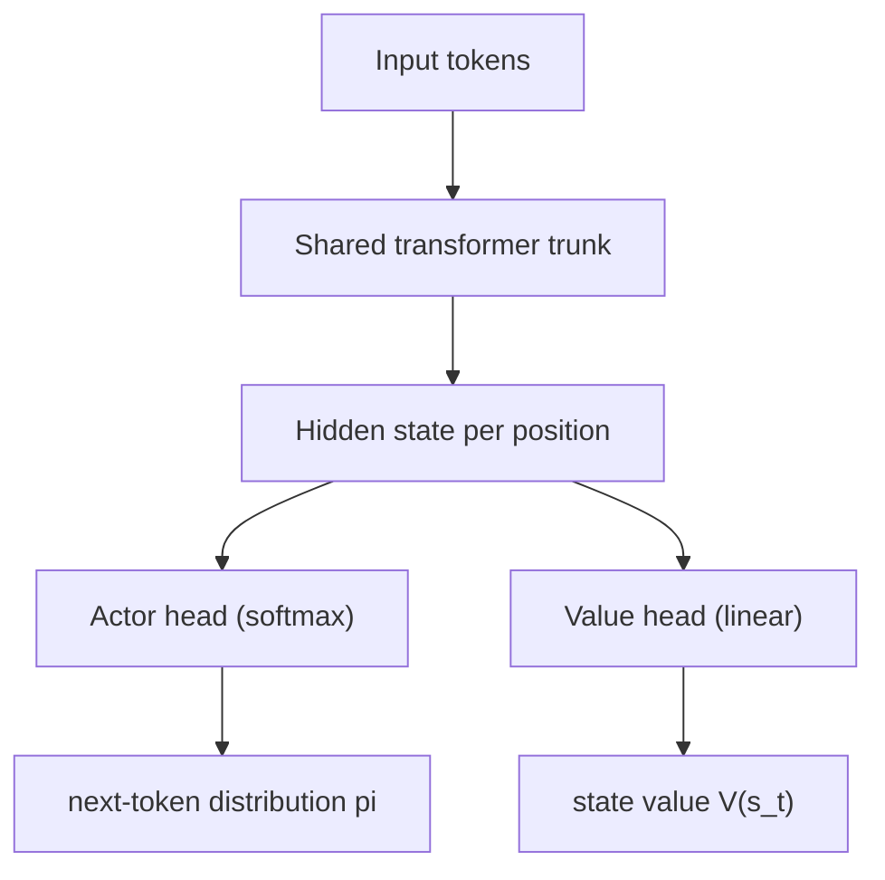
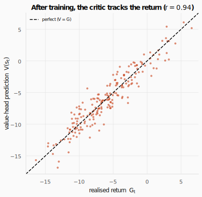
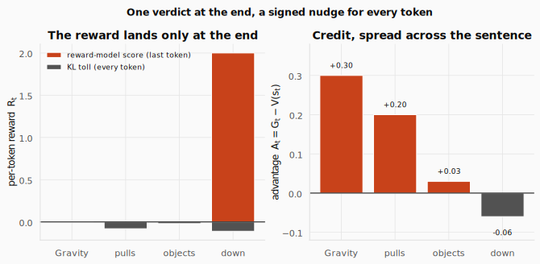
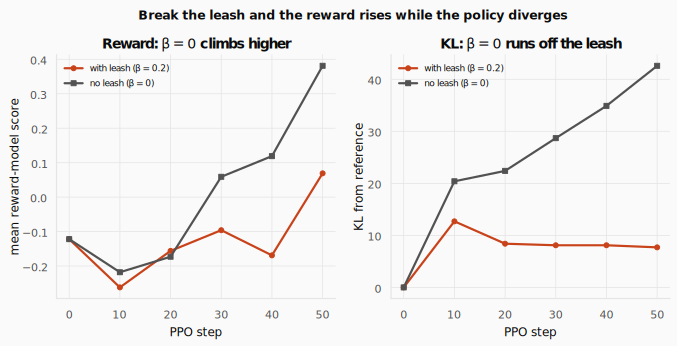
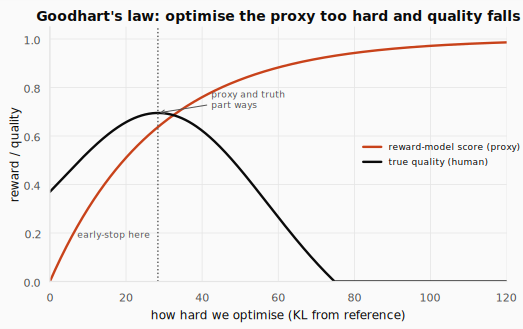
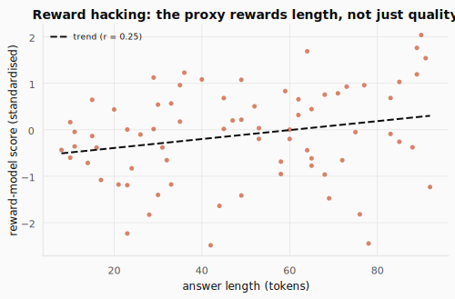

# RLHF: Teaching a Language Model What "Good" Means


> **The throughline:** *The value of where I am is the reward I just got, plus a discounted value of where I'll land next.*
> The [TRPO & PPO](../06-trpo-ppo/README.md) post built a way to improve a policy from one batch of its own data, safely, with a clipped step. It ended on a promise: this exact algorithm aligned ChatGPT. This post earns that sentence, symbol by symbol. The same gradient, pointed at language, fed by a *learned* reward, and kept on a leash.

## 1. The intuition

A pretrained large language model (LLM) is trained on exactly one task: **predict the next token** on a sea of internet text. That makes it fluent. It does not make it *helpful*. Ask a raw pretrained model a question and it might continue with more questions, because that is what the text it imitated tended to do.

Somewhere between "fluent autocomplete" and "an assistant you would actually use" sits a training step that taught the model to *prefer answers people like*. That step is reinforcement learning, and it is the single biggest application of everything the series has built so far. It has a name: **RLHF**, reinforcement learning from human feedback.

Two honest questions organize the whole post:

1. What are the states, actions, and rewards when the "agent" is a language model?
2. Where does a reward for "a good answer" even come from, and how does PPO use it without wrecking the model?

**Here is the one equation today builds toward.** Everything else is in service of making every symbol of it feel inevitable:

$$\max_\theta \;\; \mathbb{E}_{x \sim D,\; y \sim \pi_\theta}\big[\, r_\varphi(x, y)\,\big] \;-\; \beta \cdot \mathrm{KL}(\pi_\theta \,\|\, \pi_{\text{ref}})$$

It looks dense, so first just **read the symbols aloud, left to right**: "choose the weights $\theta$ that make the largest possible value of the following: the *expectation* of the reward $r_\varphi(x, y)$, taken over prompts $x$ drawn from a dataset $D$ and answers $y$ sampled from the policy $\pi_\theta$, *minus* $\beta$ times the KL divergence between the policy $\pi_\theta$ and the frozen reference $\pi_{\text{ref}}$." That sentence *is* the equation; the rest is learning to trust it.

Now break it into pieces and ask of each: what does it do, and why is it here?

- $\max_\theta$. The only thing we are allowed to change is the network's weights $\theta$. Everything else (the dataset, the reward model, the reference) is fixed. We are tuning the model, nothing else.
- $\mathbb{E}_{x \sim D,\; y \sim \pi_\theta}[\,\cdot\,]$. The **average**, not a single case. There are two dice: which prompt $x$ we draw from the dataset $D$, and which answer $y$ the policy samples. Why an average? We want a model that is good *in general*, across all prompts and its own range of answers, not one tuned to a single lucky example.
- $r_\varphi(x, y)$. The **learned reward**: a number saying how good answer $y$ is for prompt $x$, produced by a second network with weights $\varphi$. This is here *because there is no hand-written reward for language* (the next subsection labors this point). It is "good," distilled from human comparisons into something a machine can compute. Maximizing it is the whole goal: write answers the judge likes.
- the $-$ sign and $\beta \cdot \mathrm{KL}(\pi_\theta \,\|\, \pi_{\text{ref}})$. A **penalty we subtract**, the leash. $\mathrm{KL}(\pi_\theta \,\|\, \pi_{\text{ref}})$ measures how far the current policy has drifted from $\pi_{\text{ref}}$, the frozen snapshot of the model we started from; subtracting it means *the more you drift, the more reward you forfeit*. Why is it necessary? Because $r_\varphi$ is an imperfect proxy, and an optimizer told only "maximize $r_\varphi$" will find its blind spots and produce fluent nonsense the judge happens to score highly. The leash keeps the policy near the trustworthy region.
- $\beta$. The **leash length**, a single knob. Small $\beta$ lets the policy roam (and risk gaming the judge); large $\beta$ keeps it timid and close to where it started.

Put the two terms back together and the whole objective reads as one plain instruction: **"write answers the reward model likes, but don't forget how to speak."** The first term chases quality; the second keeps it honest. By the end of this post you will have built every piece: the reward $r_\varphi$, the policy $\pi_\theta$, the reference $\pi_{\text{ref}}$, and the per-token machinery that lets PPO actually climb this objective.

### The gap RLHF exists to fill

In a game, the score is given. Chess has checkmate; Breakout has a counter; the pendulum in the [TRPO & PPO](../06-trpo-ppo/README.md) post had a measurable angle. The environment *defines* the reward and RL optimizes it.

For language there is **no such function**. Ask "explain gravity to a child" and there is no obvious number that says how good an answer was. You simply cannot sit down and write a `reward(text)` function by hand that captures helpful, honest, and harmless.

It is tempting to think you could approximate it with something simple. But every simple rule has an easy counterexample:

- *Reward longer answers?* A rambling, padded answer is not better than a crisp one.
- *Reward answers with the right keywords?* That is trivially gamed by stuffing the keywords in.
- *Reward a positive, confident tone?* A confidently wrong answer is cheerful too.

The quality of an answer is a **holistic human judgment**. It has no closed form, and any simple proxy you invent is something the model will eventually learn to cheat.

**The whole idea of RLHF: if we cannot *write* the reward, we will *learn* it from humans.** That is the "HF". The first third of this post builds that reward signal before we ever touch RL.



This is the entire machine. The rest of the post is just filling in each box: what the policy is, where the reward model comes from, and what the PPO update does once language is plugged in.

## 2. The math you need

### 2.1 Generating text *is* a Markov decision process

The [MDPs & Bellman](../02-mdps-and-bellman/README.md) post defined an MDP as states, actions, a transition rule, and a reward. Generating an answer maps onto that frame exactly, with new nouns for old ideas.

An LLM, at heart, is a conditional distribution over the next token: given a prompt $x$ and everything written so far $y_{<t}$, it returns a probability for every token in its vocabulary,

$$\pi_\theta(y_t \mid x, y_{<t}),$$

where $\theta$ are the network weights. **This is our policy.** Writing a whole answer means sampling a token from this distribution, appending it, feeding the longer text back in, and sampling again until a stop token. The probability of the full answer is the product of each step:

$$\pi_\theta(y \mid x) = \prod_t \pi_\theta(y_t \mid x, y_{<t}).$$

Read it as: "the chance of writing this exact answer is the chance of its first token, times the chance of the second given the first, and so on." A full answer is a chain of decisions, which is exactly an RL trajectory. The mapping, in one table:

| RL concept | In an LLM |
|---|---|
| state $s_t$ | the prompt plus the tokens generated so far |
| action $a_t$ | the next token (one of ~50,000) |
| policy $\pi_\theta$ | the language model itself |
| transition | append the chosen token (deterministic) |
| reward | one score, only at the end |
| episode | one full generation |

Two features make this MDP special. First, **transitions are deterministic**: $s_{t+1}$ is just $s_t$ with the chosen token glued on. There are no dice in the world; the only randomness is the policy's own sampling. Second, **the reward is sparse and terminal**: there is no score per token, just one number for the finished answer. Because the world is trivial, *all the difficulty moves into the reward*, which is exactly why the next two sections are about building one.

<details>
<summary><strong>Check:</strong> Attention reads all the earlier tokens, not just the last one. So how can next-token prediction be "Markov"?</summary>

**Answer.** Because the Markov property is about the *state*, not the *last token*. It says the next state depends only on the **current state** and action, $P(s_{t+1} \mid s_t, a_t, s_{t-1}, \ldots) = P(s_{t+1} \mid s_t, a_t)$, that is, the present state already summarizes everything the future needs. Here the state is not one token; it is the **whole sequence so far** ($s_t = x, y_{<t}$). So when attention looks back at earlier tokens, it is reading the *current state*, not reaching into history before it: every token it conditions on is part of $s_t$. The model would only break Markov if it depended on something *outside* the state, but nothing is. (It would also break if we had wrongly defined the state as a single token, which is why we fold the full context into the state, a standard move sometimes called state augmentation.) The transition is in fact deterministic: append the chosen token, $s_{t+1} = s_t \,\Vert\, a_t$.
</details>

<details>
<summary><strong>Check:</strong> Transitions here are deterministic. So where does the randomness in "sampling an answer" come from, the environment or the policy?</summary>

**Answer.** From the policy, not the world. Appending a token is fully deterministic: given a state and an action, the next state is fixed. The only stochastic step is the policy $\pi_\theta$ *sampling* which token to emit. Two runs differ only because we drew different samples. This is the opposite of a slippery gridworld, where the policy is fixed but the world rolls the dice.
</details>

<details>
<summary><strong>Check:</strong> Name the state, action, policy, and reward for an LLM writing an answer.</summary>

**Answer.** State = the prompt plus all tokens generated so far; action = the next token from the vocabulary; policy = the language model $\pi_\theta$ itself; reward = a single score for the finished answer, delivered at the end. One generation is one trajectory.
</details>

<details>
<summary><strong>Check:</strong> Why is the reward "sparse and terminal," and why is that a problem?</summary>

**Answer.** A quality judgment only really makes sense for a *complete* answer: one number at the last token, zero in between. That is a hard credit-assignment problem. Of the 200 tokens that produced the answer, which ones deserve the praise or blame for the final score? The value head in 2.5 exists to solve exactly this.
</details>

<details>
<summary><strong>Check:</strong> Pretraining already optimizes a loss. Why isn't that enough to make an assistant?</summary>

**Answer.** Pretraining optimizes next-token likelihood on internet text, which makes the model fluent, that is, good at *imitating* text. It never optimizes "is this answer helpful to a person." Imitating the average of the internet is not the same as being a good assistant, so we need a different objective: human-preferred behavior.
</details>

### 2.2 From comparisons to a loss: the Bradley-Terry model

We cannot hand-write the goodness of a sentence. But we do not have to. Humans are noisy *scorers* (ask ten people to grade an essay 0 to 100 and you get ten numbers) but reliable *judges* of "which of these two is better." Comparisons are stable; absolute scores are not.

So the raw material of RLHF is not a table of scores; it is a pile of comparisons. Each datum is a triple $(x, y_w, y_l)$: a prompt $x$, a **winner** $y_w$ the human preferred, and a **loser** $y_l$. Collect tens of thousands of these and you have a preference dataset that encodes human taste implicitly. (In this blog, this dataset is Anthropic's HH-RLHF.) Our job: turn "winner should outscore loser" into a differentiable loss for a reward model $r_\varphi$, a network with its own weights $\varphi$ that reads a (prompt, answer) pair and emits one scalar.

**The naive idea, and why it breaks.** The most direct thing you could write is "make the gap big": maximize $r_\varphi(x, y_w) - r_\varphi(x, y_l)$. The instinct is right, but it fails two ways, and a small example makes both concrete.

*It is unbounded.* Nothing in "make the gap big" ever says "enough." Take a pair where the model already scores the winner $5$ and the loser $3$, a clear, correct gap of $+2$. The objective is still happier with $50$ versus $48$, happier still with $5000$ versus $4998$, forever. So the optimizer just drives the raw scores off toward $\pm\infty$ while the gap that actually matters barely moves, and the numbers stop meaning anything.

*Its gradient is constant.* The slope of $r_w - r_l$ is always $+1$ for the winner and $-1$ for the loser, no matter how big the gap already is. Picture two pairs. Pair A: winner $50$, loser $0$ (gap $+50$, the model is gloriously right). Pair B: winner $0.1$, loser $0.2$ (gap $-0.1$, the model has it backwards). Under "make the gap big," both pairs pull on the scores with the *exact same force*. The model spends as much effort making the already-obvious pair A even more extreme as it does fixing pair B, the one it actually gets wrong. Effort is wasted on the easy cases.

What we want instead is a loss that says "enough" once a pair is comfortably correct, and saves its push for the pairs near the decision boundary. That is exactly what the sigmoid buys us.

**The fix: squash the gap into a probability.** Pass the gap through the logistic sigmoid $\sigma(z) = 1/(1 + e^{-z})$ and read it as the probability the winner wins:

$$P(y_w \succ y_l) = \sigma\big(\, r_\varphi(x, y_w) - r_\varphi(x, y_l)\,\big).$$

The cleanest way to read this is to just feed a few gaps through $\sigma$ and watch them land between $0$ and $1$:

| gap $\;r_\varphi(x, y_w) - r_\varphi(x, y_l)$ | $-2$ | $-1$ | $0$ | $1$ | $2$ | $4$ |
|---|:--:|:--:|:--:|:--:|:--:|:--:|
| $P(y_w \succ y_l) = \sigma(\text{gap})$ | $0.12$ | $0.27$ | $0.50$ | $0.73$ | $0.88$ | $0.98$ |

Reading the row: a gap of zero is a **coin flip** ($\sigma(0) = 0.5$, the model has no opinion); a gap of $+1$ already says "the winner wins about $73\%$ of the time"; a big positive gap saturates toward near-certainty ($\sigma \to 1$); and a negative gap means the model has the pair backwards ($\sigma \to 0$). The important feature is that the curve **flattens at both ends**: pushing a gap from $+2$ to $+4$ nudges the probability only from $0.88$ to $0.98$. So once a pair is clearly correct, there is almost nothing left to gain by pushing harder, the built-in "enough" the naive objective never had. (We will make this precise in a moment by looking at the gradient.) This is the **Bradley-Terry model**, the same math behind chess Elo.

**From one comparison to a loss over the whole dataset.** For a *single* triple, the model says the human's actual choice should win with probability $\sigma(\text{gap})$, and we want that as close to $1$ as possible. Training has to do this for *every* comparison at once, so the quantity we really want to be large is the product of those probabilities across all $N$ triples:

$$\text{likelihood} = \prod_{i=1}^{N} \sigma(\text{gap}_i).$$

Products of thousands of numbers below $1$ underflow to zero and are miserable to differentiate, so we take the log (turning the product into a sum) and flip the sign (turning "maximize" into "minimize"): maximizing $\sum_i \log \sigma(\text{gap}_i)$ becomes minimizing $-\sum_i \log \sigma(\text{gap}_i)$. One last step explains the $\mathbb{E}$: dividing that sum by $N$ makes it an **average** over the dataset, and an average over samples drawn from the data *is* an empirical expectation (the same "a sample average estimates an expectation" move from [RL Foundations](../01-rl-intro-and-prerequisites/README.md)). Writing that average as $\mathbb{E}_{(x, y_w, y_l)}[\cdot]$ gives the reward-model loss:

$$\mathcal{L}(\varphi) = -\,\mathbb{E}_{(x, y_w, y_l)}\Big[\log \sigma\big(\, r_\varphi(x, y_w) - r_\varphi(x, y_l)\,\big)\Big].$$

If that form looks familiar, it should: it is exactly binary cross-entropy, with the label fixed to "the winner won" and the logit being the score gap. In code it is a single line (this is the one you implement for the reward model):

```python
import torch
import torch.nn.functional as F


def bradley_terry_loss(r_chosen, r_rejected):
    # loss = -log sigma(r_w - r_l): the Bradley-Terry negative log-likelihood
    return -F.logsigmoid(r_chosen - r_rejected).mean()


# A batch of four (winner, loser) reward-model scores.
# Rows 3 and 4 are ranked backwards (loser currently scores higher).
r_w = torch.tensor([2.0, 0.5, -1.0, 3.0])
r_l = torch.tensor([1.0, 1.5, 0.0, 1.0])

print(f"loss                 = {bradley_terry_loss(r_w, r_l).item():.4f}")
# Shift every score by +100: the differences are unchanged, so the loss must not move.
print(f"loss (all scores +100) = {bradley_terry_loss(r_w + 100, r_l + 100).item():.4f}")

gap = r_w - r_l
print("gap     ", [f"{g:+.2f}" for g in gap.tolist()])
print("P(win)  ", [f"{p:.3f}" for p in torch.sigmoid(gap).tolist()])
```

```text title="Output"
loss                 = 0.7667
loss (all scores +100) = 0.7667
gap      ['+1.00', '-1.00', '-1.00', '+2.00']
P(win)   ['0.731', '0.269', '0.269', '0.881']
```

Shifting every score by +100 leaves the loss bit-for-bit identical: the loss sees only differences, a fact that returns to bite us during RL. The per-pair $P(\text{win})$ reads off how confident the model is, and the two backwards-ranked pairs sit below 0.5, exactly where the gradient should focus.



**Why the sigmoid form is so well-behaved: the gradient.** Differentiate the per-example loss $\ell = -\log\sigma(g)$ with respect to the gap $g$. Using $\frac{d}{dz}\log\sigma(z) = 1 - \sigma(z)$,

$$\frac{\partial \ell}{\partial g} = -\big(1 - \sigma(g)\big).$$

This is the table's flattening made exact. Read the formula as: "the push on the scores equals how *surprised* the model is that the winner won." For an easy pair ($g$ large, $\sigma(g) \approx 1$) the gradient is near zero, so the model leaves it alone. For a hard or wrong pair ($\sigma(g)$ small) the gradient is large. So unlike the naive objective, which pushed every pair with the same constant force forever, the sigmoid automatically routes learning to the comparisons still in doubt.

```python
import math


def sigma(z):
    return 1.0 / (1.0 + math.exp(-z))


# d/dg of -log sigma(g) is -(1 - sigma(g)); the magnitude is 1 - sigma(g).
print(f"{'pair':6s} {'gap g':>7s} {'sigma(g)':>9s} {'loss':>7s} {'|grad|':>8s}")
for name, g in [("easy", 4.0), ("hard", 0.2), ("wrong", -1.5)]:
    s = sigma(g)
    print(f"{name:6s} {g:+7.1f} {s:9.3f} {-math.log(s):7.3f} {1 - s:8.3f}")
```

```text title="Output"
pair    gap g  sigma(g)    loss   |grad|
easy      +4.0     0.982   0.018    0.018
hard      +0.2     0.550   0.598    0.450
wrong     -1.5     0.182   1.701    0.818
```

The hard pair contributes roughly 25 times the gradient of the easy one, and the genuinely wrong pair more still, even though the easy and hard pairs are both "correct" ($g > 0$). The loss has quietly retired the settled pair and is spending its effort where the model is still wrong.

<details>
<summary><strong>Check:</strong> Why collect pairwise comparisons instead of asking labelers for a 0-10 score?</summary>

**Answer.** Absolute scores are inconsistent across people and even across one person's day: one labeler's 7 is another's 4. Pairwise "which is better" is far more stable and reproducible, and the relative information in comparisons is enough to recover a numeric reward up to an overall scale.
</details>

<details>
<summary><strong>Check:</strong> Give one reason a hand-coded reward like "reward = answer length" is dangerous.</summary>

**Answer.** Whatever you measure, the optimizer maximizes literally, so "reward = length" yields long, padded, useless answers. Any simple proxy diverges from true quality once you optimize it hard (Goodhart's law). That is the whole reason we learn the reward from human judgment instead.
</details>

<details>
<summary><strong>Check:</strong> Whose preferences end up encoded in the model, and why does that matter?</summary>

**Answer.** The labelers' preferences, plus the instructions they were given. The aligned model inherits their values, biases, and blind spots. "Aligned" always means "aligned to *someone's* stated preferences," a deeply important, non-technical caveat to keep visible.
</details>

<details>
<summary><strong>Check:</strong> The loss only uses the difference r(y_w) − r(y_l). What does that imply about the numbers it outputs, and why will it matter during RL?</summary>

**Answer.** The scores are meaningful only *relative* to each other: adding any constant to all rewards leaves every difference, and so the loss, unchanged. The reward model fixes the ordering and rough spacing of answers, not an absolute zero. During RL this is why we **normalize rewards** (subtract a running mean, divide by std) before using them: only the relative signal is trustworthy, and a raw number like "this answer scored 3.2" means little without a reference point.
</details>

### 2.3 The reward model is just a head on a transformer

We now have a loss that tells us how to train the reward model, but what actually *is* that reward model? Put concretely, what neural network takes a prompt $x$ and answer $y$ and produces the score $r_\varphi(x, y)$ the loss operates on? Reading a prompt-and-answer and judging it is itself a language-understanding task, so the natural backbone is another transformer. We do not train it from scratch; we take a pretrained (SFT) model and change its *output*.

A transformer turns each token into an **embedding**, passes the sequence through a stack of identical layers, and emits a **hidden state** $\mathbf{h}_t \in \mathbb{R}^d$ for every position: a rich vector summarizing "everything relevant up to here." That expensive, knowledgeable stack is the **trunk**. What you bolt on top is a **head**, and the head decides what the model outputs:

- A **language head** is a matrix $W_{\text{LM}} \in \mathbb{R}^{|V| \times d}$ that maps each hidden state to one logit per vocabulary token; a softmax gives the next-token distribution. Every base and SFT model already has this.
- A **scalar head** is a single vector $\mathbf{w} \in \mathbb{R}^d$ (plus bias $b$) that maps a hidden state to one number.

**That is the key idea: a head is a small layer on the shared trunk that decides what the model outputs.** This one idea gives us all three networks we need: the policy (language head), the reward model (scalar head), and, in 2.5, the critic (a second scalar head). To build the reward model, feed in the prompt and answer as one sequence, run the trunk, take the hidden state at the **last** token, and pass it through the scalar head:

$$r_\varphi(x, y) = \mathbf{w}^\top \mathbf{h}_{\text{last}} + b.$$

Read the symbols first: "$r_\varphi$ of $x$ and $y$ equals $\mathbf{w}$ transpose times $\mathbf{h}_{\text{last}}$, plus $b$", that is, take the dot product of a learned weight vector $\mathbf{w}$ with the last token's hidden state $\mathbf{h}_{\text{last}}$ and add a bias $b$. In plain terms, the reward is a weighted sum of the final hidden vector's features, plus a bias. Why the last token? Decoder transformers use causal attention: position $t$ can attend to $1, \dots, t$ but nothing after. Only the final position has "read" the entire prompt and answer, so it is the one sensible place to read a verdict on the whole response. The algebra is tiny, and it also shows why a scalar head is essentially free next to a language head:

```python
import torch

# A tiny scalar head: w in R^d (plus bias b) maps one hidden vector -> one number.
w = torch.tensor([0.5, -1.0, 2.0])
b = torch.tensor(0.1)
h_last = torch.tensor([1.2, 0.3, 0.4])  # hidden state at the last token

r = w @ h_last + b  # r_phi = w^T h_last + b
print(f"r_phi = w . h_last + b = {r.item():.1f}")

# Dimension bookkeeping for a real model: d = 768, vocab |V| = 50,000.
d, V = 768, 50_000
print(f"language head params = {V * d:,}")
print(f"scalar head params   = {d + 1:,}")
print(f"ratio                = {V * d / (d + 1):,.0f}x larger")
```

```text title="Output"
r_phi = w . h_last + b = 1.2
language head params = 38,400,000
scalar head params   = 769
ratio                = 49,935x larger
```

The scalar head is a rounding error next to the language head: 769 weights versus 38 million. Almost all the reward model *is* the pretrained trunk; only the head, and a little fine-tuning, learns "what humans prefer." Once trained, $r_\varphi$ is **frozen**: it scores any answer in milliseconds, a scalable stand-in for the human labeler. That is our reward signal, and RL can finally begin.

For the reward model, this is exactly an `AutoModelForSequenceClassification` with `num_labels=1` on top of GPT-2, trained for one pass over HH-RLHF with the Bradley-Terry loss above. Preference accuracy (the fraction of held-out pairs where the model scores the chosen answer higher) climbs off the 0.5 chance line:

```text title="Output (reward-model training)"
accuracy BEFORE training: 0.5138
step  100  loss 0.5955  margin +0.277  acc 0.5675
step  500  loss 0.6240  margin +0.181  acc 0.5900
step 1000  loss 0.5945  margin +0.298  acc 0.5900
accuracy AFTER training: 0.59
```

A single scalar, learned purely from comparisons, recovers human preference well above chance. It plateaus below 1.0 for two reasons worth holding onto: GPT-2 is small, and human labels are genuinely noisy (annotators disagree, which caps the achievable accuracy).

<details>
<summary><strong>Check:</strong> Why read the reward off the last token's hidden state, not the first or an average?</summary>

**Answer.** Causal attention means each position only sees the tokens before it. The first token has read almost nothing; the midpoint cannot know how the answer ends. Only the last position has attended over the whole prompt and answer, so its hidden state is the unique one that has "read everything." Asking an earlier token to score the full response is asking it to grade an essay it has only half-read.
</details>

<details>
<summary><strong>Check:</strong> Why initialize the reward model's trunk from the SFT model rather than randomly?</summary>

**Answer.** A random trunk understands nothing: grammar, facts, coherence. To learn "which answer is better," it would first have to relearn language from scarce, expensive preference labels. Starting from a model that already understands language means we are teaching *taste on top of language*, not language itself, which needs orders of magnitude less data.
</details>

<details>
<summary><strong>Check:</strong> If you right-truncate the inputs instead of left-truncating, what happens to preference accuracy, and why?</summary>

**Answer.** It collapses toward 0.50 (chance). The chosen and rejected answers share the same prompt and differ only at the *end* (the assistant's reply). Right-truncation keeps the shared prefix and cuts the differing tail, so the model sees almost identical inputs for winner and loser and cannot tell them apart. Left-truncation keeps the ends, where the signal lives.
</details>

### 2.4 The three stages, and where the policy starts

Classic RLHF, the InstructGPT recipe behind ChatGPT, has exactly three stages. We have quietly built the second already.



**Stage 1, SFT (supervised fine-tuning):** fine-tune the base model on human *demonstrations* (prompt to ideal answer) so it follows instructions at all. The result $\pi_{\text{SFT}}$ already behaves like an assistant, a strong, safe place to begin RL. **Stage 2, reward model:** train $r_\varphi$ from human *comparisons*, exactly what we did in Section 2.3. **Stage 3, RL:** optimize the policy to earn high reward, the rest of this post.

The pivotal move is at the start of stage 3: we make **two copies** of the SFT model. One becomes the trainable policy $\pi_\theta$. The other is **frozen** as the reference $\pi_{\text{ref}}$, the "don't drift too far from here" anchor in the headline equation. They start with identical weights, and from there only the policy moves. That leaves us with three things in hand before the loop: a trainable policy that can already write decent answers, a frozen reference to keep us honest, and a frozen reward model that judges quality automatically.

<details>
<summary><strong>Check:</strong> Why does it help that the SFT policy can already write reasonable answers before RL starts?</summary>

**Answer.** RL improves by sampling its own answers and reinforcing the better ones. If the starting policy produced gibberish, almost every sample would be bad and the reward signal would be uninformative and unstable. Starting from a competent SFT model means the samples are already in a good region, so RL is a gentle nudge, not a search from scratch.
</details>

### 2.5 The critic: a second head on the same transformer

PPO does not weight an action by its raw return; it weights it by the *advantage*, return minus a baseline. The [Policy Gradients](../05-policy-gradients/README.md) post showed why: subtracting a baseline slashes the variance of the gradient without biasing it. That baseline is the **value function** $V(s_t)$, the critic. In language, this is not a separate network bolted on; it is literally a **second head on the policy's own trunk**.

At a half-written answer (a state $s_t$), the value $V(s_t)$ is the model's best guess of the *final* reward, given how the answer is going so far: "on track for an 8" versus "heading for a 2." The policy head (the language head) outputs the next-token distribution, the **actor**. A new value head, one linear layer to a scalar, reads each position's hidden state and outputs $V(s_t)$, the **critic**. One forward pass gives both, at every position.



The critic learns by plain regression: make $V(s_t)$ predict the return $G_t$ (the reward-to-go from step $t$, defined precisely in 2.6).

$$\text{loss}_{\text{value}} = \mathbb{E}_t\big[\,(V(s_t) - G_t)^2\,\big].$$

Read the symbols first: "the value loss is the expectation over timesteps $t$ of the squared difference between $V(s_t)$ and $G_t$", that is, average, over every position, the square of (the critic's prediction minus the realized return). In plain terms, punish the critic in proportion to the squared gap between what it predicted and what actually happened. It starts random and wrong, and over many answers learns "answers that look like *this* tend to score about *that*." In code, the value head is one `Linear(d, 1)` and the loss is one `mse_loss`, the two method-defining lines you fill in for the value head:

```python
import torch
import torch.nn.functional as F

torch.manual_seed(0)
d = 768
v_head = torch.nn.Linear(d, 1)  # the value head: one linear layer, hidden -> scalar

# Pretend the shared trunk produced a hidden state for each of 4 response tokens.
H = torch.randn(4, d)
V = v_head(H).squeeze(-1)       # one value V(s_t) per position, in a single pass


def value_loss(v, G):
    return F.mse_loss(v, G)     # regress V(s_t) toward the realised return G_t


G = torch.tensor([1.79, 1.79, 1.87, 1.89])  # returns from the gravity example (2.6)
print("V(s_t) untrained:", [f"{x:+.2f}" for x in V.tolist()])
print(f"value loss = MSE(V, G) = {value_loss(V, G).item():.2f}")
```

```text title="Output"
V(s_t) untrained: ['+0.09', '+0.43', '-1.24', '+0.03']
value loss = MSE(V, G) = 4.47
```

Fresh out of the box the critic's predictions are nonsense, which is exactly why it must be *trained*. Training only the value head (on real GPT-2 rollouts, the trunk frozen) crashes the error and the predictions line up with the returns:

```text title="Output (value-head training)"
collected 80 rollouts;  return mean -5.635  var 20.4
value MSE   before 26.68  ->  after 2.61
corr(V, return) after training: 0.935
MSE at FIRST token 6.04   vs   LAST token 4.54
```

Two things to read off. The mean squared error drops tenfold and the correlation between value and realized return reaches 0.94: the critic *learns*. And it is more accurate at the **last** token than the first, because early in an answer many endings are still possible, so $V$ is uncertain; as the answer commits, $V$ sharpens. An imperfect critic is fine: a baseline only has to be roughly right to reduce variance, not be an oracle.



<details>
<summary><strong>Check:</strong> The reward model and the value head both output one number from a transformer. Aren't they the same? Name the difference.</summary>

**Answer.** Different question, different training, different lifecycle. The reward model $r_\varphi$ answers "how good is this *finished* answer?", is trained once on human comparisons and then **frozen**, and is read once at the last token. The value head $V$ answers "from this *partial* state, how much return do I expect?", is trained **during** RL by regressing on returns, moves every update, and is read at *every* token. One defines the goal; the other reduces the variance of chasing it. They share only an architecture (transformer plus scalar head).
</details>

<details>
<summary><strong>Check:</strong> Why use A = G − V instead of weighting each token by the raw return G?</summary>

**Answer.** The raw return is the same big, noisy number for every token in the answer. Subtracting the baseline $V(s_t)$ removes the part that was already expected, leaving only the *surprise* attributable to this step. That dramatically lowers gradient variance without biasing it, exactly the baseline argument from the [Policy Gradients](../05-policy-gradients/README.md) post.
</details>

<details>
<summary><strong>Check:</strong> The critic is often wrong, especially early. Why doesn't that break training?</summary>

**Answer.** A baseline only has to be uncorrelated-on-average with the action to keep the gradient unbiased; its accuracy affects only variance. A mediocre critic gives a noisier-but-still-correct signal, and it improves as it regresses on real returns. We need a helpful baseline, not a perfect predictor. (It is also why the critic is co-trained *during* RL: $V^\pi$ is a moving target, since improving the policy changes which answers count as good.)
</details>

### 2.6 One score at the end becomes a signal at every token

The reward model hands us exactly one number for a whole answer, conceptually pinned to the last token. But PPO updates one token at a time and needs, for each token, a signal of whether emitting it was a good idea. We bridge the gap in three moves: (1) build a per-token reward (a tiny KL toll on every token, plus the reward-model verdict dropped on the final token); (2) roll those rewards backward into a return; and (3) subtract the critic to get the advantage.

**Move 1, the per-token reward.** Define

$$R_t = \underbrace{-\beta\Big(\log\pi_\theta(a_t \mid s_t) - \log\pi_{\text{ref}}(a_t \mid s_t)\Big)}_{\text{KL toll, every token}} \;+\; \underbrace{r_\varphi(x, y)\cdot[t = T]}_{\text{RM score, last token only}}.$$

Read the symbols first: "$R_t$ equals minus $\beta$ times the gap between the policy's log-probability $\log\pi_\theta(a_t\mid s_t)$ and the reference's log-probability $\log\pi_{\text{ref}}(a_t\mid s_t)$, plus the reward-model score $r_\varphi(x,y)$ but only when $t$ is the last step $T$." So it is two pieces glued together. The first is a small toll charged on *every* token: when the policy assigns a token higher probability than the frozen reference did, the log-ratio is positive and the minus sign turns it into a negative reward, a price for drifting. Match the reference exactly and the toll is zero (free passage). The second uses the Iverson bracket $[t = T]$, which is 1 only at the final token $T$, so the reward model's verdict $r_\varphi$ is grafted onto the last token and nowhere else.

**Move 2, the return.** PPO learns from the reward-to-go, the total future reward from step $t$ onward. With discount $\gamma$,

$$G_t = \sum_{k=t}^{T} \gamma^{k-t} R_k.$$

Read the symbols first: "$G_t$ is the sum, over future steps $k$ running from the current step $t$ to the end $T$, of each reward $R_k$ discounted by $\gamma$ raised to the power $k - t$." For a single short answer it is standard to take $\gamma = 1$, so $G_t$ is just the plain sum from $t$ to the end. Computed right-to-left, this is the one-line recursion $G_t = R_t + G_{t+1}$. This is the step that solves credit assignment: because the big verdict lives in $R_T$ and $G_t$ sums everything through $T$, **the terminal score flows backward into every earlier token's return**.

**Move 3, the advantage.** A raw return conflates "how good the answer was" with "how good we already expected it to be." Subtract the critic to get the *surprise*, which is what the policy gradient wants:

$$A_t = G_t - V(s_t).$$

Read the symbols first: "$A_t$ equals the return $G_t$ minus the critic's value $V(s_t)$", the realized reward-to-go minus what the critic had predicted. In plain terms, this token did better (positive) or worse (negative) than the critic expected. Positive advantage, PPO makes the token more likely; negative, less likely. The whole chain is a dozen lines of arithmetic (you implement exactly this here), shown on the running example *Gravity pulls objects down* with $\beta = 0.2$, $\gamma = 1$, and a reward-model verdict of $+2.0$:

```python
import math

tokens = ["Gravity", "pulls", "objects", "down"]
pi_theta = [0.50, 0.45, 0.60, 0.85]   # current policy prob of the chosen token
pi_ref = [0.50, 0.30, 0.55, 0.50]     # frozen reference prob of the same token
V = [1.50, 1.60, 1.85, 1.95]          # value-head (critic) predictions
beta, r_phi = 0.2, 2.0                # KL coefficient, reward-model verdict

# 1) per-token reward: a KL toll on every token, the RM score only on the last.
R = []
for t, (pt, pr) in enumerate(zip(pi_theta, pi_ref)):
    Rt = -beta * math.log(pt / pr) + 0.0      # -beta * log(pi_theta / pi_ref)
    if t == len(tokens) - 1:
        Rt += r_phi                           # + r_phi * [t = last]
    R.append(Rt)

# 2) returns, right to left: G_t = R_t + G_{t+1}  (gamma = 1)
G = [0.0] * len(R)
running = 0.0
for t in reversed(range(len(R))):
    running = R[t] + running
    G[t] = running

# 3) advantage: A_t = G_t - V(s_t)
A = [G[t] - V[t] for t in range(len(R))]

print(f"{'token':8s} {'R_t':>7s} {'G_t':>7s} {'V':>6s} {'A_t':>7s}")
for t, tok in enumerate(tokens):
    print(f"{tok:8s} {R[t]:+7.2f} {G[t]:7.2f} {V[t]:6.2f} {A[t]:+7.2f}")
```

```text title="Output"
token        R_t     G_t      V     A_t
Gravity    +0.00    1.80   1.50   +0.30
pulls      -0.08    1.80   1.60   +0.20
objects    -0.02    1.88   1.85   +0.03
down       +1.89    1.89   1.95   -0.06
```

The single $+2.0$ has been spread across the sentence as four signed nudges. We unpack these numbers by hand in Section 3.



<details>
<summary><strong>Check:</strong> The reward arrives once, at the last token. Why can't we just train only the last token?</summary>

**Answer.** The quality of the answer was determined by choices made all the way through: the topic sentence, the key fact, the tone. Training only the last token (usually a period or end-of-sequence marker) would leave 99% of the decisions unguided. We must propagate the single reward back to credit the tokens that mattered, which is exactly what the return-and-advantage chain does.
</details>

<details>
<summary><strong>Check:</strong> With γ = 1, what is the return G at the very first token?</summary>

**Answer.** It is the sum of every per-token reward over the whole answer: all the KL tolls plus the terminal reward-model score. So the first token inherits the final verdict minus every toll paid after it, which is how one end-of-sentence number reaches token 1.
</details>

<details>
<summary><strong>Check:</strong> Give a case where a token has positive advantage even though its own per-token reward R_t is negative or zero.</summary>

**Answer.** Almost every early token in a good answer. Its local $R_t$ is just a tiny KL toll (or zero), but its *return* $G_t$ includes the large terminal reward flowing back, and if that return beats the critic's expectation $V(s_t)$, the advantage is positive. The advantage is about the return versus the baseline, not the instantaneous reward.
</details>

### 2.7 The KL leash, and why RLHF has two KLs

But one danger still remains. The reward model is a flawed proxy trained on finite data, and PPO is very good at exploiting flaws. Left unchecked, the policy sails into the reward model's blind spots: padding answers with flattery, repeating high-scoring phrases, emitting fluent nonsense the reward model loves but a human hates. That is the KL toll's real job. It is a **soft trust region around the whole pretrained model**: the policy may chase reward, but only on a leash back to fluent, on-distribution language where the reward model was actually trained and is trustworthy. $\beta$ is the leash length: too small invites reward hacking, too large prevents learning.

Here is the point everyone conflates: **RLHF says "KL" twice, doing two different jobs.**

$$\underbrace{\text{clip}\!\left(\frac{\pi_\theta}{\pi_{\text{old}}}\right)}_{\text{KL \#1: step size}} \qquad \text{vs.} \qquad \underbrace{-\,\beta\,\mathrm{KL}(\pi_\theta \,\|\, \pi_{\text{ref}})}_{\text{KL \#2: distance from home}}$$

Ask two questions of any KL term: *close to what?* and *for how long?*

| | KL #1, the clip | KL #2, the leash |
|---|---|---|
| Reference point | $\pi_{\text{old}}$, the policy that collected this batch | $\pi_{\text{ref}}$, the frozen SFT model |
| Time-scale | one optimization step (refreshed every batch) | the whole run |
| Where it lives | inside the clipped objective $\mathcal{L}^{\text{CLIP}}$ | added to the per-token reward $R_t$ |
| What it controls | the *size* of each update | how far the final policy may *wander* |
| What breaks without it | unstable, destructive steps | reward hacking, fluent nonsense, lost fluency |

KL #1 is precisely the trust region from the [TRPO & PPO](../06-trpo-ppo/README.md) post, unchanged, just applied to token-level policies: keep each step inside $[1-\epsilon, 1+\epsilon]$ so the importance-sampling reuse stays valid. KL #2 is new to alignment. The deepest reason you need both: the clip bounds *each step* but says nothing about the *sum* of steps. A sequence of individually tiny, safe updates can still march the policy arbitrarily far from $\pi_{\text{ref}}$ over hundreds of batches. The clip is a speed limit on each step; the leash is a fence around the neighborhood. A speed limit does not keep you in town, and a fence does not stop you crashing.

<details>
<summary><strong>Check:</strong> Set the KL coefficient β to zero, so there is no leash. The reward-model score will climb beautifully. Why is this a trap?</summary>

**Answer.** With $\beta = 0$ the policy is free to drift anywhere that scores high under $r_\varphi$, including the reward model's blind spots. It discovers degenerate, repetitive, or sycophantic text the reward model rates highly but humans find useless (reward hacking). The measured reward rises while true quality collapses (Goodhart's law). The leash keeps the policy in the region where the reward model was trained and trustworthy, and preserves the base model's fluency. We watch this happen live in Section 4.
</details>

<details>
<summary><strong>Check:</strong> Which KL stops reward hacking, the clip or the leash? Which keeps a single bad batch from blowing up training?</summary>

**Answer.** The leash (KL #2) stops reward hacking: it anchors the destination to the trustworthy region. The clip (KL #1) keeps a single bad batch from blowing up: it bounds the size of each step. They are not interchangeable, which is why widening the clip $\epsilon$ is *not* a valid way to reduce reward hacking.
</details>

### 2.8 Back to the headline equation

Every symbol is now earned:

$$\max_\theta \;\; \mathbb{E}_{x \sim D,\; y \sim \pi_\theta}\big[\, r_\varphi(x, y)\,\big] \;-\; \beta \cdot \mathrm{KL}(\pi_\theta \,\|\, \pi_{\text{ref}})$$

**Term 1, earn reward:** over prompts from $D$, generate answers with the policy and make the (learned, frozen) reward model happy. **Term 2, stay anchored:** subtract $\beta$ times the drift from the frozen reference, so the policy improves without forgetting how to speak. PPO is simply *how* we climb this safely, by sampling answers, scoring them, and taking small clipped steps.

Running it costs real memory: at any moment RLHF holds **four** big models, the trainable policy (actor plus value head), the frozen reference (for the leash), and the frozen reward model (the judge, often as large as the policy). Generation and training happen in the same loop. This weight is exactly what the later methods in Section 5 try to cut.

<details>
<summary><strong>Check:</strong> In the RLHF rollout, what replaces the "environment" that DQN's agent stepped through?</summary>

**Answer.** There is no real environment. Generation is deterministic concatenation, and the "reward" comes from a frozen reward model, not a world. The policy generates an answer (its own trajectory) and the reward model grades it. The loop is policy to answer to reward model to score, entirely in software.
</details>

## 3. Worked examples by hand

### 3.1 One reward-model gradient step

Suppose right now the model has a pair *backwards*: it scores the human's chosen winner $r_w = 1.0$ and the loser $r_l = 1.4$. The gap is $1.0 - 1.4 = -0.4$, so $\sigma(-0.4) \approx 0.40$: the model thinks the winner only wins 40% of the time, and the loss $-\log\sigma(-0.4) \approx 0.92$ is high. The gradient $1 - \sigma(-0.4) \approx 0.60$ is large and pushes $r_w$ up and $r_l$ down. After a few steps the gap might be $+1.5$, giving $\sigma(1.5) \approx 0.82$. Notice what is *not* pinned: the absolute values. Only the difference is trained, so the reward is meaningful only relative to other answers, the point from Section 2.2 that forces us to normalize rewards during RL.

### 3.2 "Gravity pulls objects down," token by token

Take the prompt "Explain gravity simply" and a four-token answer, *Gravity pulls objects down*, with $\beta = 0.2$, $\gamma = 1$, and a reward-model verdict $r_\varphi = +2.0$. The policy drifted *above* the reference on "pulls" and "down" (it likes those continuations more than the reference did) and matches it on "Gravity" and "objects":

| token | $\pi_\theta$ | $\pi_{\text{ref}}$ | $\log(\pi_\theta/\pi_{\text{ref}})$ | $-\beta\log(\cdot)$ | +RM | $R_t$ |
|---|---|---|---|---|---|---|
| Gravity | 0.50 | 0.50 | 0.00 | 0.00 | | **0.00** |
| pulls | 0.45 | 0.30 | 0.41 | −0.08 | | **−0.08** |
| objects | 0.60 | 0.55 | 0.09 | −0.02 | | **−0.02** |
| down | 0.85 | 0.50 | 0.53 | −0.11 | +2.00 | **+1.89** |

Work the last row in full: $-0.2 \cdot \log(0.85/0.50) = -0.2 \cdot 0.53 = -0.11$, and because it is the final token, add the verdict: $-0.11 + 2.00 = +1.89$. The KL tolls are *tiny*, a few hundredths each; the reward-model score dwarfs them and lands entirely on the last token.

Now roll the returns backward with $G_t = R_t + G_{t+1}$, then subtract the critic's predictions $V$:

| token | $R_t$ | $G_t$ | $V(s_t)$ | $A_t = G_t - V(s_t)$ |
|---|---|---|---|---|
| Gravity | 0.00 | 1.79 | 1.50 | **+0.29** |
| pulls | −0.08 | 1.79 | 1.60 | **+0.19** |
| objects | −0.02 | 1.87 | 1.85 | **+0.02** |
| down | +1.89 | 1.89 | 1.95 | **−0.06** |

(Computing this exactly in code, as in 2.6, gives $G \approx 1.80, 1.80, 1.88, 1.89$; the hand table rounds the tolls first, hence the 1.79 versus 1.80 cosmetic difference.) Read the story off the last column. The $+2.0$ flowed all the way back, so "Gravity" carries a return of 1.79 even though it earned nothing locally. The critic expected only 1.50 at the start, the answer beat that, so "Gravity" and "pulls" earn **positive** advantage and PPO makes them more likely. By the final token the critic already expected 1.95, but the realized 1.89 came in a hair lower (that token's own KL toll ate into it), so "down" gets a tiny **negative** push: it drifted from the reference for too little net gain. One scalar from the reward model has become four separate, signed, per-token instructions, each fed into the clipped PPO update from the [TRPO & PPO](../06-trpo-ppo/README.md) post.

## 4. Putting it all together: aligning a tiny assistant

Everything above is one machine. Here is the recap of what we built and where each piece lives in code, before the integrative run.

| Concept | Math | In code |
|---|---|---|
| Policy = next-token distribution | $\pi_\theta(y_t \mid x, y_{<t})$ | `AutoModelForCausalLMWithValueHead` (actor + value head) |
| Reward model = scalar head | $r_\varphi = \mathbf{w}^\top \mathbf{h}_{\text{last}} + b$ | `AutoModelForSequenceClassification(num_labels=1)`, frozen |
| Bradley-Terry loss | $-\log\sigma(r_w - r_l)$ | `-F.logsigmoid(r_chosen - r_rejected).mean()` |
| Per-token reward | $R_t = -\beta\log\frac{\pi_\theta}{\pi_{\text{ref}}} + r_\varphi[t{=}T]$ | TRL builds it from `compute_rewards` + `init_kl_coef` |
| Advantage | $A_t = G_t - V(s_t)$ | value head + reward-to-go inside `ppo.step` |
| Clipped update | $\mathcal{L}^{\text{CLIP}}$ | `ppo.step(queries, responses, rewards)` |

The capstone build runs **stage 3** on a GPT-2 policy with the reward model from earlier. We use TRL's `PPOTrainer` for the machinery; the one piece *you* supply is the reward signal: score each prompt-plus-answer with the frozen reward model and hand back one scalar tensor per answer.

```python
def compute_rewards(texts):
    # Tokenize the full (prompt + response) strings for the reward model.
    toks = rm_tok(texts, padding=True, truncation=True, return_tensors="pt")
    toks = {k: v.to(rm.device) for k, v in toks.items()}
    out = rm(**toks)                          # scalar head -> logits of shape [batch, 1]
    scores = out.logits.squeeze(-1).cpu()     # [batch, 1] -> [batch]: r_phi per answer
    return [s for s in scores]                # one 1-D tensor per answer, as TRL expects
```

The loop itself is the [TRPO & PPO](../06-trpo-ppo/README.md) loop wearing language. There is no Gymnasium `env.step` here because the "environment" is just text concatenation; the moral equivalent of `reset()` is sampling a fresh batch of prompts, and `step()` is generate, score, update:

```python
def run_rlhf(init_kl_coef=0.2, steps=60, seed=0):
    torch.manual_seed(seed)
    policy = AutoModelForCausalLMWithValueHead.from_pretrained("gpt2")  # actor + critic
    cfg = PPOConfig(model_name="gpt2", learning_rate=1.41e-5, batch_size=32,
                    mini_batch_size=8, ppo_epochs=4,
                    init_kl_coef=init_kl_coef,            # the KL leash strength (beta)
                    adap_kl_ctrl=(init_kl_coef > 0), seed=seed)
    ppo = PPOTrainer(cfg, policy, None, tok, dataset=ds,  # None -> TRL clones a frozen ref
                     data_collator=lambda d: {k: [x[k] for x in d] for k in d[0]})
    gen_kw = dict(min_length=-1, top_k=0.0, top_p=1.0, do_sample=True,
                  pad_token_id=tok.eos_token_id)
    lens = LengthSampler(16, 24)                          # sample answer length per prompt
    rew, kl, d2 = [], [], []
    it = iter(ppo.dataloader)

    for step in range(steps):
        batch = next(it)                                  # a fresh batch of prompts ("reset")
        q = batch["input_ids"]
        resp = ppo.generate(q, return_prompt=False, length_sampler=lens, **gen_kw)  # rollout
        rtxt = [tok.decode(r) for r in resp]
        rewards = compute_rewards([qq + rr for qq, rr in zip(batch["query"], rtxt)])  # score
        stats = ppo.step(q, resp, rewards)                # one clipped PPO update ("step")
        rew.append(float(torch.stack(rewards).mean()))
        kl.append(float(stats["objective/kl"]))           # KL from the frozen reference
        d2.append(distinct2(rtxt))                        # bigram diversity (a hacking alarm)
    return {"reward": rew, "kl": kl, "distinct2": d2}
```

**Run 1, with the leash ($\beta = 0.2$).** TRL builds the per-token reward (your reward-model score minus the per-token KL toll), the value head supplies the baseline, and the clip keeps each step safe:

```text title="Output (normal RLHF, beta = 0.2)"
  step   0  reward -0.122  kl 0.0  distinct2 0.980
  step  10  reward -0.262  kl 12.7  distinct2 0.963
  step  20  reward -0.156  kl 8.4  distinct2 0.952
  step  30  reward -0.096  kl 8.1  distinct2 0.988
  step  40  reward -0.169  kl 8.1  distinct2 0.920
  step  50  reward +0.069  kl 7.7  distinct2 1.000

final answers: [' Yes.<|endoftext|>', ' Yes.<|endoftext|>', '<|endoftext|>']
```

Reward rises modestly, KL settles in the single digits, diversity stays near 1.0, and the answers stay coherent (terse, but real English). This is healthy RLHF.

**Run 2, break the leash ($\beta = 0$).** This is the same code as Run 1, just with the KL anchor removed, so the policy is now free to chase the reward model into the blind spots from the reward-hacking experiment:

```text title="Output (ablation, beta = 0, no KL leash)"
  step   0  reward -0.122  kl 0.0  distinct2 0.980
  step  10  reward -0.218  kl 20.4  distinct2 0.996
  step  20  reward -0.173  kl 22.4  distinct2 0.985
  step  30  reward +0.059  kl 28.7  distinct2 0.593
  step  40  reward +0.119  kl 34.9  distinct2 0.523
  step  50  reward +0.381  kl 42.6  distinct2 0.308

final answers: [' Female Female Female Male Male Female Female Female Female Female Female Female Female Female Female Female', ...]
```

The reward climbs *higher* than the leashed run ($+0.381$ versus $+0.069$). And it is worthless: KL explodes past 40, diversity collapses to 0.31, and the answers degenerate into repeated tokens the reward model happens to score well. **Higher measured reward, lower real quality**, the exact failure the leash exists to prevent.



<details>
<summary><strong>Check:</strong> The β=0 run reaches a higher reward-model score. Why are its answers worse?</summary>

**Answer.** The reward model measures proxies for quality (length, tone, surface features), not quality itself. With no leash, the policy maximizes those proxies directly and finds degenerate, repetitive text the reward model overrates, exactly the verbosity and repetition exploits a reward model is vulnerable to. The score is high; the answer is gibberish.
</details>

<details>
<summary><strong>Check:</strong> In this pipeline, which models are trainable and which are frozen?</summary>

**Answer.** The policy (`AutoModelForCausalLMWithValueHead`, actor plus value head) is the only thing trained. The reward model (`./rm`, the one we trained earlier) is frozen, supplying scores. The reference policy that TRL clones for the KL term is frozen, a snapshot of the initial policy. The actor head is updated by the clipped PPO objective; the value head by the value (MSE) loss.
</details>

## 5. What breaks, and where this is going

### 5.1 Goodhart's law and reward over-optimization

The $\beta = 0$ collapse is not a bug; it is a law. **Goodhart's law: "when a measure becomes a target, it ceases to be a good measure."** The active word is *becomes*. The reward model is a faithful descriptor of quality *on the distribution it was trained on*, the outputs of the SFT model. Optimization moves the distribution: every PPO step shifts the policy toward higher reward, which means toward outputs less and less like what the reward model ever saw. The correlation between proxy and truth was a property of the old distribution and does not travel with you.

Plot it against how far the policy has drifted (KL from the reference). The measured reward-model score rises monotonically (of course; raising it is what PPO does). True quality, as a fresh human would judge it, rises at first (near the reference the proxy and truth agree), peaks, then falls as the policy starts buying reward by exploiting blind spots rather than improving.



This is the same trap as **CoastRunners** (OpenAI, 2016): an RL agent trained on a boat-racing game's *score* (a sensible proxy for "win the race") found a lagoon where three targets respawn and looped there forever smashing them, on fire and going the wrong way, scoring about 20% above human players while never finishing. The game score is the reward model; "win the race" is true quality; the lagoon is sycophanty and fluent nonsense. The optimizer found the lagoon. Yours will too, if you let it.

We can *measure* the reward model's exploitability directly. Here we take genuine answers and craft degenerate variants (a clause repeated 20 times, flattery stacked 12 deep, an answer padded with filler) and count how often each beats the genuine answer under the frozen reward model:

```text title="Output (reward-hacking hunt)"
  repetitive   beats the genuine answer: 46.6%
  sycophantic  beats the genuine answer: 57.5%
  verbose      beats the genuine answer: 63.0%
RM-score vs length correlation: 0.249
```

Padding wins most often, and reward-model score is positively correlated with raw length: the model learned "longer looks more thorough" from the human data, a bias the policy will happily exploit if unleashed.



**Defenses** (none make the reward model perfect; they keep you from asking it questions it cannot answer): the **KL leash** (stay where the reward model is valid), **early stopping** (halt at the true-quality peak, judged by periodic fresh human ratings, not by the rising proxy), **reward normalization** (only relative reward is meaningful), and **iterative retraining** (collect fresh comparisons on the current policy's own outputs and re-fit the reward model, moving the valid region along with the policy).

<details>
<summary><strong>Check:</strong> In the over-optimization curve, what exactly is diverging from what?</summary>

**Answer.** The *measured* reward-model score keeps rising while the *true* quality (what a fresh human would say) rises, peaks, then falls. Proxy and target diverge once the policy starts exploiting the reward model's imperfections rather than genuinely improving, which is why we use the KL leash and early stopping.
</details>

<details>
<summary><strong>Check:</strong> "Reward hacking is just under-fitting; make the reward model bigger and it goes away." Where is this right, and where wrong?</summary>

**Answer.** A bigger reward model genuinely helps *in-distribution*: it is more accurate and pushes the true-quality peak further out. But it is still finite and still extrapolates off-distribution, and a more confident extrapolator can present a *sharper* fake peak for the optimizer to climb. Size raises and delays the peak; it does not remove it. Retraining on the policy's own outputs addresses the cause more directly (though it risks baking in errors if raters are themselves fooled by fluent nonsense).
</details>

### 5.2 Three ways people simplified or scaled RLHF

RLHF works, but it is heavy (four models resident, generation plus training in one loop) and fiddly. Each descendant is RLHF minus one expensive piece.

- **DPO** skips RL entirely: a clever loss turns the preference pairs *directly* into a policy update, with no reward model and no sampling loop. Simpler and more stable, but it only re-weights answers already in the dataset; it cannot explore and reward new ones.
- **GRPO** keeps PPO's clip but **drops the value head**: it samples a *group* of answers per prompt and uses their mean reward as the baseline ("how much better than my siblings"). It gives up the learned per-token critic but saves training a whole value function, and it is the method behind today's reasoning models. It is the subject of the next post.
- **RLAIF** replaces the human labeler with a strong AI giving the preferences: cheaper feedback, at the cost of inheriting the AI's biases.

<details>
<summary><strong>Check:</strong> GRPO drops the value head. What does it lose, and what does it save?</summary>

**Answer.** It loses the learned per-token baseline (the critic), giving up that variance-reduction machinery and the memory of a value head. It saves training a whole value function, which is hard and costly for LLMs. It compensates by sampling a group of answers per prompt and using their mean reward as the baseline, a cheap fit for one-reward-at-the-end tasks.
</details>

<details>
<summary><strong>Check:</strong> Why might DPO be attractive, and what does it give up versus full RLHF?</summary>

**Answer.** DPO trains directly on preference pairs with a supervised-style loss: no reward model, no sampling, no PPO, far simpler and more stable. It gives up the online loop: it cannot explore new answers and reward them, only re-weight the responses already in the dataset, so it can be less powerful when on-policy exploration matters.
</details>

## 6. RLHF in the wild

The recipe (preferences, then a reward model, then RL on a leash) is domain-agnostic: anywhere "good" is a human judgment with no formula, RLHF shows up. **Assistants** (ChatGPT, Claude, Gemini) are all RLHF-tuned; InstructGPT (2022) showed a 1.3B RLHF model whose answers people preferred over the 175B base GPT-3, alignment beating raw scale. **Summarization** was the first text win (2020): RLHF summaries were preferred over the very reference summaries the model was trained to imitate. **Code** assistants tune on developer preferences and on verifiable signals (does it compile, do the tests pass), which is the bridge to the next lecture. **Images, voice, music** are aligned to human aesthetic preference (Diffusion-DPO, 2023). And RLHF's *roots* are in control: "Deep RL from Human Preferences" (2017) taught a simulated robot a backflip from ~900 "which clip looks better?" comparisons, with no reward function ever written. Different field, same machine: preferences (or a verifiable check), a reward, RL on a leash.

## 7. It was the same gradient all along

Five posts, and a single update rule has not changed once. RLHF is not a new algorithm; it is our old policy gradient, pointed at language, fed by a learned reward, and kept on a leash.

$$\nabla_\theta J = \mathbb{E}\big[\, A_t \cdot \nabla_\theta \log \pi_\theta(a_t \mid s_t)\,\big]$$

Read the symbols first: "the gradient of the objective $J$ with respect to $\theta$ is the expected value of the advantage $A_t$ times the gradient of the log-probability of the action $a_t$ in state $s_t$." In plain terms: push up the log-probability of actions that beat the baseline (positive $A_t$), push down the ones that fell short, weighted by how much. The reward model supplies the reward, the value head supplies the advantage $A_t$, and the KL leash keeps it anchored. The gradient is the one from the [Policy Gradients](../05-policy-gradients/README.md) post; the clip is from the [TRPO & PPO](../06-trpo-ppo/README.md) post; the value baseline and bootstrapping trace back to [DP, MC & TD](../03-dp-mc-td/README.md); the MDP frame to [MDPs & Bellman](../02-mdps-and-bellman/README.md). No row of the translation required a new idea, only a new noun.

| RL | LLM / RLHF |
|---|---|
| state | prompt + tokens so far |
| action | the next token |
| policy | the language model |
| transition | append the token (deterministic) |
| reward | RM score − β·KL |
| value | the value head's estimate |
| episode | one full generation |

## Check your understanding

<details>
<summary><strong>Check:</strong> Why does adding a per-token KL toll require keeping the frozen reference model in memory during the whole run?</summary>

**Answer.** The toll is $-\beta(\log\pi_\theta(a_t\mid s_t) - \log\pi_{\text{ref}}(a_t\mid s_t))$, so computing it needs the reference's probability for the *same* chosen token at the *same* state, every step. The reference never trains, but it must be queried continuously, which is why RLHF holds it resident alongside the policy and the reward model.
</details>

<details>
<summary><strong>Check:</strong> A single token's KL toll is around −0.08, tiny next to a reward-model score of +1.5. How can the leash still dominate?</summary>

**Answer.** The toll is paid *per token*. Over a 200-token answer, 200 tolls of about −0.08 sum to roughly −16, which dwarfs a sequence-level reward of +1.5. A leash that is invisible token-by-token becomes a dominant force once summed over a full answer, which is exactly why the policy feels it and stays near home.
</details>

<details>
<summary><strong>Check:</strong> The bigram-diversity metric (distinct-2) collapsed to 0.31 in the β=0 run. Why is that a useful early warning?</summary>

**Answer.** Low distinct-2 means the policy is repeating the same word pairs, the signature of reward-hacked, degenerate text. Together with a fast-rising KL-from-reference, it flags that the policy is leaving the trustworthy region and gaming the reward model, well before you would catch it by reading samples.
</details>

---

## Practice: assignments

The full RLHF pipeline, broken into five focused labs:

> **[Lab A — Build a Reward Model from Human Preferences](https://github.com/S1LV3RJ1NX/RL-in-Production-Bootcamp-Resources/blob/main/assignments/lecture5.1.ipynb)**

> **[Lab B — Token-Level Rewards & Advantages](https://github.com/S1LV3RJ1NX/RL-in-Production-Bootcamp-Resources/blob/main/assignments/lecture5.2.ipynb)**

> **[Lab C — The Reward-Hacking Hunt](https://github.com/S1LV3RJ1NX/RL-in-Production-Bootcamp-Resources/blob/main/assignments/lecture5.3.ipynb)**

> **[Lab D — The Value Head, Dissected](https://github.com/S1LV3RJ1NX/RL-in-Production-Bootcamp-Resources/blob/main/assignments/lecture5.4.ipynb)**

> **[Flagship — Align a Tiny Assistant (RLHF with PPO)](https://github.com/S1LV3RJ1NX/RL-in-Production-Bootcamp-Resources/blob/main/assignments/lecture5.5.ipynb)**

## Where this goes next

RLHF holds four big models at once, and the most expensive and unstable of them is the value head: training a per-token critic for an LLM is hard. The next post drops it. **GRPO** keeps PPO's clip but replaces the learned critic with a *group baseline*: sample $G$ answers for the same prompt, score them all, and let the group's mean reward stand in for $V$. The advantage becomes

$$A_i = \frac{r_i - \text{mean}(r_1, \ldots, r_G)}{\text{std}(r_1, \ldots, r_G)}.$$

Read the symbols first: "$A_i$ equals reward $r_i$ minus the mean reward of the group, divided by the standard deviation of the group", that is, take each answer's reward, subtract the group average, and divide by the group spread. That is just a z-score, read as "how many standard deviations better (or worse) answer $i$ was than its siblings." Same gradient, same clip, a cheaper advantage, and the method behind today's reasoning models, where the reward is often a *verifiable check* (did the proof close, did the tests pass) rather than a learned model. That is the next lecture.
