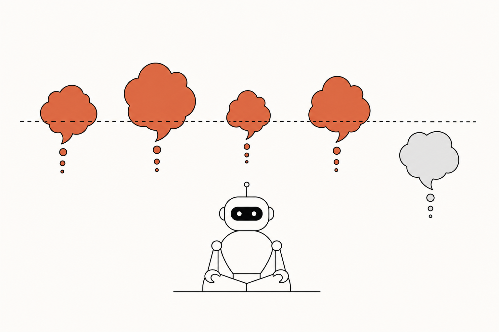
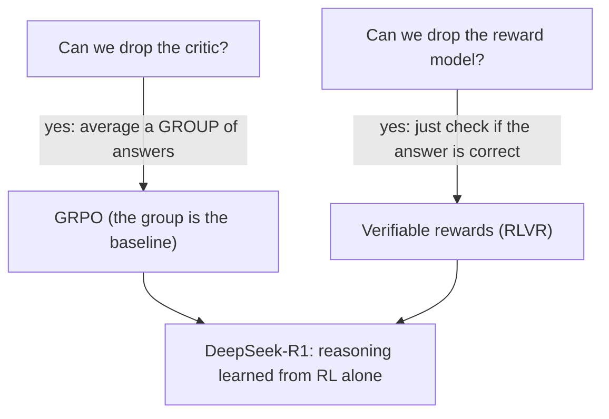
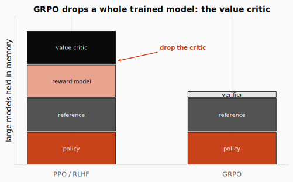
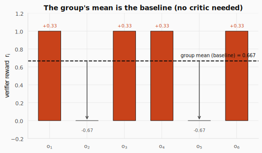
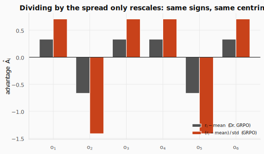
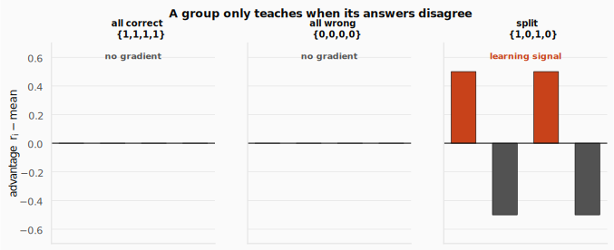
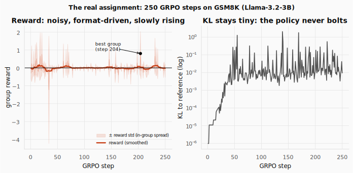
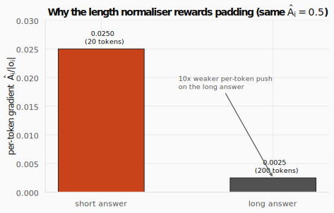

# GRPO: Teaching a Model to Reason by Comparing It to Itself



> **The throughline:** *The value of where I am is the reward I just got, plus a discounted value of where I'll land next.*
> The [RLHF](../07-rlhf/README.md) post aligned a language model with PPO, carrying a *learned* reward model for the signal and a *value-head critic* for the baseline, all on a KL leash. It ended by promising the next idea drops the critic. This post keeps that promise, and then drops the reward model too. What is left is the same gradient we have written since [DP, MC & TD](../03-dp-mc-td/README.md), fed a rule-based reward and a baseline measured from a group of answers. That recipe is exactly what produced **DeepSeek-R1**.

## 1. The intuition

RLHF worked. But look at what it had to carry. To align a model with PPO you hold **four** large models in memory at once: the policy you are training, a frozen reference for the KL leash, a learned reward model that scores answers, and a value-head critic that predicts a per-token baseline. Two of those four are the expensive, fragile passengers this post is about.

**Passenger #1, the reward model.** A whole transformer trained on human preference data, and (as the [RLHF](../07-rlhf/README.md) post showed in its reward-hacking lab) a *proxy* the optimizer learns to fool. It needs expensive labels to train and a KL leash to keep it honest.

**Passenger #2, the critic.** A second network about the size of the policy, whose only job is to estimate $V(s)$ so we can subtract it as a baseline. It doubles the trainable memory, and on a long reasoning chain (where the reward only arrives at the very last token) its per-token predictions hundreds of tokens early are mostly noise.

Now the puzzle that, answered twice, made reasoning models:



**Drop the critic.** The critic exists only to give a baseline, an estimate of "how well do I usually do here?" to subtract from the reward. What if, instead of *learning* that baseline with a network, we *measured* it: sample a **group** of $G$ answers to the same prompt and use their average reward? That is **GRPO**, Group Relative Policy Optimization.

**Drop the reward model.** For a math problem there is a *right answer*. What if the reward were simply "is it correct?", checked by a few lines of code instead of a learned, hackable network? That is a **verifiable reward**.

Put the two together and a base model can *learn to reason from RL alone*. That is the story of this post, and it is the algorithm behind this lecture's lab, adapted from [Unsloth's GRPO notebooks](https://unsloth.ai/docs/get-started/reinforcement-learning-rl-guide#grpo-notebooks), where we train Llama-3.2-3B to solve grade-school math problems by sampling groups of solutions and grading them with rules.

**Here is the one equation everything today builds toward.** Read it loosely now; by the end every symbol is obvious:

$$J(\theta) = \mathbb{E}_{i,t}\Big[\, \min\big(\rho_{i,t}\,\hat{A}_i,\ \text{clip}(\rho_{i,t},\, 1-\varepsilon,\, 1+\varepsilon)\,\hat{A}_i\big)\,\Big] \;-\; \beta\,D_{\text{KL}}(\pi_\theta \,\|\, \pi_{\text{ref}})$$

Read it as: "the objective is PPO's clipped surrogate, averaged over every answer $i$ in the group and every token $t$ in that answer, minus a KL penalty that keeps the policy $\pi_\theta$ near a frozen reference $\pi_{\text{ref}}$." The clip and the ratio $\rho_{i,t}$ are **exactly PPO** from the [TRPO & PPO](../06-trpo-ppo/README.md) post. The only genuinely new thing is the advantage $\hat{A}_i$: it now comes from a group of answers instead of a critic. There is no value network anywhere, and no critic loss term, because there is no critic.



That single deletion, the value critic, is most of the win. The other passenger, the learned reward model, comes off in the next section.

<details>
<summary><strong>Check:</strong> Why is a per-token value function especially unreliable for long chain-of-thought answers?</summary>

**Answer.** The reward is sparse and terminal: it only arrives once the full answer is graded. Asking the critic to predict that eventual reward hundreds of tokens early, before the reasoning has resolved, is a high-variance guess. On long chains those early predictions are mostly noise, so the baseline they provide is shaky exactly where we lean on it most.
</details>

<details>
<summary><strong>Check:</strong> What kind of task is verifiable-reward + GRPO best suited to, and what isn't?</summary>

**Answer.** Best: tasks with a checkable outcome, math, code (run the tests), formal logic, anything with ground truth. Poorly suited: open-ended generation (essays, dialogue, "be helpful") where there is no automatic correctness check. Those still need a learned reward model or human preferences, that is, they stay in the [RLHF](../07-rlhf/README.md) world.
</details>

## 2. The math you need

### 2.1 Verifiable rewards: replace the reward model with a rule

In the [RLHF](../07-rlhf/README.md) post we could not *write* "a good answer," so we *learned* it from human comparisons. The catch was that the learned reward $r_\varphi$ is a proxy with blind spots, and a relentless optimizer sprints toward them: sycophancy, padding, fluent nonsense that scores high. That is reward hacking, and it is the reason RLHF needs a KL leash at all.

Now change the task. Ask the model to compute $2 + 2 \times 3$, or solve an equation, or write a function that passes some tests. Something fundamental shifts: **"good answer" now has a definition a short program can check.** The reward stops being a network and becomes a rule:

$$r(x, y) = \mathbb{1}\big[\,\text{answer}(y) = \text{gold}(x)\,\big] \in \{0, 1\}.$$

Read it as: "the reward is 1 if the answer extracted from the model's output $y$ equals the stored gold answer for prompt $x$, and 0 otherwise." No neural network, no preference data, no parameters to fit. This is **RLVR**, reinforcement learning from verifiable rewards.

The assignment's accuracy reward is exactly this. It extracts whatever the model wrote between `<answer>` tags and compares it to the gold answer, paying out a flat +2 for a match:

```python
def extract_xml_answer(text: str) -> str:
    answer = text.split("<answer>")[-1]
    answer = answer.split("</answer>")[0]
    return answer.strip()

def correctness_reward(response: str, gold: str) -> float:
    # +2 iff the extracted answer equals the gold answer
    return 2.0 if extract_xml_answer(response) == gold else 0.0

good = "<reasoning>\n2 + 2*3 = 2 + 6 = 8\n</reasoning>\n<answer>\n8\n</answer>\n"
bad  = "<reasoning>\nadd first: 4*3 = 12\n</reasoning>\n<answer>\n12\n</answer>\n"
print("extracted (good):", repr(extract_xml_answer(good)))
print("extracted (bad): ", repr(extract_xml_answer(bad)))
print("correctness (good):", correctness_reward(good, gold="8"))
print("correctness (bad): ", correctness_reward(bad, gold="8"))
```

```text title="Output"
extracted (good): '8'
extracted (bad):  '12'
correctness (good): 2.0
correctness (bad):  0.0
```

The wrong answer scores 0 no matter how fluent its reasoning. There is no "style" loophole because style was never on the scoresheet.

On top of correctness, recipes add a small **format reward** that shapes *how* the model presents its work without judging *what* it concludes: did it wrap its reasoning in `<reasoning>` tags and give a clean `<answer>`? The assignment's `count_xml` hands out partial credit for each correct tag and gently penalizes trailing junk after the answer:

```python
def count_xml(text) -> float:
    count = 0.0
    if text.count("<reasoning>\n") == 1: count += 0.125
    if text.count("\n</reasoning>\n") == 1: count += 0.125
    if text.count("\n<answer>\n") == 1:
        count += 0.125
        # punish trailing junk after the answer
        count -= len(text.split("\n</answer>\n")[-1]) * 0.001
    if text.count("\n</answer>") == 1:
        count += 0.125
        count -= (len(text.split("\n</answer>")[-1]) - 1) * 0.001
    return count

clean    = "<reasoning>\nwork\n</reasoning>\n<answer>\n8\n</answer>\n"
trailing = "<reasoning>\nwork\n</reasoning>\n<answer>\n8\n</answer>\nthanks for asking!!"
print("count_xml (clean):   ", round(count_xml(clean), 4))
print("count_xml (trailing):", round(count_xml(trailing), 4))
```

```text title="Output"
count_xml (clean):    0.5
count_xml (trailing): 0.462
```

The clean answer gets the full format reward; the chatty one loses a sliver per trailing character. The total reward is a sum, with correctness weighted heavily so presentation can shape behavior but never outweigh being right:

$$r(x, y) = r_{\text{acc}}(x, y) + \lambda\,r_{\text{fmt}}(x, y), \qquad \lambda \ll 1.$$

Read it as: "reward equals the accuracy term plus a small multiple $\lambda$ of the format term," with $\lambda$ kept tiny so a beautifully formatted wrong answer still loses to a correct one.

<details>
<summary><strong>Check:</strong> Why split the reward into an accuracy part and a format part?</summary>

**Answer.** They target different things. Accuracy drives the model toward correct answers; the format reward shapes presentation (show working in tags, give a parseable final answer) so the output can be graded and the chain-of-thought is encouraged. Keeping the format weight small means style can guide behavior without ever overriding correctness.
</details>

<details>
<summary><strong>Check:</strong> Even with a verifiable reward, what can still be gamed?</summary>

**Answer.** Correctness itself cannot, but the surroundings can: gaming the answer-extractor so the parser misreads, exploiting a weak unit-test suite for code, getting the right answer by a fluke with nonsense working, or padding the chain-of-thought to chase a length-correlated signal. The reward is robust, not invincible, which is exactly what motivates the later variants (DAPO's overlong shaping, Dr. GRPO's length-bias fix).
</details>

<details>
<summary><strong>Check:</strong> If verifiable rewards are so clean, why didn't RLHF just use them?</summary>

**Answer.** RLHF targets open-ended helpfulness, which has no automatic correctness check. You cannot write a rule for "is this a kind, well-pitched explanation," so human preference (a learned reward model) is the only option there. Verifiable rewards exist only where ground truth does.
</details>

### 2.2 The group is the baseline: replace the critic

Now the second deletion. Recall the one fact about advantages that has survived the whole series (from the [DP, MC & TD](../03-dp-mc-td/README.md) and [Policy Gradients](../05-policy-gradients/README.md) posts): the advantage is **reward minus a baseline**, and *any* estimate of expected reward that does not depend on the action you are scoring is a valid, unbiased baseline. The critic was just *one* choice of baseline, a learned network predicting $V(s)$.

GRPO picks the simplest baseline imaginable: **the group's own average.** For a single prompt $q$, sample a group of $G$ answers (in practice $G \in \{8, \dots, 64\}$; the assignment uses 6), score each with the verifier, and standardize:

$$\hat{A}_i = \frac{r_i - \text{mean}(r_1, \dots, r_G)}{\text{std}(r_1, \dots, r_G)}.$$

Read it as: "answer $i$'s advantage is its reward minus the group's mean reward, divided by the group's spread." Two pieces, two jobs. **The mean is the baseline** (the critic's old job, now measured for free): it answers "how well does this model typically do on this prompt?" Subtracting it converts a raw score into a verdict, did this answer beat its siblings or fall short? **The std is just a scale normalizer**, putting every prompt on a comparable "how many standard deviations above average" footing. (Section 4 revisits whether the ÷std should be there at all.)

**A first concrete group of four.** Take the prompt "Compute $2 + 2 \times 3$." The gold answer is 8 (multiplication binds first; the trap answer 12 comes from adding first). Sample $G = 4$ answers and run each through the exact-match verifier:

| answer | verdict | $r_i$ | $\hat{A}_i = (r_i - \mu)/\sigma$ |
|---|---|---|---|
| "$\dots = 8$" | correct | 1 | $+1.0$ |
| "$\dots = 12$" | wrong | 0 | $-1.0$ |
| "$\dots = 8$" | correct | 1 | $+1.0$ |
| "$\dots = 10$" | wrong | 0 | $-1.0$ |

The group supplies its own baseline and scale: $\mu = \text{mean}(1,0,1,0) = 0.5$ and $\sigma = 0.5$, so the two correct answers get $\hat{A} = (1 - 0.5)/0.5 = +1$ and the two wrong ones get $(0 - 0.5)/0.5 = -1$. No critic was queried; the four rewards graded each other. The code below runs the same idea on a group of six:

```python
import numpy as np

def group_advantages(rewards):
    r = np.asarray(rewards, dtype=float)
    # A_i = (r_i - mean) / std
    return (r - r.mean()) / (r.std() + 1e-8)

six = [1, 0, 1, 1, 0, 1]
print("group {1,0,1,1,0,1}: mean=%.3f std=%.3f" % (np.mean(six), np.std(six)))
print("  numerator (r-mean):", np.round(np.array(six) - np.mean(six), 3))
print("  advantages A_i:    ", np.round(group_advantages(six), 3))
print("  centred? sum(r-mean) =", round(float(np.sum(np.array(six) - np.mean(six))), 6))
```

```text title="Output"
group {1,0,1,1,0,1}: mean=0.667 std=0.471
  numerator (r-mean): [ 0.333 -0.667  0.333  0.333 -0.667  0.333]
  advantages A_i:     [ 0.707 -1.414  0.707  0.707 -1.414  0.707]
  centred? sum(r-mean) = 0.0
```

The four correct answers each land above the mean and get a positive push; the two wrong ones get a negative push. Notice the deviations sum to zero by construction, yet not one of them is zero: the baseline being the average is exactly what makes the advantages *well-centered*, not what makes them vanish.



Why is this a legitimate baseline and not a trick? Because it is the same object the critic was approximating, computed more directly. The critic was trained so that $V(s) \to \mathbb{E}[r \mid q]$, the typical reward for this prompt. The group mean is the textbook Monte-Carlo estimate of that very expectation: draw $G$ samples and average them. As $G \to \infty$ the group mean converges to $\mathbb{E}[r \mid q]$. The critic *predicts* the average with a network; GRPO *measures* it from a group drawn fresh for this prompt. Crucially, $\hat{A}_i$ carries a single subscript $i$: **every token of answer $i$ shares the one advantage.** It is an outcome-level signal, not a per-token one. We pay for that simplicity in Section 5, but for a checkable end-of-answer reward it is exactly enough.



Dividing by the spread never flips a sign. Put the raw numerators $r_i - \mu$ next to the full z-scores $(r_i - \mu)/\sigma$ and the two agree on which answers go up and which go down; only the scale changes. That is all the std-normalization ever does, which is why Section 4 can drop it without changing the direction of a single update.

**The degenerate case: all-same, no signal.** One property of this baseline is worth seeing directly. Run the advantage on a uniform group and a split group:

```python
print("all correct {1,1,1,1}:", np.round(group_advantages([1, 1, 1, 1]), 3))
print("all wrong   {0,0,0,0}:", np.round(group_advantages([0, 0, 0, 0]), 3))
print("split       {1,0,1,0}:", np.round(group_advantages([1, 0, 1, 0]), 3))
```

```text title="Output"
all correct {1,1,1,1}: [0. 0. 0. 0.]
all wrong   {0,0,0,0}: [0. 0. 0. 0.]
split       {1,0,1,0}: [ 1. -1.  1. -1.]
```

When every answer agrees, every advantage is zero and the prompt teaches nothing: we drew $G$ rollouts and got no gradient. The signal is strongest exactly when the group is _split_, which is where the model sits on the boundary of being able to solve the problem, and where a gradient step helps most. This is the natural marriage of verifiable rewards and GRPO.



The three panels make it visual: the all-correct and all-wrong groups sit flat at zero, no learning signal at all, while only the split group shows the positive and negative bars that actually move the policy.

<details>
<summary><strong>Check:</strong> If a prompt's group of answers are all correct (every reward = 1), what is each answer's GRPO advantage, and what does that mean for the update?</summary>

**Answer.** Every advantage is zero, so the prompt contributes no gradient. The mean is 1, so $r_i - \text{mean} = 0$ for all answers (the same happens if all are wrong). The group baseline only produces a learning signal when answers *disagree*. This "all-same, no signal" fact is wasteful, and it is exactly what DAPO's dynamic sampling fixes in Section 4.
</details>

### 2.3 The clipped surrogate: borrowed wholesale from PPO

Here GRPO simply reuses PPO. Because we take several gradient steps on the same batch of answers, the live policy $\pi_\theta$ drifts away from the $\pi_{\text{old}}$ that generated them, so we correct for the mismatch with a per-token importance ratio:

$$\rho_{i,t} = \frac{\pi_\theta(o_{i,t} \mid q, o_{i,<t})}{\pi_{\text{old}}(o_{i,t} \mid q, o_{i,<t})}.$$

Read it as: "the ratio for token $t$ of answer $i$ is how much more (or less) likely the new policy makes that token, compared to the old policy that sampled it." This is exactly the ratio from the [TRPO & PPO](../06-trpo-ppo/README.md) post, wearing token-of-an-answer notation. We then combine it with the advantage and clip, character for character PPO's surrogate:

$$\min\big(\rho_{i,t}\,\hat{A}_i,\ \text{clip}(\rho_{i,t},\, 1-\varepsilon,\, 1+\varepsilon)\,\hat{A}_i\big).$$

The clip bounds the ratio to $[1-\varepsilon, 1+\varepsilon]$ (typically $\varepsilon \approx 0.2$) and the outer min ensures the policy is never rewarded for shoving the ratio past the clip in the helpful direction. That is the trust region from the [TRPO & PPO](../06-trpo-ppo/README.md) post, unchanged; the only new thing inside is the group-relative $\hat{A}_i$. (See that post's clip figures for the full $A > 0$ and $A < 0$ pictures, which carry over verbatim.)

```python
def clipped_surrogate(rho, A, eps=0.2):
    # clip(rho, 1-eps, 1+eps)
    clipped = min(max(rho, 1 - eps), 1 + eps)
    # PPO's pessimistic min
    return min(rho * A, clipped * A)

for rho in (1.1, 1.5):
    print("rho=%.1f  A=+1 -> surrogate=%.2f" % (rho, clipped_surrogate(rho, +1.0)))
```

```text title="Output"
rho=1.1  A=+1 -> surrogate=1.10
rho=1.5  A=+1 -> surrogate=1.20
```

At $\rho = 1.1$ the update is inside the trust band and flows freely. At $\rho = 1.5$ the clip bites: the surrogate caps at 1.2, so pushing this token's probability any higher buys nothing and the gradient through it vanishes. The step stays safe.

### 2.4 The KL leash, now a loss term

GRPO keeps one more piece of PPO's stability machinery: a KL penalty pulling the policy toward a frozen reference $\pi_{\text{ref}}$. But it sits in a different place. In classic RLHF the KL-to-reference was folded *into the per-token reward*, subtracted token by token. GRPO instead adds it as a separate term in the loss, using an unbiased, always-positive estimator so the penalty behaves well:

$$-\,\beta\,D_{\text{KL}}(\pi_\theta \,\|\, \pi_{\text{ref}}), \qquad D_{\text{KL}} \approx \frac{\pi_{\text{ref}}}{\pi_\theta} - \log\frac{\pi_{\text{ref}}}{\pi_\theta} - 1.$$

Read it as: "subtract $\beta$ times the KL divergence from the reference, where the KL is estimated per token by a quantity that is zero when the policies agree and positive otherwise." The coefficient $\beta$ sets how hard the leash pulls.

```python
import math
def kl_unbiased(logp_theta, logp_ref):
    # pi_ref / pi_theta
    ratio = math.exp(logp_ref - logp_theta)
    # >= 0, and 0 when the policies match
    return ratio - (logp_ref - logp_theta) - 1

print("theta == ref    -> %.4f" % kl_unbiased(-1.0, -1.0))
print("theta drifted   -> %.4f" % kl_unbiased(-1.0, -1.5))
```

```text title="Output"
theta == ref    -> 0.0000
theta drifted   -> 0.1065
```

The estimator is exactly zero when the policy matches the reference and grows as it drifts. There is a twist worth knowing: for pure-reasoning runs with a genuinely verifiable reward, many recipes **drop the KL term entirely** ($\beta = 0$). With little to hack, there is less reason to anchor near the reference, and cutting the leash lets the model move further toward correct reasoning. The assignment keeps a small KL (we will see it stay around 0.01 in the logs).

### 2.5 The full objective, assembled

Stack the four pieces: the group-relative advantage, the per-token ratio, the clip, and the KL. Average the clipped surrogate twice, over the $G$ answers and over each answer's tokens, then subtract the penalty:

$$J(\theta) = \frac{1}{G}\sum_{i=1}^{G} \frac{1}{|o_i|}\sum_{t=1}^{|o_i|} \min\big(\rho_{i,t}\,\hat{A}_i,\ \text{clip}(\rho_{i,t},\, 1-\varepsilon,\, 1+\varepsilon)\,\hat{A}_i\big) \;-\; \beta\,D_{\text{KL}}(\pi_\theta \,\|\, \pi_{\text{ref}}).$$

Maximize it and you have the actor update, with no critic loss term because there is no critic. Every symbol, in one legend:

| Symbol | Meaning |
|---|---|
| $q$ | the prompt |
| $G$ | group size, number of answers sampled per prompt (e.g. 8–64; the assignment uses 6) |
| $o_i,\ \lvert o_i\rvert$ | the $i$-th answer and its length in tokens |
| $o_{i,t},\ o_{i,<t}$ | the $t$-th token of answer $i$, and the tokens before it |
| $r_i$ | verifier reward for answer $i$ |
| $\hat{A}_i$ | group-relative advantage, shared by all tokens of $o_i$ |
| $\rho_{i,t}$ | per-token importance ratio $\pi_\theta/\pi_{\text{old}}$ |
| $\varepsilon$ | clip width, typically $\approx 0.2$ |
| $\beta$ | KL-penalty strength (sometimes 0) |
| $\pi_{\text{ref}}$ | frozen reference policy the leash anchors to |

**This is PPO with the critic swapped for the group.** If you understood why PPO clips, you already understand most of GRPO. Only two things changed: the advantage now comes from a group instead of a value network, and the KL moved out of the reward and into the loss.

<details>
<summary><strong>Check:</strong> Where did the clip and the ratio in the GRPO objective come from?</summary>

**Answer.** Straight from PPO (the [TRPO & PPO](../06-trpo-ppo/README.md) post). GRPO changes only the advantage (group-relative instead of return-minus-critic) and where the KL lives. The "take a safe step by clipping the ratio" machinery is untouched, which is why GRPO is still a policy-gradient method.
</details>

<details>
<summary><strong>Check:</strong> In GRPO every token of an answer shares the same advantage. Contrast that with PPO's per-token advantage. What is gained and lost?</summary>

**Answer.** Gained: simplicity and no critic, one outcome reward, one group baseline, one advantage per answer. Lost: fine-grained credit assignment, GRPO cannot say "this particular token was the good move," only "this whole answer beat its siblings." For outcome-checkable tasks that coarse signal is enough; for dense per-step rewards PPO's per-token value is more informative.
</details>

### 2.6 The GRPO loop in code

We now have every part the objective named; time to run it. Before the GPU-scale lab, here is the _entire_ GRPO algorithm in about 30 lines, on a task small enough to finish in a second on a CPU. The "prompts" are integers $0\dots4$; the "answer" is a single token; the verifiable reward is +1 if the token equals the prompt. No critic, no reward model, just a group baseline and PPO's clip. Watch the policy learn purely from comparing each answer to its siblings:

```python
import torch

torch.manual_seed(0)
# the correct answer for prompt p is the token p
N_PROMPTS = VOCAB = 5
G, EPS, LR, STEPS, INNER = 16, 0.2, 0.3, 80, 2

# uniform policy at start
logits = torch.zeros(N_PROMPTS, VOCAB, requires_grad=True)
opt = torch.optim.SGD([logits], lr=LR)


# the verifiable reward: correct or not
def verify(prompt, token):
    return 1.0 if token == prompt else 0.0


for step in range(STEPS):
    # pi_old: frozen snapshot
    old_logp = torch.log_softmax(logits, -1).detach()
    P, S, ADV, R = [], [], [], []
    for p in range(N_PROMPTS):
        # GROUP of G answers to prompt p
        toks = torch.distributions.Categorical(logits=old_logp[p]).sample((G,))
        r = torch.tensor([verify(p, int(t)) for t in toks])
        # group-relative advantage
        A = (r - r.mean()) / (r.std() + 1e-8)
        P += [p] * G; S.append(toks); ADV.append(A); R.append(r)
    P = torch.tensor(P); S = torch.cat(S); ADV = torch.cat(ADV); R = torch.cat(R)

    # reuse the batch a few times
    for _ in range(INNER):
        logp = torch.log_softmax(logits, -1)[P, S]
        # rho = pi_theta / pi_old
        ratio = torch.exp(logp - old_logp[P, S])
        surr = torch.min(ratio * ADV, torch.clamp(ratio, 1 - EPS, 1 + EPS) * ADV)
        # maximise the clipped surrogate
        loss = -surr.mean()
        opt.zero_grad(); loss.backward(); opt.step()

    if step % 16 == 0 or step == STEPS - 1:
        probs = torch.softmax(logits, -1).detach()
        p_correct = probs[torch.arange(N_PROMPTS), torch.arange(N_PROMPTS)].mean()
        print(f"step {step:2d}   group reward = {R.mean():.3f}   P(correct) = {p_correct:.3f}")
```

```text title="Output"
step  0   group reward = 0.200   P(correct) = 0.209
step 16   group reward = 0.425   P(correct) = 0.424
step 32   group reward = 0.738   P(correct) = 0.688
step 48   group reward = 0.788   P(correct) = 0.847
step 64   group reward = 0.875   P(correct) = 0.912
step 79   group reward = 0.962   P(correct) = 0.939
```

From a uniform policy (20% correct, pure chance) the model climbs to 96% group reward and a 94% probability on the right answer, with nothing but a verifiable check and a group baseline. Every line maps to a box in the objective: `old_logp` is $\pi_{\text{old}}$, the `Categorical.sample((G,))` is the group, `(r - r.mean())/r.std()` is $\hat{A}_i$, `torch.exp(logp - old_logp)` is $\rho_{i,t}$, and the `torch.min(... clamp ...)` is the clipped surrogate. (Answers here are a single token, so $|o_i| = 1$ and every token "sharing" the advantage is trivial; in the real thing an answer is hundreds of tokens, all sharing the one $\hat{A}_i$.)

### 2.7 GRPO at scale: GSM8K with TRL

The lab (adapted from [Unsloth's GRPO notebooks](https://unsloth.ai/docs/get-started/reinforcement-learning-rl-guide#grpo-notebooks)) runs the same algorithm at scale, with the clip-and-advantage internals handled by TRL's `GRPOTrainer`. Your job is the part that is genuinely GRPO-specific: the verifiable rewards (Section 2.1), the group size $G$, and the wiring. The reward functions are passed as a _list_, summed per answer, then turned into group-relative advantages internally:

```python
training_args = GRPOConfig(
    learning_rate = 5e-6,
    # num_generations is G, the group size
    num_generations = 6,
    max_prompt_length = 256,
    max_completion_length = 768,
    max_steps = 250,
    max_grad_norm = 0.1,
    # report_to = "wandb"  -> uncomment to log the reward/kl curves
)

trainer = GRPOTrainer(
    # Llama-3.2-3B + LoRA, no value head
    model = model,
    processing_class = tokenizer,
    # summed per answer, then group-normalised by TRL
    reward_funcs = [
        # partial credit for clean XML tags
        xmlcount_reward_func,
        soft_format_reward_func,
        strict_format_reward_func,
        # answer is a number
        int_reward_func,
        # +2 if the answer matches the gold (the real signal)
        correctness_reward_func,
    ],
    args = training_args,
    # openai/gsm8k, 7,473 grade-school problems
    train_dataset = dataset,
)
trainer.train()
```

```text title="Output"
==((====))==  Unsloth - 2x faster free finetuning | Num GPUs used = 1
   Num examples = 7,473 | Num Epochs = 1 | Total steps = 250
   Batch size per device = 6 | Gradient accumulation steps = 1 | Total batch size = 6
   Trainable parameters = 48,627,712 of 3,261,377,536 (1.49% trained)
...
TrainOutput(global_step=250, training_loss=0.0211,
            metrics={'train_runtime': 8032.6, 'train_steps_per_second': 0.031})
```

Notice what is _not_ there: no value head (the model is loaded without one), no reward model (the five `reward_funcs` are plain Python), and only LoRA adapters train (1.49% of the weights). The whole run fits on a single 14.5 GB T4, which is the entire point of dropping the critic.

What do the logs show over 250 steps? Be patient, as the notebook warns: "you'll probably get 0 reward for the first 100 steps." The reward is noisy and stays low, and crucially it is **mostly driven by the format reward, not correctness**: on a 3B model in two hours, the group-mean correctness reward is non-zero in only 19 of 250 steps (peaking when 4 of 6 answers in a group are right). The KL to reference stays tiny throughout, around 0.01, so the policy never bolts.



The two panels show that story. On the left the reward curve is noisy and only drifts up slowly, with a wide band for the in-group spread and a best group near step 204; on the right the KL to the reference stays tiny on a log scale, confirming the policy never bolts. This short demo run teaches the _machinery_ (sample a group, verify, advantage, clipped step) and the _format shaping_, while real reasoning gains need bigger models, longer chains, and many more steps, exactly the regime DeepSeek-R1 ran (Section 3). The `reward_std` column is the thing to watch: it is non-zero precisely on the prompts where the group disagrees, which (Section 2.2) is where every bit of the learning actually happens.

## 3. The DeepSeek revolution

GRPO began life as a quiet efficiency trick. It first appeared in the **DeepSeekMath** paper (2024, arXiv:2402.03300) described undramatically as "a variant of PPO that enhances mathematical reasoning while concurrently optimizing the memory usage of PPO." The motivation was exactly Section 1: the value network is expensive, so drop it and use the group. No one called it a revolution.

The revolution came when DeepSeek pointed it at a *base* model with verifiable rewards and let it run. **DeepSeek-R1-Zero** (Jan 2025, arXiv:2501.12948) took a base LLM with *no supervised fine-tuning on reasoning traces at all* and applied pure GRPO with a verifiable reward: +1 for the correct final answer, a little for clean formatting, 0 otherwise. Nothing in the loop ever judged the *reasoning*.

And it worked. The model spontaneously developed long chains of thought, self-reflection, answer verification, and the habit of re-trying strategies, behaviors nobody hand-coded. The paper highlights an **"aha moment"**: mid-solution, the model writes something like *"wait, let me re-evaluate that step,"* backtracks, and fixes its own error.


Nothing told it to do this. The only pressure was the verifiable reward for getting the final answer right, and re-checking your work *raises the probability of a correct answer*, which raises the reward, which GRPO reinforces. **Reasoning emerged as a strategy the model discovered for earning reward**, not a behavior taught by example.

R1-Zero reasoned well but wrote messily (mixed languages, hard to read), so **DeepSeek-R1** added a small "cold-start" SFT for readability, then the same GRPO RL, then a final cleanup pass. The result rivaled OpenAI's o1 on reasoning, and DeepSeek released the weights and the recipe. That openness is why every lab now runs GRPO-style training: it needed no human-preference dataset and no closed reward model, so anyone could reproduce it cheaply.

<details>
<summary><strong>Check:</strong> R1-Zero used no supervised reasoning data, yet learned long, self-correcting chains of thought. Where did that behavior come from?</summary>

**Answer.** It was reinforced because it raised the verifiable reward. The only signal was "is the final answer correct?" Longer deliberation, checking intermediate steps, and re-trying after a mistake all increase the chance of a correct answer, so GRPO made them more likely. The deep lesson: with a clean reward and enough RL, capability can be *incentivized* rather than demonstrated.
</details>

<details>
<summary><strong>Check:</strong> Why was using a base model (not an instruction-tuned one) for R1-Zero such a striking choice?</summary>

**Answer.** It showed reasoning did not need to be bootstrapped from human demonstrations at all: pure RL on raw next-token weights was enough to grow it. That challenged the assumption that you must first SFT on curated reasoning traces, and suggested RL can *discover* capabilities, not only sharpen demonstrated ones.
</details>

<details>
<summary><strong>Check:</strong> Why did R1 add a small cold-start SFT that R1-Zero skipped?</summary>

**Answer.** R1-Zero reasoned well but produced unreadable output (language mixing, poor formatting) because nothing rewarded readability. A little curated SFT before RL gave it a clean, human-friendly starting style, which the subsequent GRPO preserved while improving reasoning, trading a touch of purity for a much more usable model.
</details>

## 4. Fixing GRPO's rough edges: DAPO and Dr. GRPO

Once everyone ran vanilla GRPO, three weak spots showed up. **Entropy collapse:** the policy becomes over-confident too fast, stops exploring, and plateaus. **Wasted prompts:** all-correct or all-wrong groups give zero gradient (the all-same case in Section 2.2). **Hidden biases:** the way GRPO averages and normalizes quietly rewards longer answers and over-weights easy prompts. Two responses matter most, and both are small edits to the same gradient.

**DAPO** (ByteDance, 2025, arXiv:2503.14476) stacks four fixes onto GRPO and reached 50 on AIME 2024 with a Qwen2.5-32B base, publishing every detail:

- **Clip-Higher.** Split the single $\varepsilon$ into a lower and an upper bound and raise the upper one ($\varepsilon_{\text{high}} > \varepsilon_{\text{low}}$, e.g. 0.28 vs 0.2). A symmetric clip caps how fast *any* token's probability can rise, so rare exploratory tokens with positive advantage hit the ceiling and never grow, and entropy collapses. Raising only the upper bound gives good-but-rare tokens room to climb, keeping exploration alive.
- **Dynamic Sampling.** Over-sample and filter: discard all-correct and all-wrong groups (zero gradient) and keep only ones that disagree. This is not throwing away data, those groups carry no signal, so every prompt in the batch now moves the policy.
- **Token-level loss.** Average over all tokens in the batch at once instead of per-answer-then-per-group, so long correct answers are not under-counted.
- **Overlong shaping.** Apply a soft, growing penalty to runaway-length completions instead of a hard cutoff, reducing reward noise without abruptly punishing borderline answers.

**Dr. GRPO** (Sea AI Lab, 2025, arXiv:2503.20783) makes a sharper claim: vanilla GRPO contains two *biases* hiding in its normalizers, and removing them gives an unbiased estimator.

**Length bias** comes from dividing each answer's loss by its token count ($1/|o_i|$). A long answer's many tokens each get a small share of the gradient, so a long *wrong* answer is barely discouraged per token, and over training the model drifts toward ever-longer outputs:

```python
A = 0.5
for L in (20, 200):
    print("answer length %3d tokens -> per-token push = %.4f" % (L, A / L))
```

```text title="Output"
answer length  20 tokens -> per-token push = 0.0250
answer length 200 tokens -> per-token push = 0.0025
```

Same advantage, a 10x weaker push on the long answer. Flip the sign for a wrong answer and the long one is penalized 10x less per token: the model learns to pad. Dr. GRPO drops the length division so a wrong answer is penalized the same regardless of length.



The two bars make the bias concrete. At the same advantage, the 20-token answer gets a per-token push of 0.025 while the 200-token answer gets only 0.0025, a 10x weaker signal purely because it is longer. Dropping the length division levels the two bars, so a wrong answer is discouraged the same amount no matter how many tokens it spans.

**Difficulty bias** comes from the ÷std: dividing by the group's spread over-weights low-variance (easy) prompts, where tiny reward differences get blown up. Dr. GRPO removes that too, leaving the plain mean-centered advantage:

$$\hat{A}_i = \frac{r_i - \text{mean}(r)}{\text{std}(r)} \ \longrightarrow\ \hat{A}_i = r_i - \text{mean}(r) \quad \text{(no ÷std, no ÷length)}.$$

Read it as: "keep the group mean as the baseline, but stop dividing by the spread and by the answer length." The baseline idea is untouched; only the two distorting normalizers are gone.

The common thread: **every variant tweaks the advantage, the clip, or the sampling, and nothing else.** DAPO changes the clip and the sampling; Dr. GRPO changes the advantage. Two more worth knowing do the same elsewhere: **GSPO** (Qwen) clips at the *sequence* level instead of per token, steadier for very long answers and MoE models, and **CISPO** (MiniMax) clips the importance weights so reflective low-probability tokens survive.

| | GRPO | DAPO | Dr. GRPO |
|---|---|---|---|
| **Clip** | symmetric $[1-\varepsilon, 1+\varepsilon]$ | decoupled, raised upper | same as GRPO |
| **Sampling** | fixed group per prompt | dynamic: drop all-same, resample | same as GRPO |
| **Loss aggregation** | per-answer then mean | token-level over the batch | no length division |
| **Normalization** | ÷std and ÷length | keeps ÷std; overlong shaping | removes both |
| **KL term** | optional $\beta$ | often dropped | dropped |

<details>
<summary><strong>Check:</strong> How does clip-higher combat entropy collapse, mechanically?</summary>

**Answer.** A symmetric clip caps how much any token's probability can rise in one step (factor $1+\varepsilon$). Rare exploratory tokens with positive advantage hit that cap and stop growing, so mass piles onto a few high-probability tokens and entropy falls toward zero. Raising the upper bound lets those good-but-rare tokens keep gaining probability, preserving spread, that is, exploration.
</details>

<details>
<summary><strong>Check:</strong> Your GRPO run's outputs keep getting longer epoch after epoch with no gain in accuracy. Which fix addresses this, and why?</summary>

**Answer.** Both DAPO's overlong shaping (a soft penalty on runaway length) and Dr. GRPO's removal of the $1/|o_i|$ length division attack it. The un-fixed objective rewards length because dividing a wrong answer's loss by its many tokens makes each token's penalty tiny, so long mistakes are barely discouraged. Drop the length normalizer and you would expect average completion length to stop drifting upward, since a wrong answer is now penalized the same per token regardless of how long it is.
</details>

## 5. GRPO vs PPO: when to use which

GRPO did not replace PPO; it found a better fit for one important shape of problem. Read the table top to bottom and watch the critic, and everything attached to it, disappear while the stability machinery (clip, KL) stays put.

| | PPO / RLHF | GRPO |
|---|---|---|
| **Baseline** | learned value critic $V(s)$ | group mean reward (no network) |
| **Advantage** | GAE over a trajectory | group-normalized $(r_i - \text{mean})/\text{std}$ |
| **Models in memory** | policy + ref + reward + value $\approx 4$ | policy + ref + verifier $\approx 2$–3 |
| **Reward source** | typically a learned reward model | typically a verifiable function |
| **Clip + KL** | keeps both | keeps both |
| **Rollouts per update** | 1 sample per prompt | $G$ samples per prompt |
| **Best fit** | dense/shaped rewards, long continuous control | one checkable answer (math, code, logic) |

The trade is about the shape of your reward and your episodes. **Reach for PPO** when rewards are dense and arrive throughout long, expensive episodes (robotics, games, continuous control): there a learned critic earns its memory by producing low-variance per-step advantages from a single trajectory. **Reach for GRPO** when there is one checkable outcome at the end and sampling a group is cheap and parallel: there the group mean is a free Monte-Carlo baseline and the critic is pure overhead. Classic RL lives in the first world; LLM reasoning lives in the second.

<details>
<summary><strong>Check:</strong> Why is sampling a group of G answers an acceptable cost, when training a critic was not?</summary>

**Answer.** Generation is forward-only, embarrassingly parallel, and runs on fast inference engines, so sampling G answers mostly costs time, not a second set of trainable weights and optimizer state. A critic doubles the trained-model memory, must itself be learned, and is unreliable on long chains. You trade a hard training problem for cheap parallel sampling.
</details>

<details>
<summary><strong>Check:</strong> You are training a controller with a dense per-step reward and long, expensive episodes. GRPO or PPO?</summary>

**Answer.** PPO. The reward is dense and per-step, so a learned critic can produce a low-variance per-step advantage that uses every timestep, where GRPO would collapse the whole episode to one outcome number. And the episodes are long and expensive, so you cannot cheaply draw a group of $G$ per starting state for a Monte-Carlo baseline. This is the classic-RL world the critic was built for.
</details>

## 6. GRPO in the wild

In a real training stack the bottleneck is **generation**, because GRPO's whole added cost over single-sample methods is producing a group of $G$ answers per prompt, every step. So production GRPO leans on a fast rollout engine (SGLang, vLLM) to sample the group while a trainer applies the clipped update and ships fresh weights back. (The assignment uses Unsloth's vLLM-backed fast generation for exactly this reason.)

The failure modes are the ones the variants exist to fix: **entropy collapse** (over-confident too fast, exploration dies, answered by clip-higher and an entropy bonus), **length hacking** (answers balloon to chase a length-correlated signal, answered by Dr. GRPO and overlong shaping), and **reward gaming** (a loophole that scores without solving, answered by harder verifiers and better tests). The key knobs: group size $G$ (bigger gives a lower-variance baseline at more compute), clip $\varepsilon$ / $\varepsilon_{\text{high}}$, KL weight $\beta$ (often 0 for pure reasoning), and dynamic sampling on or off.

<details>
<summary><strong>Check:</strong> Many reasoning runs set the KL weight β to 0. When is that safe, and when is it risky?</summary>

**Answer.** Safe when the reward is genuinely verifiable, so correctness cannot be hacked and there is little benefit to anchoring near the reference, while removing the leash lets the model move further toward correct reasoning. Risky when the reward is exploitable or you care about preserving general abilities and safety, where dropping the KL invites drift and reward-gaming and you keep $\beta > 0$, RLHF-style.
</details>

<details>
<summary><strong>Check:</strong> How does group size G trade off against the quality of the baseline?</summary>

**Answer.** The group mean is a Monte-Carlo estimate of the expected reward, so a larger G gives a lower-variance, more accurate baseline (and more contrast within the group), stabilizing the advantage, at the cost of more generation per prompt. Too-small G makes the baseline noisy; teams pick G to balance signal quality against rollout compute.
</details>

## 7. Putting it all together

Everything above is one machine. Here is the recap of what we built, mapping each concept to the math and the code already shown inline:

| Concept | Math | In code |
|---|---|---|
| Verifiable reward | $r = \mathbb{1}[\text{answer} = \text{gold}]$ | `2.0 if extract_xml_answer(r) == gold else 0.0` |
| Group baseline | $\mu = \frac{1}{G}\sum_j r_j$ | `r.mean()` over the group |
| Group advantage | $\hat{A}_i = (r_i - \mu)/\sigma$ | `(r - r.mean()) / (r.std() + 1e-8)` |
| Importance ratio | $\rho = \pi_\theta/\pi_{\text{old}}$ | `torch.exp(logp - old_logp)` |
| Clipped surrogate | $\min(\rho \hat{A},\ \text{clip}(\rho)\hat{A})$ | `torch.min(ratio*ADV, clamp(ratio,1-eps,1+eps)*ADV)` |

The complete, runnable program, the toy GRPO loop from Section 2.6 and the full GSM8K run from Section 2.7, is packaged as a notebook you can run and extend in the [assignment](https://github.com/S1LV3RJ1NX/RL-in-Production-Bootcamp-Resources/blob/main/assignments/lecture6.ipynb).

## 8. It was the same gradient all along

Six lectures, one update rule. GRPO did not change the gradient; it changed where the baseline and the reward come from. Translate every RL term into its reasoning-RL meaning and only two rows differ from the [RLHF](../07-rlhf/README.md) post:

| RL | GRPO reasoning |
|---|---|
| state | prompt + tokens so far |
| action | the next token |
| policy | the reasoning model |
| reward | **verifiable: is the answer correct?** |
| baseline | **the group's mean (no critic)** |
| episode | one full solution attempt |

$$\nabla_\theta J = \mathbb{E}\big[\, \hat{A} \cdot \nabla_\theta \log \pi_\theta \,\big]$$

Read it as: "push up the log-probability of answers that beat the baseline (positive $\hat{A}$), push down the ones that fell short, weighted by how much." The **group** replaces the critic; a **verifiable check** replaces the reward model; the **clip** still keeps each step safe. It is the same gradient we wrote on the first day of the [DP, MC & TD](../03-dp-mc-td/README.md) post, the same one that drove [Policy Gradients](../05-policy-gradients/README.md), [TRPO & PPO](../06-trpo-ppo/README.md), and [RLHF](../07-rlhf/README.md). We only ever changed how we estimate the advantage and where the reward comes from.

## Check your understanding

<details>
<summary><strong>Check:</strong> Why does a verifiable reward resist the reward-hacking you saw in RLHF?</summary>

**Answer.** A learned reward model is an approximation with blind spots the optimizer can exploit (verbosity, sycophancy). A rule that checks "is the final answer correct?" has no such soft spots: a wrong answer scores 0 no matter how fluent or flattering. You can still game the *format* or the parser, but not the correctness, which is why a verifiable-reward run can optimize hard without collapsing into reward-hacked nonsense.
</details>

<details>
<summary><strong>Check:</strong> Dynamic sampling discards all-correct and all-wrong groups. Why is that not throwing away data?</summary>

**Answer.** Those groups have zero advantage for every member (every reward equals the group mean), so they contribute exactly zero gradient. Keeping them just burns the forward and backward compute. Filtering them and resampling means every group in the batch actually moves the policy, so you get more learning per unit compute, not less.
</details>

<details>
<summary><strong>Check:</strong> A bug makes a reward format-only (it pays out for a well-formed answer regardless of correctness). What does the policy converge to, and why doesn't the group baseline save you?</summary>

**Answer.** The policy converges to producing perfectly-formatted answers of any content, because that is all the reward measures. The group baseline does not help: if every answer is equally well-formatted, every reward is the same, the mean equals that value, and every advantage is 0, so there is no signal pulling toward correctness. The gradient only ever points where the reward actually varies, and here it varies with format, not truth.
</details>

<details>
<summary><strong>Check:</strong> Why does open-sourcing R1 matter so much for the field?</summary>

**Answer.** It published both the weights and a simple, reproducible recipe (GRPO + verifiable rewards) that needed no massive human-preference dataset and no closed reward model. Suddenly any lab could train strong reasoners cheaply, which is why GRPO and its variants exploded across 2025.
</details>

---

## Practice: assignment

> **[Assignment: GRPO](https://github.com/S1LV3RJ1NX/RL-in-Production-Bootcamp-Resources/blob/main/assignments/lecture6.ipynb)**

## Where this goes next

GRPO gave us reasoning from a single verifiable outcome per prompt: sample a group, grade each answer with a rule, compare to the group's average, take a clipped step. The final post makes two moves. First it _simplifies_: Direct Preference Optimization reaches the same aligned model as RLHF while firing both the reward model and the RL loop. Then it _expands_: it points the same group-relative gradient at a _long, multi-step world_, where an "answer" becomes a _trajectory of tool calls_ and the model stops answering and starts acting as an **agent**, reading observations and earning a reward only after a whole episode. Same $\nabla_\theta J = \mathbb{E}[\hat{A} \cdot \nabla_\theta \log \pi_\theta]$, a new shape of episode, in the [DPO & Agentic RL](../09-dpo-and-agentic-rl/README.md) post.
