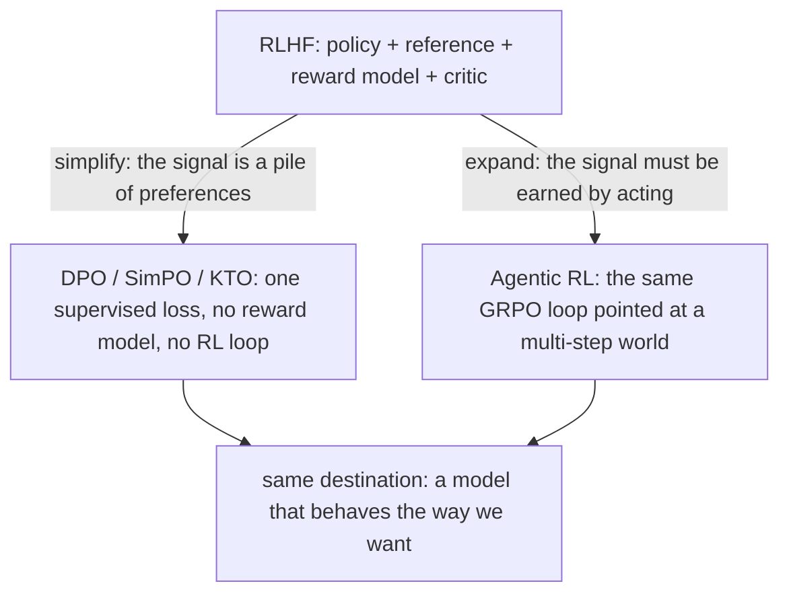
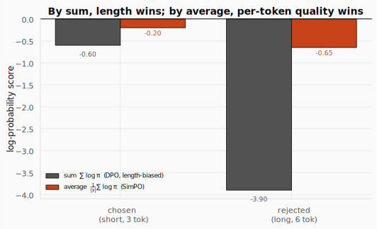
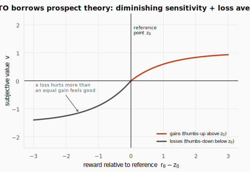
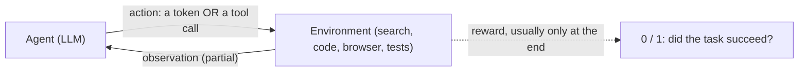
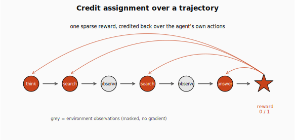
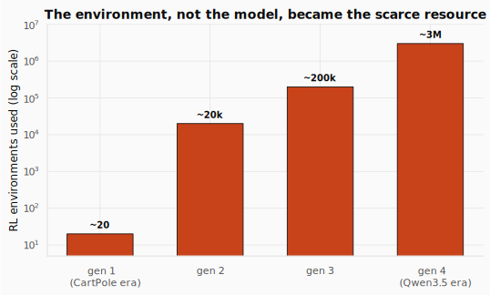

# DPO and Agentic RL: Align Without a Reward Model, Then Step Into the World


> **The throughline:** *The value of where I am is the reward I just got, plus a discounted value of where I'll land next.*
> The [GRPO](../08-grpo/README.md) post ended by pointing at agents: an "answer" becoming a *trajectory of tool calls*, the reward arriving after a whole episode of acting. This post delivers that, but takes one simplifying detour first. [RLHF](../07-rlhf/README.md) aligned a model with a learned reward model and a KL leash; GRPO dropped the critic and the reward model for *verifiable* tasks. **DPO** drops even more: for preference data it throws away the reward model *and* the RL loop, leaving a single supervised loss. Then **Agentic RL** spends everything we saved, pointing the same $\nabla J = \mathbb{E}[A \cdot \nabla \log \pi]$ at a world the model must act in.

## 1. The intuition: simplify, or expand

Look back at what [RLHF](../07-rlhf/README.md) had to carry. To align a model with PPO you held **four** large models in memory: the policy you train, a frozen reference for the KL leash, a learned reward model that scores answers, and a value critic for the baseline. [GRPO](../08-grpo/README.md) deleted two of them: the critic (the group is the baseline) and, for checkable tasks, the reward model (a rule replaces it).

This lecture makes the two final moves, in opposite directions.



**Simplify (DPO).** When all you have is a stack of preference cards ("answer A beat answer B"), the reward model adds nothing the preferences did not already contain. So skip it: train the model on the preferences *directly*, with a loss as stable and cheap as ordinary supervised learning. No reward model, no sampling, no RL loop.

**Expand (Agentic RL).** When the reward must be *earned by acting*, there are no fixed preference pairs to learn from. The model has to search, run code, look closer, or click, across many steps, and only then is it judged. That is the GRPO machine again, pointed at an interactive world instead of a single answer.

A kitchen makes the first move concrete. Picture RLHF as a restaurant: a chef (the model) learning to cook, a hired food critic (the reward model) scoring every plate, and a manager (the RL loop) coaching the chef toward higher scores. **DPO fires the critic and the manager** and still gets a better chef, because the diner cards, studied directly, were enough all along.

<details>
<summary><strong>Check:</strong> The reward model is trained only on the human preference pairs. What extra information does it add beyond those pairs?</summary>

**Answer.** None. The reward model just *repackages* the same preference pairs into a score; it invents no new signal. That is the crack DPO walks through: if the only truth is the preferences, train the model on them directly and skip the middleman.
</details>

## 2. The DPO math you need

### 2.1 Why a naive push falls apart, and the fix

The most obvious idea in the world: we have a pair where a human preferred $y_w$ (the winner) over $y_l$ (the loser), so make the model put **more** probability on $y_w$ and **less** on $y_l$. More of this, less of that.

Push that naively, with no brakes, and the model drifts. It inflates a few phrases, loses fluency, and forgets what it knew, because "raise the chosen, lower the rejected" with constant strength has no anchor and never stops. We saw the same failure in [RLHF](../07-rlhf/README.md): optimize a signal too hard and the policy runs off into reward-hacked nonsense, which is why RLHF needed a **KL leash** to a frozen reference.

DPO's fix is to bake that leash into the rule itself. Score an answer not by its raw probability but by **how much more likely the policy makes it than the reference did**. The frozen reference $\pi_{\text{ref}}$ (your supervised-fine-tuned model) is the anchor; an answer is rewarded only for rising *above* where the reference already had it.

### 2.2 The implicit reward: the policy is its own reward model

That phrase, "how much more likely than the reference," is a number we can write down. It is the **implicit reward**:

$$\hat{r}(x, y) = \beta \log \frac{\pi_\theta(y \mid x)}{\pi_{\text{ref}}(y \mid x)}.$$

Read it as: "the reward of response $y$ to prompt $x$ is the temperature $\beta$ times the log-ratio of how likely the trained policy $\pi_\theta$ makes $y$ versus how likely the frozen reference $\pi_{\text{ref}}$ made it." If the policy has raised $y$'s probability above the reference, the log-ratio is positive and the reward is positive; if it pushed $y$ down, the reward is negative. The knob $\beta$ scales how sharply that gap counts.

The striking part: there is **no separate network**. The policy's own probabilities, read against the frozen reference, *are* the reward. We never needed to train a reward model; we just read the score off the model's own behavior. (Section 2.5 proves this is not a hack but the exact reward implied by the RLHF objective.)

A language model scores a whole response by summing its per-token log-probabilities (multiplication in probability space is addition in log space), so each $\log \pi(y \mid x)$ above is itself a sum:

$$\log \pi(y \mid x) = \sum_t \log \pi(y_t \mid x, y_{<t}).$$

Read it as: "the log-probability of the response is the sum, over its tokens, of each token's log-probability given everything before it." Recall this is the same autoregressive factorization from the [RLHF](../07-rlhf/README.md) post; nothing new, just the bookkeeping that turns two strings into two numbers.

### 2.3 The DPO loss: a ranking loss on implicit rewards

Now state the goal in one line: make the chosen answer's implicit reward beat the rejected one's. Feed the gap through a logistic and take the negative log:

$$\mathcal{L}_{\text{DPO}} = -\log \sigma\!\left( \beta \log \frac{\pi_\theta(y_w)}{\pi_{\text{ref}}(y_w)} - \beta \log \frac{\pi_\theta(y_l)}{\pi_{\text{ref}}(y_l)} \right), \qquad \sigma(z) = \frac{1}{1 + e^{-z}}.$$

Read it as: "each bracketed term is an answer's implicit reward (§2.2); their difference is the **margin** between chosen ($y_w$) and rejected ($y_l$); $\sigma$ turns that margin into 'how confidently did we rank them right?'; the negative log makes a confident-correct ranking cheap and a wrong one expensive." This is exactly the Bradley-Terry loss you would use to train a reward-model classifier (the [RLHF](../07-rlhf/README.md) post), with the reward replaced by the implicit reward. The reward model and the policy optimization have fused into one supervised step.

Here is the whole loss in code, with the four log-probabilities it needs:

```python
import math

def sigmoid(z):
    return 1.0 / (1.0 + math.exp(-z))

def dpo_loss(logp_w, logp_l, ref_w, ref_l, beta=0.1):
    r_w = beta * (logp_w - ref_w)              # implicit reward of the chosen answer
    r_l = beta * (logp_l - ref_l)              # implicit reward of the rejected answer
    margin = r_w - r_l                         # m = r_hat(y_w) - r_hat(y_l)
    loss = -math.log(sigmoid(margin))          # -log sigma(m)
    return loss, r_w, r_l, margin

loss, r_w, r_l, m = dpo_loss(logp_w=-1.4, logp_l=-2.2, ref_w=-2.2, ref_l=-1.8)
print(f"implicit reward chosen   r_w = {r_w:+.3f}")
print(f"implicit reward rejected r_l = {r_l:+.3f}")
print(f"margin                     m = {m:+.3f}")
print(f"DPO loss                     = {loss:.3f}")
```

```text title="Output"
implicit reward chosen   r_w = +0.080
implicit reward rejected r_l = -0.040
margin                     m = +0.120
DPO loss                     = 0.635
```

Four log-probs in, one loss out: no reward model, no sampling, no rollouts. The positive margin says the policy already ranks this pair correctly, so the loss is modest (just under the coin-flip value $-\ln 0.5 \approx 0.69$).

### 2.4 The gradient: push hardest on the pairs you get wrong

Differentiate that loss and you get the update DPO actually applies. It factors cleanly into a weight times a direction:

$$\nabla_\theta \mathcal{L}_{\text{DPO}} = -\,\beta\, \underbrace{\sigma\big(\hat{r}_l - \hat{r}_w\big)}_{\text{weight: how wrong we are}} \big[\, \underbrace{\nabla_\theta \log \pi_\theta(y_w)}_{\text{push chosen up}} - \underbrace{\nabla_\theta \log \pi_\theta(y_l)}_{\text{push rejected down}} \,\big].$$

Read it as: "the update is a scalar weight, the sigmoid of the *reversed* margin, times a contrastive direction that simultaneously raises the chosen answer's probability and lowers the rejected one's." The direction is always "lift the winner, suppress the loser." The weight is the clever part: it is large when the pair is currently **mis-ranked** ($\hat{r}_l > \hat{r}_w$ makes the sigmoid exceed 0.5) and shrinks toward zero once the pair is **confidently correct**.

```python
def grad_weight(margin, beta=0.1):
    return beta * sigmoid(-margin)             # beta * sigma(r_l - r_w) = beta * sigma(-m)

for mm in (-0.5, 0.0, 0.12, 1.0):
    print(f"margin {mm:+.2f}  ->  weight {grad_weight(mm):.4f}")
```

```text title="Output"
margin -0.50  ->  weight 0.0622
margin +0.00  ->  weight 0.0500
margin +0.12  ->  weight 0.0470
margin +1.00  ->  weight 0.0269
```

A mis-ranked pair (negative margin) gets the strongest push; a comfortably-correct pair (margin +1.0) gets barely a nudge. **This data-dependent weight is exactly what makes DPO stable.** Delete it and you are back to "raise the winner, lower the loser" forever, with no signal to stop, which is the runaway degeneration from §2.1.

<details>
<summary><strong>Check:</strong> People say DPO is "secretly reward modelling," yet we never trained a reward model. In what sense is that true?</summary>

**Answer.** The reward is still there, just *implicit*: an answer's reward is $\beta \log(\pi_\theta / \pi_{\text{ref}})$, how much more likely the policy makes it than the reference does. The policy's own probabilities *are* the reward model; we read the score off it instead of training a separate network.
</details>

<details>
<summary><strong>Check:</strong> Everything is measured against the reference. What breaks if we drop it and push raw probabilities?</summary>

**Answer.** Without an anchor the model can drive the chosen answer's probability (and anything correlated with it) up without bound, inflating phrases, collapsing diversity, and drifting off fluent language. The reference is DPO's leash; remove it and the push has no brakes.
</details>

<details>
<summary><strong>Check:</strong> Mid-training the model mis-ranks a pair (so r_l > r_w). What happens to the gradient weight, and is that what we want?</summary>

**Answer.** The reversed margin $\hat{r}_l - \hat{r}_w$ is now positive, so $\sigma$ of it climbs above 0.5 toward $\beta$: the weight grows and the update pushes *hard* to fix the mis-ranking. Exactly right. DPO spends its gradient on the pairs it currently gets wrong and eases off once a pair is comfortably correct.
</details>

### 2.5 Why this is RLHF in disguise (one clean derivation)

The implicit reward looks too convenient. Why is $\beta \log(\pi_\theta / \pi_{\text{ref}})$ the *right* reward, and not an ad-hoc trick? Because it falls straight out of the RLHF objective. Here is the whole argument in four steps; the only tool is rewriting an expression until the answer is obvious.

**Step 1, the optimal policy.** RLHF maximizes expected reward minus a KL penalty to the reference (the [RLHF](../07-rlhf/README.md) objective, with temperature $\beta$):

$$\max_{\pi}\ \mathbb{E}_{y\sim\pi}\big[r(x, y)\big] - \beta\, \text{KL}\big(\pi(\cdot \mid x)\,\|\,\pi_{\text{ref}}(\cdot \mid x)\big).$$

For *any* reward $r$, the policy that maximizes this has a closed form:

$$\pi^*(y \mid x) = \frac{1}{Z(x)}\, \pi_{\text{ref}}(y \mid x)\, \exp\!\Big(\tfrac{1}{\beta} r(x, y)\Big),$$

where $Z(x) = \sum_y \pi_{\text{ref}}(y\mid x)\exp(\tfrac1\beta r(x,y))$ is a normalizer (the partition function) that depends on the prompt but not on any one response. Read it as: "the best policy is the reference *reshaped* by the reward, multiplying up responses with high reward by $\exp(r/\beta)$ and renormalizing." (You get this by rewriting the objective as $-\beta\,\text{KL}(\pi \,\|\, \pi^*)$ plus a constant; KL is minimized at zero when $\pi = \pi^*$.)

**Step 2, read it backwards.** Take logs of that optimum and solve for the reward:

$$r(x, y) = \beta \log \frac{\pi^*(y \mid x)}{\pi_{\text{ref}}(y \mid x)} + \beta \log Z(x).$$

Read it as: "the reward is the implicit reward (the log-ratio) plus a prompt-only term $\beta \log Z(x)$." The reward is no longer a mysterious network; it is written entirely in terms of policies, plus one annoying intractable term $Z(x)$.

**Step 3, the partition function cancels.** Human data comes as comparisons, and the Bradley-Terry model says the probability a human prefers $y_w$ over $y_l$ is $\sigma$ of the reward *difference*. Substitute the reward from Step 2 for both responses:

$$r(x, y_w) - r(x, y_l) = \beta \log \frac{\pi^*(y_w)}{\pi_{\text{ref}}(y_w)} - \beta \log \frac{\pi^*(y_l)}{\pi_{\text{ref}}(y_l)}.$$

Both responses share the same prompt, hence the same $Z(x)$, so the two $\beta \log Z(x)$ terms are identical and **cancel exactly**. The intractable normalizer is gone. Anything that depended only on the prompt washed out the moment we compared two responses to it.

**Step 4, the loss.** Replace the unknown optimum $\pi^*$ with our trainable $\pi_\theta$ and ask which parameters make the observed preferences most likely. That maximum-likelihood objective is exactly $\mathcal{L}_{\text{DPO}}$ from §2.3. So:

> **One line to remember.** DPO optimizes the *exact* RLHF objective with a single classification loss, no reward model and no RL.

The information you lose by skipping the explicit reward model, that prompt-only $\beta \log Z(x)$ shift, is exactly the information that never affected the policy in the first place. (Rafailov et al., 2023, [*Your Language Model is Secretly a Reward Model*](https://arxiv.org/abs/2305.18290).)

<details>
<summary><strong>Check:</strong> Why does the intractable partition function Z(x) not stop us, when computing it directly is hopeless?</summary>

**Answer.** Because preferences only ever use the *difference* of two rewards for the same prompt, and $Z(x)$ depends only on the prompt. It appears identically in both rewards and cancels in the subtraction, so we never have to evaluate it.
</details>

<details>
<summary><strong>Check:</strong> DPO never samples from the model during training. What is the upside, and the hidden limitation?</summary>

**Answer.** Upside: it trains like supervised learning on a fixed dataset, stable, cheap, no rollouts. Limitation: it is *offline*. It can only judge the fixed pairs, never fresh answers the model invents. The moment a reward must be *earned by acting*, you need online RL again, which is exactly the agentic setting in the second half.
</details>

## 3. DPO worked end to end, every number

Take one real preference and walk it to a gradient step. Fix $\beta = 0.1$.

- **Prompt $x$:** "Should I put all my savings into one stock?"
- **Chosen $y_w$:** "No, putting everything in one stock is risky; spread it across a low-cost index fund."
- **Rejected $y_l$:** "Yes, go all in."

**Score each answer.** Run both through $\pi_\theta$ and $\pi_{\text{ref}}$, sum the per-token log-probs, and subtract to get each response's log-ratio $\Delta(y) = \log \pi_\theta(y) - \log \pi_{\text{ref}}(y)$:

| | $\log \pi_\theta$ | $\log \pi_{\text{ref}}$ | $\Delta(y)$ |
|---|---|---|---|
| chosen $y_w$ | $-1.4$ | $-2.2$ | $+0.80$ |
| rejected $y_l$ | $-2.2$ | $-1.8$ | $-0.40$ |

Two paragraphs of text have collapsed to two scalars: $\Delta(y_w) = +0.80$ (the policy likes the prudent answer *more* than the reference did) and $\Delta(y_l) = -0.40$ (it already disprefers the reckless one). Everything downstream touches only these two numbers.

**Reward, margin, loss.** Scale by $\beta$ to get implicit rewards, subtract for the margin, push through the loss. These are the §2.3 outputs: $\hat{r}_w = 0.1 \times 0.80 = +0.08$, $\hat{r}_l = 0.1 \times (-0.40) = -0.04$, margin $m = +0.12$, and $\mathcal{L} = -\log \sigma(0.12) \approx 0.635$. The pair is ranked correctly but only barely, so there is plenty of room to improve.

**The gradient.** From §2.4, the weight is $\beta \cdot \sigma(-m) = 0.1 \times \sigma(-0.12) = 0.047$. That single small number scales the whole contrastive step: nudge $y_w$ up and $y_l$ down, gently, because the pair is already (just) correct.


**Turn the temperature up.** Re-run the same scored pair at $\beta = 0.5$ instead of $0.1$:

```python
loss5, r_w5, r_l5, m5 = dpo_loss(-1.4, -2.2, -2.2, -1.8, beta=0.5)
print(f"r_w = {r_w5:+.2f}   r_l = {r_l5:+.2f}   margin = {m5:+.2f}")
print(f"loss = {loss5:.3f}   weight = {grad_weight(m5, beta=0.5):.3f}")
```

```text title="Output"
r_w = +0.40   r_l = -0.20   margin = +0.60
loss = 0.437   weight = 0.177
```

A larger $\beta$ does two things at once: it *sharpens* the reward (the same log-ratio now maps to a five-times-larger reward, so the margin grows from 0.12 to 0.60 and the loss falls) and it *enlarges* the step (the weight grows from 0.047 to 0.177). Temperature is not only a leash on drift; it directly scales both the reward you read off the policy and the size of every update.

**The recipe, in three steps.** (1) **SFT first** on good demonstrations; the result *is* your frozen reference $\pi_{\text{ref}}$. (2) **Collect preference triples** $(x, y_w, y_l)$, once, ahead of time. (3) **Run the single DPO loss** over them, supervised-style. In practice this is a few lines with TRL's `DPOTrainer`: hand it the SFT model and the preference dataset, set $\beta$, and train as if it were ordinary fine-tuning.

<details>
<summary><strong>Check:</strong> In the worked pair the margin is already positive (+0.12). Why is the loss still nonzero, and why is that fine?</summary>

**Answer.** $\sigma(0.12) \approx 0.53$, so $-\log \sigma(0.12) \approx 0.635$, just below the coin-flip loss of 0.69. The model ranks the pair correctly but not *confidently*, so a small loss (and a small-weight update) keeps nudging it toward a clearer separation. A perfectly confident pair would drive the loss toward 0.
</details>

## 4. Two variations worth knowing: SimPO and KTO

DPO turned alignment into one loss, but it still asks for two things: a frozen reference model kept in memory the whole run, and *paired* data (a chosen and a rejected answer for every prompt). Two popular variations relax exactly those constraints. The core never changes: raise the relative likelihood of the preferred output with a single offline loss.

### 4.1 SimPO: drop the reference, fix the length bias

DPO leaves three things on the table, and spotting them is the whole motivation for SimPO. First, the **reference model** sits in memory the entire run, so you pay for two models to train one. Second, a **length bias**: DPO scores a response by the *sum* of its token log-probs, and more tokens means more terms, so the score drifts with length and the model learns it can move the loss just by rambling. Third, a **train/generate mismatch**: at decoding time we rank candidates by their *average* log-probability per token, but DPO trains on a reference-relative *sum*. The quantity you optimize is not the quantity you later select on.

SimPO's claim is that all three share one cure: score a response by its **own average log-probability per token**, and nothing else. "Its own" kills the reference model; "average per token" kills the length bias and matches what decoding does. It also adds a target margin $\gamma$ so the chosen must win by a clear gap, not a hair:

$$\mathcal{L}_{\text{SimPO}} = -\log \sigma\!\left( \frac{\beta}{|y_w|}\sum_t \log \pi_\theta(y_{w,t}) - \frac{\beta}{|y_l|}\sum_t \log \pi_\theta(y_{l,t}) - \gamma \right).$$

Read it as: "same logistic ranking loss as DPO, but each answer's score is now its average log-probability per token (the sum divided by the length $|y|$), there is no $\pi_{\text{ref}}$ anywhere, and we subtract a target margin $\gamma$ so the loss stays high until the chosen beats the rejected by at least $\gamma$." The $\beta$ still sharpens the gap before the sigmoid, exactly as in DPO, but now it multiplies a raw average log-prob rather than a reference ratio.

```python
def avg_logprob(token_logps):
    return sum(token_logps) / len(token_logps)        # (1/|y|) * sum log pi

def simpo_loss(logps_w, logps_l, beta=2.0, gamma=1.0):
    s_w = beta * avg_logprob(logps_w)                 # reference-free, length-normalised
    s_l = beta * avg_logprob(logps_l)
    margin = s_w - s_l - gamma                         # demand a clear gap gamma
    return -math.log(sigmoid(margin)), s_w, s_l

chosen = [-0.20, -0.30, -0.10]                         # short, confident answer
rejected = [-0.50, -0.60, -0.70, -0.60, -0.80, -0.70]  # long, mediocre answer
print(f"sum  log-prob:  chosen {sum(chosen):+.2f}   rejected {sum(rejected):+.2f}  (length-biased)")
print(f"avg  log-prob:  chosen {avg_logprob(chosen):+.3f}   rejected {avg_logprob(rejected):+.3f}")
sl, s_w, s_l = simpo_loss(chosen, rejected)
print(f"SimPO scores:   s_w {s_w:+.2f}   s_l {s_l:+.2f}   loss {sl:.3f}")
```

```text title="Output"
sum  log-prob:  chosen -0.60   rejected -3.90  (length-biased)
avg  log-prob:  chosen -0.200   rejected -0.650
SimPO scores:   s_w -0.40   s_l -1.30   loss 0.744
```

Look at the two scoring rules side by side. By **sum**, the longer rejected answer scores $-3.90$ versus the chosen's $-0.60$: the length gap dominates, and a longer answer accumulates a bigger magnitude just by having more tokens. By **average**, the per-token quality is what shows: the confident short answer ($-0.20$/token) cleanly beats the rambly one ($-0.65$/token). The averaging is the length fix.



In practice SimPO's $\beta$ is much larger than DPO's (around 2.0 to 2.5 versus DPO's 0.1) because the length-normalized reward lives on a smaller numeric scale and needs more amplification. The cost of going reference-free: removing $\pi_{\text{ref}}$ also removes the implicit KL anchor, so SimPO can drift further and is more hyperparameter-sensitive; $\gamma$ and the normalization now do the stabilizing the reference used to. (Meng et al., 2024.)

<details>
<summary><strong>Check:</strong> SimPO length-normalises the score. What bias does that remove, and where did it come from in plain DPO?</summary>

**Answer.** Plain DPO scores an answer by the *sum* of its token log-probs, which grows in magnitude simply because there are more tokens, so longer answers get a mechanical edge and the model drifts wordier. SimPO scores by the *average* per token, so length no longer tips the scales (and it matches the metric decoding actually ranks by).
</details>

### 4.2 KTO: learn from a lone thumbs-up

SimPO kept DPO's paired data. KTO attacks that assumption. Real feedback is rarely a matched A-vs-B pair: a user clicks a thumbs-up or thumbs-down, a reviewer accepts or rejects, a reply gets a like or a dislike. Each is a verdict on *one* response in isolation, and DPO's loss is a comparison, so a lone thumb has nothing to subtract against. Curated pairs are expensive; unpaired thumbs are everywhere and nearly free.

KTO borrows a model of human judgement from behavioural economics. **Kahneman-Tversky prospect theory** says we do not judge an outcome by its absolute value, but as a *gain or loss relative to a reference point*, with two distortions: **diminishing sensitivity** (the value curve is an S-shape that flattens far from the reference) and **loss aversion** (a loss hurts about twice as much as an equal gain feels good). KTO turns that human value curve into a training loss:

$$r_\theta(x, y) = \beta \log \frac{\pi_\theta(y \mid x)}{\pi_{\text{ref}}(y \mid x)}, \qquad v(x, y) = \begin{cases} \lambda_D\, \sigma\big(r_\theta - z_0\big) & y \text{ is desirable (thumbs-up)} \\ \lambda_U\, \sigma\big(z_0 - r_\theta\big) & y \text{ is undesirable (thumbs-down)} \end{cases}$$

Read it as: "the implicit reward $r_\theta$ is the *same* one DPO uses (the policy scores itself against the reference); the reference point $z_0$ is 'what counts as a normal reward right now', estimated as the batch KL; for a thumbs-up we reward the amount its reward sits *above* $z_0$, for a thumbs-down we reward the amount it sits *below* $z_0$; $\sigma$ gives the S-shaped diminishing sensitivity, and the separate weights $\lambda_D, \lambda_U$ encode loss aversion." The loss is then $\mathcal{L}_{\text{KTO}} = \mathbb{E}[\lambda_y - v(x, y)]$, so minimizing it *maximizes* the value $v$: push desirable answers above the reference point, undesirable ones below, each judged alone.

```python
def kto_value(r_theta, z0, desirable, lam_D=1.0, lam_U=1.5):
    if desirable:
        return lam_D * sigmoid(r_theta - z0)          # thumbs-up wants reward ABOVE baseline
    return lam_U * sigmoid(z0 - r_theta)              # thumbs-down wants reward BELOW baseline

z0 = 0.0
for label, r, des in [("thumbs-up, above z0", +0.5, True),
                      ("thumbs-up, below z0", -0.5, True),
                      ("thumbs-down, below z0", -0.5, False),
                      ("thumbs-down, above z0", +0.5, False)]:
    print(f"{label:24s}: v = {kto_value(r, z0, des):.3f}")
```

```text title="Output"
thumbs-up, above z0     : v = 0.622
thumbs-up, below z0     : v = 0.378
thumbs-down, below z0   : v = 0.934
thumbs-down, above z0   : v = 0.566
```

Two things to read off. A thumbs-up scores higher when its reward is above the baseline (0.622 vs 0.378) and a thumbs-down scores higher when its reward is below it (0.934 vs 0.566): the value function pulls each example in the right direction with no partner needed. And because $\lambda_U = 1.5 > \lambda_D = 1.0$, the satisfied thumbs-down (0.934) outweighs the satisfied thumbs-up (0.622): a dislike avoided matters more than a like earned, which is loss aversion, and it also rebalances logs that contain far more dislikes than likes.



<details>
<summary><strong>Check:</strong> KTO learns from single thumbs-up/down instead of A-vs-B pairs. Why is that a big practical deal?</summary>

**Answer.** Unpaired thumbs are everywhere and cheap (every product has like/dislike buttons), often around 10x cheaper to collect than curated pairs with a clean winner and loser for the same prompt. KTO lets you align on the abundant signal you already have.
</details>

### 4.3 The three, side by side, and when to leave them

Each variation changes one thing about DPO and keeps the core.

| | DPO | SimPO | KTO |
|---|---|---|---|
| **Data** | paired | paired | unpaired (like / dislike) |
| **Reference model** | required | none | required |
| **Reward inside $\sigma$** | $\beta \log \tfrac{\pi_\theta}{\pi_{\text{ref}}}$ | $\tfrac{\beta}{\lvert y\rvert}\sum \log \pi_\theta$ | $\beta \log \tfrac{\pi_\theta}{\pi_{\text{ref}}}$ vs $z_0$ |
| **Extra term** | (none) | margin $\gamma$ | loss-averse weights $\lambda_D, \lambda_U$ |
| **Theory** | Bradley-Terry | Bradley-Terry + length-norm | Kahneman-Tversky |
| **Main win** | no reward model, no PPO | + no reference, no length bias | cheap binary feedback |

But the whole DPO family shares one ceiling: it is **offline**. It learns from a fixed set of preferences and never samples from the model. The moment the reward must be *earned by acting*, with no fixed pairs to learn from, we are back to on-policy RL.

| | DPO and variants | PPO / GRPO |
|---|---|---|
| **Data** | a fixed set of preferences / labels | a live reward you can query |
| **Sampling** | none, offline, supervised-style | on-policy rollouts every step |
| **Models** | policy + (optional) reference | policy + reference + reward/verifier (+ critic) |
| **Best for** | style, tone, helpfulness from prefs | verifiable or interactive tasks: math, code, agents |

That right-hand column is the bridge to the rest of this post.

<details>
<summary><strong>Check:</strong> SimPO and KTO change DPO in different ways but keep the same core. What is that unchanging core?</summary>

**Answer.** Raise the (relative) likelihood of the preferred output and lower the rejected one, with a single offline, supervised-style loss and *no reward model and no RL loop*. Everything else (paired vs unpaired, reference vs reference-free, sum vs average) is a knob on that one idea.
</details>

<details>
<summary><strong>Check:</strong> Why was DPO enough for chat, but not for an agent that uses tools?</summary>

**Answer.** DPO is offline: it needs a fixed dataset of (prompt, chosen, rejected) triples and never samples the model. An agent's reward is *interactive*, it exists only once the agent acts and you see the outcome, so there is no pre-collected set of good-vs-bad trajectories to hand a preference loss. You must generate trajectories with the current policy and score them live, which is on-policy RL.
</details>

## 5. From alignment to agents

Everything so far, RLHF, DPO, SimPO, KTO, aligns a model that answers *once*: a prompt goes in, a response comes out, it is scored a single time. As a decision problem that is one step, with full information and immediate feedback. In RL language it is a **degenerate one-step MDP**.

An agent faces something genuinely larger.


At each turn the agent emits an **action**: text *and/or* a tool call (search, run code, zoom into an image, click a button). The environment returns an **observation**, the tool's output, which the agent did not choose and cannot control. The **state** is the whole running context so far: the prompt, every action taken, and every observation returned. The agent plans over a horizon and acts on incomplete information, because it only ever sees what the environment reveals. This is a multi-step, partially-observed problem, formally a **POMDP**.



| | RLHF / DPO (alignment) | Agentic RL |
|---|---|---|
| **Horizon** | one turn | many turns |
| **Observation** | the full prompt, seen at once | partial, grows turn by turn as tool outputs arrive |
| **Action** | one response | text *and* tool calls; the action space grew beyond language |
| **Reward** | once, on the response | often only at the end; sparse and delayed |

The intuition: alignment is answering an exam question. Agentic RL is doing a research project. You take an action (look something up), the world answers (you find a paper), you take another action conditioned on that answer, and only at the very end is the project judged good or bad.

### 5.1 The agentic MDP, made precise

It helps to write the MDP components down, because the differences from single-turn RL are exactly the sources of difficulty. In single-turn LLM RL the state is just the token context, the action is the next token, the transition deterministically appends that token, and the reward lands once on the finished rollout. The agentic version generalizes every row (this framing follows Cameron Wolfe's [*Agentic RL*](https://cameronrwolfe.substack.com/p/agentic-rl) overview):

- **State**: a *joint* state, the LLM-visible context (instructions, generated tokens, tool calls, observations) *plus* any external environment state the agent can modify (a filesystem, a database, a web page).
- **Action**: the agent's output at a step. At the lowest level a sampled token; in aggregate, sequences of tokens that form tool calls.
- **Transition**: text actions append tokens as before, but tool calls also *change the environment* and return observations, so the transition can be **non-deterministic**, unlike the single-turn case.
- **Reward**: terminal (outcome) reward, sometimes with intermediate process rewards at the step level.

**One episode, concretely.** "When did the lead author of GRPO last publish?" with only a web-search tool:

- **t1, think:** "I do not know this; I should find the lead author, then their latest paper."
- **t2, act:** `search("GRPO paper authors")`.
- **t3, observe:** a results list (points to DeepSeekMath).
- **t4, act:** `search("DeepSeekMath first author recent papers")`.
- **t5, observe:** a profile page with a publication list.
- **t6, answer:** read off the most recent date and reply.
- **end, reward:** 1 if the date matches ground truth, else 0. One number for the whole six-turn episode.

Two features drive everything that follows. Only the model's own tokens (the think, act, and answer turns) are its **actions**; the observations at t3 and t5 were returned by the world. And the reward is **verifiable but sparse**: a clean 0/1 at the end, nothing in between. RL's job is to take that single end-reward and make the *good decisions along the way* more likely: searching instead of guessing, refining the query, stopping at the right time. That is the credit-assignment problem (the [Policy Gradients](../05-policy-gradients/README.md) post) stretched over an entire trajectory.



<details>
<summary><strong>Check:</strong> In single-turn RLHF the "MDP" was called degenerate. Name the two things the agentic setting adds that make it a real sequential-decision problem.</summary>

**Answer.** (1) **Multiple steps** before any reward: the agent takes a whole sequence of actions (tool calls, observations) that affect each other, so there is real temporal credit assignment. (2) **Partial observability**: it acts on what the environment chooses to reveal, not the full state. Single-turn RLHF had exactly one step and full information, which is why it was degenerate.
</details>

## 6. Agentic RL in the wild

Five real systems, each trained with RL, each unlocking a different capability. The most instructive is DeepEyes, so work it in full, then the others fall into the same pattern.

### 6.1 DeepEyes: learning to "think with images"

A vision-language model encodes a picture into a *fixed, limited* number of visual tokens. On a high-resolution photo, a small or distant detail (a far-off road sign, a tiny label) is blurred away in that compression: the model does not overlook it, it literally cannot resolve it. Humans zoom in on the relevant region, look closer, then reason. Can a model learn to do that on its own?

DeepEyes (arXiv [2505.14362](https://arxiv.org/abs/2505.14362)) gives the model one visual tool, **zoom-in**, alongside text. Mid-reasoning it can emit grounding coordinates (a bounding box); the environment crops and zooms that region and feeds the high-resolution patch back as a new image observation. The result is an interleaved visual chain of thought: text, image, text, image, the picture becoming a scratchpad the model edits and re-reads.

> **Worked episode.** "What does the small sign in the distance say?"
> - **t1, think:** "That sign is tiny in the full frame; I cannot read it. I should look closer."
> - **t2, act:** emit a bounding box around the sign, a zoom tool call.
> - **t3, observe:** the environment returns the cropped, zoomed patch, now legible. *(masked, see §7.1)*
> - **t4, think:** "Now I can read it. It says No Parking."
> - **t5, answer:** "No Parking." Reward 1 if correct.

DeepEyes is trained **purely with RL**, no SFT cold-start and no separate grounding model. It starts from a base 7B vision-LLM (Qwen2.5-VL-7B) and uses the [GRPO](../08-grpo/README.md) machine, sample a group of full trajectories per question, score them, push toward the better ones, now with a visual tool in the action space. The reward has three parts:

| Component | What it does |
|---|---|
| **Accuracy** | Is the final answer correct? The main, verifiable signal. |
| **Tool-use** | A model can ignore the zoom and guess. A reward for *actually using* the tool when it helps **bootstraps** the behaviour, until accuracy alone can sustain it. |
| **Format** | Well-formed tool calls and answer structure, so the environment can parse the box and act. |

The tool-use term is the key trick. Early in training the model is not yet good enough for zooming to pay off in accuracy, so a pure accuracy reward would give it no reason to ever zoom, and the behaviour would never appear. The small tool-use reward gets zooming off the ground; once the model is competent, accuracy takes over and the scaffold can be annealed away. (We will reproduce exactly this bootstrap in the §10 capstone.)

**Nobody told the model to zoom.** It was never shown a "first zoom, then answer" demonstration; RL discovered the strategy because zooming led to correct answers, which earned reward. And the behaviour sharpens in three stages: **explore** (zooms almost at random, limited benefit), **exploit** (zooms aggressively, and it starts working), **refine** (zooms *selectively*, only when it helps). Human-like behaviours appear on their own: visual search, region comparison, confirmation before committing, and hallucination mitigation (look first, then answer, so it invents fewer details).

### 6.2 The same recipe, four more worlds

The point of DeepEyes is that it is *not* a special case. The identical recipe recurs across the literature, each instance just swapping the tool and the verifier:

- **Search (Search-R1, arXiv [2503.09516](https://arxiv.org/abs/2503.09516)).** Multi-hop question answering; the agent interleaves reasoning with live search calls, writing its own queries. Reward on final-answer correctness only. RL turns retrieval from a fixed pre-step ("always fetch, then answer") into a *learned decision*: search only when needed, refine the query when results disappoint. About +41% over RAG baselines (Qwen2.5-7B).
- **Code (ReTool / ToolRL).** Hard math and logic; the agent writes and runs code mid-reasoning, reads the result back, and continues. Outcome reward on the final answer. The model stops doing brittle arithmetic in its head and learns to *offload* the exact parts to a tool.
- **GUIs (UI-TARS, arXiv [2501.12326](https://arxiv.org/abs/2501.12326)).** Complete real GUI tasks from screenshots alone; actions are human-like mouse and keyboard events. Refined with multi-turn RL, it beats wrapped GPT-4o / Claude pipelines on 10+ GUI benchmarks. Operating a computer is the ultimate long-horizon environment; RL taught recovery from mis-clicks and multi-step plans no single-shot prompt could script.
- **Software (SWE-RL / SWE-Gym).** Resolve a real GitHub issue: navigate the repo, edit files, run the tests, over many steps. The reward is simply whether the **tests pass**, a clean verifiable signal (the [GRPO](../08-grpo/README.md) idea in a multi-step environment). RL connects reasoning to ground truth: the agent is rewarded for code that *works*, not code that looks plausible.

**The common machine.** (1) Widen the action space beyond tokens (zoom, search, code, click, test). (2) Let the agent take many steps before judging it. (3) Reward the verifiable outcome, usually 0/1 at the end. (4) Optimize on-policy with GRPO/PPO: sample whole trajectories, score them, push toward the better ones. That is exactly the [GRPO](../08-grpo/README.md) machine (group baseline + verifiable reward + clipped update), pointed at an interactive world.

<details>
<summary><strong>Check:</strong> Remove DeepEyes' tool-use reward and keep only accuracy and format. Early in training, why might zooming never emerge, yet later the tool-use reward can be annealed to zero safely?</summary>

**Explanation.** Early on the model is bad at grounding, so a zoom rarely improves the answer; with only an accuracy reward, zooming and guessing look equally (un)rewarding, and there is nothing to single out the zoom, so it never gets reinforced. The tool-use reward pays the model just for zooming, getting the behaviour off the ground. Once the model zooms competently, correct zooms reliably earn the accuracy reward on their own, so the tool-use scaffold is redundant and can be removed without the behaviour collapsing.
</details>

## 7. How agents are trained

The objective does not change: it is still GRPO/PPO, still "make good behaviour more likely." What changes is the *rollout*, and two details of the rollout are where almost all agentic-RL bugs live.

### 7.1 Masking: train on the agent's actions, not the world's replies

A rollout interleaves two kinds of tokens: the ones the model **generated** (its thoughts, actions, tool calls, answer) and the ones the environment **inserted** (search results, stack traces, a returned image patch). They sit side by side in one context, but one is an action the policy is responsible for and the other is an observation it merely received.

> **The masking rule.** The policy-gradient loss is computed *only* on the tokens the model generated, never on environment tokens. Every observation token gets a loss mask of 0.

The failure mode if you get this wrong is concrete: training on environment tokens teaches the model to *predict*, and therefore to *hallucinate*, tool outputs it cannot control. It learns to write plausible-looking search results instead of issuing a real search and reading the real ones, and the gradient is polluted with text the agent never authored. This is the single most common implementation bug in agentic RL, and it is invisible until you check the mask.

```python
import torch

tokens = ["Q:", "<think>", "search(", "GRPO", ")", "[RESULT:DeepSeek]", "answer", "=", "2024"]
#          prompt  -------------- agent action tokens --------------   env obs   --- agent ---
action_mask = torch.tensor([0, 1, 1, 1, 1, 0, 1, 1, 1], dtype=torch.float32)   # 1 = agent, 0 = world
per_token_logp = torch.tensor([-0.1, -0.7, -1.2, -0.3, -0.4, -2.5, -0.6, -0.5, -0.9])
advantage = 0.8                                        # one group-relative advantage, whole answer

contrib = -advantage * per_token_logp * action_mask    # masked policy-gradient surrogate
print("trained on", int(action_mask.sum().item()), "of", len(tokens), "tokens")
print("masked term:", [round(x, 3) for x in contrib.tolist()])
print("env tokens (idx 0, 5) zeroed ->", contrib[0].item(), contrib[5].item())
```

```text title="Output"
trained on 7 of 9 tokens
masked term: [0.0, 0.56, 0.96, 0.24, 0.32, 0.0, 0.48, 0.4, 0.72]
env tokens (idx 0, 5) zeroed -> 0.0 0.0
```

The prompt token and the `[RESULT:...]` observation contribute exactly zero; only the agent's own decisions feed the gradient. A clean way to remember it: **you only reinforce decisions, and the agent's only decisions are the tokens it wrote.**

### 7.2 Where the reward lives

The second choice is how much reward signal you give, and when. An **outcome reward** is a single signal at the end (did the answer verify, did the tests pass): the cleanest, most honest signal, but maximally sparse. A **process reward** adds intermediate signals (a useful search, an edit that compiles, a partial test pass): denser and easier to learn from, but a proxy that can be gamed. The tension is real: too sparse and credit assignment is brutal (which of six turns earned the single +1?); too shaped and the model farms the intermediate bonuses without solving the task. Masking and reward placement are the two knobs with no analogue in DPO; everything else is the GRPO loop you already built.

### 7.3 Why it is hard, and the toolkit

Long horizons make every part harder at once: **credit assignment** (one reward after twenty steps, which action mattered?), **sparse reward** (most trajectories fail and score 0, and a group of all-failures carries no gradient, the [GRPO](../08-grpo/README.md) dynamic-sampling problem amplified), **tool and environment noise** (real tools time out and return junk), and **long context and cost** (many turns blow up the context window, and each rollout is many model calls). The standard fixes do not change the objective; they squeeze a usable signal out of long, sparse, expensive trajectories:

- **Format and tool-use bonuses** to bootstrap behaviour before accuracy can (exactly DeepEyes' tool-use reward).
- **Process / turn-level rewards and per-turn advantages**, so credit is not a single 0/1 smeared across the episode.
- **Curriculum**: start with short, easy trajectories and grow the horizon as the agent improves.
- **Dynamic sampling**: drop all-success and all-fail groups that carry no gradient, spending compute where there is signal.
- **Group-relative methods (GRPO)**: a learned critic asked to predict returns over a twenty-turn, mostly-failing trajectory is exactly the kind of model that becomes brittle. GRPO never asks "how good is this state in absolute terms," only "which of these sampled attempts did relatively better," a comparison that stays meaningful even when every individual estimate would be noise.

### 7.4 Stability at scale: normalization, async rollouts, and collapse

Pushing agentic RL to many tasks and long horizons surfaces failure modes that single-turn RL rarely sees. Three are worth knowing, all distilled from recent frameworks in Wolfe's [*Agentic RL*](https://cameronrwolfe.substack.com/p/agentic-rl) survey.

**Advantage normalization across a task.** Vanilla GRPO normalizes a completion's reward relative to other completions for the *same prompt*. In multi-task training, different domains live on different reward scales, and one domain can dominate the update. The fix (AgentRL's task-level normalization, AutoForge's ERPO) is to standardize advantages across an entire task or domain so no single one takes over:

```python
# terminal rewards from two domains that live on very different scales
rewards = torch.tensor([10.0, 6.0, 8.0,     # domain A: large-magnitude rewards
                        0.9, 0.1, 0.5])      # domain B: small-magnitude rewards
domain = torch.tensor([0, 0, 0, 1, 1, 1])

norm = torch.zeros_like(rewards)
for d in domain.unique():
    g = domain == d                                          # all trajectories in this domain
    norm[g] = (rewards[g] - rewards[g].mean()) / (rewards[g].std(unbiased=False) + 1e-8)

print("raw rewards:        ", [round(x, 1) for x in rewards.tolist()])
print("per-domain z-scores:", [round(x, 2) for x in norm.tolist()])
```

```text title="Output"
raw rewards:         [10.0, 6.0, 8.0, 0.9, 0.1, 0.5]
per-domain z-scores: [1.22, -1.22, 0.0, 1.22, -1.22, 0.0]
```

Domain A's rewards (6 to 10) and domain B's (0.1 to 0.9) both map to the same $\pm 1.22$ z-scores, so a high-magnitude domain no longer drowns out a low-magnitude one in the shared gradient.

**Asynchronous rollouts.** Agentic trajectories vary wildly in length and wall-clock time (some search twice, some time out), so a synchronous "generate a fixed batch, then train" loop leaves GPUs idle waiting for stragglers. Production systems use a **disaggregated** architecture: a separate inference engine continuously generates trajectories into a bounded queue, and the trainer drains the queue each step. The queue is size-capped so data never gets too stale (too off-policy).

**Echo trap and template collapse.** Train an agent on its own generated trajectories and it can overfit to its own reasoning patterns, collapsing into repetitive, deterministic output (a plateau in reward, a sharp drop in within-group reward variance and token entropy, a gradient-norm spike). RAGEN names this the **echo trap**; its successor adds **template collapse**, where the model keeps high within-prompt entropy yet produces input-agnostic, templated reasoning. The fixes rhyme with the [GRPO](../08-grpo/README.md) variants: drop the KL term and raise the clip ceiling to keep exploration alive, and filter training tasks for high reward *variance* (the most informative signal), which is the same instinct as dynamic sampling.

<details>
<summary><strong>Check:</strong> Why must the environment's returned tokens (search results, code output) be masked out of the loss?</summary>

**Answer.** Because the policy did not produce them; they are observations, not actions. Training on them teaches the model to predict, and therefore hallucinate, tool outputs it cannot control, corrupting the policy and polluting the gradient with text the agent was not responsible for. We only reinforce the agent's own decisions.
</details>

<details>
<summary><strong>Check:</strong> A coding agent gets reward 1 only if all tests pass after 30 steps. Why is this brutal, and give two fixes.</summary>

**Answer.** A single terminal 0/1 cannot say which of the 30 steps helped; the signal is maximally diluted. Fixes: *process rewards* (partial test pass, did it compile), a *curriculum* from short to long tasks, *dynamic sampling* to skip no-signal groups, and group baselines so relative trajectory quality still gives a gradient.
</details>

<details>
<summary><strong>Check:</strong> Why is on-policy RL (GRPO/PPO) unavoidable for agents, where DPO was fine for chat?</summary>

**Answer.** The reward is *interactive*: it exists only once the agent acts in the environment and you see the outcome. There is no fixed dataset of good-vs-bad trajectories to run DPO on; you must generate trajectories with the current policy and score them live. No rollouts, no signal.
</details>

## 8. Where agents actually practise: RL environments

An agentic RL run is only as good as the world the model trains in. That world is an **RL environment**, the LLM-era analogue of CartPole's physics-sim-plus-reward-rule. The loop is the same one from the [MDPs & Bellman](../02-mdps-and-bellman/README.md) post; what changed is the world.

| | Classic RL (CartPole) | LLM-era RL |
|---|---|---|
| **Agent** | a tiny policy network | a language model |
| **State** | 4 numbers (cart and pole) | the running context (prompt + tool outputs so far) |
| **Action** | push left or right | text *plus* tool calls |
| **Reward** | +1 per upright step | a verifier or rubric over the whole trajectory |
| **Environment** | a physics simulator + a reward rule | a sandbox that runs the tools, manages the episode, and scores it |

**Environments are now the bottleneck.** RL has become the main driver of capability gains for agentic and reasoning models, the place supervised fine-tuning stalls and RL keeps climbing. But RL needs somewhere to climb, and teams scaled environment counts dramatically to hit their targets:



The Qwen team attributes most of Qwen3.5's post-training gain to **environment scale and diversity**, not a bigger model or a cleverer loss. The model is no longer the scarce resource; the environments are. That single inversion is why a whole field of tooling now exists, and why "RL in Production" spends a lecture on it. (Distilled from "The ultimate guide to RL environments," Kolavi, Tunstall, von Werra, Gallouedec et al., Hugging Face, May 2026.)

Open the box of any framework and the same **six components** show up: tasks and dataset, tools and action model, reward/rubric, episode control (turn-taking and termination), the rollout harness (the loop driving model and environment), and the deployment protocol (in-process object vs HTTP/MCP service). The six leading frameworks, all launched in 2025, differ only in which components they hand you fully built:

| Framework | Creator | Best for |
|---|---|---|
| **OpenEnv** | Meta (PyTorch) | thin, swappable, MCP-compatible interfaces |
| **ORS** (Open Reward Standard) | General Reasoning | plugging into a big pre-built catalog (330+ envs) |
| **NeMo Gym** | NVIDIA | trajectory-level scoring; NVIDIA-stack teams |
| **Verifiers** | Prime Intellect | zero-to-training fast with a full toolchain |
| **SkyRL Gym** | NovaSky / Berkeley | full control of the rollout loop, Gym mental model |
| **GEM** | Axon-RL | a Gymnasium / Atari mental model on text |

How they scale splits into two models. **In-process** (Verifiers, SkyRL Gym, GEM): the environment is a Python object with sub-millisecond startup, so 10,000 instances are trivial and the trainer handles parallelism. **HTTP / containerized** (OpenEnv, ORS, NeMo Gym): the environment is a service that scales independently of training, with orchestration baked in. The benchmark's headline is reassuring: Docker adds no meaningful overhead, a single laptop serves 2,048 concurrent sessions, and scale is a load-balancer problem, not an environment problem (fixing an Envoy proxy config took one run from 128 to 16,384 concurrent sessions). The punchline of the whole guide: **the same environment ports across all six**; what differs is how it wires into training, not what it can do. Pick on the two or three axes your run actually needs (deployment shape, episode control, task-spec strictness) and build now; expect consolidation around a few protocols (MCP, ORS) within a year.

<details>
<summary><strong>Check:</strong> The Qwen team scaled from about 20 to millions of environments. Why is "the environment, not the model, is the scarce resource" the headline?</summary>

**Answer.** Most of Qwen3.5's post-training gain was attributed to environment *scale and diversity*, not a larger model or a new loss. Once RL is the main driver of capability, the limiting factor becomes how many diverse, gradeable worlds you can run, so building and scaling environments becomes its own engineering discipline.
</details>

## 9. The whole bootcamp, one idea

Nine posts, and a single sentence carried all of them: *the value of where I am is the reward I just got, plus a discounted value of where I'll land next.* Everything was a different way to estimate that value or to act on it.

- **[RL Foundations](../01-rl-intro-and-prerequisites/README.md)** set the frame: an agent, a state, an action, a reward, and a return to maximize.
- **[MDPs & Bellman](../02-mdps-and-bellman/README.md)** wrote the recursion that defines value, the equation every later method approximates.
- **[DP, MC & TD](../03-dp-mc-td/README.md)** gave three ways to solve it: full models, full episodes, or one-step bootstrapping.
- **[SARSA, Q-learning & DQN](../04-sarsa-qlearning-dqn/README.md)** replaced the value *table* with a network, and learned to play Atari from pixels.
- **[Policy Gradients](../05-policy-gradients/README.md)** stopped learning value as a detour and optimized the policy directly: $\nabla J = \mathbb{E}[A \cdot \nabla \log \pi]$, raise the log-probability of actions with positive advantage.
- **[TRPO & PPO](../06-trpo-ppo/README.md)** made that gradient *safe*: the largest step you can take without leaving the region where your data is still trustworthy.
- **[RLHF](../07-rlhf/README.md)** pointed it at language: a learned reward model plus a KL leash to align an LLM with human preference.
- **[GRPO](../08-grpo/README.md)** stripped the critic and the reward model: let a *group* of answers be its own baseline, and reward what is *verifiable*.
- **This post** made the final two moves: **DPO** simplified preference alignment down to one supervised loss, and **Agentic RL** pointed the same group-relative gradient at a multi-step, partially-observed world.

Read the policy-gradient line once more, because it never left:

$$\nabla_\theta J(\theta) = \mathbb{E}\big[\, A \cdot \nabla_\theta \log \pi_\theta(a \mid s)\,\big].$$

Read it as: "nudge the policy to make actions with positive advantage more likely and actions with negative advantage less likely." DPO is this with the advantage written as a preference margin and the expectation taken offline. GRPO is this with the advantage set by a group baseline. Agentic RL is this with $a$ a tool call, $s$ a partial history, and $A$ a sparse terminal reward propagated back over a trajectory. One gradient, nine posts.

| Concept | Math | Code |
|---|---|---|
| Implicit reward | $\beta \log \tfrac{\pi_\theta}{\pi_{\text{ref}}}$ | `beta * (logp - ref)` |
| DPO loss | $-\log \sigma(\hat{r}_w - \hat{r}_l)$ | `-log(sigmoid(margin))` |
| DPO gradient weight | $\beta\,\sigma(\hat{r}_l - \hat{r}_w)$ | `beta * sigmoid(-margin)` |
| SimPO score | $\tfrac{\beta}{\lvert y\rvert}\sum \log \pi_\theta$ | `beta * mean(token_logps)` |
| KTO value | $\lambda\,\sigma(\pm(r_\theta - z_0))$ | `lam * sigmoid(r - z0)` |
| Observation masking | loss on agent tokens only | `loss * action_mask` |
| Group-relative advantage | $(r - \bar r)/\sigma_r$ | `(r - r.mean()) / r.std()` |

## 10. Capstone: an agent that learns to use a tool

One runnable program ties the second half together. It is a tiny **agentic RL loop**: a multi-turn text environment with a `reset`/`step` interface, an agent that may call a tool or answer, a **sparse terminal reward**, and the [GRPO](../08-grpo/README.md) update (group baseline + clipped surrogate) doing the learning. There is no labelled "you should search" anywhere; we will watch tool use *emerge from reward alone*, the DeepEyes story in miniature.

**The world.** A hidden digit $t \in \{0,1,2,3,4\}$ is drawn each episode. From the `start` context the agent picks one action: call `SEARCH`, or guess a digit. If it searches, the environment reveals the digit as an observation (context `saw:t`, the masked tool output it did not choose) and the agent guesses on the next turn. The terminal reward is 1 for a correct guess, 0 otherwise, plus a small +0.15 tool-use bonus for having searched (DeepEyes' bootstrap, §6.1). The optimal policy is obvious to us and unknown to the agent: **search, read the revealed digit, guess it.** It must discover that from reward.

The policy is a tiny table of logits over 6 actions for each of 6 contexts, trained with the exact GRPO loop from the [GRPO](../08-grpo/README.md) post: snapshot $\pi_{\text{old}}$, sample a **group** of trajectories on the *same* task, turn terminal rewards into group-relative advantages, and apply the clipped surrogate over the agent's action tokens.

```python
import torch
torch.manual_seed(0)

N_CTX, N_ACT = 6, 6          # contexts: 0=start, 1..5 = "saw:digit" ; actions: 0=SEARCH, 1..5 = guess digit a-1
SEARCH = 0
G, EPS, LR, STEPS, TASKS = 12, 0.2, 0.5, 400, 8

logits = torch.zeros(N_CTX, N_ACT, requires_grad=True)
opt = torch.optim.SGD([logits], lr=LR)

def rollout(target, logp):
    steps, ctx = [], 0                                  # start in context "start"
    for _ in range(2):                                  # at most two turns
        a = int(torch.distributions.Categorical(logits=logp[ctx]).sample())
        steps.append((ctx, a))
        if a == SEARCH and ctx == 0:                    # tool call: env returns a masked observation
            ctx = target + 1                            # "saw:target"
            continue
        guess = a - 1
        reward = 1.0 if guess == target else 0.0        # verifiable terminal reward
        if ctx != 0:
            reward += 0.15                              # small tool-use bonus (bootstraps search, as in DeepEyes)
        return steps, reward
    return steps, 0.0                                   # searched twice, never answered

for step in range(STEPS):
    old = torch.log_softmax(logits, -1).detach()        # pi_old snapshot
    CTX, ACT, ADV, rlog = [], [], [], []
    for _ in range(TASKS):
        target = int(torch.randint(0, 5, (1,)))
        group = [rollout(target, old) for _ in range(G)]        # GROUP of G on the SAME task
        r = torch.tensor([g[1] for g in group])
        A = (r - r.mean()) / (r.std() + 1e-8)                   # group-relative advantage
        rlog.append(r.mean().item())
        for (st, _), adv in zip(group, A):
            for (ctx, a) in st:                                 # only the agent's own actions
                CTX.append(ctx); ACT.append(a); ADV.append(adv)
    CTX = torch.tensor(CTX); ACT = torch.tensor(ACT); ADV = torch.stack(ADV)

    for _ in range(2):                                  # reuse the batch (PPO/GRPO inner loop)
        logp = torch.log_softmax(logits, -1)[CTX, ACT]
        ratio = torch.exp(logp - old[CTX, ACT])
        surr = torch.min(ratio * ADV, torch.clamp(ratio, 1 - EPS, 1 + EPS) * ADV)
        loss = -surr.mean()                             # clipped surrogate, maximise advantage
        opt.zero_grad(); loss.backward(); opt.step()

    if step % 80 == 0 or step == STEPS - 1:
        p = torch.softmax(logits, -1).detach()
        p_search = p[0, SEARCH].item()
        acc = sum(p[t + 1, t + 1].item() for t in range(5)) / 5
        print(f"step {step:3d}  group reward={sum(rlog) / len(rlog):.3f}  "
              f"P(search@start)={p_search:.3f}  P(correct|saw)={acc:.3f}")
```

```text title="Output"
step   0  group reward=0.254  P(search@start)=0.172  P(correct|saw)=0.167
step  80  group reward=0.824  P(search@start)=0.959  P(correct|saw)=0.789
step 160  group reward=1.117  P(search@start)=0.994  P(correct|saw)=0.956
step 240  group reward=1.129  P(search@start)=0.997  P(correct|saw)=0.980
step 320  group reward=1.140  P(search@start)=0.998  P(correct|saw)=0.988
step 399  group reward=1.140  P(search@start)=0.998  P(correct|saw)=0.991
```

Read the three columns as the whole second half of this post, happening live. At step 0 the agent is random: it searches about 1 time in 6 and, even after seeing the digit, guesses right about 1 time in 5 (`P(correct|saw)=0.167`). By the end it searches almost always (`0.998`) and, once it has seen the digit, names it almost perfectly (`0.991`). Group reward climbs past 1.0 because the converged agent reliably both searches (collecting the +0.15 bonus) and answers correctly. Nobody wrote "search first"; the only inputs were a verifiable reward and a group baseline, and the **two-step strategy emerged** exactly as it does for DeepEyes, Search-R1, and the rest. That is agentic RL, on a laptop, in forty lines.

## Where this goes next

This is the last post in the series, so end by looking outward. The toy above learns in seconds because its world has six states; the open problems are all about what happens when the world does not.

- **Real environments at scale.** §8's frameworks are a year old. The bet is consolidation around a few protocols (MCP, ORS) and a shared catalog of thousands of gradeable worlds, the "environments are the scarce resource" thesis taken to its conclusion.
- **Long horizons.** Toy episodes are two turns; a real software agent runs hundreds. Credit assignment, context cost, and stability all get harder roughly linearly in horizon, and §7.4's failure modes (echo trap, template collapse) get easier to trigger. Better per-step credit and cheaper long-context training are open.
- **Reward design and verification.** Everything here leaned on a *verifiable* reward (right answer, passing tests). The frontier is tasks with no clean verifier, where reward modelling, rubric grading, and process supervision return, now wrapped around an agent instead of a single response.
- **Safety.** An agent that *acts* (runs code, edits files, clicks) can cause real side effects, and reward hacking stops being a curiosity when the optimizer has a shell. Sandboxing, guardrails, and alignment of *behaviour* (not just answers) become first-class.

You now have the full arc: from the [Bellman equation](../02-mdps-and-bellman/README.md) to a model that books its own travel and fixes its own bugs. The same gradient runs underneath all of it. The rest is environments, horizons, and care.

### References and further reading

- Rafailov et al., 2023. *Direct Preference Optimization: Your Language Model is Secretly a Reward Model.* [arXiv:2305.18290](https://arxiv.org/abs/2305.18290).
- Meng, Xia, Chen, 2024. *SimPO: Simple Preference Optimization with a Reference-Free Reward.* [arXiv:2405.14734](https://arxiv.org/abs/2405.14734).
- Ethayarajh et al., 2024. *KTO: Model Alignment as Prospect Theoretic Optimization.* [arXiv:2402.01306](https://arxiv.org/abs/2402.01306).
- Zheng et al., 2025. *DeepEyes: Incentivizing "Thinking with Images" via Reinforcement Learning.* [arXiv:2505.14362](https://arxiv.org/abs/2505.14362).
- Jin et al., 2025. *Search-R1.* [arXiv:2503.09516](https://arxiv.org/abs/2503.09516). Qin et al., 2025. *UI-TARS.* [arXiv:2501.12326](https://arxiv.org/abs/2501.12326).
- Cameron R. Wolfe, 2025. *Agentic RL.* [cameronrwolfe.substack.com/p/agentic-rl](https://cameronrwolfe.substack.com/p/agentic-rl).
- Kolavi, Tunstall, von Werra, Gallouedec et al., 2026. *The Ultimate Guide to RL Environments.* Hugging Face.
