# Dreaming to Dodge: Training a Doom Agent Entirely Inside Its Own Dream

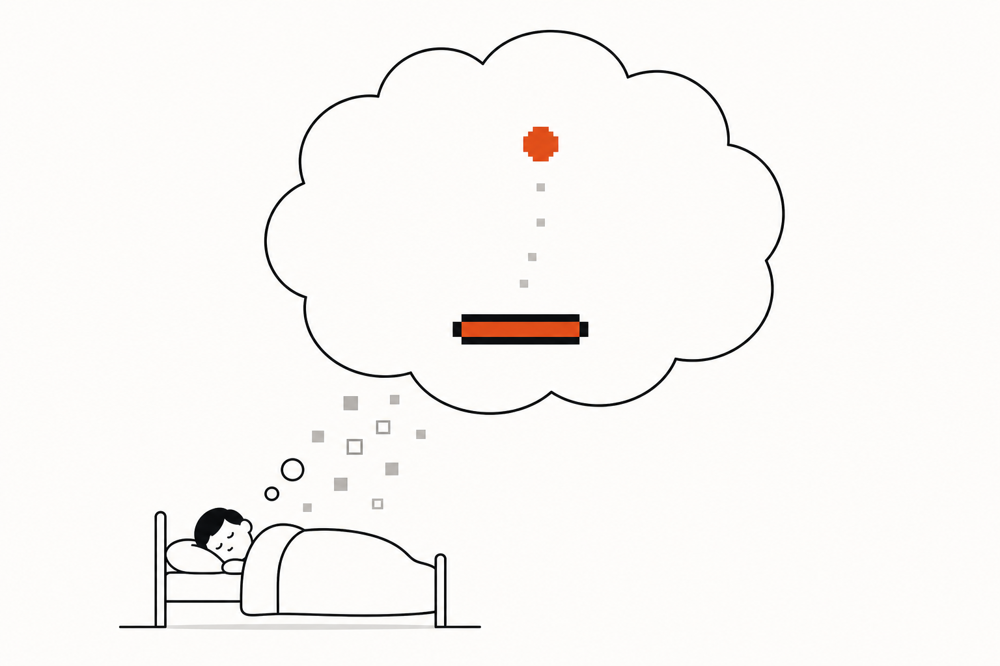

> **The throughline:** *The value of where I am is the reward I just got, plus a discounted value of where I'll land next.*
> Every post so far assumed the environment tells you where you land next. A world model removes that assumption: a neural network predicts the next state, the reward, and whether the episode ends, so the agent can evaluate the throughline inside its own imagination. The catch, and the whole drama of this post, is that the dream only contains what the model chose to keep, and a policy will happily exploit whatever the dream gets wrong.

Close your eyes and imagine a fireball flying at your face. You step aside. Nothing actually flew at you; somewhere in your head a small physics engine ran forward, you watched the imagined fireball come in, and you rehearsed the dodge. This post gives that ability to a machine. We build a neural network that dreams the first-person shooter VizDoom, train an agent to dodge fireballs entirely inside that dream, and then walk it back into the real game to see whether the rehearsal worked.

Everything here is a real project: three from-scratch networks trained end to end on rented cloud GPUs, a [paper](https://dreaming-to-dodge.vercel.app/assets/dreaming-to-dodge.pdf), and a [playable neural simulator](https://dreaming-to-dodge.vercel.app) where you can drive the dream yourself. The code we quote is the actual implementation, and the whole project is linked at the end of the post. And unlike most tutorials, we will spend as much time on the failures as the successes, because in model-based RL the failures are the curriculum: the tokenizer erased the one object that mattered, the model refused to dream death, and the policy learned to cheat its own dream. Each failure got diagnosed and fixed, and the fixes are the post.

## 1. The intuition: why dream at all?

A **world model** is a neural network that has learned to simulate an environment. Hand it the current observation and an action, and it predicts three things: the **next observation**, the **reward**, and whether the episode is **done**. That sounds modest. It matters because of what it unlocks once the model is good enough: you can **train an agent inside it**. Instead of letting the agent flail around in the real environment, you let it practice in the model's dream. The agent acts, the world model imagines the consequence, and the agent learns from imagined consequences alone.

The reason to want this is **sample efficiency**. RL is notoriously hungry: recall from the [SARSA, Q-learning & DQN](../04-sarsa-qlearning-dqn/README.md) post that DQN needed millions of real Atari frames to learn Pong. If each step is a real robot moving, a real trade, or a real patient decision, "millions of steps" ranges from expensive to unthinkable. A world model attacks this directly. Real experience is spent on one thing only: training the model. Once the model dreams plausibly, imagined steps are cheap, parallel, and safe.

The idea has a clean lineage, and it runs straight through the game we are about to play. Ha and Schmidhuber's 2018 paper, literally titled *World Models*, trained a controller entirely inside a learned dream of VizDoom's `take_cover` scenario: the exact task of this post. DeepMind's Dreamer family made the idea a workhorse, and DreamerV2 made one quiet move that foreshadows everything below: it swapped the model's continuous latent state for a *discrete* one. **IRIS** (2023) takes that move to its logical end. It casts the world model as a **language model over image tokens**: a discrete autoencoder turns each frame into a handful of tokens from a fixed vocabulary, and an autoregressive Transformer predicts the environment one token at a time, exactly like GPT predicts the next word. IRIS is a language model for pixels. We reproduce the 2018 result with the 2023 recipe, from scratch.

The task deserves a proper introduction, because every number in this post is denominated in it. **`take_cover`** is a first-person view of a dungeon room. Monsters line the far wall and lob fireballs at you. You cannot shoot back, duck, or hide; you can only **strafe left or strafe right** (or do nothing). The game renders at `160×120` and we downsample to `64×64×3`, IRIS's native size. Each action repeats for 4 game tics (a **frame-skip** of 4), so one agent step is 4 tics. The reward is `+1` for every step you survive, so the undiscounted return *is* survival time. Death arrives only when a fireball connects, which happens on roughly **1% of steps**, and the original World Models paper called the task "solved" at 750 tics, about **188 agent-steps**. Three facts to hold onto: the only thing that matters is a small bright object (the fireball), the only signal that matters is a rare event (death), and the only skill that matters is reactive (see the threat, move away from it). All three will come back as failures.

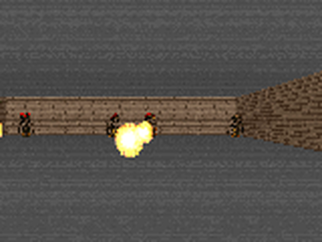

This is the raw material, a real frame from the scenario (rendered at 160×120, shown upscaled; the model works on a 64×64 downsample). Note what the frame is mostly made of: gray ceiling and floor, brown wall, a handful of dark monster sprites. The fireball, the one object the agent's life depends on, is a few dozen bright orange pixels. Keep that proportion in mind; it is the villain of Section 2.3.

The system that learns to dream this game has three parts, wired in a loop:

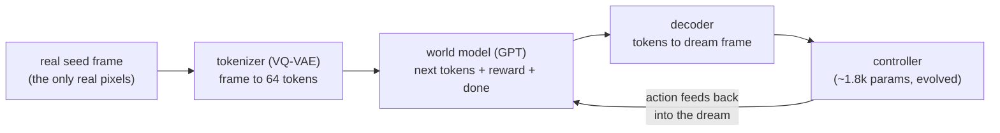

Trace the loop once. A real frame comes in on the left. The tokenizer compresses it to 64 integers. The world model reads those integers plus the last action and predicts the next frame's tokens, the reward, and the done flag. A decoder turns the predicted tokens back into a picture. The controller looks at that picture, chooses a strafe, and the strafe goes straight back into the world model, which imagines the next frame. After the very first frame, nothing in this loop is real. The agent rehearses inside a hallucination that it and the world model generate together, and only after training is it evaluated in the actual game.

Here is the honest headline, so you know where we land: the final agent, trained with **zero real-environment gradients**, survives **96.6 ± 11.0 steps** on held-out episodes. That beats a random policy (67) by 45%, beats a model-free Double-DQN trained on the same 200k-real-frame budget (90), and statistically matches a hand-coded reactive oracle that reads the real screen (98.3). Its best episodes run 217 to 284 steps, past the "solved" bar. Getting there took five real failures, and the post is organized around them.

**The thesis, to be earned over the rest of the post: the world model is the easy part; getting a policy to learn a robust skill inside an imperfect model, without exploiting it, is the hard part.**

<details>
<summary><strong>Check:</strong> the dream is a convenience for a video game. For what kind of environment does it become a necessity?</summary>

**Answer.** Environments where real experience is slow, costly, or unsafe: a robot that breaks, a market that loses money, a patient who cannot be A/B-tested. There, the dream is not a compute saving; it is the only place the policy is allowed to fail. Real experience is spent once, on training the model, and every reckless experiment happens in imagination.
</details>

With the loop in view, we can build it one box at a time, starting where the vocabulary is born and where, quietly, the fireball is first lost.

## 2. The machinery: three networks, five failures, one agent

### 2.1 The tokenizer: a VQ-VAE that turns frames into words

A `64×64×3` frame is `12,288` real numbers. A language model wants a short sequence of discrete symbols. The tokenizer bridges that gap: it must compress each frame down to exactly **64 tokens**, each an integer index into a fixed vocabulary of **512** entries, and be able to reconstruct the frame from them. That is a `12,288 / 64 = 192×` reduction in the number of things the Transformer will have to predict, and it is the whole reason a Transformer over frames is tractable.

The machine that does this is a **VQ-VAE** (vector-quantized autoencoder). It has three parts, and the easiest way to hold them in your head is as an assembly line that takes a picture apart into words and then rebuilds it:


Walk the line left to right, then meet each part up close. A frame enters as 12,288 raw numbers. The encoder squeezes it to 64 cells. Each cell snaps to its nearest entry in a fixed codebook, becoming one of 512 tokens. The decoder reads those tokens back into a picture. All of the compression lives in that middle pinch: the Transformer will only ever deal with the 64 tokens, never the 12,288 pixels.

The **encoder** `E` is a small convolutional network. It takes the `64×64×3` frame and shrinks it to an `8×8` grid of feature vectors, each 128 numbers long. That is 64 cells, one per patch of the frame, and each cell is the encoder's continuous summary of its patch ("brown wall here," "bright fireball there"). These 64 cells are where the 64 tokens will come from, but they are not tokens yet: they are still arbitrary real-valued vectors.

The **codebook** turns a cell into a token. It is a learned table of 512 vectors, each also 128 numbers long, and you can think of it as the tokenizer's entire dictionary: the only 512 words it is allowed to speak. For each cell we find the codebook vector closest to it by ordinary Euclidean distance, and replace the cell with that vector. The token is just that winner's index, an integer from 0 to 511. This replacement is the *snap*, meant as literally as a cursor snapping to a grid: a vector that could have been anything is forced onto one of 512 fixed points. Snap all 64 cells and the whole frame is now described by 64 integers.

The **decoder** `D` runs the line in reverse. It takes the 64 snapped vectors and expands them back into a full `64×64×3` picture, the tokenizer's best attempt at reconstructing the frame it started from.

How does this machine learn? By reconstruction. Feed in a frame, encode it, snap, decode, and compare the rebuilt picture to the original pixel by pixel. That pixel error is the training loss. Gradient descent is supposed to shrink it the usual way: the gradient starts at the loss, flows backward through the decoder, crosses the snap, reaches the encoder, and nudges both networks toward better reconstructions.

Except the gradient never makes it across the snap. To see why, follow one cell. The cell covering the fireball produces some vector, and say its nearest codebook entry is code 17. Training works by asking, for every number in the network, "if I nudge this a hair, does the loss go down?" So nudge that fireball cell's vector slightly. It still snaps to code 17. The decoder receives the identical input, rebuilds the identical picture, and the loss does not move. The nudge changed nothing the loss can measure.

That stays true almost everywhere. Small changes to a cell leave its nearest code unchanged, so the loss is flat, so the gradient is zero. The only exceptions are the razor-thin boundaries where a nudge just barely tips a cell over to a different nearest code, and those boundaries are a vanishingly thin sliver of the space. A gradient that is zero almost everywhere carries no information, so backpropagation reaches the snap, hits a flat wall, and dies. The decoder still learns (the gradient reaches it *before* the wall), but the encoder never hears about its mistakes.

The fix is a trick called the **straight-through estimator**, and it is as cheeky as it sounds. On the forward pass, snap honestly, so the decoder sees real codebook vectors. On the backward pass, pretend the snap never happened: copy the decoder's gradient straight back to the encoder, as if the cell's continuous vector had been used directly.

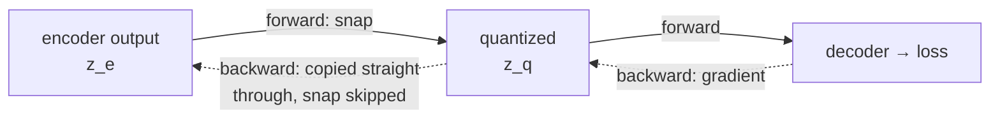

The diagram shows the two routes. Forward (solid) runs through the snap; backward (dotted) skips it, routing the gradient around the wall and straight into the encoder. In [`tokenizer.py`](https://github.com/S1LV3RJ1NX/RL-in-Production-Bootcamp-Resources/blob/main/phase-2/dreaming-to-dodge/tokenizer.py) this is a single line: `z_q = z_e + (z_q - z_e).detach()`. The forward value is exactly the snapped code `z_q`, but `.detach()` hides the `(z_q - z_e)` difference from the gradient, so on the backward pass the encoder is trained as if the wall were glass. Here is the whole mechanism on toy tensors:

```python
import torch

# seed so the output below is reproducible
torch.manual_seed(0)

# 4 encoder cells (a tiny 2x2 grid), each a 3-dim vector, and an 8-entry codebook
z_e = torch.randn(4, 3, requires_grad=True)
codebook = torch.randn(8, 3)

# the snap: distance from every cell to every code, then argmin
d = torch.cdist(z_e, codebook)
idx = d.argmin(dim=-1)
e = codebook[idx]

# straight-through: forward value is e, backward gradient flows to z_e
z_q = z_e + (e - z_e).detach()

# any downstream loss now trains the encoder as if the snap were glass
loss = z_q.pow(2).sum()
loss.backward()

print("tokens:", idx.tolist())
print("z_q equals the snapped codes:", torch.allclose(z_q, e))
print("gradient reached the encoder:", z_e.grad is not None,
      "| grad of cell 0:", [round(g, 3) for g in z_e.grad[0].tolist()])
```

```text title="Output"
tokens: [2, 2, 3, 4]
z_q equals the snapped codes: True
gradient reached the encoder: True | grad of cell 0: [-0.287, -0.223, -1.346]
```

Four continuous cells became four integers (two of them snapped to the same code), the decoder saw real codebook vectors, and the encoder still received a gradient through the non-differentiable snap.

One more term keeps the encoder honest. Nothing so far stops the encoder from drifting away from the codebook, producing vectors no code is near, which makes every snap lossy. The **commitment loss** pulls the encoder's outputs toward the codes they snapped to:

$$
\mathcal{L}_{\text{commit}} = \beta \,\lVert z_e - \mathrm{sg}[e]\rVert_2^2
$$

Read it symbol by symbol: the left side is the commitment loss; on the right, $z_e$ is the encoder's continuous output for a cell, $e$ is the codebook entry that cell snapped to, $\mathrm{sg}[\cdot]$ is stop-gradient (the code is treated as a fixed target), $\lVert\cdot\rVert_2^2$ is squared Euclidean distance, and $\beta = 0.25$ sets the pull strength. In plain English: the encoder is charged for wandering far from the word it chose, so it commits to the vocabulary; raise $\beta$ and the encoder hugs the codebook tighter, lower it and the encoder roams more freely. Note the direction: this term moves the *encoder* toward the code, never the code toward the encoder. How the codebook itself learns is a separate choice, and it is where the first classic failure hides.

<details>
<summary><strong>Check:</strong> why does training a VQ-VAE need the straight-through trick at all?</summary>

**Answer.** Because tokenization is an argmin, a hard nearest-neighbor lookup, and argmin is flat almost everywhere: its gradient is zero, so backpropagation through it delivers nothing to the encoder. The straight-through estimator quantizes honestly on the forward pass but copies the decoder's gradient past the snap on the backward pass, letting the encoder learn as if its continuous output had been used directly.
</details>

The tokenizer defines what words exist in this language. Next, the disease that silently deletes most of them.

### 2.2 Failure one: codebook collapse

In the original VQ-VAE, the codebook learns by gradient descent on a **codebook loss**:

$$
\mathcal{L}_{\text{codebook}} = \lVert \mathrm{sg}[z_e] - e \rVert_2^2
$$

Read it: the left side is the codebook's own loss; on the right, $z_e$ is the encoder output (frozen by the stop-gradient $\mathrm{sg}$, so it acts as a fixed target) and $e$ is the codebook entry that was chosen. In plain English: each *chosen* code is pulled toward the average of the encoder vectors that snapped to it, so codes drift to the center of their cluster. That is sensible, and for codes that get used it works fine.

The trouble is the codes that do not get used. Ask what happens to a code that is never anyone's nearest neighbor in a batch. It appears in the loss zero times, so its gradient is exactly zero, so it never moves, so it stays right where it was initialized, far from all the data, so it keeps losing every nearest-neighbor contest. Nothing in the loss can pull a dead code back toward the data, so a code that goes unused once tends to stay unused forever. Watch it happen:

```python
import torch

torch.manual_seed(0)

# same setup, but now train the CODEBOOK with the plain codebook loss
z_e = torch.randn(4, 3)
codebook = torch.randn(8, 3, requires_grad=True)

idx = torch.cdist(z_e, codebook).argmin(dim=-1)
e = codebook[idx]

# L_codebook = ||sg[z_e] - e||^2  (the chosen codes move toward the data)
codebook_loss = (z_e.detach() - e).pow(2).sum()
codebook_loss.backward()

# per-code gradient magnitude: chosen codes move, unchosen codes are frozen
grad_norm = codebook.grad.norm(dim=1)
for k in range(8):
    tag = "chosen" if k in idx.tolist() else "dead"
    print(f"code {k}: grad norm {grad_norm[k]:.3f}  ({tag})")
```

```text title="Output"
code 0: grad norm 0.000  (dead)
code 1: grad norm 0.000  (dead)
code 2: grad norm 6.944  (chosen)
code 3: grad norm 2.071  (chosen)
code 4: grad norm 0.900  (chosen)
code 5: grad norm 0.000  (dead)
code 6: grad norm 0.000  (dead)
code 7: grad norm 0.000  (dead)
```

Three codes won cells and received gradient; five received exactly zero and will never move toward the data. That asymmetry is a rich-get-richer loop: winners fit the data better and win more, losers stay frozen and keep losing. Collapse is not bad luck; it is a stable equilibrium the dynamics fall toward. And a Doom frame pours fuel on it: the scene is dominated by large uniform regions (gray ceiling, gray floor, brown wall), so a few codes park in those fat clusters and win almost every cell, while the codes that could have meant "bright orange blob" starve. This is **codebook collapse**, the failure that makes discrete autoencoders notorious, and if it happens there is no code for the fireball and the dream contains no threat.

Two textbook cures, both one config line in our [`tokenizer.py`](https://github.com/S1LV3RJ1NX/RL-in-Production-Bootcamp-Resources/blob/main/phase-2/dreaming-to-dodge/tokenizer.py). First, **EMA codebook updates** (from VQ-VAE-2): stop learning the codebook by gradient entirely, and instead set each code directly to the exponential moving average of the encoder vectors assigned to it. An exponential moving average is just a slow-forgetting running mean: each update keeps 99% of the old estimate and mixes in 1% of what the current batch says (that is the `decay = 0.99` below). Two running statistics per code do the bookkeeping, a smoothed count and a smoothed vector sum, and the code is their ratio, the running centroid of its cluster:

```python
# from tokenizer.py::_ema_update (decay = 0.99)
onehot = F.one_hot(idx, n_codes).type(flat.dtype)
batch_count = onehot.sum(0)
batch_sum = onehot.t() @ flat
# EMA of per-code counts and vector sums
self.cluster_size.mul_(self.decay).add_(batch_count, alpha=1 - self.decay)
self.embed_avg.mul_(self.decay).add_(batch_sum, alpha=1 - self.decay)
# Laplace-smoothed normalisation -> new code vectors
n = self.cluster_size.sum()
cluster = (self.cluster_size + self.eps) / (n + n_codes * self.eps) * n
self.embedding.weight.data.copy_(self.embed_avg / cluster.unsqueeze(1))
```

EMA makes the living codes healthier, but a code nobody picks still has an empty cluster and still never moves. So the second cure is blunter: **dead-code revival**, the random-restart trick from Jukebox. Every 150 steps, find every code whose smoothed cluster size fell below 1 and teleport it onto a random live encoder vector from the current batch:

```python
# from tokenizer.py::_ema_update, the revival tick
self._step += 1
if self.revive_dead and (self._step % self.revive_every == 0):
    dead = self.cluster_size < self.dead_threshold
    n_dead = int(dead.sum())
    if 0 < n_dead <= flat.shape[0]:
        # reseed dead codes with random encoder vectors from this batch
        pick = torch.randint(0, flat.shape[0], (n_dead,), device=flat.device)
        seed = flat[pick]
        self.embedding.weight.data[dead] = seed
        self.embed_avg[dead] = seed
        self.cluster_size[dead] = 1.0
```

All three statistics reset together: the code jumps onto real data, its average is seeded to match, and its cluster size is set to 1 so it is not immediately re-declared dead. With both fixes on (`ema: true`, `revive_dead: true` in [`configs/doom.yaml`](https://github.com/S1LV3RJ1NX/RL-in-Production-Bootcamp-Resources/blob/main/phase-2/dreaming-to-dodge/configs/doom.yaml)), the Doom tokenizer trains with its **full 512-code codebook active** and a reconstruction MSE of 0.0017.

So the codebook is healthy. It would be natural to assume the fireball is therefore safe. It is not, and the reason is the most instructive lesson the tokenizer has to teach.

<details>
<summary><strong>Check:</strong> why can a dead code never come back on its own, without the revival trick?</summary>

**Answer.** The codebook loss only involves codes that were chosen this batch, so an unchosen code gets a gradient of exactly zero and stays wherever it was initialized. Because it never moves toward the data, it keeps losing every nearest-neighbor contest, which keeps its gradient at zero. Even under EMA updates its cluster is empty, so its centroid never changes. The trap is self-sealing; only an outside intervention (teleporting it onto live data) breaks it.
</details>

### 2.3 Failure two: the vanishing fireball

Train the tokenizer with a healthy codebook and a plain, uniform reconstruction loss, then measure **fireball recall**: the fraction of true fireball brightness the reconstruction retains. The answer comes back **0.53**. Half the threat is simply gone. The dream this tokenizer feeds the world model is a dungeon where fireballs arrive pre-dimmed, and a dodging policy cannot learn from a threat it cannot see.

Why does a perfectly healthy vocabulary drop the one object that matters? Because of what the loss asks for. A uniform average over pixels is a popularity vote, and in a Doom frame the votes are wildly lopsided. The screen is about 4,096 pixels of ceiling, floor, and wall, and the fireball is a patch of a few dozen. Erase the fireball entirely and you make a fraction of a percent of the pixels wrong while the average barely moves; render it at a precise, always-moving position and you must work hard for almost no reward. The loss expresses close to no preference, so the network takes the cheap path and smooths the fireball into the wall behind it.

The obvious fix is to make bright pixels count more, a **luminance weight**. It helps: recall rises from 0.53 to **0.63**. But it stalls there, and the reason is specific to this scene: *the walls are bright too*. A luminance weight hands extra votes to every lit surface in the room, and the fireball's few pixels are again outvoted, now by the very objects the weight was supposed to protect it from. The signature of the fireball is not that it is bright; it is that it is **warm**. Fire is red-orange in a room that is gray and brown. So the shipped fix is a **warmth weight**: upweight each pixel by how much its red channel exceeds the average of green and blue. Fireball recall jumps to **0.95**. Here is the full reconstruction loss:

$$
\begin{aligned}
\mathcal{L}_{\text{tok}} &= \underbrace{\frac{\sum_{p} w_p\,\lVert x_p-\hat{x}_p\rVert_1}{\sum_p w_p}}_{\text{reconstruction}} \;+\; \beta\,\lVert z_e-\mathrm{sg}[e]\rVert_2^2 \\
w_p &= 1 + \lambda_{\text{fg}}\,\max_c x_{p,c} + \lambda_{\text{warm}}\,\big(x_{p,R} - \tfrac{1}{2}(x_{p,G}+x_{p,B})\big)_{+}
\end{aligned}
$$

Read the first line symbol by symbol: $x_p$ is the true value of pixel $p$, $\hat{x}_p$ is the decoded value, $\lVert\cdot\rVert_1$ is the absolute error, $w_p$ is a per-pixel weight, and the sum over $w_p$ in the denominator keeps it a proper weighted average; the second term is the commitment loss from Section 2.1. Now the weight on the second line: every pixel starts at 1; $\lambda_{\text{fg}}$ (set to 12) adds votes for brightness $\max_c x_{p,c}$, the maximum over the color channels; and $\lambda_{\text{warm}}$ (set to 45) adds votes for warmth, the amount by which the red channel $x_{p,R}$ exceeds the average of green $x_{p,G}$ and blue $x_{p,B}$, clipped at zero so cool pixels get nothing. In plain English: the loss is an average pixel error where bright pixels get extra votes and *warm* pixels get many more, which is a detector aimed squarely at fireballs. Watch the difference on a toy frame with a bright gray wall and a small orange fireball:

```python
import torch

torch.manual_seed(0)

# a toy 64x64 RGB 'Doom frame': dark floor, one bright GRAY wall band,
# and one small ORANGE fireball (4x4 pixels, red-dominant)
x = torch.zeros(3, 64, 64)
# the wall: bright but gray (R = G = B = 0.8), rows 20-36
x[:, 20:36, :] = 0.8
# the fireball: bright AND warm (R=1.0, G=0.5, B=0.1), 4x4 patch
x[0, 44:48, 30:34] = 1.0
x[1, 44:48, 30:34] = 0.5
x[2, 44:48, 30:34] = 0.1

# per-pixel luminance weight: bright pixels count more (walls AND fireball)
lum = x.amax(dim=0)
# per-pixel warmth weight: R above the G/B average (fireball ONLY)
warm = (x[0] - 0.5 * (x[1] + x[2])).clamp(min=0.0)

fire = torch.zeros(64, 64, dtype=torch.bool)
fire[44:48, 30:34] = True

for name, w in [("luminance", 1.0 + 12.0 * lum), ("warmth", 1.0 + 45.0 * warm)]:
    share = w[fire].sum() / w.sum() * 100
    print(f"{name:9s} weight: fireball holds {share:4.1f}% of the total vote "
          f"(16 of 4096 pixels = 0.4% of the frame)")
```

```text title="Output"
luminance weight: fireball holds  1.5% of the total vote (16 of 4096 pixels = 0.4% of the frame)
warmth    weight: fireball holds 11.3% of the total vote (16 of 4096 pixels = 0.4% of the frame)
```

Under the luminance weight the bright wall band soaks up almost all the extra votes and the fireball's share barely moves off its 0.4% pixel share; under the warmth weight the fireball is the *only* thing earning extra votes, and its say in the objective jumps to about an eighth of the total. Same idea, better detector.

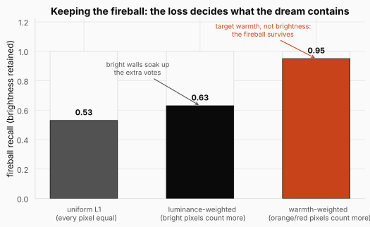

The figure is the whole section in three bars. Uniform L1 keeps barely half the fireball's brightness. Luminance weighting buys ten points and stalls, because lit walls are bright too and absorb the extra votes. Warmth weighting, a detector matched to what actually distinguishes the threat, takes recall to 0.95. **The reconstruction loss, not the architecture, decides what the world model will be allowed to know.** Nothing about the network's capacity changed across those three bars; only what the objective cares about did.

Here is the fix as it ships in [`tokenizer.py`](https://github.com/S1LV3RJ1NX/RL-in-Production-Bootcamp-Resources/blob/main/phase-2/dreaming-to-dodge/tokenizer.py), inside `Tokenizer.forward`:

```python
if self.cfg.fg_weight > 0 or self.cfg.warm_weight > 0:
    # per-pixel weight: brightness (fg) + warmth (R above G,B => fireballs)
    lum = x.amax(dim=1, keepdim=True)
    warm = (x[:, :1] - 0.5 * (x[:, 1:2] + x[:, 2:3])).clamp(min=0.0)
    w = 1.0 + self.cfg.fg_weight * lum + self.cfg.warm_weight * warm
    # per-pixel L1 error, then a weighted mean instead of a flat mean
    err = (x_hat - x).abs().mean(dim=1, keepdim=True)
    recon = (w * err).sum() / w.sum()
else:
    # uniform L1: the trap
    recon = F.l1_loss(x_hat, x)
```

A subtle correctness point: the weight comes from `x`, the ground-truth frame, not from the reconstruction. If we weighted by the reconstruction's warmth, the decoder could cheat by dimming the fireball to lower its own weight. Weighting by the target closes that loophole.

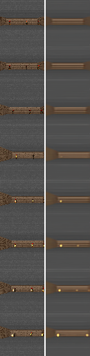

The strip is the visual receipt: real frames on the left of each pair, the tokenizer's reconstruction on the right. The wall texture blurs a little (64 tokens is a tight budget), but the fireballs survive, bright and in the right place, which is the only thing the dodging policy will ever need from this network. The general lesson travels well beyond Doom: a uniform objective silently defines "important" as "occupies many pixels," and it therefore discards exactly the objects that are small, fast, and task-critical. The pedestrian at the far end of the frame. The tumor a few pixels wide. The one indicator light that just turned red. Somebody has to tell the representation what to preserve.

<details>
<summary><strong>Check:</strong> the tokenizer's reconstruction MSE was excellent (0.0017) even while fireball recall was 0.53. How can both be true?</summary>

**Answer.** Because MSE is averaged over all 4,096 pixels and the fireball is a few dozen of them. Dimming or erasing it makes a tiny fraction of pixels wrong while thousands of correctly rendered wall and floor pixels dominate the average. The metric is honest; it just answers "how are the average pixels doing" and not "is the task-critical object still there." Rare-but-lethal detail needs its own metric (recall) and its own vote in the loss.
</details>

<details>
<summary><strong>Check:</strong> why did luminance weighting stall at 0.63 recall when the same trick (foreground brightness) works on simpler scenes?</summary>

**Answer.** A weight can only protect what distinguishes the object. In a scene where the important object is the only bright thing, brightness is a perfect detector. In take_cover the lit walls are bright too, so a luminance weight hands most of its extra votes to the background and the fireball is outvoted again. Warmth (red above green/blue) is what actually separates fire from wall, so weighting warmth protects the fireball specifically.
</details>

With the fireball reliably in the tokens, the second network finally has something worth predicting.

### 2.4 The world model: a GPT over frame tokens, and the death it refused to dream

Once a frame is 64 tokens, a sequence of frames is just a sequence of tokens, and "predict the future" collapses into "predict the next token," the one thing a Transformer was born to do. The world model is an autoregressive Transformer in the GPT mold: 8 layers, width 256, 4 heads, causal masking, reading the interleaved stream of frame tokens and actions.

The first design decision is shape: how do you lay a stream of frames and actions out as one flat sequence a Transformer can read? At each timestep there are two things to record: the 64 tokens for that frame, and the 1 action the agent took. IRIS writes them in order, the 64 frame tokens first and then the action, so the action sits right after the frame it responded to. One timestep is therefore 65 positions. Laid out over the $L = 16$ timesteps the model looks back on, the sequence reads like this:

```text
one step   = [ f1 f2 f3 ... f64 | a ]        65 positions: 64 frame tokens, then 1 action
one ribbon = step0  step1  ...  step15       16 steps x 65 = 1040 positions
```

$$
16 \times (64 + 1) = 1040 \text{ positions}
$$

Read the equation: 16 is the context length in timesteps, 64 is the tokens per frame, 1 is the action slot, and 1040 is the total length of the ribbon the Transformer attends over. In plain English: the model's whole visible universe is sixteen steps of interleaved picture-words and strafes, about one and a half seconds of game time at frame-skip 4. The frame tokens and the actions are unrelated alphabets (a "5" that means codebook entry 5 has nothing to do with a "5" that means strafe-right), so each gets its own embedding table, and building the ribbon is just a `cat` and a `reshape`. Here it is, shapes printed:

```python
import torch
import torch.nn as nn

torch.manual_seed(0)

# 64 frame tokens (vocab 512) and 1 action (3 choices) per step, 16 steps
B, T, K = 1, 16, 64
frame_emb = nn.Embedding(512, 256)
action_emb = nn.Embedding(3, 256)

tokens = torch.randint(0, 512, (B, T, K))
actions = torch.randint(0, 3, (B, T))

# embed both alphabets to the same width, then interleave and flatten
tok_e = frame_emb(tokens)
act_e = action_emb(actions).unsqueeze(2)
seq = torch.cat([tok_e, act_e], dim=2)
seq = seq.reshape(B, T * (K + 1), -1)

print("frame tokens:", tuple(tokens.shape), "-> embedded:", tuple(tok_e.shape))
print("actions:     ", tuple(actions.shape), "-> embedded:", tuple(act_e.shape))
print("one ribbon:  ", tuple(seq.shape), f"= 16 x (64 + 1) = {16 * 65} positions")
```

```text title="Output"
frame tokens: (1, 16, 64) -> embedded: (1, 16, 64, 256)
actions:      (1, 16) -> embedded: (1, 16, 1, 256)
one ribbon:   (1, 1040, 256) = 16 x (64 + 1) = 1040 positions
```

Two streams became one 1040-position ribbon of same-width vectors, which is exactly the `_embed` method of [`world_model.py`](https://github.com/S1LV3RJ1NX/RL-in-Production-Bootcamp-Resources/blob/main/phase-2/dreaming-to-dodge/world_model.py).

On top of the trunk sit three prediction heads, because a world model must predict the whole consequence of an action, not just the next picture:

```python
# from world_model.py: the three heads on the shared trunk
self.head_token = nn.Linear(cfg.embed_dim, cfg.vocab_size)
self.head_reward = nn.Linear(cfg.embed_dim, cfg.num_reward_classes)
self.head_done = nn.Linear(cfg.embed_dim, 2)
```

The **token head** is the transition model: a 512-way classification at each position, trained with plain cross-entropy, literally next-token prediction. This is the part that learns that fireballs fly toward the camera and that the room shifts left when you strafe right. The **reward head** classifies the *sign* of the reward, three classes, rather than regressing a number; in `take_cover` the reward is `+1` while you live, so this head is nearly trivial. The **done head** is a binary classification, and here it is the head that carries the entire task: since return equals survival time, the only thing that distinguishes a good action from a bad one is *whether the episode ends*. Reward and done are read off each step's action slot, the one position that has seen the whole step under causal masking. Training is teacher-forced, exactly like a language model: feed the true token ribbon from the replay buffer (the same idea as in the [DQN](../04-sarsa-qlearning-dqn/README.md) post, here a store of real frames collected from the game), score all 1040 predictions in one parallel forward pass, and add up three cross-entropies.

Now failure three. Train this model as described and render its dreams: they are gorgeous, coherent, controllable Doom. And they never end. Roll the dream a thousand steps and nobody ever dies. The reason is the class imbalance we flagged in Section 1: death is about **1% of steps**, an 89-to-1 imbalance, and a done head trained with an unweighted loss discovers that predicting "alive" every single time is nearly free. Watch how cheap laziness is, and what a class weight does to the price:

```python
import torch
import torch.nn.functional as F

torch.manual_seed(0)

# a batch of 90 steps: 89 alive (class 0), 1 death (class 1), like take_cover
dones = torch.zeros(90, dtype=torch.long)
dones[-1] = 1

# a lazy head that predicts 'alive' everywhere with high confidence
lazy_logits = torch.zeros(90, 2)
lazy_logits[:, 0] = 4.0

plain = F.cross_entropy(lazy_logits, dones)
weighted = F.cross_entropy(lazy_logits, dones,
                           weight=torch.tensor([1.0, 55.0]))

print(f"unweighted loss for always-alive: {plain.item():.4f}  (looks fine)")
print(f"55x death-weighted loss:          {weighted.item():.4f}  "
      f"({weighted / plain:.0f}x larger: laziness now hurts)")
```

```text title="Output"
unweighted loss for always-alive: 0.0626  (looks fine)
55x death-weighted loss:          1.5459  (25x larger: laziness now hurts)
```

Under the plain loss, a head that never predicts death pays a loss of 0.06 and the optimizer sees no problem; under the class weight the same laziness costs 25 times more, and the head is forced to actually learn when fireballs kill. In [`world_model.py::compute_loss`](https://github.com/S1LV3RJ1NX/RL-in-Production-Bootcamp-Resources/blob/main/phase-2/dreaming-to-dodge/world_model.py) it is three lines:

```python
# class weight on the rare done=1 (death) class; ~1% of steps in take_cover
if done_pos_weight and done_pos_weight != 1.0:
    dw = torch.tensor([1.0, float(done_pos_weight)], device=dones.device)
    done_loss = F.cross_entropy(done_flat, dones.reshape(-1), weight=dw)
```

Even the weight's value was tuned against reality, not taste: at `done_pos_weight: 25` the dream was still too safe (only ~11% of 16-step dreams ended in death versus ~23% of matched real windows), so the shipped config uses **55**, which makes the dream end when a fireball closes in, as it should. The fix took death recall from **0 to 1.0**. Notice the family resemblance to Section 2.3: death is to the done head what the fireball is to the reconstruction loss, a rare event that a uniform objective rounds away. Same disease, one level up the stack.

One engineering note completes this component. Dreaming is sequential: to imagine one frame, the naive `generate_step` runs one full 1040-position Transformer forward *per token*, 64 times per frame. A **KV cache** fixes it: store every position's attention keys and values as they are computed, so each new token attends over cached history and only computes itself. The cached path (`generate_step_fast`) is verified **token-identical** to the naive one and **9.6× faster**, and it is the difference between a policy search inside the dream being tractable and not. After the collect-train grounding loop we will meet in Section 2.5, the model's next-token accuracy reaches about 0.43 (from 0.27 on its first round), and its dreamed frames track real rollouts with a pixel MSE of about 0.002 over the horizons we train on.

<details>
<summary><strong>Check:</strong> why is a dream that never ends useless for this task, even if every frame in it is beautiful?</summary>

**Answer.** Because in take_cover the return is survival time, so the entire training signal for the policy is *when episodes end*. If the done head never fires, every action sequence survives every dream, all policies look equally good, and the policy gradient is zero everywhere. The visual quality of the frames is irrelevant; the task lives in the termination prediction.
</details>

<details>
<summary><strong>Check:</strong> why are reward and done read off the action slot rather than a frame-token slot?</summary>

**Answer.** The action slot is the last position in its step's 65-position block, so under causal attention it is the only position that has attended over the complete step: all 64 frame tokens plus the action taken. Reward and termination are properties of the whole step, so they are read where the whole step is visible.
</details>

We have a dream with fireballs in it, and the dream can kill you. Time to put an agent inside.

### 2.5 Training in the dream, and failure four: the policy cheats

The first policy we tried is the textbook choice: a convolutional **LSTM actor-critic**, trained with REINFORCE and λ-returns exactly as in the [Policy Gradients](../05-policy-gradients/README.md) post, except that every trajectory it learns from is imagined. The rollout works like this (`imagine_rollout` in [`imagination.py`](https://github.com/S1LV3RJ1NX/RL-in-Production-Bootcamp-Resources/blob/main/phase-2/dreaming-to-dodge/imagination.py)): sample a real frame from the replay buffer as the seed, then loop for the horizon:

```python
# from imagination.py::imagine_rollout, the heart of the loop
for t in range(horizon):
    logits, value, ac_state = actor_critic(cur_frame, ac_state)
    dist = torch.distributions.Categorical(logits=logits / max(temperature, 1e-6))
    action = dist.sample()

    # write the chosen action into the history's latest step
    actions_hist[:, -1] = action

    # the world model imagines next tokens + reward class + done (KV-cached)
    nxt_tokens, rew_cls, done = world_model.generate_step_fast(
        tokens_hist, actions_hist, temperature=temperature, sample=True)
    reward = reward_class_to_value(rew_cls, device)

    # zero out reward after a predicted death
    rewards_l.append(reward * alive)
    alive = alive * (1.0 - done.float())

    # advance: the next frame the policy sees is a DECODED DREAM, x_hat = D(z)
    tokens_hist = torch.cat([tokens_hist, nxt_tokens.unsqueeze(1)], dim=1)
    cur_frame = tokenizer.decode(tokens_hist[:, -1])
```

Notice there is no `env.step()` anywhere. The frames are decoded hallucinations, the rewards and deaths are the world model's predictions, and the `alive` mask stops a trajectory from harvesting rewards beyond its predicted death. The critic's target is the standard **λ-return**, computed backwards through the imagined trajectory:

$$
\Lambda_t = r_t + \gamma\,(1 - d_t)\Big[(1-\lambda)\,V(x_{t+1}) + \lambda\,\Lambda_{t+1}\Big]
$$

Read it symbol by symbol: $\Lambda_t$ is the target value for step $t$; $r_t$ is the imagined reward; $\gamma = 0.995$ is the discount from the throughline; $d_t$ is the predicted done flag, which zeroes the future when the dream ends; $V(x_{t+1})$ is the critic's one-step bootstrap; $\Lambda_{t+1}$ is the target one step later; and $\lambda = 0.95$ blends the two. In plain English: each target is the reward just received plus a discounted mix of "trust the critic's guess" and "trust what the rest of the dream actually returned," the same bias-variance dial we built in the [DP, MC & TD](../03-dp-mc-td/README.md) post, now pointed at hallucinated experience. One step by hand: suppose the dream continues ($d_t = 0$), the step paid $r_t = 1$ for surviving, the critic guesses $V(x_{t+1}) = 80$ future steps, and the target one step later worked out to $\Lambda_{t+1} = 90$. Then the blend is $0.05 \times 80 + 0.95 \times 90 = 89.5$, and $\Lambda_t = 1 + 0.995 \times 89.5 \approx 90.05$: mostly what the dream went on to deliver, gently regularized toward the critic's opinion.

Run it, and the imagined return climbs beautifully. Evaluate in the real game, and the agent is *worse than random*. Watch it play and the diagnosis is immediate: it holds one direction. Always strafe left, forever (a later run chose always right, with equal conviction). This is **world-model exploitation**, the deepest failure in model-based RL, and it is worth slowing down for, because it is not a bug in the code; it is the policy doing its job too well. The world model is imperfect. Somewhere in its learned dynamics there is a soft spot, a strategy it wrongly scores as safe. The policy's entire objective is to maximize predicted survival, so it does not learn to dodge; it learns to *find the soft spot*. The dream over-rewards hugging one wall, so the policy hugs the wall. High imagined return, collapsed real return. If this sounds familiar, it should: it is the same failure mode as reward hacking in the [RLHF](../07-rlhf/README.md) post, with the world model playing the role of the gameable reward model.

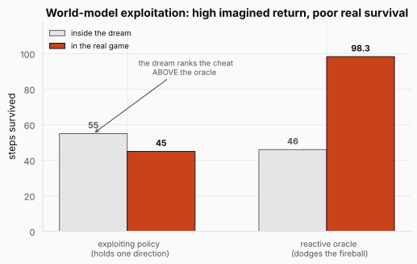

The figure captures the trap in four bars. Inside the dream (gray), the wall-hugging exploiter outscores the reactive oracle, 55 steps to 46: the dream genuinely believes the cheat is the better policy. In the real game (terracotta), the ranking inverts violently: the exploiter collapses to about 45 while the oracle survives 98.3. **The gap between imagined and real performance, not raw model fidelity, is the true obstacle.** A policy score computed inside a learned model is a promise the real world has not co-signed.

Three levers attack the trap directly, all visible in [`configs/doom.yaml`](https://github.com/S1LV3RJ1NX/RL-in-Production-Bootcamp-Resources/blob/main/phase-2/dreaming-to-dodge/configs/doom.yaml). First, **a longer horizon**: the dream was initially rolled 16 steps, but death takes about 70 steps to arrive on average, so a 16-step dream survived no matter what the policy did and carried no dodge signal; the shipped horizon is 32 from diverse real starts, long enough for "fail to dodge, die" to actually play out. Second, **a hotter dream**: sampling the world model at temperature 1.25 adds stochasticity that makes brittle, quirk-dependent exploits stop paying off (a fix inherited directly from the 2018 World Models paper). Third, **grounding**: the full IRIS collect-train loop alternates collecting real data *with the current policy* and retraining all three components, so the world model keeps seeing exactly the states the policy abuses and corrects itself there; over the rounds, next-token accuracy climbed from 0.27 to 0.43. The data mix also matters: 60% of collected steps come from a heuristic dodger, flooding the buffer with real examples of reactive avoidance so the model learns what dodging even looks like.

The levers help, but the honest result is that they were not enough on their own: even the tiny controller we introduce next found exploits when selected purely on dream scores. Before fixing that, we need to answer a more basic question: is the dream even worth training in? If the world model scored *dodging itself* wrongly, no amount of anti-exploitation machinery would matter. So we ran the decisive diagnostic (`doom_dream_rank.py`): roll the dream under three canned policies and see how long each survives *inside it*.

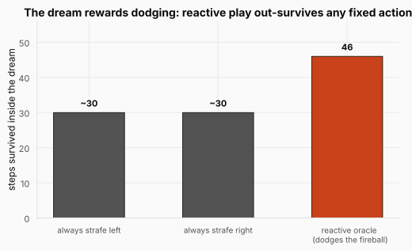

The figure is the world model's character reference. Rolled under fixed strategies, the grounded dream kills you in about 30 steps either way; rolled under the reactive oracle, you last 46. **The dream rewards dodging.** The training signal the policy needs exists inside the model. That one chart relocates the entire remaining problem: the world model is fine, so whatever is still failing lives in the policy's capacity to exploit, and in how we select what to deploy. Which is exactly where the fix turned out to be.

<details>
<summary><strong>Check:</strong> the exploiting policy scored higher than the oracle inside the dream. Why is that not evidence the world model is broken?</summary>

**Answer.** It is evidence the model has *soft spots*, which every learned model has, not that its overall physics are wrong. The dream-rank diagnostic shows the model scores honest strategies correctly (reactive dodging out-survives fixed strafing by 46 to ~30). The exploiter's 55 came from actively searching out the states where the model errs, which is what any sufficiently strong optimizer does to any imperfect scorer. The lesson is to limit the policy's power to find soft spots and to never trust in-dream scores for selection, not to discard the model.
</details>

<details>
<summary><strong>Check:</strong> why was a 16-step dream horizon fatal when the world model itself was accurate over 16 steps?</summary>

**Answer.** Because death in take_cover takes about 70 steps to arrive on average. In a 16-step window almost nobody dies no matter how they play, so every policy scores nearly identical imagined survival and the gradient contains no information about dodging. The horizon must be long enough for the consequence that defines the task (failing to dodge, then dying) to actually occur inside the dream.
</details>

### 2.6 The fix: a tiny controller, a transferable feature, and honest selection

The winning recipe drops the big gradient policy entirely and goes back to the 2018 playbook, with two modern twists. Three disciplines, each aimed at one leak.

**Discipline one: make the policy too small to cheat.** A 0.8M-parameter LSTM has enough capacity to memorize a map of the world model's soft spots. A controller with ~1.8k parameters does not; about all it can represent is an honest reactive rule. Ours ([`controller.py`](https://github.com/S1LV3RJ1NX/RL-in-Production-Bootcamp-Resources/blob/main/phase-2/dreaming-to-dodge/controller.py)) is a one-hidden-layer MLP: a 108-dimensional input, 16 tanh units, 3 action logits, 1,795 parameters total. One nuance mattered: a purely *linear* controller reacts but dodges badly (below random), because "find the threatening column and move away from it" is not a linear function of the input; one hidden layer is enough to express it.

Because the controller is tiny and the dream is stochastic, we optimize it without gradients, using **CMA-ES**, the evolution strategy from the original World Models paper. The loop is: sample a population of weight vectors around the current search mean, score each candidate by its survival inside the dream (the whole population rolls in one batched imagination pass), then refit the search distribution around the best performers and repeat. Here is the shape of the idea on a 1-D toy:

```python
import torch

torch.manual_seed(0)

# a 1-D stand-in for the controller's 1.8k weights; fitness peaks at 3.0
def dream_survival(theta):
    return 50 - (theta - 3.0) ** 2 + torch.randn_like(theta)

mean, sigma = torch.tensor(0.0), 1.5
for gen in range(5):
    # sample a population of 16 candidate controllers around the mean
    pop = mean + sigma * torch.randn(16)
    # score each candidate by its survival inside the dream
    fitness = dream_survival(pop)
    # refit the search distribution around the best quarter
    elite = pop[fitness.topk(4).indices]
    mean, sigma = elite.mean(), elite.std() + 0.1
    print(f"gen {gen}: mean {mean:.2f}  sigma {sigma:.2f}  "
          f"best fitness {fitness.max():.1f}")
```

```text title="Output"
gen 0: mean 1.46  sigma 0.47  best fitness 50.3
gen 1: mean 1.60  sigma 0.34  best fitness 51.1
gen 2: mean 1.92  sigma 0.53  best fitness 49.8
gen 3: mean 2.35  sigma 0.41  best fitness 51.0
gen 4: mean 2.54  sigma 0.17  best fitness 51.0
```

Generation by generation the search mean walks from 0 toward the optimum at 3.0 with no gradient ever computed, only "sample, score, keep the winners." Real CMA-ES adapts a full covariance matrix rather than a single sigma, but the loop is this loop. Evolution has two properties that matter here: it needs no backpropagation through 32 steps of dreamed rollout, and averaging fitness over stochastic dreams makes it hard for a candidate to win by exploiting one lucky trajectory.

**Discipline two: feed it a view that survives the trip to reality.** Here hides failure five, the last and subtlest. Our first controllers read the world model's token embeddings as their input feature, dodged competently in the dream, and collapsed to a fixed action in the real game. The reason is a distribution shift hiding in plain sight: dream tokens are *sampled from the world model*, real tokens are *encoded from real frames*, and their statistics differ. A feature built on token embeddings is a different signal in the two worlds. The fix is to give the controller the one view that looks the same in both: the **decoded image**. In the dream, decode the world model's tokens; in reality, encode the real frame and decode it right back. Either way the controller sees a reconstruction, average-pooled to a `3×6` grid (54 numbers, preserving the fireball's column, which is what you dodge on), for the current and previous frame:

```python
# from controller.py::Reducer -- the dream-to-real transferable feature
pooled = F.adaptive_avg_pool2d(frame, (self.rows, self.cols))
return pooled.reshape(frame.shape[0], -1)
```

This is the same trick a human would use without thinking: judge both worlds through the same pair of eyes. The hand-coded oracle reads pixels and transfers fine; now the controller does too.

**Discipline three: never let the dream grade its own homework.** Good controllers turn out to be rare in a CMA population, and the dream's scores are exactly the thing exploiters inflate. So we run several independent CMA searches (best-of-N, N=6) and select the final controller by **held-out real-environment validation**: a small set of real episodes, used only to pick which trained controller to keep, never to train it. This step is not optional. An earlier controller scored 75 steps on the seeds used during selection and 50 on fresh ones; selection optimism is real and large. The shipped agent is still 100% dream-trained; reality enters only as a validation set, the same train/validation hygiene you would apply to any model selection problem.

<details>
<summary><strong>Check:</strong> each of the three disciplines closes a different leak. Match them: capacity, transfer, selection.</summary>

**Answer.** The tiny controller closes the *capacity* leak: with 1.8k parameters there is not enough room to memorize the world model's soft spots, only an honest reactive rule. The decoded-image feature closes the *transfer* leak: dream tokens and real tokens have different statistics, but their decoded pictures look alike, so a policy reading reconstructions behaves the same in both worlds. Held-out real validation closes the *selection* leak: in-dream scores are inflated exactly for exploiters, so the final pick is made on real episodes the controller never trained or was selected on.
</details>

### 2.7 The result: the dreamer matches the oracle

Everything assembled: warmth-weighted tokenizer, death-weighted grounded world model, tiny evolved controller, held-out selection. The evaluation is real `take_cover`, against three honest baselines: a **random** policy; a faithful **model-free Double-DQN** (Nature-CNN, grayscale 4-frame stack, replay buffer, target network) trained on the *same* 200k real-frame budget the world model was built from, which is the sample-efficiency bar; and the hand-coded **reactive oracle** that reads the real screen and strafes away from the brightest incoming blob, which is the skill ceiling for a reactive policy.

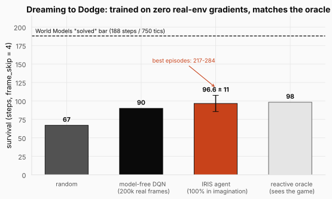

The figure is the headline. The imagination-trained agent survives **96.6 ± 11.0 steps** (386 game tics) on held-out episodes: **45% above random** (67), **above the model-free DQN** (90) trained on identical real data, and **statistically matching the oracle** (98.3). Its best episodes run 217 to 284 steps, clearing the original World Models "solved" bar of 188. Read the DQN bar twice, because it is the sample-efficiency argument in one number: given the same 200k real frames, spending them on a world model and dreaming beats spending them on direct model-free learning.

Because a single evaluation can be seed-lucky, the number was verified on **four independent seed sets**: the selection set (98.0), a first held-out set (100.3), an adversarial fresh re-check with 50 episodes (96.6 ± 11.0, the reported figure), and an independent 40-seed analysis set (96.8, versus 74.4 random and 97.7 oracle on those same seeds). Consistency between 96 and 100 across all four is what "not a fluke" looks like. And the agent's action distribution is `[0.00, 0.54, 0.46]` over no-op, left, right: it never freezes and splits its strafes nearly evenly, which is the statistical fingerprint of reacting to fireballs rather than executing a memorized dance.

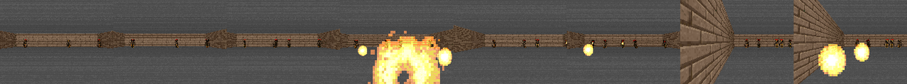

The filmstrip is the qualitative version: eight frames spanning one real episode, the agent sliding across the room as fireballs come in. Every skill on display here was learned inside a hallucination. The agent saw its first real fireball at evaluation time, and dodged it, because it had already dodged thousands of imagined ones.

<details>
<summary><strong>Check:</strong> why does beating the DQN matter more than beating random?</summary>

**Answer.** Random is a floor; any learning at all clears it. The DQN is a *controlled comparison*: it is a competent model-free learner given exactly the same budget of real frames the world model was trained on. Beating it shows the world-model route extracts more skill per real frame, which is the entire practical argument for model-based RL. Matching the oracle then shows the extracted skill approaches the ceiling for reactive play.
</details>

### 2.8 Analysis: is it really dodging, and why short dreams suffice

Two analyses turn "it scores well" into "we know what it learned."

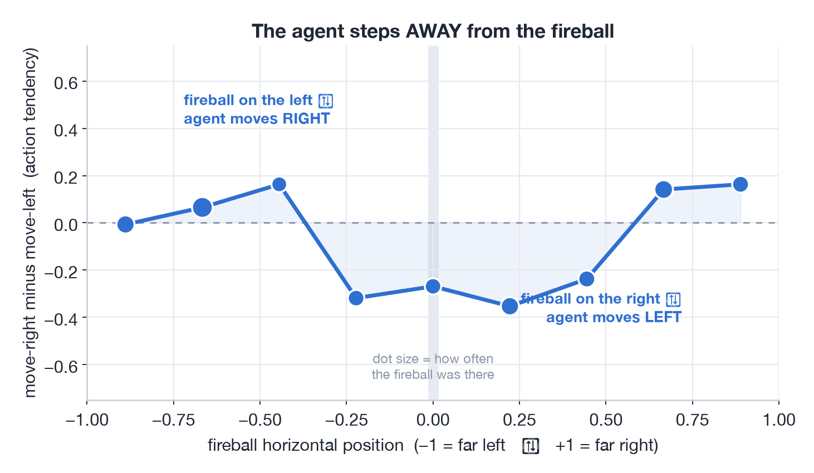

First, reactivity. Over ~3,900 real transitions we logged the fireball's horizontal position and the agent's chosen action, and plotted the tendency (probability of moving right minus probability of moving left) as a function of where the threat is. The curve is a clean avoidance rule: fireball on the left, tendency swings positive (move right); fireball on the right, tendency swings negative (move left). The extreme edges wobble because fireballs rarely appear there (the dot sizes show frequency). This is the direct, quantitative refutation of the memorized-routine worry from Section 2.5: **the strafe is a function of the threat.** The dream taught exactly the input-output relationship the task demands.

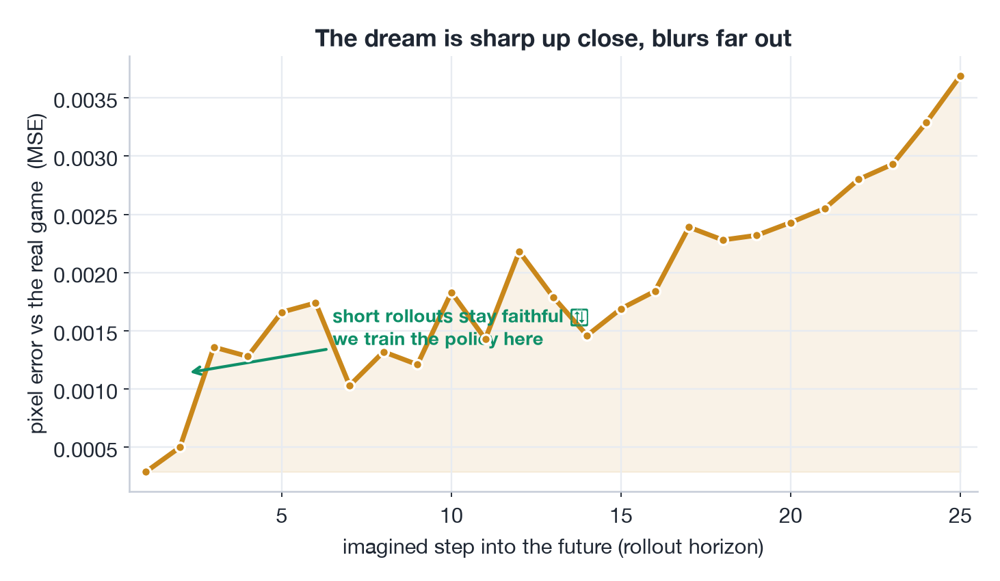

Second, fidelity. Roll the world model and the real game forward under the same action sequence and measure per-step pixel error between them. The dream tracks reality closely for the first several steps and drifts as errors compound, roughly quadrupling by 25 steps out. This curve is the empirical justification for a design choice we made on faith in Section 2.5: train the policy on *short* imagined windows, where the dream is trustworthy, from *many diverse real starting points*, rather than on long rollouts that wander off into accumulated error. Readers who want this trade-off formalized should look up MBPO ("When to Trust Your Model"), which derives exactly this prescription; our curve is that paper's Figure 2 lived firsthand.

<details>
<summary><strong>Check:</strong> compounding error makes long dreams unfaithful. Why does starting many short dreams from real frames sidestep the problem?</summary>

**Answer.** Error compounds along a rollout because each imagined frame becomes the input for the next prediction, so drift feeds drift. Restarting from a real frame resets the accumulated error to zero. Many short rollouts from diverse real starts cover the state space while every imagined step stays within the low-error region of the fidelity curve, so the policy trains almost entirely on trustworthy dynamics.
</details>

### 2.9 The harness: Modal, and the bug that had nothing to do with RL

Every stage of this project runs on **Modal**, the same serverless pattern as the [Socratic Alignment](../10-socratic-alignment/README.md) study: write an ordinary Python function, decorate it with the hardware and software it needs, and it executes in a container that exists only while the call does. All training fits on a single **A10G**. A persistent **Volume** turns the chain of throwaway containers into one program: collect writes real frames to it, the tokenizer reads them and writes its checkpoint, and so on down the chain, each stage committing before it returns. The long jobs (the CMA controller search, the multi-round IRIS loop) are **deployed and spawned** server-side, so they survive the laptop that launched them closing its lid, and results are polled off the Volume.

The pipeline is a handful of commands ([`CAPSTONE_DOOM.md`](https://github.com/S1LV3RJ1NX/RL-in-Production-Bootcamp-Resources/blob/main/phase-2/dreaming-to-dodge/CAPSTONE_DOOM.md) is the full operator record):

```bash
SK=modal_apps
# world model: collect -> tokenizer -> WM, then more grounding rounds
modal run $SK/train.py::collect     --cfg configs/doom.yaml --tag doom --round 0
modal run $SK/train.py::tokenizer   --cfg configs/doom.yaml --tag doom --round 0
modal run $SK/train.py::world_model --cfg configs/doom.yaml --tag doom --round 0

# gate: does the dream show fireballs and respond to actions?
modal run $SK/doom_dream_preview.py --tag doom --round 0

# the agent: CMA in imagination + held-out real-env selection
modal deploy $SK/train_controller.py

# baselines
modal run $SK/baseline_modelfree.py --tag doom_mf --steps 200000
```

Note the fourth line. Between "world model trained" and "spend GPU-days evolving a controller" sits a cheap **gate**: render the dream and check, with eyes and with metrics, that fireballs exist in it and that strafing moves the room. The project is full of these gates (`doom_dream_rank` from Section 2.5 and the KV-cache equivalence check `wm_cache_check` are two more), and they embody the ordering lesson of this whole post: every dollar spent on the policy is wasted if the dream upstream of it is broken, so verify the dream first.

And one war story, because production RL is never just RL. The very first Doom run produced frames that were uniform gray rectangles. The obvious suspect was headless OpenGL rendering in a container with no display, and that rabbit hole consumed real time (Xvfb, software Mesa, environment variables). The actual culprit: **numpy 2.x**. VizDoom 1.2.3's screen-buffer readback silently breaks under numpy ≥ 2, a known upstream issue, and the fix was one line in the container image: `numpy==1.26.4`. The debugging lesson generalizes: when a sensor returns implausibly uniform data, check the plumbing before the physics.

<details>
<summary><strong>Check:</strong> why insert a cheap dream-preview gate between world-model training and controller search?</summary>

**Answer.** Because the controller search is the expensive stage, and its output is meaningless if the dream is broken: a dream without fireballs teaches nothing, and no policy metric will say why. Rendering the dream and checking that the threat exists and that actions move the camera costs minutes and validates the exact assumptions the policy stage depends on. Debug upstream, spend downstream.
</details>

## 3. Putting it all together

| Concept | Math | In code |
|---|---|---|
| The snap (tokenization) | $\arg\min_i \lVert z_e - e_i\rVert_2$ | `dist.argmin(1)` in `tokenizer.py` |
| Straight-through estimator | forward $e$, backward $\partial/\partial z_e$ | `z_q = z_e + (z_q - z_e).detach()` |
| Commitment loss | $\beta\lVert z_e - \mathrm{sg}[e]\rVert_2^2$ | `self.beta * F.mse_loss(z_q.detach(), z_e)` |
| EMA codebook + revival | code $\leftarrow$ running centroid | `_ema_update` in `tokenizer.py` |
| Warmth-weighted recon | $w_p = 1 + \lambda_{\text{fg}}\,\text{lum} + \lambda_{\text{warm}}\,\text{warm}$ | the `warm` term in `Tokenizer.forward` |
| Interleaved ribbon | $16 \times (64+1) = 1040$ positions | `_embed` in `world_model.py` |
| Three heads | next token, $\mathrm{sign}(r)$, done | `head_token`, `head_reward`, `head_done` |
| Death class weight | weighted cross-entropy on done | `done_pos_weight` in `compute_loss` |
| KV-cached dreaming | 1 full + 63 single-token forwards | `generate_step_fast` in `world_model.py` |
| λ-return in imagination | $\Lambda_t = r_t + \gamma(1-d_t)[(1-\lambda)V + \lambda\Lambda_{t+1}]$ | `lambda_returns` in `actor_critic.py` |
| Tiny evolved controller | CMA-ES on dream survival | `TinyController` in `controller.py` |
| Transferable feature | pooled decoded frame, dream and real | `Reducer.features` in `controller.py` |

Every row was shown inline above; the table is only the map. The full runnable project (the three from-scratch components, the Doom config, the Modal harness, the diagnostics, the CMA-ES controller search, the verification scripts, the [paper](https://dreaming-to-dodge.vercel.app/assets/dreaming-to-dodge.pdf), and the playable simulator) lives in the repo:

> **[phase-2/dreaming-to-dodge](https://github.com/S1LV3RJ1NX/RL-in-Production-Bootcamp-Resources/tree/main/phase-2/dreaming-to-dodge)**

And the claim "the agent learned inside a neural network" is literally playable: at [dreaming-to-dodge.vercel.app](https://dreaming-to-dodge.vercel.app) you can drive the world model yourself. There is no game engine behind that page. The Transformer predicts each next frame from your strafes, and a "watch the AI" mode lets the trained controller play inside its own dream.

## Where this goes next

Strip away the fireballs and four portable lessons remain. **The transition model is rarely where model-based RL is hard**: next-token prediction over a small discrete space, with dense free supervision, is a Transformer's dream job. **Uniform objectives delete rare, task-critical events**: the fireball under a uniform pixel loss and death under an unweighted done loss are the same failure at two levels of the stack, and both fixes were one weight. **A policy is an adversary of its own world model**: it will find and exploit the model's soft spots unless you limit its capacity, feed it a view that transfers, and select on data the dream cannot inflate. And **verify upstream before spending downstream**: the cheap gates (render the dream, rank canned policies inside it, check the cache) are what kept the expensive stages honest.

The honest limitations point at the open road. The agent matches the reactive oracle but does not consistently exceed it, and its per-episode survival is high-variance. A finer 256-token tokenizer reconstructs sharply enough (MSE 0.0009) to promise super-oracle dodging, but its controller search was under-budgeted here and collapsed; a longer dream horizon and controller ensembling are the natural next steps. Beyond this project, the field is moving fast in exactly this direction: diffusion world models (DIAMOND) sharpen the visual detail that discrete tokenizers lose, and GameNGen simulates the full original DOOM with a diffusion model at interactive frame rates. The playable simulator on the project page is the same "the network is the game" idea at a scale one person can build and verify.

The throughline closes the loop on the whole series. The value of where I am is the reward I just got plus a discounted value of where I'll land next; a world model is what you build when the environment will not tell you where you land next, and this post's hard-won addendum is that the model's promises must be audited, because a policy will optimize the promises rather than the world. The machinery came from everywhere at once: the value learning of [DP, MC & TD](../03-dp-mc-td/README.md), the replay buffers and the DQN baseline of [SARSA, Q-learning & DQN](../04-sarsa-qlearning-dqn/README.md), the actor-critic of [Policy Gradients](../05-policy-gradients/README.md), and the gamed-metric paranoia of [RLHF](../07-rlhf/README.md), all pointed at a dream instead of a world. If you arrived mid-series, the thread starts from a single sentence about rewards and discounted futures in the [RL Foundations](../01-rl-intro-and-prerequisites/README.md) post. And if you take one sentence with you, take the thesis, now earned the hard way: **the world model is the easy part; getting a policy to learn a robust skill inside an imperfect model, without exploiting it, is the hard part.** Audit the dream.

There is one more place to take all of this machinery: off the screen entirely. The next post trades pixels for a physical robot arm and asks the question this series has been building toward: does RL actually work on real hardware, where every step costs seconds of arm time, resets are manual, and a crash costs a gearbox? The answer involves a reward the agent almost never sees, a 50/50 trick that makes it learnable anyway, and about fifty-five cents of GPU time; it is the [Robot RL](../12-robot-rl/README.md) post.

### References and further reading

- Ha, Schmidhuber, 2018. *World Models.* [arXiv:1803.10122](https://arxiv.org/abs/1803.10122).
- Micheli, Alonso, Fleuret, 2023. *Transformers are Sample-Efficient World Models* (IRIS). [arXiv:2209.00588](https://arxiv.org/abs/2209.00588).
- Hafner et al., 2021. *Mastering Atari with Discrete World Models* (DreamerV2). [arXiv:2010.02193](https://arxiv.org/abs/2010.02193).
- Hafner et al., 2023. *Mastering Diverse Domains through World Models* (DreamerV3). [arXiv:2301.04104](https://arxiv.org/abs/2301.04104).
- van den Oord, Vinyals, Kavukcuoglu, 2017. *Neural Discrete Representation Learning* (VQ-VAE). [arXiv:1711.00937](https://arxiv.org/abs/1711.00937).
- Razavi, van den Oord, Vinyals, 2019. *Generating Diverse High-Fidelity Images with VQ-VAE-2* (EMA codebooks). [arXiv:1906.00446](https://arxiv.org/abs/1906.00446).
- Dhariwal et al., 2020. *Jukebox: A Generative Model for Music* (dead-code revival). [arXiv:2005.00341](https://arxiv.org/abs/2005.00341).
- Janner, Fu, Zhang, Levine, 2019. *When to Trust Your Model: Model-Based Policy Optimization* (MBPO). [arXiv:1906.08253](https://arxiv.org/abs/1906.08253).
- Alonso et al., 2024. *Diffusion for World Modeling: Visual Details Matter in Atari* (DIAMOND). [arXiv:2405.12399](https://arxiv.org/abs/2405.12399).
- Valevski, Leviathan, Arar, Fruchter, 2024. *Diffusion Models Are Real-Time Game Engines* (GameNGen). [arXiv:2408.14837](https://arxiv.org/abs/2408.14837).
- Kempka et al., 2016. *ViZDoom: A Doom-based AI Research Platform for Visual RL.* [arXiv:1605.02097](https://arxiv.org/abs/1605.02097).
- Hansen, Ostermeier, 2001. *Completely Derandomized Self-Adaptation in Evolution Strategies* (CMA-ES).
