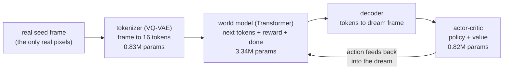
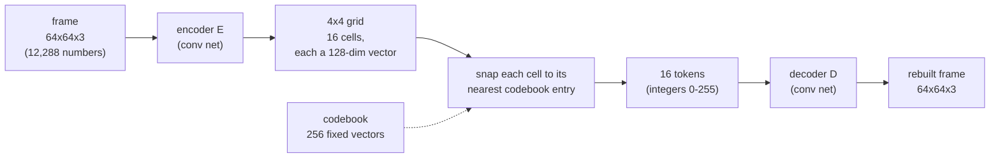
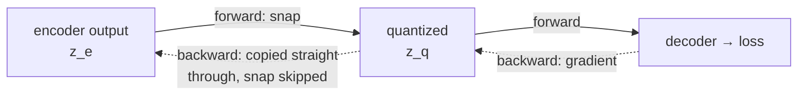
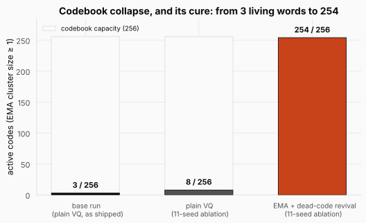
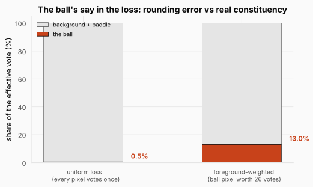
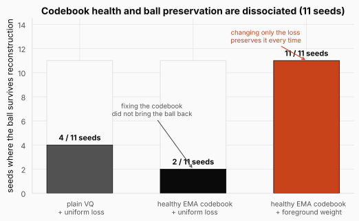
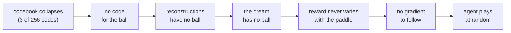
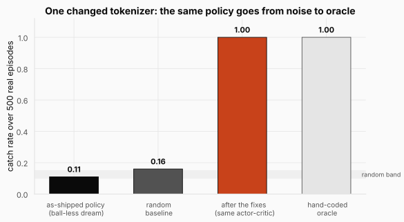
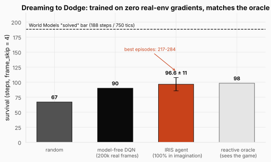

# World Models: Training an Agent Entirely Inside Its Own Dream


> **The throughline:** *The value of where I am is the reward I just got, plus a discounted value of where I'll land next.*
> Every post so far assumed the environment tells you where you land next. A world model removes that assumption: a neural network predicts the next state, the reward, and whether the episode ends, so the agent can evaluate the throughline inside its own imagination. The catch, and the whole drama of this post, is that the dream only contains what the model's representation chose to keep.

Close your eyes and imagine tossing a ball up and catching it. You did not throw anything. Somewhere in your head there is a small physics engine, and you just ran it forward: the ball rises, slows, falls, and your hand is there to meet it. You practiced in your imagination. This post gives that ability to a machine, builds it from scratch, and then does something most tutorials refuse to do: it runs the machine honestly, watches it fail, and traces the failure to its true cause. The failure turns out to be more instructive than the success.

Everything here is a real project: three networks under five million parameters total, trained end to end on rented GPUs for about the price of a coffee. The code we quote is the actual implementation, and the whole project is linked at the end of the post.

## 1. The intuition: why dream at all?

A **world model** is a neural network that has learned to simulate an environment. Hand it the current observation and an action, and it predicts three things: the **next observation**, the **reward**, and whether the episode is **done**. That sounds modest. It matters because of what it unlocks once the model is good enough: you can **train an agent inside it**. Instead of letting the agent flail around in the real environment, you let it practice in the model's dream. The agent acts, the world model imagines the consequence, and the agent learns from imagined consequences alone.

The reason to want this is **sample efficiency**. RL is notoriously hungry: recall from the [SARSA, Q-learning & DQN](../04-sarsa-qlearning-dqn/README.md) post that DQN needed millions of real Atari frames to learn Pong. If each step is a real robot moving, a real trade, or a real patient decision, "millions of steps" ranges from expensive to unthinkable. A world model attacks this directly. Real experience is spent on one thing only: training the model. Once the model dreams plausibly, imagined steps are cheap, parallel, and safe.

The idea has a clean lineage. Ha and Schmidhuber's 2018 paper, literally titled *World Models*, trained a controller entirely inside a learned dream of a racing game. DeepMind's Dreamer family made it a workhorse, and DreamerV2 made one quiet move that foreshadows everything below: it swapped the model's continuous latent state for a *discrete* one. **IRIS** (2023) takes that move to its logical end. It casts the world model as a **language model over image tokens**: a discrete autoencoder turns each frame into a handful of tokens from a fixed vocabulary, and an autoregressive Transformer predicts the environment one token at a time, exactly like GPT predicts the next word. IRIS is a language model for pixels.

We rebuild all three IRIS components from scratch and study them on a task deliberately small enough that every moving part is visible: pixel **Catch**. A paddle at the bottom of a `64×64` screen slides left or right to intercept one falling ball. Reward is a single terminal signal: `+1` for a catch, `−1` for a miss. An episode lasts about 7 steps. The three networks wire into one loop:



Trace the loop once. A real frame comes in on the left. The tokenizer compresses it to 16 integers. The world model reads those integers plus the last action and predicts the next frame's tokens, the reward, and the done flag. A decoder turns the predicted tokens back into a picture. The actor-critic looks at that picture, chooses an action, and the action goes straight back into the world model, which imagines the next frame. After the very first frame, nothing in this loop is real. The agent walks through a hallucination that it and the world model generate together.

Here is what happens when you assemble this system naively and run it: **the agent plays Catch at random.** It does not learn to catch the ball. And the interesting question, the one this whole post is built to answer, is *why*. The temptation is to blame the agent or the hyperparameters. But traced patiently backwards, the failure leads somewhere surprising: the actor-critic gets no learning signal because the dream contains no ball to catch, and the dream contains no ball because the **tokenizer discarded the ball** before the world model ever saw a frame. The usual name for that is *codebook collapse*, and that diagnosis, we will show, is real but incomplete.

**The thesis, to be earned over the rest of the post: a world model can only teach a policy what its tokenizer chooses to preserve.**

<details>
<summary><strong>Check:</strong> the world model is a convenience for Catch. For what kind of environment does it become a necessity?</summary>

**Answer.** Environments where real experience is slow, costly, or unsafe: a robot that breaks, a market that loses money, a patient who cannot be A/B-tested. There, the dream is not a compute saving; it is the only place the policy is allowed to fail. Real experience is spent once, on training the model, and every reckless experiment happens in imagination.
</details>

With the loop in view, we can build it one box at a time, starting where the vocabulary is born and where, quietly, the ball is first lost.

## 2. The machinery: three networks, two diseases, one fix

### 2.1 The tokenizer: a VQ-VAE that turns frames into words

A `64×64×3` frame is `12,288` real numbers. A language model wants a short sequence of discrete symbols. The tokenizer bridges that gap: it must compress each frame down to exactly **16 tokens**, each an integer index into a fixed vocabulary of **256** entries, and be able to reconstruct the frame from them. That is a `12,288 / 16 = 768×` reduction in the number of things the Transformer will have to predict, and it is the whole reason a Transformer over frames is tractable.

The machine that does this is a **VQ-VAE** (vector-quantized autoencoder). It has three parts, and the easiest way to hold them in your head is as an assembly line that takes a picture apart into words and then rebuilds it:



Walk the line left to right, then meet each part up close. A frame enters as 12,288 raw numbers. The encoder squeezes it to 16 cells. Each cell snaps to its nearest entry in a fixed codebook, becoming one of 256 tokens. The decoder reads those tokens back into a picture. All of the `768×` compression lives in that middle pinch: the Transformer will only ever deal with the 16 tokens, never the 12,288 pixels.

The **encoder** `E` is a small convolutional network. It takes the `64×64×3` frame and shrinks it to a `4×4` grid of feature vectors, each 128 numbers long. That is 16 cells, one per patch of the frame, and each cell is the encoder's continuous summary of its patch ("dark background here," "bright ball there"). These 16 cells are where the 16 tokens will come from, but they are not tokens yet: they are still arbitrary real-valued vectors.

The **codebook** turns a cell into a token. It is a learned table of 256 vectors, each also 128 numbers long, and you can think of it as the tokenizer's entire dictionary: the only 256 words it is allowed to speak. For each cell we find the codebook vector closest to it by ordinary Euclidean distance, and replace the cell with that vector. The token is just that winner's index, an integer from 0 to 255. This replacement is the *snap*, meant as literally as a cursor snapping to a grid: a vector that could have been anything is forced onto one of 256 fixed points. Snap all 16 cells and the whole frame is now described by 16 integers.

The **decoder** `D` runs the line in reverse. It takes the 16 snapped vectors and expands them back into a full `64×64×3` picture, the tokenizer's best attempt at reconstructing the frame it started from.

How does this machine learn? By reconstruction. Feed in a frame, encode it, snap, decode, and compare the rebuilt picture to the original pixel by pixel. That pixel error is the training loss. Gradient descent is supposed to shrink it the usual way: the gradient starts at the loss, flows backward through the decoder, crosses the snap, reaches the encoder, and nudges both networks toward better reconstructions.

Except the gradient never makes it across the snap. To see why, follow one cell. The cell covering the ball produces some vector, and say its nearest codebook entry is code 17. Training works by asking, for every number in the network, "if I nudge this a hair, does the loss go down?" So nudge that ball cell's vector slightly. It still snaps to code 17. The decoder receives the identical input, rebuilds the identical picture, and the loss does not move. The nudge changed nothing the loss can measure.

That stays true almost everywhere. Small changes to a cell leave its nearest code unchanged, so the loss is flat, so the gradient is zero. The only exceptions are the razor-thin boundaries where a nudge just barely tips a cell over to a different nearest code, and those boundaries are a vanishingly thin sliver of the space. A gradient that is zero almost everywhere carries no information, so backpropagation reaches the snap, hits a flat wall, and dies. The decoder still learns (the gradient reaches it *before* the wall), but the encoder never hears about its mistakes.

The fix is a trick called the **straight-through estimator**, and it is as cheeky as it sounds. On the forward pass, snap honestly, so the decoder sees real codebook vectors. On the backward pass, pretend the snap never happened: copy the decoder's gradient straight back to the encoder, as if the cell's continuous vector had been used directly.



The diagram shows the two routes. Forward (solid) runs through the snap; backward (dotted) skips it, routing the gradient around the wall and straight into the encoder. In [`tokenizer.py`](https://github.com/S1LV3RJ1NX/RL-in-Production-Bootcamp-Resources/blob/main/phase-2/dreaming-to-dodge/tokenizer.py) this is a single line: `z_q = z_e + (z_q - z_e).detach()`. The forward value is exactly the snapped code `z_q`, but `.detach()` hides the `(z_q - z_e)` difference from the gradient, so on the backward pass the encoder is trained as if the wall were glass. Here is the whole mechanism on toy tensors:

```python
import torch

# seed so the output below is reproducible
torch.manual_seed(0)

# 4 encoder cells (a tiny 2x2 grid), each a 3-dim vector, and an 8-entry codebook
z_e = torch.randn(4, 3, requires_grad=True)
codebook = torch.randn(8, 3)

# the snap: distance from every cell to every code, then argmin
d = torch.cdist(z_e, codebook)
idx = d.argmin(dim=-1)
e = codebook[idx]

# straight-through: forward value is e, backward gradient flows to z_e
z_q = z_e + (e - z_e).detach()

# any downstream loss now trains the encoder as if the snap were glass
loss = z_q.pow(2).sum()
loss.backward()

print("tokens:", idx.tolist())
print("z_q equals the snapped codes:", torch.allclose(z_q, e))
print("gradient reached the encoder:", z_e.grad is not None,
      "| grad of cell 0:", [round(g, 3) for g in z_e.grad[0].tolist()])
```

```text title="Output"
tokens: [2, 2, 3, 4]
z_q equals the snapped codes: True
gradient reached the encoder: True | grad of cell 0: [-0.287, -0.223, -1.346]
```

Four continuous cells became four integers (two of them snapped to the same code), the decoder saw real codebook vectors, and the encoder still received a gradient through the non-differentiable snap.

One note on paths, so the code links do not mislead you: everything in this post lives in a single repo, `phase-2/dreaming-to-dodge`, named after its Doom capstone (Section 2.10). The same `tokenizer.py`, `world_model.py`, and `actor_critic.py` run Catch and Doom alike; a config file picks the environment. Until Section 2.10, every example and every number is Catch.

One more term keeps the encoder honest. Nothing so far stops the encoder from drifting away from the codebook, producing vectors no code is near, which makes every snap lossy. The **commitment loss** pulls the encoder's outputs toward the codes they snapped to:

$$\mathcal{L}_{\text{commit}} = \beta \,\lVert z_e - \mathrm{sg}[e]\rVert_2^2$$

Read it symbol by symbol: the left side is the commitment loss; on the right, $z_e$ is the encoder's continuous output for a cell, $e$ is the codebook entry that cell snapped to, $\mathrm{sg}[\cdot]$ is stop-gradient (the code is treated as a fixed target), $\lVert\cdot\rVert_2^2$ is squared Euclidean distance, and $\beta = 0.25$ sets the pull strength. In plain English: the encoder is charged for wandering far from the word it chose, so it commits to the vocabulary; raise $\beta$ and the encoder hugs the codebook tighter, lower it and the encoder roams more freely. Note the direction: this term moves the *encoder* toward the code, never the code toward the encoder. How the codebook itself learns is a separate choice, and it is where the first disease hides.

<details>
<summary><strong>Check:</strong> why does training a VQ-VAE need the straight-through trick at all?</summary>

**Answer.** Because tokenization is an argmin, a hard nearest-neighbor lookup, and argmin is flat almost everywhere: its gradient is zero, so backpropagation through it delivers nothing to the encoder. The straight-through estimator quantizes honestly on the forward pass but copies the decoder's gradient past the snap on the backward pass, letting the encoder learn as if its continuous output had been used directly.
</details>

The tokenizer defines what words exist in this language. Next we watch it lose most of them.

### 2.2 Pathology one: codebook collapse

Train the tokenizer as shipped and ask how many of the 256 codes it actually uses. The answer is about **1.2%**: roughly **3 of 256**. The other 253 sit allocated, initialized, and never touched. This is **codebook collapse**, and the mechanism is worth seeing once, because you can never un-see it.

In the original VQ-VAE, the codebook learns by gradient descent on a **codebook loss**:

$$\mathcal{L}_{\text{codebook}} = \lVert \mathrm{sg}[z_e] - e \rVert_2^2$$

Read it: the left side is the codebook's own loss; on the right, $z_e$ is the encoder output (frozen by the stop-gradient $\mathrm{sg}$, so it acts as a fixed target) and $e$ is the codebook entry that was chosen. In plain English: each *chosen* code is pulled toward the average of the encoder vectors that snapped to it, so codes drift to the center of their cluster. That is sensible, and for codes that get used it works fine.

The trouble is the codes that do not get used. Ask what happens to a code that is never anyone's nearest neighbor in a batch. It appears in the loss zero times, so its gradient is exactly zero, so it never moves, so it stays right where it was initialized, far from all the data, so it keeps losing every nearest-neighbor contest. Nothing in the loss can pull a dead code back toward the data, so a code that goes unused once tends to stay unused forever. Watch it happen:

```python
import torch

torch.manual_seed(0)

# same setup, but now train the CODEBOOK with the plain codebook loss
z_e = torch.randn(4, 3)
codebook = torch.randn(8, 3, requires_grad=True)

idx = torch.cdist(z_e, codebook).argmin(dim=-1)
e = codebook[idx]

# L_codebook = ||sg[z_e] - e||^2  (the chosen codes move toward the data)
codebook_loss = (z_e.detach() - e).pow(2).sum()
codebook_loss.backward()

# per-code gradient magnitude: chosen codes move, unchosen codes are frozen
grad_norm = codebook.grad.norm(dim=1)
for k in range(8):
    tag = "chosen" if k in idx.tolist() else "dead"
    print(f"code {k}: grad norm {grad_norm[k]:.3f}  ({tag})")
```

```text title="Output"
code 0: grad norm 0.000  (dead)
code 1: grad norm 0.000  (dead)
code 2: grad norm 6.944  (chosen)
code 3: grad norm 2.071  (chosen)
code 4: grad norm 0.900  (chosen)
code 5: grad norm 0.000  (dead)
code 6: grad norm 0.000  (dead)
code 7: grad norm 0.000  (dead)
```

Three codes won cells and received gradient; five received exactly zero and will never move toward the data. That asymmetry is a rich-get-richer loop: winners fit the data better and win more, losers stay frozen and keep losing. Collapse is not bad luck; it is a stable equilibrium the dynamics fall toward. And Catch pours fuel on it, because a frame is ~99% dark background, so a couple of codes park in the fat background cluster and win almost every cell. The three surviving codes are three flavors of background. There is no code that means "bright ball here."

Two textbook cures, both one config line in our [`tokenizer.py`](https://github.com/S1LV3RJ1NX/RL-in-Production-Bootcamp-Resources/blob/main/phase-2/dreaming-to-dodge/tokenizer.py). First, **EMA codebook updates** (from VQ-VAE-2): stop learning the codebook by gradient entirely, and instead set each code directly to the exponential moving average of the encoder vectors assigned to it. An exponential moving average is just a slow-forgetting running mean: each update keeps 99% of the old estimate and mixes in 1% of what the current batch says (that is the `decay = 0.99` below). Two running statistics per code do the bookkeeping, a smoothed count and a smoothed vector sum, and the code is their ratio, the running centroid of its cluster:

```python
# from tokenizer.py::_ema_update (decay = 0.99)
onehot = F.one_hot(idx, n_codes).type(flat.dtype)
batch_count = onehot.sum(0)
batch_sum = onehot.t() @ flat
# EMA of per-code counts and vector sums
self.cluster_size.mul_(self.decay).add_(batch_count, alpha=1 - self.decay)
self.embed_avg.mul_(self.decay).add_(batch_sum, alpha=1 - self.decay)
# Laplace-smoothed normalisation -> new code vectors
n = self.cluster_size.sum()
cluster = (self.cluster_size + self.eps) / (n + n_codes * self.eps) * n
self.embedding.weight.data.copy_(self.embed_avg / cluster.unsqueeze(1))
```

EMA makes the living codes healthier, but a code nobody picks still has an empty cluster and still never moves. So the second cure is blunter: **dead-code revival**, the random-restart trick from Jukebox. Every 200 steps, find every code whose smoothed cluster size fell below 1 and teleport it onto a random live encoder vector from the current batch:

```python
# from tokenizer.py::_ema_update, the revival tick
self._step += 1
if self.revive_dead and (self._step % self.revive_every == 0):
    dead = self.cluster_size < self.dead_threshold
    n_dead = int(dead.sum())
    if 0 < n_dead <= flat.shape[0]:
        # reseed dead codes with random encoder vectors from this batch
        pick = torch.randint(0, flat.shape[0], (n_dead,), device=flat.device)
        seed = flat[pick]
        self.embedding.weight.data[dead] = seed
        self.embed_avg[dead] = seed
        self.cluster_size[dead] = 1.0
```

All three statistics reset together: the code jumps onto real data, its average is seeded to match, and its cluster size is set to 1 so it is not immediately re-declared dead. Together the two fixes work emphatically. In the paper's controlled ablation over 11 seeds, plain VQ collapses to about **8 of 256** active codes; EMA with revival holds **254 of 256**.



The figure puts the three regimes side by side against the full 256-code capacity. The two left bars are the same disease measured on two runs: the as-shipped base run collapses to 3 codes, and even the slightly healthier plain-VQ ablation holds only 8. The right bar is the cure: EMA updates keep living codes tracking their clusters, and revival keeps recycling dead ones back into the data, so the vocabulary never settles into the three-word equilibrium. **Two config lines take the codebook from three living words to two hundred and fifty-four.**

If the story ended here, we would take a bow and the agent would learn to catch. It is very tempting to believe that. It is also wrong, and the way it is wrong is the most important lesson in the whole project.

<details>
<summary><strong>Check:</strong> why can a dead code never come back on its own, without the revival trick?</summary>

**Answer.** The codebook loss only involves codes that were chosen this batch, so an unchosen code gets a gradient of exactly zero and stays wherever it was initialized. Because it never moves toward the data, it keeps losing every nearest-neighbor contest, which keeps its gradient at zero. Even under EMA updates its cluster is empty, so its centroid never changes. The trap is self-sealing; only an outside intervention (teleporting it onto live data) breaks it.
</details>

### 2.3 Pathology two: the vanishing ball

Here is the result that took a while to believe. With the codebook fully healthy, 254 of 256 codes alive, we ran the same tokenizer across **11 random seeds** and measured, for each, whether the ball survived reconstruction. It survived in **2 of 11**. Nine times out of eleven, a pristine 256-word vocabulary rebuilt the frame with the ball erased. For comparison, the *collapsed* plain-VQ codebook kept the ball in 4 of 11. Fixing the codebook did not improve ball preservation at all. Codebook health and ball preservation are **dissociated**, so whatever erases the ball, it is not collapse.

If the vocabulary is not the bottleneck, the objective must be. Here is the tokenizer loss the project ships. The first term is the pixel-by-pixel reconstruction error that Section 2.1 described in words, now written out precisely; the second is the commitment term you have already met:

$$
\begin{aligned}
\mathcal{L}_{\text{tok}} &= \underbrace{\frac{\sum_{p} w_p\,\lVert x_p-\hat{x}_p\rVert_1}{\sum_p w_p}}_{\text{reconstruction}} \;+\; \beta\,\lVert z_e-\mathrm{sg}[e]\rVert_2^2 \\
w_p &= 1 + \lambda_{\text{fg}}\,\max_c x_{p,c}
\end{aligned}
$$

Read the reconstruction term symbol by symbol: $x_p$ is the true value of pixel $p$, $\hat{x}_p$ is the decoded value, $\lVert\cdot\rVert_1$ is the absolute error, $w_p$ is a per-pixel weight, and the sum over $w_p$ in the denominator keeps it a proper weighted average. The weight itself: every pixel starts at 1, and we add $\lambda_{\text{fg}}$ times the pixel's brightness $\max_c x_{p,c}$, the maximum over the three color channels. In plain English: the loss is an average pixel error where bright pixels can be given extra votes; set $\lambda_{\text{fg}} = 0$ and every pixel votes exactly once, which is the base setting and the most natural loss in the world.

And it contains a trap that has nothing to do with codebooks. A uniform average over pixels is a popularity vote, and in a Catch frame the votes are wildly lopsided. The screen is about 4,096 pixels. The background is almost all of them. The paddle sits on a fixed bottom row the network memorizes for free. The ball is a handful of bright pixels, roughly **0.5% of the frame**. Now do the optimizer's arithmetic out loud: erase the ball entirely, and you make ~0.5% of the pixels maximally wrong while the average barely moves. Keep the ball, and you must render a small bright object at a precise, always-changing position. The two solutions land at almost the same loss, so which one a run settles into is decided by seed noise. That is exactly why the 11-seed result is a coin flip rather than 0 of 11: *the loss expressed no preference, so chance decided.* Watch the arithmetic on a toy frame:

```python
import torch

torch.manual_seed(0)

# a 64x64 single-channel 'frame': dark background, one 4x4 bright ball
# (16 of 4096 pixels, about 0.4% of the frame, like Catch's ball)
x = torch.zeros(64, 64)
x[8:12, 28:32] = 1.0

# reconstruction A keeps the ball perfectly; B erases it entirely
recon_keep = x.clone()
recon_drop = torch.zeros(64, 64)

# both are slightly noisy on the background either way
noise = 0.02 * torch.rand(64, 64)
recon_keep = (recon_keep + noise).clamp(0, 1)
recon_drop = (recon_drop + noise).clamp(0, 1)


def weighted_l1(x, x_hat, fg_weight):
    # w_p = 1 + lambda_fg * brightness (brightness of the TARGET, not the recon)
    w = 1.0 + fg_weight * x
    err = (x_hat - x).abs()
    return (w * err).sum() / w.sum()


for lam in [0.0, 25.0]:
    keep = weighted_l1(x, recon_keep, lam)
    drop = weighted_l1(x, recon_drop, lam)
    print(f"lambda_fg = {lam:>4.0f}:  keep-ball loss {keep:.4f}   "
          f"drop-ball loss {drop:.4f}   ratio {drop / keep:.1f}x")
```

```text title="Output"
lambda_fg =    0:  keep-ball loss 0.0099   drop-ball loss 0.0137   ratio 1.4x
lambda_fg =   25:  keep-ball loss 0.0090   drop-ball loss 0.1007   ratio 11.2x
```

Under the uniform loss, deleting the ball costs 0.0038 in absolute terms, a rounding error the optimizer will happily pay for a simpler decoder; with the foreground weight the same deletion multiplies the loss elevenfold, and the choice stops being a coin flip.

The fix, then, is one knob: turn $\lambda_{\text{fg}}$ from 0 to 25. A dark pixel keeps weight ~1; a bright ball pixel gets weight $1 + 25 = 26$. Napkin math for what that buys: the ball's influence on the loss is its pixel share times its weight, so it goes from $0.5\% \times 1 = 0.5\%$ of the vote to roughly $0.5\% \times 26 \approx 13\%$. The ball goes from rounding error to real constituency.



The figure is the napkin math drawn: under a flat vote the ball's few pixels are invisible to the objective, and after the reweighting they command an eighth of the total say. Nothing about the model's capacity changed, only how much the objective cares. This is the sense in which the reconstruction loss, not the architecture, decides what the world model will be allowed to know.

Here is the fix as it ships in [`tokenizer.py`](https://github.com/S1LV3RJ1NX/RL-in-Production-Bootcamp-Resources/blob/main/phase-2/dreaming-to-dodge/tokenizer.py), inside `Tokenizer.forward`. It is genuinely this small (the `warm` term is for Doom, coming in Section 2.10; for Catch it is zero):

```python
if self.cfg.fg_weight > 0 or self.cfg.warm_weight > 0:
    # per-pixel weight: brightness (fg) + warmth (R above G,B => fireballs)
    lum = x.amax(dim=1, keepdim=True)
    warm = (x[:, :1] - 0.5 * (x[:, 1:2] + x[:, 2:3])).clamp(min=0.0)
    w = 1.0 + self.cfg.fg_weight * lum + self.cfg.warm_weight * warm
    # per-pixel L1 error, then a weighted mean instead of a flat mean
    err = (x_hat - x).abs().mean(dim=1, keepdim=True)
    recon = (w * err).sum() / w.sum()
else:
    # uniform L1: the base setting, and the trap
    recon = F.l1_loss(x_hat, x)
```

A subtle correctness point: the weight comes from `x`, the ground-truth frame, not from the reconstruction. If we weighted by the reconstruction's brightness, the decoder could cheat by dimming the ball to lower its own weight. Weighting by the target closes that loophole.

Does it work? Across the same 11 seeds, with the codebook mechanism held fixed and only the loss changed, ball preservation goes from **2 of 11 to 11 of 11**, mean ball recall ≈ 1.00, zero variance. The variance vanishing is the tell that we fixed the cause: the outcome is no longer decided by noise because the objective now expresses a preference.



Read the figure as two controlled experiments on one grid. Bars one to two fix the codebook while holding the loss uniform: the ball does not come back (4 of 11 becomes 2 of 11, statistically the same coin flip). Bars two to three hold the codebook fixed and change only the loss: 2 of 11 becomes 11 of 11. **The reconstruction objective, not codebook health, decides whether the ball lives.** The "codebook collapse" diagnosis was real but incomplete, and this one-variable-at-a-time comparison is how you tell a correlated diagnosis from a causal one.

One honest caveat travels with the trick. Foreground weighting exploits a fact special to Catch: the important objects are the bright ones. It is a cheap stand-in for the **perceptual loss** that full-scale IRIS pairs with its tokenizer, which protects salient structure on natural images for the same reason. The base implementation we inherited had dropped that perceptual term as "buying little on small synthetic frames," and that deletion is exactly what re-opened this hole. The general lesson stands either way: a raw pixel average silently defines "important" as "occupies many pixels," and it therefore discards exactly the objects that are small, fast, and task-critical. The pedestrian at the far end of the frame. The tumor a few pixels wide. The one indicator light that just turned red.

<details>
<summary><strong>Check:</strong> how can the reconstruction error look excellent while the one object that matters is missing?</summary>

**Answer.** Because the error is averaged over all 4,096 pixels and the ball is about 0.5% of them. Erasing it makes a few pixels maximally wrong while thousands of correctly rendered background pixels dominate the average, so the MSE stays tiny (the base run reports 0.0165). The metric is honest; it just answers "how are the average pixels" and not "is the task-critical object still there."
</details>

<details>
<summary><strong>Check:</strong> why did the ball survive on 2 of 11 seeds instead of none, if the uniform loss prefers dropping it?</summary>

**Answer.** Because keeping and dropping the ball sit at nearly identical loss values; the gap is a fraction of a percent of the pixels. When two solutions are that close, initialization and minibatch order decide which one a run falls into. The loss expressed no preference, so seed noise chose, which is also why the recall across seeds is bimodal (near 1 or near 0) rather than a stable middle value. Large cross-seed variance is the fingerprint of a decision being made by noise.
</details>

With the ball reliably in the tokens, the second network finally has something worth predicting.

### 2.4 The world model: a GPT over frame tokens

Once a frame is 16 tokens, a sequence of frames is just a sequence of tokens, and "predict the future" collapses into "predict the next token," the one thing a Transformer was born to do. The world model is an autoregressive Transformer, 4 layers, width 256, 4 heads, about 3.34M parameters: a small minGPT pointed at pixels.

The first design decision is shape: how do you lay a stream of frames and actions out as one flat sequence a Transformer can read? At each timestep there are two things to record: the 16 tokens for that frame, and the 1 action the agent took. IRIS writes them in order, the 16 frame tokens first and then the action, so the action sits right after the frame it responded to. One timestep is therefore 17 positions. Laid out over the $L = 10$ timesteps the model looks back on, the sequence reads like this:

```text
one step   = [ f1 f2 f3 ... f16 | a ]        17 positions: 16 frame tokens, then 1 action
one ribbon = step0  step1  ...  step9        10 steps x 17 = 170 positions
```

$$10 \times (16 + 1) = 170 \text{ positions}$$

Read the equation: 10 is the context length in timesteps, 16 is the tokens per frame, 1 is the action slot, and 170 is the total length of the ribbon the Transformer attends over. In plain English: the model's whole visible universe is ten steps of interleaved picture-words and moves. That comfortably covers Catch's 7-step episodes, and it is tiny by GPT standards, which is one reason this component is cheap.

Two small implementation notes. The frame tokens and the actions are unrelated alphabets (a "5" that means codebook entry 5 has nothing to do with a "5" that means action 5), so each gets its own embedding table. And building the ribbon is just a `cat` (glue the action embedding onto the frame embeddings) followed by a `reshape` (flatten the per-step blocks into one long line). Here it is, shapes printed:

```python
import torch
import torch.nn as nn

torch.manual_seed(0)

# 16 frame tokens (vocab 256) and 1 action (3 choices) per step, 10 steps
B, T, K = 1, 10, 16
frame_emb = nn.Embedding(256, 256)
action_emb = nn.Embedding(3, 256)

tokens = torch.randint(0, 256, (B, T, K))
actions = torch.randint(0, 3, (B, T))

# embed both alphabets to the same width, then interleave and flatten
tok_e = frame_emb(tokens)
act_e = action_emb(actions).unsqueeze(2)
seq = torch.cat([tok_e, act_e], dim=2)
seq = seq.reshape(B, T * (K + 1), -1)

print("frame tokens:", tuple(tokens.shape), "-> embedded:", tuple(tok_e.shape))
print("actions:     ", tuple(actions.shape), "-> embedded:", tuple(act_e.shape))
print("one ribbon:  ", tuple(seq.shape), f"= 10 x (16 + 1) = {10 * 17} positions")
```

```text title="Output"
frame tokens: (1, 10, 16) -> embedded: (1, 10, 16, 256)
actions:      (1, 10) -> embedded: (1, 10, 1, 256)
one ribbon:   (1, 170, 256) = 10 x (16 + 1) = 170 positions
```

Two streams became one 170-position ribbon of same-width vectors, which is exactly the `_embed` method of [`world_model.py`](https://github.com/S1LV3RJ1NX/RL-in-Production-Bootcamp-Resources/blob/main/phase-2/dreaming-to-dodge/world_model.py).

On top of the trunk sit three prediction heads, because a world model must predict the whole consequence of an action, not just the next picture:

```python
# from world_model.py: the three heads on the shared trunk
self.head_token = nn.Linear(cfg.embed_dim, cfg.vocab_size)
self.head_reward = nn.Linear(cfg.embed_dim, cfg.num_reward_classes)
self.head_done = nn.Linear(cfg.embed_dim, 2)
```

The **token head** is the star: a 256-way classification at each position, trained with plain cross-entropy, literally next-token prediction. This is the transition model, the part that learns that the ball falls one row per step and the paddle moves where the action said. The **reward head** makes a deliberate simplification: instead of regressing a real number, it classifies the *sign* of the reward, $\mathrm{sign}(r) \in \{-1, 0, +1\}$, three classes. In Catch the reward is only ever −1, 0, or +1, so three buckets is all there is, and classifying a sparse categorical signal is far easier than regressing it (the same instinct as DreamerV2's discrete reward encoding). The mapping is one line:

```python
import torch

# Catch's only rewards: -1 (miss), 0 (mid-episode), +1 (catch)
r = torch.tensor([-1.0, 0.0, 0.0, 1.0])

# sign(r) mapped to classes {0, 1, 2} for the 3-way reward head
classes = torch.sign(r).long() + 1
print("rewards:", r.tolist(), "-> classes:", classes.tolist())
```

```text title="Output"
rewards: [-1.0, 0.0, 0.0, 1.0] -> classes: [0, 1, 1, 2]
```

The four possible rewards land in three clean classes, and the head just has to pick a bucket. The **done head** is a binary classification: did the episode end. Both reward and done are read off each step's *action position*: the action slot is the last position in its step's block, so under causal attention it is the one position that has seen the entire step, which is precisely the context needed to say what the step earned and whether it ended the game.

Training uses the two ideas inherited wholesale from language modeling. **Causal masking** forbids position $p$ from attending past itself (in the code it is PyTorch's fused attention with `is_causal=True`), because otherwise "predict the next token" would be copying. **Teacher forcing** feeds the model the true tokens at every position and scores all 170 predictions in one parallel forward pass; the truth comes from the **replay buffer**, the same idea as in the [DQN](../04-sarsa-qlearning-dqn/README.md) post, here a store of 12,000 real transitions collected once by a random policy and then tokenized. One bookkeeping subtlety: the last frame token of each step sits right before an action slot, and predicting an action is not the token head's job, so those targets are set to `-100`, PyTorch's ignore index, and cross-entropy skips them (see `_flat_token_targets` in `world_model.py`). The total loss is three cross-entropies added up, `loss = tr_loss + rew_loss + done_loss`, no weighting, no schedule. Compare that to the tokenizer, where the choice of loss was the whole drama. Here there is no trap: cross-entropy on discrete tokens is the natural objective. That contrast is the post's thesis in miniature.

**Dreaming** is where the model earns its keep, and it is sequential: the classic train/generate gap of every autoregressive model. Given the history, `generate_step` first reads the reward and done off the last action slot, then produces the next frame the only way it can, one token at a time, sixteen times:

```python
# from world_model.py::generate_step, the autoregressive inner loop (K = 16)
for k in range(K):
    o = self.forward(work_tok, work_act)
    # the logit that predicts token k of the appended step sits just before it
    flat_pred_idx = T * (K + 1) + k - 1
    logits = o["token_logits"][:, flat_pred_idx] / max(temperature, 1e-6)
    nxt = torch.multinomial(F.softmax(logits, dim=-1), 1).squeeze(-1)
    gen[:, k] = nxt
    # feed the sampled token back in so token k+1 is conditioned on it
    work_tok[:, T, k] = nxt
```

Sixteen forward passes and we have a whole imagined frame as tokens; hand them to the tokenizer's decoder and you get an actual picture the model invented. Before generating, the history is trimmed to the most recent $L - 1 = 9$ steps so the appended step lands exactly at 170 positions: a small guardrail that lets the dream roll forward indefinitely with a sliding window.

<details>
<summary><strong>Check:</strong> why are the reward and done predictions read off the action slot rather than a frame-token slot?</summary>

**Answer.** The action slot is the last position in its step's 17-position block, so under causal attention it is the only position that has attended over the complete step: all 16 frame tokens plus the action taken. Reward and done are properties of the whole step, so they are read where the whole step is visible. A frame-token slot mid-step has only seen part of the frame and not the action.
</details>

We have a simulator. The obvious question: is it any good?

### 2.5 The world model works, and the caveat that becomes the whole post

Measured on the base run's tokens, after a 3,000-step training run that takes about 48 seconds on an A10G, the Transformer reaches **98.2%** next-token accuracy, **90.3%** reward accuracy, and **91.3%** done accuracy. At step 0 it guesses at 0.0% among 256 codes; by step 200 it is at 92.6%; the transition loss falls from 5.79 to 0.051. This is not a struggle, it is a network sliding into a well-shaped basin. Reward and done sit lower than the tokens for an honest reason: they are the rare events, non-zero only on the last step of a 7-step episode, so a single miss on the step that matters dents the accuracy noticeably.

There is one more number, the most convincing one. Roll the model forward from a real seed frame under a fixed action sequence, decode every dreamed frame, and compare pixel-for-pixel against the real environment run under the same actions (`compare_to_real` in [`imagination.py`](https://github.com/S1LV3RJ1NX/RL-in-Production-Bootcamp-Resources/blob/main/phase-2/dreaming-to-dodge/imagination.py)): the mean dream-vs-real MSE is about **0.02** on a `[0,1]` pixel scale. Frame for frame, the dream and reality are nearly the same picture.

Why was the scariest-sounding component this easy? Three tailwinds, each a lesson about where difficulty actually lives. The prediction space is small and discrete: a 256-way classification, not a regression over thousands of continuous pixels. The environment is deterministic: given the past and the action, the next frame is determined, so the model learns a rule, not a distribution. And the supervision is dense and free: every one of the 12,000 collected transitions carries a known-correct token at every slot, ordinary supervised learning with no reward to wait for and no credit to assign. Recall from the [Policy Gradients](../05-policy-gradients/README.md) post what the *policy* faces: one sparse scalar at the end of an episode. Same project, opposite supervision regimes. **The world model is the easy part.**

Now the turn. Read this slowly, because it is the pivot of the entire project: the world model is 98% accurate *at reproducing what the tokenizer kept*. Not 98% accurate at reproducing reality. Its whole universe is the tokens. In the as-shipped base run, those tokens came from a collapsed 3-code vocabulary that had already dropped the ball, and a 98%-accurate model of ball-less tokens dutifully dreams a beautiful, high-fidelity, dead-accurate movie of Catch **with no ball in it**. The model is not broken. It is a faithful mirror, and a faithful mirror of an amputated input reflects the amputation just as faithfully.

<details>
<summary><strong>Check:</strong> why did a 98%-accurate world model not save the agent?</summary>

**Answer.** Because accuracy measures agreement with the input tokens, and the tokens were already impoverished. The base-run tokenizer erased the ball before the world model saw a single frame, so the model learned a perfect transition function of a ball-less world and dreamed it flawlessly. Faithfulness to a corrupted representation is not a virtue the policy can use; the dynamics can be excellent while modeling the wrong world.
</details>

A simulator is not an agent. Nothing in it decides to move the paddle. That is the third network's job.

### 2.6 The actor-critic: learning inside the dream

The policy must map what the agent sees to what it should do, and Catch pays out only at the very end: +1 or −1, with zeros before it. Recall from the [Policy Gradients](../05-policy-gradients/README.md) post how an actor-critic handles that credit-assignment problem: the **actor** picks actions, the **critic** estimates the value of each situation, and the actor is trained on the **advantage**, whether things went better than the critic expected. Our actor-critic ([`actor_critic.py`](https://github.com/S1LV3RJ1NX/RL-in-Production-Bootcamp-Resources/blob/main/phase-2/dreaming-to-dodge/actor_critic.py)) is 0.82M parameters: a conv stem, an LSTM cell for memory across the trajectory (a single frame cannot tell you if the ball is one step or five from landing), and two linear heads. The whole forward pass:

```python
# from actor_critic.py: conv stem -> LSTM -> two heads
def forward(self, frame, state):
    feat = self.stem(frame)
    h, c = self.lstm(feat, state)
    logits = self.policy_head(h)
    value = self.value_head(h).squeeze(-1)
    return logits, value, (h, c)
```

The number to remember about this network is not its size but *where it lives*: it is trained **entirely in imagination**. Each training rollout starts from one real seed frame sampled from the replay buffer, the only place reality enters, and even it is just a starting point. From there, `imagine_rollout` in [`imagination.py`](https://github.com/S1LV3RJ1NX/RL-in-Production-Bootcamp-Resources/blob/main/phase-2/dreaming-to-dodge/imagination.py) runs the loop from Section 1 for a horizon of $H = 10$ steps:

```python
# from imagination.py::imagine_rollout, the heart of the loop
for t in range(horizon):
    logits, value, ac_state = actor_critic(cur_frame, ac_state)
    dist = torch.distributions.Categorical(logits=logits / max(temperature, 1e-6))
    action = dist.sample()

    # write the chosen action into the history's latest step
    actions_hist[:, -1] = action

    # the world model imagines next tokens + reward class + done
    nxt_tokens, rew_cls, done = world_model.generate_step_fast(
        tokens_hist, actions_hist, temperature=temperature, sample=True)
    reward = reward_class_to_value(rew_cls, device)

    # zero out reward after a predicted episode end
    rewards_l.append(reward * alive)
    alive = alive * (1.0 - done.float())

    # advance: the next frame the policy sees is a DECODED DREAM, x_hat = D(z)
    tokens_hist = torch.cat([tokens_hist, nxt_tokens.unsqueeze(1)], dim=1)
    cur_frame = tokenizer.decode(tokens_hist[:, -1])
```

Notice there is no `env.step()` anywhere. The frames are decoded hallucinations, the rewards are the world model's predictions, and the `alive` mask handles death the tensor-shaped way: when the model predicts an episode ended, later rewards are zeroed so the policy cannot harvest phantom rewards from beyond the grave. Why $H = 10$? Because a Catch episode lasts about 7 steps, so ten is the smallest horizon that lets a rollout starting at the top of the screen contain the entire game, terminal reward included, rather than ending on a bootstrapped guess. It also matches the world model's context $L = 10$, so we never ask the model to dream beyond the window it was trained to attend over.

What exactly do we optimize on these imagined trajectories? The recipe is standard DreamerV2, three parts. The critic's target is the **λ-return**, computed backwards through the trajectory:

$$\Lambda_t = r_t + \gamma\,(1 - d_t)\Big[(1-\lambda)\,V(x_{t+1}) + \lambda\,\Lambda_{t+1}\Big]$$

Read it symbol by symbol: $\Lambda_t$ is the target value for step $t$; $r_t$ is the imagined reward; $\gamma = 0.995$ is the discount from the throughline; $d_t$ is the done flag, which zeroes the future when the episode ends; $V(x_{t+1})$ is the critic's one-step bootstrap; $\Lambda_{t+1}$ is the target one step later; and $\lambda = 0.95$ blends the two. In plain English: each target is the reward just received plus a discounted mix of "trust the critic's guess" and "trust what the rest of the rollout actually returned." Push $\lambda \to 0$ and you get the biased-but-quiet one-step TD target from the [DP, MC & TD](../03-dp-mc-td/README.md) post; push $\lambda \to 1$ and you get the unbiased-but-noisy full Monte Carlo return; 0.95 buys most of the variance reduction at little bias. The code walks time in reverse, which is why it reads backwards:

```python
import torch

# a 3-step imagined trajectory: reward 0, 0, then a terminal +1 catch
rewards = torch.tensor([0.0, 0.0, 1.0])
dones = torch.tensor([0.0, 0.0, 1.0])
# the critic's current guesses, V(x_0..x_3) (last entry is the bootstrap)
values = torch.tensor([0.10, 0.20, 0.50, 0.40])
gamma, lam = 0.995, 0.95

T = len(rewards)
returns = torch.zeros(T)
# walk time in reverse: each target blends reward, bootstrap, and the next target
nxt = values[-1]
for t in reversed(range(T)):
    nonterminal = 1.0 - dones[t]
    boot = (1 - lam) * values[t + 1] + lam * nxt
    nxt = rewards[t] + gamma * nonterminal * boot
    returns[t] = nxt

print("lambda-returns:", [round(v, 4) for v in returns.tolist()])
print("advantages:    ", [round(v, 4) for v in (returns - values[:T]).tolist()])
```

```text title="Output"
lambda-returns: [0.927, 0.9701, 1.0]
advantages:     [0.827, 0.7701, 0.5]
```

Check the last step by hand and the recursion demystifies itself. At $t = 2$ the episode ends ($d_2 = 1$), so the future is zeroed and $\Lambda_2 = r_2 = 1.0$: the target is just the catch. At $t = 1$: the blend is $(1 - 0.95) \times V(x_2) + 0.95 \times \Lambda_2 = 0.05 \times 0.5 + 0.95 \times 1.0 = 0.975$, and $\Lambda_1 = 0 + 0.995 \times 0.975 = 0.9701$. At $t = 0$ the same recipe gives $0.927$. The terminal +1 has been propagated backwards to every earlier frame, shrinking slightly with distance, exactly the throughline at work. And every advantage is positive: each step of this trajectory went better than the critic expected, so the actions along it all get pushed up.

The full objective, from `actor_critic_loss`, is three terms:

$$\mathcal{L} = \underbrace{-\,\mathbb{E}\big[\log \pi(a_t \mid x_t)\, A_t\big]}_{\text{actor}} \;+\; c_v\,\underbrace{\big(V(x_t) - \mathrm{sg}[\Lambda_t]\big)^2}_{\text{critic}} \;-\; \eta\,\underbrace{H[\pi(\cdot \mid x_t)]}_{\text{entropy bonus}}$$

Read it: the actor term is REINFORCE with the advantage $A_t = \Lambda_t - V(x_t)$ as the weight on each action's log-probability; the critic term is a mean-squared regression to the stop-gradient λ-return (the target is fixed, so gradients move the critic toward the target and not the reverse); and the entropy term, weighted by $\eta$, *rewards* the policy for keeping its action distribution spread out. In plain English: do more of what beat expectations, predict returns better, and do not commit too early. The entropy coefficient is **annealed** from 0.03 down to 0.003 across training, the classic explore-then-exploit schedule expressed as one number: a big early bribe to try all three actions, relaxing late so the policy is allowed to become confident.

<details>
<summary><strong>Check:</strong> why is the imagination horizon set to 10 and not 4 or 50?</summary>

**Answer.** A Catch episode lasts about 7 steps and the only informative reward is the terminal one. With H = 4 a dream starting near the top of the screen ends before the ball lands, so the rollout contains no catch or miss and the critic learns from its own bootstrapped guesses, an estimate feeding an estimate. H = 10 is the smallest horizon that comfortably contains a whole episode so the real (imagined) terminal reward lands inside the window, and it matches the world model's context length, so the model is never asked to dream beyond what it was trained on.
</details>

Everything in this section is textbook. So we assemble the three components, run one full round, and check the score.

### 2.7 The uncomfortable result: why the agent plays at random

The evaluation harness plays three agents on 500 fresh real episodes. Here is what came back for the **as-shipped base run**, verbatim from the result file:

```json
"policy":          { "return_mean": -0.78,  "catch_rate": 0.11 },
"random_baseline": { "return_mean": -0.696, "catch_rate": 0.152 },
"oracle_baseline": { "return_mean": 1.0,    "catch_rate": 1.0 }
```

Read the three lines slowly. Catch's reward is a single terminal ±1, so the mean return and the catch rate are the same fact stated twice: a catch rate of 0.11 means a return near $2 \times 0.11 - 1 = -0.78$. Our trained policy is statistically indistinguishable from a coin-flipping paddle, and the oracle proves the task is completely winnable. The agent learned *nothing*.

Walk the standard checklist of suspects and every one of them is innocent. Too small a network? 0.82M parameters is plenty for one paddle and one ball, and a bigger net learns the absence of a signal just as faithfully. Not enough training? The imagined return starts near −0.28, drops to about −0.70 by update 41, and stays in that band for all 500 updates; a curve that has been flat for 450 updates will be flat for 4,500 more. Mistuned entropy? The policy's entropy starts at 1.10, essentially the maximum for three actions ($\ln 3 \approx 1.099$, totally undecided), and barely falls to 0.88. It never sharpens, not because the coefficient is wrong but because the agent found nothing worth being confident about.

So stop staring at the actor-critic and ask the productive question instead: what would the policy need in order to learn, and which upstream link failed to provide it? The advantage machinery runs on one fuel, a reward that *varies with what the agent does*. For the reward to respond to the paddle, the dream must contain a ball the paddle can be under or not under. Render the tokenizer's reconstructions and there is the smoking gun: the paddle is faithfully redrawn, and the ball is simply gone, erased by the collapsed 3-code vocabulary of Section 2.2 while the reconstruction MSE smiled at 0.0165 the whole time. The chain, read as one sentence:



The diagram is the diagnosis: seven links, one broken at the very top, the breakage propagated all the way down to the number on the scoreboard. Read it right to left to debug (start at the symptom, walk upstream); watch it fall left to right as a consequence. The confusing part is that the *middle* of the chain works beautifully: the world model predicts ball-less tokens at 98.2% and the reward head is 90.3% accurate at a base rate it can never ground, because the event that decides the reward (ball meets paddle) is not in its input. High accuracy on the wrong world. The policy is the innocent party; random is the *correct* answer to a game with no visible objective.

**The practical consequence is a strict ordering: you cannot fix this from the policy end.** Reward shaping, longer horizons, more updates, all of it operates on the last domino. Repair the tokenizer, verify with your own eyes that the ball is back in the reconstructions, and only then spend compute on the policy.

<details>
<summary><strong>Check:</strong> why is policy-side work (reward shaping, longer horizon, more updates) guaranteed to be wasted here?</summary>

**Answer.** Because every policy-side lever operates on the last domino of the chain. The policy's gradient comes from reward differences between actions, and in a ball-less dream all actions lead to the same future, so the reward landscape is flat no matter how it is shaped or how long the horizon runs. Shaping a reward that references an object the agent cannot see shapes a signal that does not exist. The first domino, the tokenizer, has to be repaired first, and the repair verified in the reconstructions, before policy compute can bite.
</details>

<details>
<summary><strong>Check:</strong> before spending compute, how could you test whether the tokens carry what the policy needs?</summary>

**Answer.** Train a tiny classifier to predict the reward from the tokens alone. If it cannot beat the base rate, the tokens do not contain the event that decides the reward and you are still upstream of the real problem: go back to the tokenizer. If it can, the representation is finally carrying the task and the policy has a chance. It is a cheap, direct probe of "does the representation preserve the thing the reward depends on."
</details>

### 2.8 After the fixes: the policy learns to catch

Now the payoff. We apply the two tokenizer fixes from Sections 2.2 and 2.3, EMA plus revival and the foreground-weighted loss, and change *nothing* about the world model or the actor-critic. One warning first, because it is the easiest way to get confused: there are **two runs** in this post with completely different numbers. The as-shipped run is the honest failure (catch rate 0.11, codebook 1.2%, imagined return −0.78). Everything in this section is the **after-the-fixes** run. Keep the two ledgers apart.

With the ball restored (ball recall ≈ 1.00 on every seed), the world model retrains to essentially the same token accuracy as before, 97.8%, and its dream fidelity *improves* four-fold to an MSE of about 0.0047, because there is now a crisp ball to track. And the identical actor-critic, the one that flatlined for 500 updates, does this:


The figure braids the two halves of learning, drawn through the logged anchor points of both real runs. The left panel is competence: the as-shipped return (gray) wanders flat around −0.7 forever, while the fixed run (terracotta) climbs out of the negatives, crosses zero near update 180, the moment the dream starts paying the agent for behavior it can produce, and plateaus around +0.36 to +0.40. The right panel is confidence: entropy starts at the uniform ceiling in both runs, but only the fixed run falls, settling near 0.67, committed but not frozen. Notice the two curves move together: the return takes off in exactly the window (updates 120 to 240) where entropy falls fastest. Exploration finds the catching actions; annealing lets the policy stop hedging and take them.

An honest puzzle hides in that plateau: if the agent has learned to catch and a catch is worth +1, why does the imagined return sit at +0.36? Two reasons, neither of which means the policy is bad. First, during training the agent *samples* its actions to keep exploring, and in a 7-step episode one unlucky sample can turn a +1 into a −1, so the sampled return sits below what the policy would score playing its best move. Second, the dream is very good but not perfect (MSE 0.0047 is not zero), and an occasional smeared frame makes the reward head fire the wrong sign. The plateau is an artifact of how we measured, a competent agent rolling dice inside a slightly noisy dream. The real test removes both sources of noise: run the policy *greedily* (argmax, no sampling) in the *real* environment (no dream noise) on 500 fresh episodes.



The figure is the whole arc of the post in four bars. The as-shipped policy sits inside the shaded random band, statistically a coin flip. The fixed policy catches the ball **500 times out of 500**: catch rate 1.00, mean return +1.00, standard deviation literally 0.0, exactly matching the hand-coded oracle that always moves toward the ball's column. **We changed nothing about the actor-critic; we fixed the tokenizer four components upstream, and the policy went from noise to oracle.** That is the coupling made quantitative, and it is the confirmation the domino diagram predicted: push the first domino back up and every downstream domino stands with it.

It is worth sitting with what the artifact of this run actually is. Render an imagined rollout as a filmstrip and only frame 0 is real. In every later frame, the world model drops the ball one row (it learned Catch's physics from tokens alone), the paddle slides toward the ball's column driven by the learned policy, and on the last frame the world model's own reward head fires the terminal +1. A made-up ball, a made-up catch, a made-up reward, and a policy that, taught by those fictions, plays the real game perfectly.

<details>
<summary><strong>Check:</strong> the fixed run's imagined return plateaus near +0.4, yet the same policy scores +1.00 in the real environment. What explains the gap?</summary>

**Answer.** The training-time number is measured with exploration noise on: the agent samples from its action distribution, so even a policy that knows the right move sometimes rolls a worse one, and one wrong step in a 7-step episode flips a +1 to a −1. The dream also carries slight noise (MSE about 0.0047), occasionally mis-scoring a catch. Evaluation removes both: greedy argmax actions in the exact real environment. The plateau measured the dice, not the ceiling.
</details>

The result is real, but so is the bill. Before scaling anything up, it is worth seeing the harness that made this whole project cost less than a sandwich.

### 2.9 The harness: Modal, and the smoke test discipline

Every stage of this project runs on **Modal**, the same serverless pattern as the [Socratic Alignment](../10-socratic-alignment/README.md) study: write an ordinary Python function, decorate it with the hardware and software it needs, and it executes in a container that exists only while the call does. Three declarations in [`modal_apps/common.py`](https://github.com/S1LV3RJ1NX/RL-in-Production-Bootcamp-Resources/blob/main/phase-2/dreaming-to-dodge/modal_apps/common.py) define the whole environment. A GPU tier per job, chosen deliberately:

```python
# from modal_apps/common.py
# tokenizer / world model / policy: the whole pipeline
GPU_SMALL = "A10G"
# smoke test
GPU_CHEAP = "L4"
# stretch goal: Pong
GPU_MED = "A100-40GB"
```

A declarative container image (pinned torch, numpy, gymnasium, and the from-scratch model files baked in with `add_local_file(..., copy=True)` so they import before any function body runs). And a **Volume**, a persistent disk every ephemeral container mounts at the same path, which is how a chain of throwaway containers behaves like one program: collect writes the replay buffer to `/vol/data/`, the tokenizer reads it and writes its checkpoint to `/vol/ckpt/`, and so on down the chain, each stage committing before it returns. A failure anywhere never destroys the work upstream of it.

The habit worth stealing is the **smoke test**. The full run costs 23 A10G-minutes; any of the freshly written stages could hide a shape bug or a device mismatch. So before spending real budget, [`modal_apps/smoke.py`](https://github.com/S1LV3RJ1NX/RL-in-Production-Bootcamp-Resources/blob/main/phase-2/dreaming-to-dodge/modal_apps/smoke.py) runs the *entire* pipeline, shrunk to tiny sizes, on the cheapest GPU, in about five minutes, and asserts the welds:

```python
# from modal_apps/smoke.py: not testing learning, testing the WIRING
assert frames.shape[1:] == (3, 64, 64)
assert math.isfinite(last_recon)
assert toks.shape == (len(frames), tc["num_tokens"])
assert math.isfinite(wm_last)
assert math.isfinite(ret_last)
assert len(dr["frames"]) >= 1 and dr["frames"][0].shape == (64, 64, 3)
```

Sixty tokenizer steps cannot teach anything, and they are not supposed to. The asserts check that a frame flows into the tokenizer and comes out as 16 tokens, the tokens produce a finite world-model loss, the model and policy compose into a rollout, and the rollout decodes back to an image. Five cheap minutes instead of discovering a transposed tensor twenty expensive minutes in. Then the real run is one command, and one YAML file ([`configs/catch.yaml`](https://github.com/S1LV3RJ1NX/RL-in-Production-Bootcamp-Resources/blob/main/phase-2/dreaming-to-dodge/configs/catch.yaml)) holds every knob: `rounds: 1`, `num_tokens: 16`, `vocab_size: 256`, `max_timesteps: 10`, `horizon: 10`.

One of those knobs deserves a defense, because it looks like a bug and is a choice: `rounds: 1`. The real IRIS recipe is a loop, collect with the current policy, improve all three components, collect better data, repeat about five times. We ran the loop exactly once, on purpose. With five rounds the stages entangle: a slightly better policy collects slightly better data, which trains a slightly better tokenizer, and improvements smear across components until you cannot say which stage owns which number. One round freezes each component against a fixed batch of random-policy data, which is what let the whole diagnosis of Sections 2.7 and 2.8 be crisp. The single round is what makes the failure legible, and the legible failure is the product.

<details>
<summary><strong>Check:</strong> the shipped config runs one collect-train round when the IRIS method calls for about five. What does the single round buy?</summary>

**Answer.** Attribution. Over multiple rounds the components co-improve and tangle: better policies collect better data, which trains better tokenizers, and no number belongs cleanly to one stage. One round trains each component exactly once on the same fixed batch of random-policy data, so the scorecard (tokenizer collapsed, world model excellent, policy random) points at specific stages. It also prevents a mediocre tokenizer from slowly bootstrapping to adequacy and masking the pathology being taught.
</details>

Catch is deliberately a specimen. The obvious question is whether any of this survives contact with a harder world. The same repo answers it twice, and the first answer is the project's headline.

### 2.10 Scaling the dream to Doom: Dreaming to Dodge

Everything so far ran on a deterministic toy. **Dreaming to Dodge** points the identical skeleton at VizDoom's `take_cover`: a first-person arena where monsters lob fireballs and the agent strafes left or right to survive. Same `reset/step/render` interface in [`envs.py`](https://github.com/S1LV3RJ1NX/RL-in-Production-Bootcamp-Resources/blob/main/phase-2/dreaming-to-dodge/envs.py), same three components, bigger numbers: 64 tokens per frame instead of 16, and a reward of +1 per survived step, so the undiscounted return *is* survival time and the done head becomes the signal that matters. This is the task from Ha and Schmidhuber's original 2018 World Models paper, rebuilt with the IRIS recipe. And unlike Catch, nothing about it went smoothly, which is exactly why it earns its section. Five real failures, each diagnosed and fixed on Modal, each a production lesson:

**The dream dropped the fireball.** Catch's ghost, back in different clothes. Brightness weighting alone was not enough here (walls are bright too), and the tokenizer smoothed the small fireball into the wall: fireball recall 0.53, a dream with no threat. The fix is the `warm` term you already saw in the Section 2.3 code: upweight pixels whose red channel exceeds green and blue, a *warmth* detector tuned to fireballs. Recall went from **0.53 to 0.95**. Same disease as the vanishing ball, same medicine, new detector.

**The world model never dreamed death.** Death is about 1% of steps, an 89-to-1 class imbalance, and the done head collapsed to always predicting "alive." A dream that never ends carries no survival signal at all. The fix is the `done_pos_weight` class weight in `world_model.py::compute_loss`, which took death recall from **0 to 1.0**. The vanishing ball, once more: the rare, task-critical event is exactly what a uniform objective drops.

**Imagination was too slow.** At 64 tokens per frame, `generate_step` runs 64 full Transformer forwards per dreamed frame. The fix is a **KV cache** (`generate_step_fast`): store the attention keys and values already computed for past positions, so each new token attends over cached history instead of re-running the whole sequence from scratch. Verified token-identical to the slow path and **9.6× faster**, which is the difference between policy-in-imagination being tractable and not.

**The policy exploited the world model.** This is the failure Catch could not teach, and it is the deepest one. Both a large LSTM policy and a tiny controller discovered degenerate strategies (hold left forever, then hold right forever) that the world model *wrongly believed* were safe: they survived longer than the oracle inside the dream (55 steps versus 46) and collapsed to ~45 in reality. The policy had stopped learning to dodge and started learning to exploit the dream's blind spots, a close cousin of the reward hacking from the [RLHF](../07-rlhf/README.md) post, with the world model playing the role of the gameable reward model. The fixes: a longer horizon (short dreams survived regardless of action, since the death timescale ~70 steps exceeded the dream length), higher dream temperature, and the full IRIS collect-train loop, grounding the model on the policy's own mistakes over rounds (token accuracy 0.27 to 0.43).

**Dream skills did not transfer.** A decisive diagnostic (`doom_dream_rank.py`) showed the dream *does* reward reactive dodging: the oracle out-survives fixed strategies inside it. The remaining gap was transfer: the controller read token-embedding features whose statistics differ between dreamed and real frames. The fix: feed the controller the **reconstructed image** (the decoder's output), the one view that looks the same in the dream and in reality, and select the final controller by **held-out real-env validation** across the search. The policy is still 100% dream-trained; reality is used only as a validation set for model selection.

The final agent is almost comically small: a **~1.8k-parameter MLP controller** ([`controller.py`](https://github.com/S1LV3RJ1NX/RL-in-Production-Bootcamp-Resources/blob/main/phase-2/dreaming-to-dodge/controller.py)) evolved by **CMA-ES** inside the dream, best-of-N with held-out selection, in the spirit of Ha and Schmidhuber's original evolved controller. CMA-ES is an evolutionary search, not gradient descent: propose a population of weight vectors, score each by its dream survival time, and breed the next generation around the winners. At 1.8k parameters that search is cheap, and it sidesteps backpropagating through 64-token dream steps entirely. Here is where it landed, reported on held-out episodes it never trained or was selected on:



The figure is the survival showdown. The imagination-trained agent (**96.6 ± 11 steps**, verified across three independent seed sets) beats random (67) by 45%, beats a model-free Double-DQN trained on **200,000 real frames** (90), and statistically matches the hand-coded reactive oracle that sees the real game (98.3). Its best episodes (217 to 284 steps) clear the original World Models "solved" bar of 188. Its action distribution is `[0.00, 0.54, 0.46]` over no-op/left/right: genuinely reactive, choosing a direction based on the fireball, not a memorized dance. An agent trained with **zero real-environment gradients** matching a reactive oracle and beating model-free RL on sample efficiency is the 2018 result, reproduced from scratch with the 2023 recipe.

And notice how the hard part moved. On Catch the battle was making the dream *contain* the task. On Doom the dream contained the task and the battle became keeping the policy from *cheating* it. That is the sharpened thesis: **the world model is the easy part; getting a policy to learn a robust skill inside an imperfect model, without exploiting it, is the hard part.**

<details>
<summary><strong>Check:</strong> the Doom policy survived longer than the oracle inside the dream and collapsed in the real game. What happened, and what fixed it?</summary>

**Answer.** World-model exploitation. The policy found degenerate strategies (hold one direction forever) that the imperfect world model wrongly scored as safe, so it optimized the dream's blind spots instead of the skill; in-dream survival beat the oracle while real survival fell to ~45. The fixes attacked the gap from both sides: longer horizons and higher dream temperature so degenerate strategies stop looking safe, more collect-train rounds to ground the model on the policy's own mistakes, a reconstructed-image feature that looks identical in dream and reality, and final selection on held-out real episodes so exploiters cannot win.
</details>

<details>
<summary><strong>Check:</strong> in Doom, what plays the role that the vanishing ball played in Catch?</summary>

**Answer.** Two things, one per network. In the tokenizer it is the fireball: a small, fast, lethal object that a brightness-weighted loss still smoothed into the wall (recall 0.53) until a warmth term targeting red-dominant pixels restored it (0.95). In the world model it is death itself: at about 1% of steps, the done head collapsed to always-alive under an unweighted loss, and a class weight restored death recall to 1.0. Both are the same lesson: uniform objectives drop rare, task-critical events.
</details>

### 2.11 Dreaming to Contain: the same skeleton, pointed at an epidemic

One more transfer, honestly labeled a setup rather than a result. Catch's "unsafe environment" argument was a figure of speech; an epidemic is where it stops being one, because you cannot A/B-test an outbreak on a real population. The repo's stretch extension, **Dreaming to Contain**, swaps Catch for a stochastic spatial-SIR epidemic on a `16×16` grid: infected cells infect neighbors with probability $1 - (1-\beta)^k$ for $k$ infected neighbors, the agent moves a cursor and vaccinates a `3×3` patch per step, and the reward each step is minus the fraction newly infected, so maximizing return literally means maximizing the people never infected.

The point is what it took to re-target the machine: a config file, [`configs/epidemic.yaml`](https://github.com/S1LV3RJ1NX/RL-in-Production-Bootcamp-Resources/blob/main/phase-2/dreaming-to-dodge/configs/epidemic.yaml), and nothing else. Finer tokens (64 on an `8×8` grid), a 512-code codebook, 5 actions, horizon 16, and, tellingly, every tokenizer fix from this post carried over (`ema: true`, `revive_dead: true`, `fg_weight: 25.0`), because the same disease is waiting: a uniform loss will blur away the rare red infection *front*, the epidemic's vanishing ball, and a policy that dreams an outbreak with no sharp front can never learn to build a wall ahead of it. What exists today: a real pure-numpy environment, a green local smoke test over 200 seeds, and the honest baseline ordering (no intervention < random < ring vaccination, the reactive strategy that eradicated smallpox). The GPU-scale run that would report a saved-fraction for the imagination-trained policy against that ring-vaccination bar is future work, and labeled so. No Catch numbers get pasted onto the epidemic; keeping ledgers separate is the discipline of this whole post.

## 3. Putting it all together

| Concept | Math | In code |
|---|---|---|
| The snap (tokenization) | $\arg\min_i \lVert z_e - e_i\rVert_2$ | `dist.argmin(1)` in `tokenizer.py` |
| Straight-through estimator | forward $e$, backward $\partial/\partial z_e$ | `z_q = z_e + (z_q - z_e).detach()` |
| Commitment loss | $\beta\lVert z_e - \mathrm{sg}[e]\rVert_2^2$ | `self.beta * F.mse_loss(z_q.detach(), z_e)` |
| EMA codebook + revival | code $\leftarrow$ running centroid | `_ema_update` in `tokenizer.py` |
| Foreground-weighted recon | $w_p = 1 + \lambda_{\text{fg}}\max_c x_{p,c}$ | `(w * err).sum() / w.sum()` |
| Interleaved ribbon | $10 \times (16+1) = 170$ positions | `_embed` in `world_model.py` |
| Three heads | next token, $\mathrm{sign}(r)$, done | `head_token`, `head_reward`, `head_done` |
| Autoregressive dreaming | sample $z^{k}$, condition on it, repeat | `generate_step` / `generate_step_fast` |
| λ-return | $\Lambda_t = r_t + \gamma(1-d_t)[(1-\lambda)V + \lambda\Lambda_{t+1}]$ | `lambda_returns` in `actor_critic.py` |
| Actor-critic in the dream | REINFORCE + baseline $-$ $\eta H$ | `actor_critic_loss`, `imagine_rollout` |
| Death class weight (Doom) | weighted cross-entropy on done | `done_pos_weight` in `compute_loss` |

Every row was shown inline above; the table is only the map. The full runnable project (the three from-scratch components, the Catch and Doom configs, the Modal harness, the diagnostics, the CMA-ES controller, the paper, and a playable neural simulator where the Transformer hallucinates each frame from your keypresses) lives in the repo:

> **[phase-2/dreaming-to-dodge](https://github.com/S1LV3RJ1NX/RL-in-Production-Bootcamp-Resources/tree/main/phase-2/dreaming-to-dodge)**

Reproducing the Catch scorecard is five Modal commands, about 23 minutes and a couple of dollars:

```bash
# 1. smoke test: the whole pipeline, tiny, on a cheap GPU (~5 min)
modal run modal_apps/smoke.py

# 2. the full round: collect -> tokenizer -> world model -> policy (~23 min, A10G)
modal run modal_apps/train.py::run_all --cfg configs/catch.yaml --tag catch

# 3. evaluate policy vs random vs oracle on 500 real episodes
modal run modal_apps/evals.py::eval --cfg configs/catch.yaml --n 500

# 4. render dreams, reconstructions, and world-model-vs-real filmstrips
modal run modal_apps/evals.py::dreams --cfg configs/catch.yaml --n 6

# 5. pull every result JSON off the Volume
modal run modal_apps/evals.py::sync --outdir results
```

The Doom pipeline runs from the same repo with `configs/doom.yaml`; the commands are in the repo's README and [`CAPSTONE_DOOM.md`](https://github.com/S1LV3RJ1NX/RL-in-Production-Bootcamp-Resources/blob/main/phase-2/dreaming-to-dodge/CAPSTONE_DOOM.md).

## Where this goes next

Strip away the paddle and the fireballs and four portable lessons remain. **The transition model is rarely where model-based RL is hard**: next-token prediction over a small discrete space, with dense free supervision, is a Transformer's dream job, and it will faithfully model whatever tokens it is given, including a world with the ball deleted. **Coupled systems must be debugged upstream, at the first broken link, never at the loudest symptom**: the failure appeared at the policy and lived in the tokenizer's loss, and no amount of policy tuning would have found it. **A plausible diagnosis that survives its own fix is not the cause**: codebook collapse was real, curable, and not the reason the ball vanished, and only a hold-one-fix-the-other ablation could tell. And the hardest problem has no drop-in tool: **somebody has to tell the representation what to preserve**, whether by a foreground weight, a warmth term, a class weight on death, or a full perceptual loss, because a uniform objective will always define "important" as "numerous" and quietly discard the small, fast, task-critical thing.

The throughline closes the loop on the whole series. The value of where I am is the reward I just got plus a discounted value of where I'll land next; a world model is what you build when the environment will not tell you where you land next, and this post's hard-won addendum is that the model can only land you in states its tokenizer can spell. The machinery came from everywhere at once: the value learning of [DP, MC & TD](../03-dp-mc-td/README.md), the replay buffers of [SARSA, Q-learning & DQN](../04-sarsa-qlearning-dqn/README.md), the actor-critic of [Policy Gradients](../05-policy-gradients/README.md), and the gamed-metric paranoia of [RLHF](../07-rlhf/README.md), all pointed at a dream instead of a world. If you arrived mid-series, the thread starts from a single sentence about rewards and discounted futures in the [RL Foundations](../01-rl-intro-and-prerequisites/README.md) post. And if you take one sentence with you, take the thesis, now earned twice, once by a ball and once by a fireball: **a world model can only teach a policy what its tokenizer chooses to preserve.** Choose well.

### References and further reading

- Ha, Schmidhuber, 2018. *World Models.* [arXiv:1803.10122](https://arxiv.org/abs/1803.10122).
- Micheli, Alonso, Fleuret, 2023. *Transformers are Sample-Efficient World Models* (IRIS). [arXiv:2209.00588](https://arxiv.org/abs/2209.00588).
- Hafner et al., 2021. *Mastering Atari with Discrete World Models* (DreamerV2). [arXiv:2010.02193](https://arxiv.org/abs/2010.02193).
- Hafner et al., 2023. *Mastering Diverse Domains through World Models* (DreamerV3). [arXiv:2301.04104](https://arxiv.org/abs/2301.04104).
- van den Oord, Vinyals, Kavukcuoglu, 2017. *Neural Discrete Representation Learning* (VQ-VAE). [arXiv:1711.00937](https://arxiv.org/abs/1711.00937).
- Razavi, van den Oord, Vinyals, 2019. *Generating Diverse High-Fidelity Images with VQ-VAE-2* (EMA codebooks). [arXiv:1906.00446](https://arxiv.org/abs/1906.00446).
- Dhariwal et al., 2020. *Jukebox: A Generative Model for Music* (dead-code revival). [arXiv:2005.00341](https://arxiv.org/abs/2005.00341).
- Hansen, Ostermeier, 2001. *Completely Derandomized Self-Adaptation in Evolution Strategies* (CMA-ES).
