# Grasping in the Dark: A Robot Arm Learns to Pick Up a Cube from a Reward It Almost Never Sees

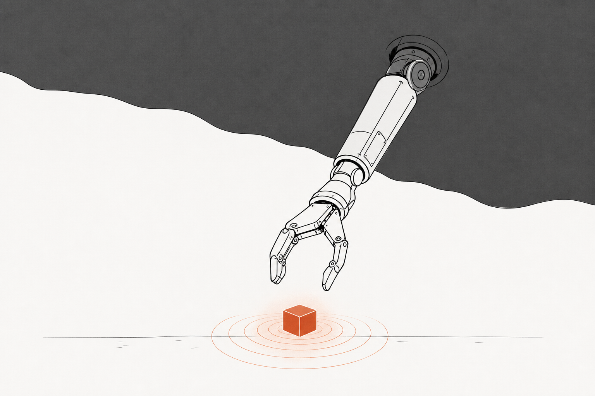

> **The throughline:** *The value of where I am is the reward I just got, plus a discounted value of where I'll land next.*
> On a robot, "where I am" is a gripper pose seen through two cameras, and the reward is brutal: 1.0 if the cube rises more than 10 cm, 0.0 otherwise. For the first ~2,900 steps of training the agent never receives it, not once. This post is about how a critic can still learn the value of states it has never been rewarded in, because someone else's successes are kept in every batch.

Ask a roboticist whether they run reinforcement learning on their physical robot and the usual answer is no, it needs too much data. A simulator gives you thousands of parallel copies, instant resets, and consequence-free crashes. A real arm gives you one timeline, no free resets, and failures that cost gearboxes. The gap between "RL works" and "RL works *here*" is a data-efficiency gap, and this post is about the recipe that closes it.

Everything here is a real project: a full reproduction of the learning core of **HIL-SERL** (Luo et al., 2024) in the LeRobot `gym-hil` simulation, trained on a rented cloud GPU, with a [paper](https://grasping-in-the-dark.vercel.app/paper.html), a [project site](https://grasping-in-the-dark.vercel.app), and a published [checkpoint](https://huggingface.co/RajatDandekar/hilserl-panda-pickcube-sac) you can roll out yourself. The code we quote is the actual implementation. And in the second half, the same method leaves the simulator: we put it on a physical $200 SO-101 arm, hit four walls the documentation does not mention, and report honestly what converged and what did not.

## 1. The intuition: why nobody runs RL on a real robot

Every RL algorithm this series has covered secretly assumed three luxuries. **Parallelism:** when [GRPO](../08-grpo/README.md) sampled 8 completions per prompt, or a Gym training loop ran vectorized environments, we were buying signal with copies of the world. **Free resets:** every episode of tic-tac-toe or CartPole started fresh at zero cost. **Free failure:** an agent that dies in VizDoom respawns; nothing breaks. A physical robot revokes all three at once. There is one arm, so experience arrives on one timeline. A reset means something physical must put the cube back. And a failure can be a bent finger or a stripped gearbox, so "explore randomly" is not a strategy, it is a repair bill.

This is why most of robot learning today is imitation: record human demonstrations, train a policy to copy them. Imitation is safe and sample-cheap, but it has a ceiling. A policy trained to copy demonstrations can at best tie the demonstrator. It never discovers a faster reach or a more reliable grip, because nothing in its objective rewards *better*, only *same*.

**HIL-SERL is the counterargument to both.** It trains vision-based manipulation policies with real reinforcement learning, on a single physical robot, to near-100% success in one to 2.5 hours: assembling connectors, inserting RAM sticks, threading a timing belt. It does this by stacking three ideas, each of which we will take apart in Section 2:

1. **SAC**, a sample-efficient off-policy learner, so every collected transition can be reused thousands of times from a replay buffer.
2. **RLPD**, a sampling trick that keeps a handful of prior demonstrations in every training batch, so the agent is never starved of successful examples.
3. **A learned reward and a human safety net**: a small classifier turns raw camera images into a success signal, and a person can take over the instant the policy is about to fail. The corrections go into the buffer, and the need for them fades to zero.

Our project reproduces the *learning core* of this recipe, items 1 and 2, in simulation, fully autonomously. The task is `PandaPickCube` from LeRobot's `gym-hil`: a simulated Franka Panda arm in MuJoCo must reach a 3 cm cube, close its gripper, and lift it. The policy sees two 128×128 camera images (a front view and a wrist view) plus an 18-dimensional proprioceptive state, and outputs a 3-D end-effector displacement plus a gripper command. The reward is sparse: 1.0 if the cube rises more than 10 cm, else 0.0. In simulation the environment computes that reward from its own physics state, so no human and no classifier are needed at runtime; the human is a concept we teach, not a dependency we run.

Here is the headline, so you know where we land. Starting from scratch, the policy fails every single one of its first 20 episodes. Its first successful lift appears near training step 2,900. By roughly step 5,000 the success rate is climbing steeply, and it plateaus at 95–100% by about step 6,800: 19 or 20 successes in the last 20 episodes. The whole run takes **about 40 minutes on one NVIDIA L4 GPU, roughly $0.55 of compute**. That is the entire economic argument of this post in one sentence: a robot skill, learned from a reward the agent almost never sees, for the price of a candy bar.

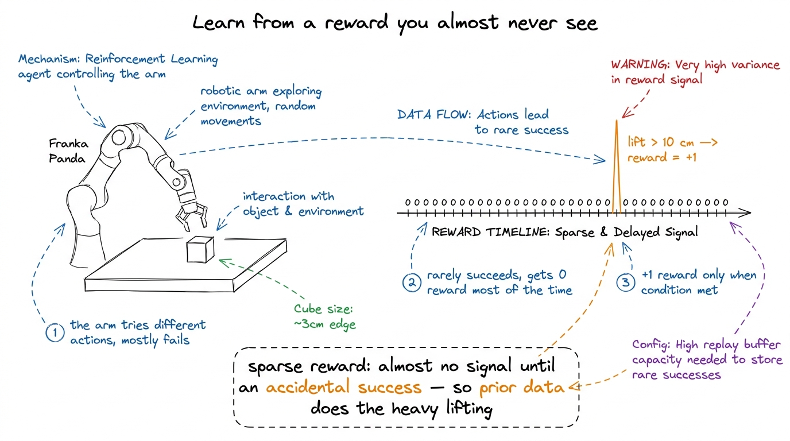

This picture is the whole difficulty in one glance. The arm on the left tries actions, almost all of which fail. The timeline on the right shows what the learning algorithm receives: zeros, hundreds and thousands of them, with a single +1 spike hiding somewhere far to the right. Nothing in the early data says "warmer" or "colder"; the reward is a needle and exploration is the haystack. Everything in Section 2 is machinery for learning in exactly this regime.

The training system itself has two halves that run concurrently:

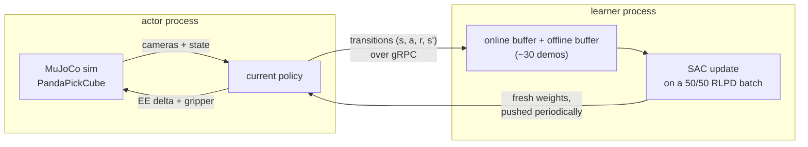

The **actor** steps the simulator with the current policy and streams every transition to the learner. The **learner** holds two replay buffers (fresh experience and prior demonstrations), performs gradient updates on blended batches, and periodically pushes new weights back to the actor. The two halves are decoupled on purpose: on a real robot the actor must act at a steady control rate (here 10 Hz) no matter how long a gradient step takes, and the learner should train as fast as the GPU allows no matter how slow the robot is. Keep this loop in mind; Section 2.6 shows the exact code that runs it in the cloud.

<details>
<summary><strong>Check:</strong> imitation learning is safer and cheaper than RL on a real robot. What can RL do that imitation fundamentally cannot?</summary>

**Answer.** Exceed the demonstrator. Imitation optimizes "match the demonstrations," so its ceiling is the quality of the data it copies. RL optimizes the reward directly, so it can discover grasps that are faster or more reliable than any demonstration in the buffer, and it keeps improving after the demos are exhausted.
</details>

## 2. The math you need

Four ideas carry the whole system: maximum-entropy RL (why SAC explores), the soft Bellman target (what SAC learns), symmetric sampling (why 30 old demos beat 100,000 fresh failures), and the asynchronous actor-learner (how it runs on real infrastructure). We take them in order, each with its code and numbers inline.

### 2.1 SAC and the maximum-entropy objective

Recall the two families this series has built. Value-based methods like [SARSA, Q-learning & DQN](../04-sarsa-qlearning-dqn/README.md) learn $Q(s, a)$, how good action $a$ is in state $s$, and act greedily on it. Policy-gradient methods like [Policy Gradients](../05-policy-gradients/README.md) learn the policy $\pi(a \mid s)$ directly, with a critic scoring it. **Soft Actor-Critic (SAC)** (Haarnoja et al., 2018) is an actor-critic that borrows the best of both, and it changes the objective itself. Instead of maximizing return alone, it maximizes return *plus the policy's entropy* at every visited state:

$$
J(\pi) = \mathbb{E}_{\pi}\!\left[\, \sum_{t} \gamma^{t}\left(r_t + \alpha\, \mathcal{H}\big(\pi(\cdot \mid s_t)\big)\right) \right]
$$

Read it symbol by symbol. $J(\pi)$ is the quantity the policy is trained to maximize. The expectation $\mathbb{E}_\pi$ is over trajectories the policy generates. Inside the sum, $\gamma^t$ is the usual discount from the [MDPs & Bellman](../02-mdps-and-bellman/README.md) post, $r_t$ is the reward at step $t$, and $\mathcal{H}(\pi(\cdot \mid s_t)) = -\mathbb{E}_{a \sim \pi}[\log \pi(a \mid s_t)]$ is the entropy of the action distribution at state $s_t$: how spread out the policy's choices are. The **temperature** $\alpha$ is a knob that prices entropy in units of reward. In plain English: the agent is paid for reward, and it is *also* paid a wage for staying undecided. A policy that collapses to one action too early forfeits the entropy wage, so exploration is not an add-on schedule (like DQN's $\epsilon$-greedy), it is part of the objective itself. When one action is genuinely much better, the reward term dominates and the policy commits; when two actions are close, the entropy term keeps both alive.

The optimal policy under this objective has a clean closed form: actions are chosen in proportion to the exponentiated value, $\pi(a \mid s) \propto \exp(Q(s,a)/\alpha)$. You can feel what $\alpha$ does with three lines of arithmetic. Take two candidate motions near the cube, approach-from-the-left with $Q = 1.00$ and approach-from-the-right with $Q = 0.95$:

```python
import numpy as np

# two candidate motions near the cube, with almost-equal values
# (approach from the left vs approach from the right)
Q = np.array([1.00, 0.95])

# pi(a) ~ exp(Q(a) / alpha): higher temperature -> more exploration
for alpha in [1.0, 0.1, 0.01]:
    p = np.exp(Q / alpha)
    p = p / p.sum()
    print(f"alpha={alpha:<5} -> pi = [{p[0]:.3f}, {p[1]:.3f}]")
```

```text title="Output"
alpha=1.0   -> pi = [0.512, 0.488]
alpha=0.1   -> pi = [0.622, 0.378]
alpha=0.01  -> pi = [0.993, 0.007]
```

At high temperature the policy barely distinguishes the two motions; at $\alpha = 0.01$ it has effectively committed. Work the middle row by hand to see the mechanism: with $\alpha = 0.1$, the odds ratio is $\exp\!\big((1.00 - 0.95)/0.1\big) = \exp(0.5) \approx 1.65$, so the better action gets $1.65/(1+1.65) \approx 0.62$ of the probability. The same 0.05 value gap becomes odds of $e^{5} \approx 148$ at $\alpha = 0.01$. SAC starts our run at `temperature_init: 0.01` and tunes $\alpha$ automatically during training (a gradient step on $\alpha$ pushes the policy's entropy toward a target), so the commitment schedule is learned, not hand-designed.

<details>
<summary><strong>Check:</strong> what does the temperature α buy you over DQN-style ε-greedy exploration?</summary>

**Answer.** ε-greedy explores blindly: with probability ε it takes a uniformly random action, regardless of how bad it is. The entropy term explores *proportionally*: actions with nearly equal value stay nearly equally likely, while clearly bad actions are still avoided. And because α is tuned automatically against an entropy target, the exploration level anneals itself as the policy improves, with no hand-tuned schedule.
</details>

### 2.2 The soft Bellman target: the throughline with a bonus term

SAC is **off-policy**: it learns from a replay buffer of past transitions rather than only from fresh rollouts. That single word is the load-bearing one for robotics. An on-policy method like [TRPO & PPO](../06-trpo-ppo/README.md) must throw its data away after each update; on a robot where every transition costs real seconds of arm time, that is unaffordable. Off-policy learning means every expensive transition is reused across thousands of gradient steps, and, crucially for the next section, it means the buffer can contain transitions the current policy did not generate. Someone else's demonstrations are legal training data.

The critics are trained on a target that is exactly our throughline plus the entropy wage. For a transition $(s, a, r, s')$ sampled from the buffer, with a fresh action $a' \sim \pi(\cdot \mid s')$ sampled from the current policy:

$$
y = r + \gamma\left(\min_{j=1,2} \bar{Q}_j(s', a') - \alpha \log \pi(a' \mid s')\right)
$$

Read it aloud. The target $y$ is what $Q(s, a)$ should equal. On the right, $r$ is the reward just received, and $\gamma$ discounts everything one step away. $\bar{Q}_1, \bar{Q}_2$ are two **target critics**, slow-moving copies of the two trained critics (updated by a soft average with weight `critic_target_update_weight: 0.005`), and we take the **minimum** of their opinions about the next state. Finally $-\alpha \log \pi(a' \mid s')$ is the entropy bonus: if the sampled next action was low-probability, $\log \pi$ is very negative and the bonus is large. The plain-English meaning: *the value of where I am is the reward I just got, plus a discounted, pessimistic value of where I land next, plus a wage for how much freedom the policy still has there.* The min over two critics exists because a single bootstrapped critic systematically overestimates (the same overoptimism we met with Q-learning's max in [SARSA, Q-learning & DQN](../04-sarsa-qlearning-dqn/README.md)); taking the min of two independent estimates biases the bootstrap toward caution.

The critic loss is then just a regression to this target, $\mathcal{L} = \mathbb{E}\big[(Q_j(s,a) - y)^2\big]$: each trained critic is pushed toward $y$, and the target critics trail behind. Here is the target computed by hand on one mid-reach transition, no reward yet:

```python
import numpy as np

# one transition from the replay buffer: mid-reach, no reward yet
r, gamma, alpha = 0.0, 0.97, 0.01

# the two target critics disagree about the next state; take the min
q1_next, q2_next = 2.40, 2.10

# log-probability of the sampled next action under the current policy
log_pi_next = -1.5

# y = r + gamma * (min(Q1, Q2) - alpha * log pi)
y = r + gamma * (min(q1_next, q2_next) - alpha * log_pi_next)
print(f"min(Q1', Q2')      = {min(q1_next, q2_next):.3f}")
print(f"entropy bonus      = {-alpha * log_pi_next:+.3f}")
print(f"soft target  y     = {y:.4f}")
```

```text title="Output"
min(Q1', Q2')      = 2.100
entropy bonus      = +0.015
soft target  y     = 2.0516
```

Follow the numbers. The reward is zero, so the entire target comes from the future: the pessimistic critic says the next state is worth 2.10 (one critic said 2.40 and was outvoted), the entropy wage adds a small $+0.015$, and the discount scales the sum by 0.97 to give $y = 2.0516$. This is the throughline doing its quiet work in the dark phase: even with $r = 0$, the target is far from zero *if the critic already believes the next state is valuable*. Where could that belief possibly come from, when the policy has never once been rewarded? That is the next section, and it is the heart of the whole method.

In our run these pieces are all standard LeRobot configuration, from [`configs/train_gym_hil.json`](https://github.com/S1LV3RJ1NX/RL-in-Production-Bootcamp-Resources/blob/main/phase-2/grasping-in-the-dark/configs/train_gym_hil.json): `discount: 0.97`, `num_critics: 2`, `temperature_init: 0.01`, learning rate `3e-4` for actor, critics, and temperature alike, and a frozen ResNet-10 encoder shared by both camera streams (`vision_encoder_name: "lerobot/resnet10"`, `freeze_vision_encoder: true`), so SAC trains only the small MLP heads on top of pretrained visual features.

<details>
<summary><strong>Check:</strong> why take the minimum of two critics instead of averaging them?</summary>

**Answer.** Bootstrapped critics are systematically optimistic: errors that overestimate a state's value get amplified, because targets are built from the critic's own estimates. Averaging keeps that upward bias; taking the min actively counteracts it by always trusting the more pessimistic opinion. Underestimates hurt much less than overestimates, since an inflated value creates a phantom incentive the policy will chase.
</details>

### 2.3 The sparse reward, and what an episode is actually worth

Now make the problem concrete. The environment's reward function is a single unforgiving line: the agent gets $r = 1.0$ on a step where the cube's height exceeds its starting height by more than 10 cm, and $r = 0.0$ otherwise. There is no "getting warmer" shaping, no distance bonus. The config adds one small honest cost, a `gripper_penalty` of $-0.02$ whenever the gripper opens or closes wastefully, which discourages the flailing snap-snap-snap of an untrained policy.

$$
r_t =
\begin{cases}
1.0 & \text{if } z_{\text{cube}, t} - z_{\text{cube}, 0} > 0.1 \text{ m} \\
0.0 & \text{otherwise}
\end{cases}
\qquad \text{plus } -0.02 \text{ per wasteful gripper toggle}
$$

Reading it: $z_{\text{cube}, t}$ is the cube's height at step $t$ and $z_{\text{cube}, 0}$ its starting height, so the condition fires only after a genuine lift. The meaning: the reward defines *what* success is (cube up 10 cm) and says absolutely nothing about *how*, which is exactly what makes it trustworthy. A shaped reward can be gamed, as we saw a language model game its judge in the [RLHF](../07-rlhf/README.md) post; a cube 10 cm off the table cannot be faked.

What is an episode worth under this reward? Recall the discounted return $G_t = \sum_k \gamma^k r_{t+k}$ from [RL Foundations](../01-rl-intro-and-prerequisites/README.md) and compute it for one successful 30-step episode with three wasteful gripper toggles along the way:

```python
# a successful episode: 30 steps of nothing, then the lift pays 1.0.
# gym-hil also charges a small penalty for wasteful gripper toggles.
gamma = 0.97
T, penalty = 30, -0.02

# G_0 = sum_k gamma^k r_k: only the final reward and the penalties are nonzero
# (three wasteful toggles, at steps 5, 12, and 20)
G = gamma ** (T - 1) * 1.0 + sum(penalty * gamma ** t for t in [5, 12, 20])
print(f"return of a successful 30-step grasp: G = {G:.4f}")

# a failed episode never sees the 1.0
G_fail = sum(penalty * gamma ** t for t in [5, 12, 20])
print(f"return of a failed episode:           G = {G_fail:.4f}")
```

```text title="Output"
return of a successful 30-step grasp: G = 0.3715
return of a failed episode:           G = -0.0419
```

A successful grasp is worth about 0.37 from the starting state ($0.97^{29} \approx 0.413$, minus roughly 0.05 of discounted gripper penalties), while a failure is worth slightly less than nothing. The gap between those two numbers is the entire learning signal, and here is the problem: a random policy essentially never produces the first kind of episode. In our run the actor went roughly 2,900 steps before its first lift. Until then, every return it computes looks like the second line: small, negative, and identical in every direction. The gradient landscape is flat because the data contains no contrast.

<details>
<summary><strong>Check:</strong> the reward fires only on a >10 cm lift. Why is this unforgiving design a feature rather than a bug?</summary>

**Answer.** Because it cannot be gamed. A sparse, physically-grounded reward defines success without prescribing (or mis-prescribing) the path there, so a policy that scores well has genuinely done the task. Dense shaped rewards inject a designer's guesses, and policies are ruthlessly good at exploiting the gap between the guess and the goal. The cost of sparsity, near-zero early signal, is exactly what RLPD exists to pay.
</details>

### 2.4 RLPD: half of every batch is someone else's success

**RLPD** (Reinforcement Learning with Prior Data, Ball et al., 2023) is the sample-efficiency engine, and its central move is almost embarrassingly simple. Keep two replay buffers: the **online** buffer, filled by the actor's own fresh experience, and an **offline** buffer, pre-loaded with prior data. Then build every single training batch as a fixed 50/50 blend:

$$
n_{\text{online}} = \lfloor B \cdot \rho \rfloor, \qquad n_{\text{offline}} = B - n_{\text{online}}
$$

Symbol by symbol: $B$ is the batch size (256 in our config), $\rho$ is the `online_ratio` (0.5), so $n_{\text{online}} = n_{\text{offline}} = 128$. The meaning: no matter how the online buffer's contents evolve, *half of every gradient step is computed on prior data*. This is called **symmetric sampling**, and in our run the offline buffer holds about 30 teleoperated demonstrations of successful picks (the public [`lilkm/pick_cube_franka_panda_30`](https://huggingface.co/datasets/lilkm/pick_cube_franka_panda_30) dataset that ships with the LeRobot example). This is only legal because SAC is off-policy, which is why Section 2.2 made such a fuss about that word.


The picture shows the plumbing: two buffers, one batch, a hard 50/50 split enforced by the sampler, feeding critics that carry two safety features we will get to in a moment. The annotation at the bottom left is the entire reason this works: successful demonstrations stay in *every* batch, so the value function has something to latch onto before the policy can succeed on its own.

Why does this matter so much? Count what a naive learner sees. Early in training the online buffer holds roughly 2,000 transitions of which one carries reward (the demos in our count are one rewarded frame per episode, roughly 1 in 50 offline). Sample batches both ways and count the reward-carrying transitions:

```python
import numpy as np

rng = np.random.default_rng(0)

# early training: 2,000 online transitions, ONE of them carries reward 1.0
online = np.zeros(2000)
online[rng.integers(0, 2000)] = 1.0

# the offline buffer: ~30 demos, every episode ends in a success.
# ~1 rewarded transition per ~50-step episode -> about 1 in 50 here.
offline = np.zeros(1500)
offline[rng.choice(1500, size=30, replace=False)] = 1.0

batch_size, trials = 256, 10_000

# uniform replay over the online buffer only
naive = np.array([
    rng.choice(online, size=batch_size).sum() for _ in range(trials)
])

# RLPD symmetric sampling: 128 online + 128 offline in every batch
rlpd = np.array([
    rng.choice(online, size=128).sum() + rng.choice(offline, size=128).sum()
    for _ in range(trials)
])

print(f"rewarded transitions per 256-batch (mean over {trials} draws):")
print(f"  uniform online-only : {naive.mean():.3f}")
print(f"  RLPD 50/50 mix      : {rlpd.mean():.3f}")
print(f"batches with ZERO reward signal:")
print(f"  uniform online-only : {(naive == 0).mean() * 100:.1f}%")
print(f"  RLPD 50/50 mix      : {(rlpd == 0).mean() * 100:.1f}%")
```

```text title="Output"
rewarded transitions per 256-batch (mean over 10000 draws):
  uniform online-only : 0.135
  RLPD 50/50 mix      : 2.619
batches with ZERO reward signal:
  uniform online-only : 87.5%
  RLPD 50/50 mix      : 6.9%
```

The naive learner sees a rewarded transition in about one batch in eight; RLPD sees several in nearly every batch. Check the first number by hand: sampling 256 uniformly from 2,000 transitions containing one success gives an expected $256 \times \tfrac{1}{2000} = 0.128$ rewarded samples per batch, matching the simulation. And the count understates the real gap, because *every* offline transition, rewarded or not, is a frame from a successful trajectory: state-action pairs on the path to the goal, exactly the states the soft Bellman target of Section 2.2 needs to assign high value. That is where the critic's belief comes from in the dark phase. The policy has never succeeded, but the critic has been studying successes from step one.

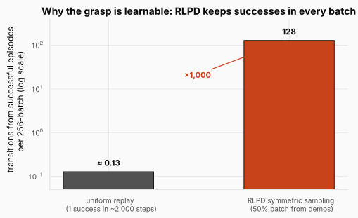

The figure puts the two regimes on one (log) axis, counting transitions drawn from successful episodes rather than just rewarded frames: 0.13 per batch versus a guaranteed 128, a factor of a thousand. This is the single most important design decision behind the learning curve you will see in Section 3. One success buried in 2,000 failures is a signal-to-noise ratio of 1:2000, statistically invisible; forcing half of each batch to come from known-good trajectories raises it to roughly 1:1 by construction.

Aggressively recycling off-distribution data has a known failure mode, and RLPD ships two counters for it, both present in our config. **LayerNorm on the critics** normalizes activations inside the critic networks, which caps the runaway value extrapolation that otherwise happens when a critic bootstraps from states it has never visited (the demos are exactly such states early on; LeRobot hard-codes this in its SAC critics). And the **update-to-data ratio** (`utd_ratio: 2`) performs two gradient updates per collected transition, squeezing more learning out of each expensive environment step. The original RLPD paper pushes this much harder (ensembles of 10 critics, 20 updates per step) for state-based tasks; the LeRobot sim config's gentler 2-critic, UTD-2 recipe is what we actually ran, and as Section 3 shows, it is enough here.

<details>
<summary><strong>Check:</strong> why does RLPD need LayerNorm on the critics at all? What goes wrong without it?</summary>

**Answer.** Half of every batch is data the current policy never generated, so the critic constantly evaluates state-action pairs outside its own experience. Unconstrained networks extrapolate wildly there, and the Bellman bootstrap amplifies any overestimate into a runaway: inflated targets produce more inflated values. LayerNorm bounds the scale of activations, which empirically caps that catastrophic value explosion and keeps the aggressive data reuse stable.
</details>

<details>
<summary><strong>Check:</strong> the offline demos were recorded by a human teleoperator, not by the policy being trained. Why is it legal to train on them at all?</summary>

**Answer.** Because SAC is off-policy: its critic update regresses toward a target computed with a *fresh* action sampled from the current policy at the next state, so the transition itself can come from anywhere. An on-policy method like PPO would need importance corrections (or would simply be biased) on foreign data; an off-policy buffer accepts any (s, a, r, s') that obeys the environment's dynamics.
</details>

### 2.5 The full HIL-SERL loop: the human as scaffolding

What we run in simulation is SAC + RLPD. The full HIL-SERL system, the one that trains real robots to thread timing belts, adds two components on top, and both exist to answer the same question: where does the training signal come from when there is no simulator to compute it?

First, the **learned reward classifier**. On a real robot nobody can hand you `z_cube > 0.1`, so HIL-SERL trains a small binary classifier on labeled camera frames: success or not-success. That classifier *is* the reward function during training. If this sounds familiar, it should: it is the robotics cousin of the reward model from the [RLHF](../07-rlhf/README.md) post, with the same failure surface (a policy can learn to fool a learned reward) and the same countermeasure (keep the classifier's training data honest and its job narrow).

Second, **human interventions**. A person watches the policy act, and the moment it drifts toward failure, takes over with a SpaceMouse, steers back to safety, and releases control. The corrective transitions are flagged and pushed into the offline buffer, exactly where the demos live (an idea inherited from HG-DAgger, a relative of the DAgger scheme we met in the [DPO & Agentic RL](../09-dpo-and-agentic-rl/README.md) post). Early in training the human intervenes constantly; as the policy improves, the intervention rate falls toward zero. It is scaffolding in the most literal sense: essential while the structure is weak, removed as it strengthens. On top of the safety it buys, every intervention is also a fresh, perfectly-targeted demonstration collected exactly where the policy is currently failing, which is far more valuable than a random extra demo.

In simulation both components are unnecessary at runtime: MuJoCo computes the true reward from its own state, so training runs fully autonomously. This is an honest simplification, and worth being precise about: our study reproduces HIL-SERL's *learning core*, not its full real-robot loop. The autonomous sim result is in one sense the method's lower bound, what SAC + RLPD achieves with no human help at all. Section 4 is what happened when we put the human back in.

<details>
<summary><strong>Check:</strong> why are human interventions more valuable per-transition than the initial demonstrations?</summary>

**Answer.** Interventions are collected exactly at the policy's current failure frontier: the human takes over precisely where the policy goes wrong, so every corrective transition targets a state the policy actually visits and mishandles. The initial demos are drawn from a human's habitual trajectories, which increasingly diverge from the states the improving policy encounters.
</details>

### 2.6 The engineering: two processes, one GPU, and the bugs that were waiting

Everything above is algorithm. What makes this a *production* story is that the run happens on rented, preemptible cloud hardware, headless, with nobody watching.


This is Section 1's loop made concrete. LeRobot implements the actor and the learner as two separate processes communicating over gRPC: transitions flow right, fresh weights flow left, and the decoupling is what lets a robot act at a steady rate while the GPU trains flat-out. We run both inside a single Modal container on `localhost`, the simplest and lowest-latency topology, with the port never exposed to any network. The learner must open its gRPC server before the actor dials in, so the launcher starts them in order, from [`modal/train_hilserl.py`](https://github.com/S1LV3RJ1NX/RL-in-Production-Bootcamp-Resources/blob/main/phase-2/grasping-in-the-dark/modal/train_hilserl.py):

```python
# Learner opens the gRPC server FIRST; give it a moment, then start the actor.
learner = spawn("lerobot.rl.learner", cfg_path)
time.sleep(20)
actor = spawn("lerobot.rl.actor", cfg_path_actor)
```

One deliberately boring choice deserves a sentence: the GPU is a single NVIDIA L4, about $0.80 per hour, not an H100. SAC here is not compute-bound. The networks are small MLP heads on a frozen encoder, the batch is 256, and throughput is gated by the 10 Hz environment stepping and the gRPC hop, so a GPU ten times more expensive buys nothing for one run. Matching the hardware to the actual bottleneck is most of what "RL in production" means in practice.

Running the system surfaced three real bugs, each invisible in the documentation and each found only by running to failure. First, **the output directory must be pristine**: LeRobot's config validator refuses to start if `output_dir` already exists, and *both* the learner and the actor run that validator against the same directory, so whichever process starts second crashes. The fix gives the actor its own throwaway directory; it checkpoints nothing anyway, since it receives weights over gRPC. Second, and nastier, **a checkpoint-serialization crash**: at every checkpoint the learner also dumps its replay buffer to disk as a dataset, the buffer stores camera frames as `float32` with values in $[0, 255]$, and LeRobot's image writer raises on any float image outside $[0, 1]$. The unhandled exception kills training at the *first* save. Our fix patches exactly that check at image-build time, from [`modal/patch_image_writer.py`](https://github.com/S1LV3RJ1NX/RL-in-Production-Bootcamp-Resources/blob/main/phase-2/grasping-in-the-dark/modal/patch_image_writer.py):

```python
# [vizuara patch] Accept float images already in [0, 255] pixel range (RL replay-buffer
# dumps store raw gym-hil uint8 obs as float32) by clip+cast to uint8 instead of raising.
max_ = image_array.max().item()
min_ = image_array.min().item()
if max_ > 1.0 or min_ < 0.0:
    image_array = np.clip(image_array, 0, 255).astype(np.uint8)
else:
    image_array = (image_array * 255).astype(np.uint8)
```

The patch touches only on-disk serialization; the batches the policy trains on are normalized separately and never pass through this code path. Third, **preemption**: spot GPU containers can vanish near convergence, so the launcher checkpoints every 1,000 steps, commits the storage volume on a two-minute timer, and pushes each new checkpoint to the Hugging Face Hub from inside the training job. A good policy externalizes the instant it exists:

```python
# Push each NEW checkpoint to the HF Hub as it's saved. This runs on Modal, so a good
# policy externalizes to the Hub the instant it exists, surviving any preemption/teardown.
api.upload_folder(folder_path=pm, repo_id=hf_repo, repo_type="model")
```

None of these bugs is intellectually deep, and that is the point. A claim that "RL is production-ready" is only honest with the operational failure modes attached, and every one of them turned out to be mundane and fixable.

<details>
<summary><strong>Check:</strong> why do the learner and the actor get different output directories, when they are part of one training run?</summary>

**Answer.** Both processes run LeRobot's config validation, which refuses to start when `output_dir` already exists. Sharing a directory means whichever process starts second always crashes. Since the actor holds no state worth saving (it receives fresh weights over gRPC and streams transitions out), it gets a disposable directory, and the learner keeps the real one with the checkpoints.
</details>

## 3. The results: a phase transition, not a ramp

### 3.1 The learning curve

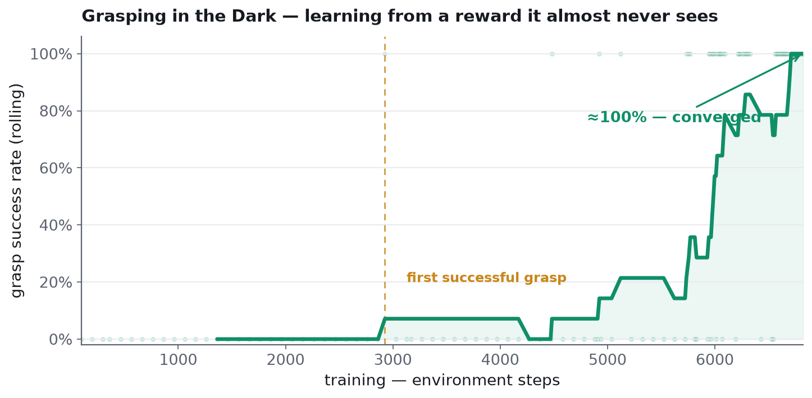

This is the actual curve from the run, parsed from the training logs, and it is worth reading slowly because its *shape* is the finding. It is not a smooth ramp. It is a **phase transition**: dead flat at zero for nearly 3,000 steps, a first success near step 2,900, a noisy plateau, then a steep climb that saturates near 100% around step 6,800. Measured directly on the actor's episodes: the first 20 episodes contained **0 successes in 20**, and the last 20 contained **19–20 in 20**. The entire trajectory fits inside about 40 minutes on the single L4.

Three regimes, and Section 2 already gave us the vocabulary for each:

1. **The dark phase (steps ~0–2,900).** Reward never arrives, and the policy looks stuck. It is not wasted time: because of symmetric sampling, the critic has been training on successful demo transitions since the very first batch, quietly building a value landscape in which "gripper closing over the cube, cube rising" scores high. The policy looks idle; the value function is doing the homework.
2. **Discovery (steps ~2,900–5,000).** The actor's exploration finally stumbles into the region of state space the critic already prizes. That first success is not diluted into noise the way it would be under uniform replay; it lands on prepared ground and is immediately reinforced, and the update-to-data ratio of 2 compounds each new success into multiple gradient steps.
3. **Consolidation (steps ~5,000+).** Online and offline data now tell the same story, the auto-tuned temperature anneals, exploration narrows around the successful trajectory, and success saturates.

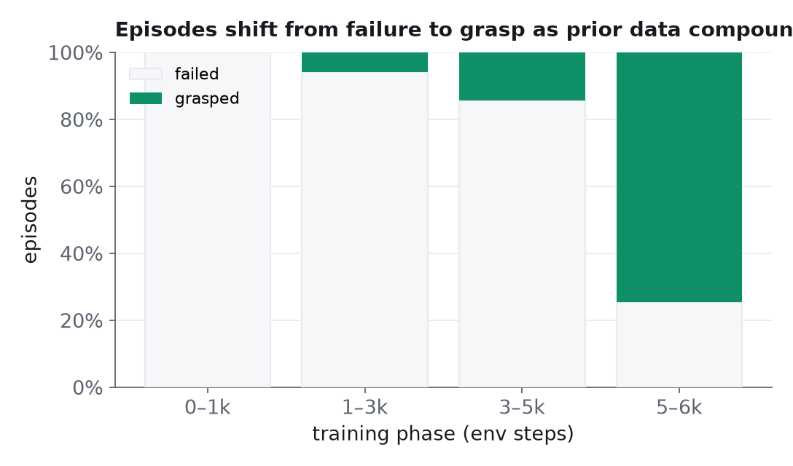

The same run, read episode-by-episode rather than as a rolling rate. Each bar is a training window; the shaded fraction is episodes ending in a grasp. The point of this view is the second and third bars: successes do not appear gradually and uniformly, they trickle in as isolated events and then compound, exactly what the "first success lands on fertile ground" story predicts.

### 3.2 The headline numbers

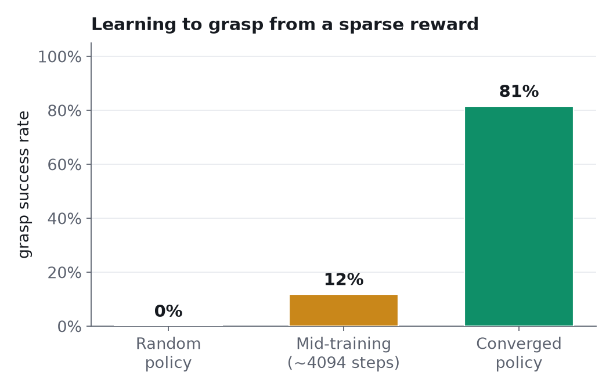

Checkpoint evaluations make the story categorical: **0%** at random initialization, a noisy **12%** mid-training as the first successes trickle in, and **81%** for the converged checkpoint under this evaluation protocol (rolling windows during training reach 95–100%). The jump from the second bar to the third is the phase transition again, seen from outside.

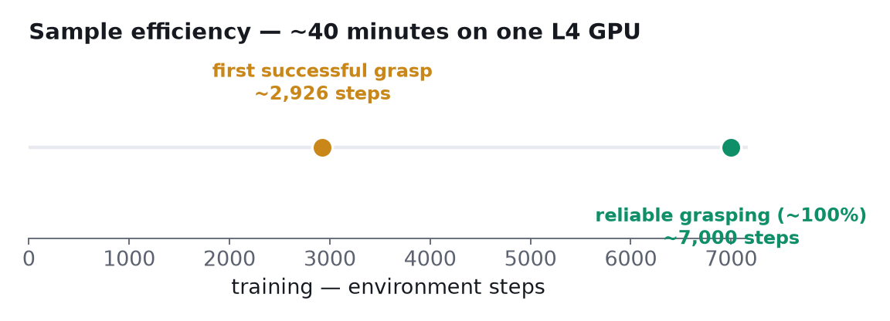

Two numbers frame the efficiency claim: **first success near step 2,900** and **reliable grasping by ~5,000–7,000 steps**, all inside 40 minutes and roughly **$0.55** of L4 time. For calibration, recall that DQN needed on the order of millions of frames to learn Atari games in the [SARSA, Q-learning & DQN](../04-sarsa-qlearning-dqn/README.md) post. Thousands instead of millions, from a reward that was zero for the first 2,900 steps, is only possible because the demonstrations anchor the value function while the policy learns to reproduce and then surpass them. Strip out the prior data and this same task reverts to the classic sparse-reward wall.

### 3.3 Before and after

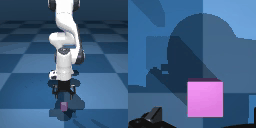

This is the policy at initialization, seen through its own two cameras (front view on the left, wrist view on the right). The end-effector wanders, the gripper snaps open and shut at random, and the cube is rarely even touched. This flailing is what generated the 2,900 steps of zeros in the dark phase.

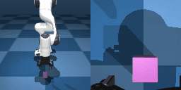

The same network after training: a clean reach, one deliberate close, a smooth lift, repeated across randomized cube positions the 30 demonstrations never covered. Nothing about the task, the reward, or the architecture changed between the two clips; only the weights did. And that last clause, "positions the demos never covered," is the answer to the obvious skeptical question: the policy is not replaying demonstrations, it is optimizing the reward, which is precisely the thing imitation cannot do.

<details>
<summary><strong>Check:</strong> how do we know the converged policy is not just memorizing the 30 demonstrations?</summary>

**Answer.** The cube's position is randomized every episode, so the converged policy succeeds from states the demos never contained; pure replay would fail there. The demos' role is to anchor the critic's value estimates early (via symmetric sampling), not to serve as a trajectory library. The policy's objective is the environment reward, and its final behavior generalizes accordingly.
</details>

<details>
<summary><strong>Check:</strong> what would you expect this run to look like with online-only uniform replay, all else equal?</summary>

**Answer.** A much longer dark phase, plausibly no takeoff at all within this step budget. The first accidental success would land in a batch stream where 87% of batches carry zero reward signal (the simulation in Section 2.4), so its effect on the critic would be diluted instead of compounded, and the classic sparse-reward wall would stand.
</details>

## 4. Sim-to-real: the $200 arm

The point of learning on a simulated Franka Panda was never the Panda. It was a **$200 SO-101 arm on a real desk**, and the encouraging fact is how little changes on paper.


The figure sorts everything the sim study built into three bins, and the bins are the lesson. **Reused byte-for-byte** (the "learning brain"): the asynchronous actor-learner, the SAC learner, the RLPD sampling, the Gaussian-actor policy network, and the hyperparameters. **Changed in configuration only:** the robot becomes an `so101_follower` (six Feetech servos on a serial bus), a leader arm provides teleoperation, and end-effector inverse kinematics plus tight workspace bounds are declared (finding good bounds is the single biggest lever on both speed and safety). **Re-collected on the physical arm:** 15–25 fresh teleoperated demonstrations (sim demos do not transfer) and a reward-classifier dataset of real labeled frames, because on hardware nobody hands you `z_cube > 0.1`. Here the human returns, both to demonstrate and to intervene.

We pressure-tested this bridge for real: the same method on a physical SO-101, with a deliberately harder-than-expected setup.

### 4.1 The rig, and the four walls

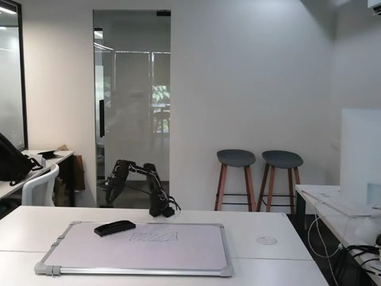

The task: **pick up a duster and wipe a marker mark off a whiteboard.** The rig: one SO-101 *follower* arm doing the task, one SO-101 *leader* arm through which a human demonstrates and intervenes by physically moving it, two 128×128 cameras (front and wrist), and, notably, an Apple Silicon Mac with MPS instead of CUDA. Every RL tutorial assumes a gamepad and an NVIDIA GPU; we had neither, on purpose, because that is what the affordable end of this field actually looks like.


Stock LeRobot does not support this setup, and each gap taught us something structural. **Wall 1, no CUDA:** the SAC learner assumes NVIDIA; MPS runs the ~8M-parameter networks but at roughly 8 fps against a 10 fps control target, fine for a proof-of-concept loop, hopeless for same-day convergence. **Wall 2, the leader arm is not a supported controller:** HIL-SERL's intervention step requires a `get_teleop_events()` interface that only the gamepad and keyboard teleoperators implement, and the `control_mode: "leader"` the documentation describes is a config field that is never read in the code. The documentation is ahead of the implementation, verified on both the release and `main`. The fix is a small teleop subclass that returns the leader's joints as a normalized array, which an existing code branch accepts directly as the action. **Wall 3, everything assumes end-effector space:** driving in joint space (to match the leader) means the policy's batched `[1, 6]` action tensor is never squeezed, crashing the motor mapping. **Wall 4, recorded demos have no reward:** `lerobot-record` datasets lack the `next.reward` column the offline buffer requires; the fix injects the sparse convention (1.0 on each episode's final frame, since every demo succeeds) into the dataset. Every fix lives in launcher shims and that one subclass, with LeRobot's source untouched.

### 4.2 The subtlest bug: the arm that gave up

The most instructive failure looked like a policy problem and was actually a pipeline problem. The symptom: the loop runs, the policy emits actions, and the arm drifts to one pose near zero and **freezes**, as if it had decided to quit.

The cause: the SAC actor emits a raw tanh-squashed action in $[-1, 1]$ and performs **no** unnormalization; mapping to physical units is supposed to happen in a separate processor that the actor loop never builds. In end-effector space the omission is invisible, because a $[-1,1]$ output *is* a sensible delta once scaled by a small step size downstream. In joint space, that $[-1,1]$ goes to the motors *as the joint target in degrees*. Watch what that means numerically:

```python
import numpy as np

# the SAC actor emits tanh-squashed actions in [-1, 1] and never rescales
policy_action = np.array([-0.46, 0.63, 0.12, -0.88, 0.31, 0.05])

# per-joint physical range of the SO-101, in degrees (min, max)
joint_min = np.array([-110.0, -100.0, -100.0, -95.0, -160.0, 0.0])
joint_max = np.array([110.0, 100.0, 100.0, 95.0, 160.0, 100.0])

# sent raw, the "joint targets" are all within a degree of zero:
print("raw [-1,1] sent as degrees :", np.round(policy_action, 2))

# a = (a_norm + 1) / 2 * (max - min) + min  (affine unnormalize per joint)
degrees = (policy_action + 1.0) / 2.0 * (joint_max - joint_min) + joint_min
print("unnormalized joint targets :", np.round(degrees, 1))
```

```text title="Output"
raw [-1,1] sent as degrees : [-0.46  0.63  0.12 -0.88  0.31  0.05]
unnormalized joint targets : [-50.6  63.   12.  -83.6  49.6  52.5]
```

The first line is what the motors received: every joint commanded to within a degree of zero, which is why the arm crept to a near-zero pose and stopped. The second line is the same policy output passed through the per-joint affine map $a_{\text{deg}} = \tfrac{a+1}{2}(\text{max} - \text{min}) + \text{min}$: a real, articulated pose. The policy was never broken; its action space was never translated.

![A hand-drawn funnel diagram: offline demos, policy outputs, leader interventions, and the replay buffer all live in [-1, 1] and converge into RobotEnv.step, the single robot boundary where values are unnormalized to joint degrees for the motors.](./images/ai-wb-action-convention.png)

The fix is the diagram's funnel: **one action convention end to end, unnormalized only at the robot boundary.** Demos, policy outputs, leader interventions, and the replay buffer all live in $[-1, 1]$, and the conversion to joint degrees happens in exactly one place, `RobotEnv.step`. Because the human's interventions pass through the same funnel as the policy's actions, the replay buffer stays consistent, which Section 2.4 should have you primed to care about: a buffer where different transitions use different action scales would quietly poison every 50/50 batch. If this bug rhymes with something from the [World Models](../11-world-models/README.md) post, it should: there, too, the model was fine and an unglamorous normalization mismatch in the pipeline made it look broken. Inference-time normalization is a separate, easy-to-omit pipeline, and omitting it produces a policy that looks broken but is not.

### 4.3 Honest results

The full HIL-SERL loop ran **live on real hardware with leader-arm interventions**, none of which stock LeRobot supports. Ten teleoperated demos warm-started the buffer; corrections flowed in as designed; the policy trained on the blend. A **fully autonomous, reliable wipe did not emerge in one session.** Three factors stack against it, all identified in Section 2's terms: MPS-speed training (fewer gradient steps per hour of arm time), only 10 seed demos (a thin offline buffer for symmetric sampling to lean on), and the harder joint-space formulation (the paper's results lean on end-effector space and far more interaction). The levers for convergence are correspondingly unmysterious: a $15 gamepad, end-effector space, CUDA, 20–30 varied demos, and a trained reward classifier.

The value of the real-robot session is the loop, not the trophy. Watching a physical arm explore, stall, get corrected by a human hand, and fold that correction into its own replay buffer is a more honest picture of RL in robotics than a highlight reel, and every wall we hit is documented with its fix in the open repo. The dataset ([`RajatDandekar/so101_whiteboard_wipe`](https://huggingface.co/datasets/RajatDandekar/so101_whiteboard_wipe)) and policy ([`RajatDandekar/so101_whiteboard_wipe_hilserl`](https://huggingface.co/RajatDandekar/so101_whiteboard_wipe_hilserl)) are public.

<details>
<summary><strong>Check:</strong> the arm drifted to a near-zero pose and froze. Why did this bug never show up in the simulation study?</summary>

**Answer.** The simulation (and stock HIL-SERL) drives in end-effector space, where the policy's raw [-1, 1] output is directly usable as a small displacement after downstream scaling, so the missing unnormalization changes nothing. Only in joint space, where the same numbers are interpreted as absolute joint targets in degrees, does the missing affine map send every joint to approximately zero.
</details>

<details>
<summary><strong>Check:</strong> why must demonstrations be re-collected on the real arm instead of reusing the 30 sim demos?</summary>

**Answer.** The demos' job is to give the critic value anchors in the state distribution the policy will actually visit. Sim frames come from different cameras, different dynamics, and a different embodiment, so their (state, action) pairs describe a world the real arm never sees; anchoring the critic there points the value landscape at the wrong states. The learning code transfers because it is state-agnostic; the data does not because it is state itself.
</details>

## 5. Putting it all together

| Concept | Math | In code |
|---|---|---|
| Maximum-entropy objective | $J(\pi) = \mathbb{E}[\sum_t \gamma^t(r_t + \alpha \mathcal{H}(\pi))]$ | `temperature_init: 0.01` in `train_gym_hil.json` |
| Boltzmann action choice | $\pi(a \mid s) \propto \exp(Q(s,a)/\alpha)$ | `np.exp(Q / alpha)` toy in §2.1 |
| Soft Bellman target | $y = r + \gamma(\min_j \bar{Q}_j - \alpha \log \pi)$ | `discount: 0.97`, `num_critics: 2` |
| Sparse reward | $r = 1$ if $\Delta z_{\text{cube}} > 0.1$ m else $0$ | gym-hil `PandaPickCube`, `gripper_penalty: -0.02` |
| RLPD symmetric sampling | $n_{\text{online}} = \lfloor B \rho \rfloor = 128$ | `mixer: "online_offline"`, `online_ratio: 0.5` |
| Aggressive reuse, stabilized | LayerNorm critics, UTD $= 2$ | `utd_ratio: 2` (LayerNorm hard-coded in LeRobot SAC) |
| Actor-learner split | act at 10 Hz, learn at GPU speed | `spawn("lerobot.rl.learner", ...)` then `actor` |
| Preemption-proof training | checkpoint every 1,000 steps, push to Hub | the uploader thread in `train_hilserl.py` |
| One action convention | $a_{\text{deg}} = \tfrac{a+1}{2}(\text{max}-\text{min}) + \text{min}$ at the robot only | `RobotEnv.step` shim in `real-so101/` |

Every row appeared inline above; the table is only the map. The full runnable project (the Modal training app, the config, the smoke tests, the Colab evaluation notebook, the figure generators, the [paper](https://grasping-in-the-dark.vercel.app/paper.html), and the complete `real-so101/` pipeline with its challenge-by-challenge autopsy) lives in the repo:

> **[phase-2/grasping-in-the-dark](https://github.com/S1LV3RJ1NX/RL-in-Production-Bootcamp-Resources/tree/main/phase-2/grasping-in-the-dark)**

The trained checkpoint is on the Hub at [`RajatDandekar/hilserl-panda-pickcube-sac`](https://huggingface.co/RajatDandekar/hilserl-panda-pickcube-sac), and the [project site](https://grasping-in-the-dark.vercel.app) has the videos, including the before/after clips and the real-robot intervention footage.

## Where this goes next

Strip away the robot and three portable lessons remain. **Sparse rewards are not the enemy; starvation is.** A reward that fires once in 2,900 steps is perfectly learnable if the value function has an independent source of belief about which states matter, and symmetric sampling is the cheapest such source anyone has found: half of every batch, no clever weighting, a thousandfold improvement in signal-to-noise by construction. **Off-policy is the keystone property for the physical world.** Everything this post did (reuse expensive transitions, train on foreign demonstrations, fold in human corrections) is legal only because SAC's update does not care who generated the data. **And the gap between a paper and a robot is made of conventions, not concepts.** Nothing that broke, in the cloud or on the desk, was an algorithm: it was a directory check, a float range, an unread config field, an unapplied affine map. The skill of "RL in production" is mostly the skill of finding the convention two components disagree about.

The throughline has now survived its hardest test. The value of where I am is the reward I just got, plus a discounted value of where I'll land next, even when "where I am" is a gripper pose seen through two cameras and the reward has never once arrived. The critic learned that value from other people's successes, the policy climbed the landscape the critic built, and the same learning code is one configuration file away from a real arm on a real desk. The machinery came from all across the series: the discounting of [MDPs & Bellman](../02-mdps-and-bellman/README.md), the replay buffers and overestimation fixes of [SARSA, Q-learning & DQN](../04-sarsa-qlearning-dqn/README.md), the actor-critic of [Policy Gradients](../05-policy-gradients/README.md), the learned-reward paranoia of [RLHF](../07-rlhf/README.md), and the audit-your-pipeline discipline of [World Models](../11-world-models/README.md). If you arrived mid-series, the thread starts from a single sentence about rewards and discounted futures in the [RL Foundations](../01-rl-intro-and-prerequisites/README.md) post. And if you take one sentence with you, take this one: **a robot skill, learned from scratch, from a reward the agent almost never sees, costs about forty minutes and fifty-five cents; the rest is conventions.**

### References and further reading

- Luo, Xu, Wu, Levine, 2024. *Precise and Dexterous Robotic Manipulation via Human-in-the-Loop Reinforcement Learning* (HIL-SERL). [arXiv:2410.21845](https://arxiv.org/abs/2410.21845).
- Ball, Smith, Kostrikov, Levine, 2023. *Efficient Online Reinforcement Learning with Offline Data* (RLPD). [arXiv:2302.02948](https://arxiv.org/abs/2302.02948).
- Luo et al., 2024. *SERL: A Software Suite for Sample-Efficient Robotic Reinforcement Learning.* [arXiv:2401.16013](https://arxiv.org/abs/2401.16013).
- Haarnoja, Zhou, Abbeel, Levine, 2018. *Soft Actor-Critic.* [arXiv:1801.01290](https://arxiv.org/abs/1801.01290).
- Kelly et al., 2019. *HG-DAgger: Interactive Imitation Learning with Human Experts.* [arXiv:1810.02890](https://arxiv.org/abs/1810.02890).
- LeRobot / Hugging Face. *HIL-SERL in simulation (gym-hil).* [huggingface.co/docs/lerobot/hilserl_sim](https://huggingface.co/docs/lerobot/hilserl_sim).
- The project: [paper](https://grasping-in-the-dark.vercel.app/paper.html) · [site](https://grasping-in-the-dark.vercel.app) · [checkpoint](https://huggingface.co/RajatDandekar/hilserl-panda-pickcube-sac) · [code](https://github.com/S1LV3RJ1NX/RL-in-Production-Bootcamp-Resources/tree/main/phase-2/grasping-in-the-dark).
