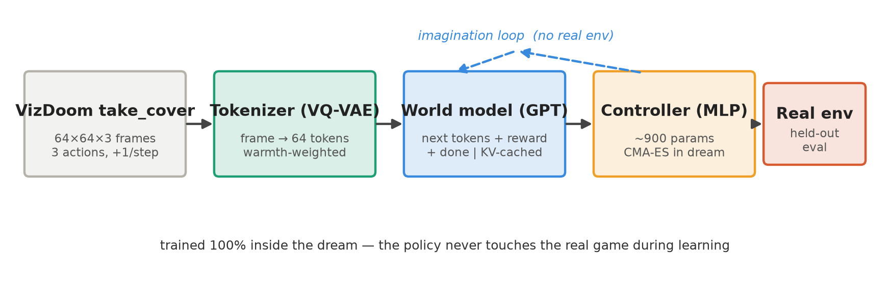

# Dreaming to Dodge 🎮🌙

**An agent that learns to survive VizDoom `take_cover` entirely inside a from-scratch Transformer world model — never touching the real game during training.**

A from-scratch reproduction of the 2018 *World Models* result ("train the agent inside its own dream") using the stronger 2023 **IRIS** recipe (VQ-VAE tokenizer + GPT world model + a policy optimised purely on imagined rollouts), running end-to-end on cloud GPUs (Modal).

<p align="center"></p>

- 📄 **Paper:** [`paper_dtd/main.tex`](paper_dtd/main.tex) (compiles to `main.pdf`)
- 🕹️ **Play the neural simulator:** https://teamvizuara--dreaming-to-dodge-sim-web.modal.run — *there is no game engine; the Transformer hallucinates each next frame from your keypresses.*
- 🧑‍🏫 **Operator runbook:** [`CAPSTONE_DOOM.md`](CAPSTONE_DOOM.md)

## Result

Trained **100% in imagination**, reported on **held-out** episodes it never trained or was selected on.

| agent | survival (steps) | tics | note |
|---|---:|---:|---|
| random | 67 | 266 | |
| model-free Double-DQN (200k real frames) | 90 | 360 | sample-efficiency bar |
| **IRIS agent (trained 100% in imagination)** | **96.6 ± 11.0** | **386** | beats random & DQN, matches oracle; best ep. 217–284 |
| heuristic oracle (reactive, sees the game) | 98.3 | 393 | upper reference |
| World Models "solved" | 188 | 750 | reference threshold |

Verified consistent across three independent seed sets (98.0 / 100.3 / 96.6). Action distribution `[0.00, 0.54, 0.46]` over {no-op, left, right} — genuinely reactive.

## Method (3 from-scratch components)

| component | file | role |
|---|---|---|
| Tokenizer (VQ-VAE) | [`tokenizer.py`](tokenizer.py) | frame → 64 discrete tokens; **warmth-weighted** recon keeps the fireball (recall 0.53→0.95) |
| World model (GPT) | [`world_model.py`](world_model.py) | next tokens + reward + **done** (class-weighted); **KV-cached** imagination (9.6×) |
| Controller (tiny MLP) | [`controller.py`](controller.py) | ~1.8k params, evolved by **CMA-ES** in the dream; reconstructed-image feature for dream→real transfer |
| Environment | [`envs.py`](envs.py) | `DoomTakeCover` (VizDoom `take_cover`) behind a tiny `reset/step/render` interface |

The engineering journey — codebook collapse, a silent termination-head collapse, **world-model exploitation**, and the transfer / model-selection fixes that overcome them — is documented in the [paper](paper_dtd/main.tex) and [`CAPSTONE_DOOM.md`](CAPSTONE_DOOM.md).

## Run it (Modal)

```bash
pip install -r requirements.txt          # local client; training runs on Modal GPUs
modal token new                          # authenticate Modal
# build the world model (collect -> tokenizer -> WM), then ground over rounds:
modal run    modal_apps/train.py::collect      --cfg configs/doom.yaml --tag doom --round 0
modal run    modal_apps/train.py::tokenizer    --cfg configs/doom.yaml --tag doom --round 0
modal run    modal_apps/train.py::world_model  --cfg configs/doom.yaml --tag doom --round 0
modal deploy modal_apps/deploy_all.py          # register ALL functions (deploy once)
# train the agent purely in imagination (CMA-ES + held-out selection), best-of-N:
#   modal.Function.from_name('iris-wm','train_controller').spawn(cfg, 'doom', ...)
modal run    modal_apps/verify_controller.py   --tag doom --run-id c6 --hidden 16
modal deploy modal_apps/simulator.py           # -> public *.modal.run playable link
```

## Repository layout

```
tokenizer.py world_model.py controller.py imagination.py actor_critic.py envs.py
configs/doom.yaml  configs/doom256.yaml
modal_apps/  common.py train.py train_controller.py evals.py baseline_modelfree.py
             simulator.py verify_controller.py deploy_all.py render_assets.py + diagnostics
paper_dtd/   main.tex (+ main.pdf), figs/
figures/doom/  publication figures
README_CATCH.md  the sibling "Dream to Catch" project this stack grew from
```

## Citation
```bibtex
@misc{dandekar2026dreamingtododge,
  title  = {Dreaming to Dodge: An Agent that Learns to Survive VizDoom
            Entirely Inside a From-Scratch Transformer World Model},
  author = {Dandekar, Rajat},
  year   = {2026},
  note   = {Vizuara AI Labs}
}
```

## License
MIT — see [LICENSE](LICENSE). VizDoom and its assets are under their respective licenses.
